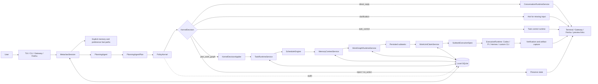

<p align="center">
  <a href="https://anyint.ai/"></a>
  
  <a href="https://www.metafusion.cc/"></a>
</p>

<div align="center">

# MetaClaw

**A local AI Task OS for durable agentic work.**

Turn natural-language requests into tasks that can be planned, scheduled, resumed, verified, remembered, and delivered through local agent runtimes.

[](https://nodejs.org/)
[](https://www.typescriptlang.org/)
[](#license)

[Technical Overview](docs/current/technical-overview.md) | [Docs](docs/README.md) | [Architecture Decisions](docs/adr) | [Chinese](README.zh-CN.md)

</div>

## What is MetaClaw?

MetaClaw is an open-source local runtime for agentic work. It sits between people and agent CLIs such as Codex, Pi, Hermes, and other local executors, turning a chat-style request into a durable task with state, memory, planning, work-unit dispatch, verification, and delivery.

A normal assistant answers the current turn. MetaClaw gives longer-running work an operating system: tasks can be created, parked, resumed, searched, split into subtasks, assigned to executor work units, checked against evidence, and delivered back through terminal or Gateway surfaces.

MetaClaw is currently optimized for local-first teams and research workflows that need more than prompt copy-paste: repository edits, multi-step analysis, artifact generation, Feishu delivery, and repeatable task recovery.

## Why MetaClaw?

Agents are becoming capable workers, but most agent runs are still fragile sessions. When a terminal closes, context gets lost. When a task blocks, the system forgets why. When multiple executors exist, routing logic gets mixed into prompts. When output returns, there is often no durable evidence trail.

MetaClaw treats agent work as work:

- A request becomes either conversation, task control, or durable work.
- Durable work gets explicit task state and resume context.
- Planning is separated from authorization through `PlanningAgent` and `PolicyKernel`.
- Subtasks are persisted as a task-owned work graph.
- Idle executor work units claim ready subtasks instead of receiving raw user input directly.
- Results are verified, recorded, and delivered with artifacts.

## Features

- **Durable task state**: created, ready, running, parked, blocked, done, archived, and cancelled tasks survive interruptions.
- **Planner-first dispatch**: natural-language input flows through `PlanningAgent`, `PolicyKernel`, and runtime services before any executor is called.
- **Work graphs and work units**: complex requests can become persisted subtasks with dependencies, acceptance criteria, executor candidates, and claimable runtime slots.
- **Local executor adapters**: Codex CLI is the default executor; Pi Agent, Hermes Agent, and custom CLI executors can be registered for specialized work.
- **Memory with boundaries**: confirmed preferences, task history, and context bundles are recalled only when clearly applicable.
- **Hybrid task retrieval**: historical tasks are searchable through SQLite FTS and semantic ranking signals.
- **Gateway delivery**: terminal, local Gateway, Feishu progress cards, artifact upload, and Markdown preview links share one session runtime.
- **Verification loop**: executor outputs can be checked for evidence, artifacts, test results, and missing acceptance criteria.
- **Real smoke gate**: `npm run smoke:metaclaw` runs an end-to-end task through the built CLI and verifies generated artifacts.

## Quick Install

MetaClaw targets Node.js 20+ and a Unix-like shell. On Windows, WSL2 with Ubuntu is the recommended runtime.

```bash
git clone https://github.com/IFOSR/metaclaw.git
cd metaclaw
./setup.sh
metaclaw --help
npm run smoke:metaclaw
```

`setup.sh` installs dependencies, builds the CLI, links `metaclaw`, creates a local config, and detects available executor commands on `PATH`.

Manual development setup:

```bash
npm install
npm run build
npm link
metaclaw --help
```

## Getting Started

Start MetaClaw in an interactive terminal:

```bash
metaclaw
```

Then give it work in natural language:

```text
Compare these three contracts and create a concise risk matrix.
```

MetaClaw decides whether the input should be a direct reply, task control action, clarification, or durable task. Durable work is planned, authorized, persisted, dispatched to an executor work unit, verified, and recorded with artifacts when produced.

Useful commands:

```bash
/tasks
/tasks active
/task <id>
/task <id> resume
/task <id> block waiting for source files
/task index search contract risk matrix
/dashboard
/memory
/config
/help
```

## Repository Structure

```text
.
|-- src/                 # TypeScript source for the CLI, TUI, runtime, planners, storage, and integrations
|-- tests/               # Vitest suites mirroring source domains
|-- docs/                # Current docs, ADRs, historical plans, and technical notes
|-- examples/            # Runnable/manual scenarios and fixtures
|-- scripts/             # Smoke tests, setup helpers, and operational scripts
|-- docker/              # Container and executor runtime support
|-- dist/                # Built CLI output generated by tsup
|-- CONTEXT.md           # Current migration vocabulary and architecture context
|-- AGENTS.md            # Repository instructions for coding agents
|-- setup.sh             # Main local install script
|-- metaclaw.sh          # Runtime helper script
`-- package.json         # Node package metadata and development commands
```

Source modules are organized by runtime responsibility:

| Path | Responsibility |
| --- | --- |
| `src/cli/` | CLI argument parsing such as `--script`, `--gateway`, and connection modes. |
| `src/tui/` | Ink terminal UI for interactive input, task status, and progress display. |
| `src/session/` | Main session coordinator for interactive, scripted, Gateway, memory, planning, policy, and persistence flows. |
| `src/planning/` | `PlanningAgent` interface (`CodexPlanningAgent`), context construction, plan schemas/vocabulary, and validation. |
| `src/kernel/` | Pure `PolicyKernel` authorization for planner decisions. |
| `src/task/` | Task state machine, scheduler, resume planning, ranking, and retrieval. |
| `src/execution/` | Execution runtime, work graph application, work-unit claiming, orchestration, aggregation, progress, and conversation runtime. |
| `src/executor/` | Executor adapters, agent-class registration, default seeding, prompts, and skill packages. |
| `src/memory/` | Memory capture, recall, review, preferences, context bundles, and vault export. |
| `src/storage/` | SQLite migrations and repositories for tasks, subtasks, work units, planning decisions, memory, and events. |
| `src/gateway/` | Local Gateway server/client and Feishu Gateway runtime. |
| `src/delivery/` | Verification, artifact extraction, aggregation checks, and delivery preparation. |
| `src/integrations/` | External integration helpers such as Markdown preview. |
| `src/commands/` | Slash command router and command handlers. |
| `src/core/` | Narrow shared primitives, the LLM bridge, capability classes, and strategy primitives. |

## Architecture



The important boundary is that natural-language planning does not directly execute work. `PlanningAgent` proposes intent, target task, executor candidates, and optional work graph nodes. `PolicyKernel` validates and authorizes that proposal against state, conflicts, confidence, and executor availability. Runtime services then apply the accepted decision by answering directly, controlling an existing task, or creating/binding durable task state and dispatching ready subtasks.

The current production path deliberately keeps one active top-level task admitted at a time. Multiple subtasks can exist inside that task, and ready subtasks are claimed by executor work units as dependencies are satisfied. This keeps local execution predictable while the planner, policy, and work-unit lifecycle continue to harden.

## CLI and Development

| Command | Description |
| --- | --- |
| `npm run dev` | Build in watch mode with tsup. |
| `npm run build` | Bundle `src/index.ts` to `dist/index.js`. |
| `npm run start` | Run the built CLI from `dist/`. |
| `npm test` | Run the Vitest suite once. |
| `npm run test:watch` | Run Vitest in watch mode. |
| `npm run lint` | Type-check with `tsc --noEmit`. |
| `npm run smoke:metaclaw` | Run the real end-to-end task smoke gate. |

For deeper implementation details, see the [Technical Overview](docs/current/technical-overview.md). For the documentation map, ADRs, and historical plans, start with [docs/README.md](docs/README.md).

## License

MIT
