<p align="center">
  <a href="https://anyint.ai/"></a>
  
  <a href="https://www.metafusion.cc/"></a>
</p>

<div align="center">

# AnyFusion

**MetaWork Server for durable, governed multi-agent execution**

AnyFusion turns natural-language objectives into persistent work graphs,
authorizes every strategic state change through a deterministic Control Kernel,
and executes approved subtasks with isolated Planner and Executor runtimes.

[](docs/releases/v1.2.0-preview.0.md)
[](https://github.com/IFOSR/metawork/actions/workflows/ci.yml)
[](#license)

[Install](#installation) · [Architecture](#core-architecture) ·
[Features](#core-features) · [Development](#development) ·
[中文](README.zh-CN.md)

</div>

## What This Repository Contains

This repository is the AnyFusion MetaWork Server. It owns durable Task state,
Planner-to-Kernel authorization, Work Graph execution, Executor lifecycle,
verification, Git publication, Gateway surfaces, and delivery.

The product is local-first and designed for work that must survive process
restarts, span multiple specialist agents, pause for missing resources or user
authorization, and produce auditable evidence rather than only a chat reply.

The current release boundary is one active top-level Task. That Task may contain
dependency-aware Subtasks, with up to four independent attempts running
concurrently.

## Installation

### Supported Native Path

The current native installer targets macOS and does not require Docker.

**One-command install.** After the one-time prerequisites below are in place,
the entire deployment is a single command. Run it from any directory:

```bash
git clone https://github.com/IFOSR/metawork.git && cd metawork && \
  ANYFUSION_PROVIDER_KEY='your-api-key' \
  ANYFUSION_PROVIDER_URL='https://your-openai-compatible-endpoint.example/v1' \
  ./setup.sh
```

This clones the repository, builds the MetaWork runtime and the vendored
AnyFusion-Pi planner, installs the `anyfusion` launcher, and writes
AnyFusion-only configuration — all in one step. Drop the two `ANYFUSION_*`
lines to be prompted for the key and URL interactively. If you already cloned
the repository, run `./setup.sh` from inside `metawork/` instead.

Required:

- Node.js `>=22.19.0`
- npm
- Git
- macOS native build tools for `better-sqlite3`
- Existing `codex` and `pi` commands on `PATH`
- An OpenAI-compatible provider URL and API key

Install prerequisites:

```bash
xcode-select --install
brew install node@22 git
export PATH="$(brew --prefix node@22)/bin:$PATH"

node --version
npm --version
git --version
codex --version
pi --version
```

Clone and install:

```bash
git clone https://github.com/IFOSR/metawork.git
cd metawork

export ANYFUSION_PROVIDER_KEY='replace-with-your-key'
export ANYFUSION_PROVIDER_URL='https://your-openai-compatible-endpoint.example/v1'

./setup.sh
```

The installer:

- Builds MetaWork and the vendored AnyFusion-Pi planner in separate dependency trees.
- Builds the AnyFusion-Pi planner directly from the checked-in `metawork/planner/AnyFusion-Pi` sources; no external repository is cloned.
- Installs the launcher at `~/.local/bin/anyfusion`.
- Writes AnyFusion-only configuration under `~/.config/anyfusion`.
- Stores runtime state under `~/.local/share/anyfusion`.
- Does not install, upgrade, downgrade, link, or reconfigure Codex or Pi.
- Does not read or write the user's `~/.codex` or `~/.pi` homes.

Open a new shell after installation. Start AnyFusion from the directory the
Planner should inspect:

```bash
cd /path/to/your/project
anyfusion
```

The launcher's working directory is the user's current directory. It is not
forced to the MetaWork repository or a fixed `/workspace`.

Start the browser interface instead of the native TUI:

```bash
anyfusion web
```

Restart the active Runtime directly into Web mode with:

```bash
anyfusion web restart
```

The restart command sends `SIGTERM` to the current `runtime.lock` holder,
waits up to 10 seconds for a clean exit, and then starts the replacement Web
instance. It fails without force-killing if the old process does not exit.

The command opens `http://127.0.0.1:8788` and authenticates the browser
automatically through a short-lived URL-fragment bootstrap. The fragment is
removed immediately and exchanged for an HttpOnly, SameSite=Strict session
cookie. No token copying or browser storage is used. For SSH, port forwarding,
or manual browser startup, run `anyfusion web --no-open`; only that mode prints
the process-local fallback token.

The native AnyFusion-Pi TUI remains the default `anyfusion` surface. Web and TUI
are separate, mutually exclusive Runtime modes in this release.

Web uses a session workspace with persistent history on the left, a full-width
Conversation/Trajectory canvas, and one sticky composer. Conversation streams
safe Planner, Kernel, routing, Executor, verification, and delivery milestones
before the final answer. Trajectory reprojects the same facts into timing,
filters, and dense event rows. Historical sessions are read-only until a safe
activation gate confirms that no Planner turn or Task runtime work is active.

Configuration changes activated from the Web settings panel are validated and
stored as the next-start revision. The running Planner, Kernel, and Executors
remain pinned to the revision loaded at startup; restart AnyFusion to apply the
new revision.

### Native Runtime Layout

```text
metawork/
└── planner/
    └── AnyFusion-Pi/          # separate Planner source and dependency tree

~/.local/bin/
└── anyfusion                  # launcher

~/.config/anyfusion/
├── provider.env              # mode 0600
├── planner/                  # isolated Planner model/settings home
├── codex/                    # AnyFusion Codex template home
└── pi-home/                  # AnyFusion Pi template home

~/.local/share/anyfusion/
├── metaclaw.db               # durable runtime state
├── planner-sessions/
└── workspaces/
```

Each Executor attempt receives another private temporary runtime home derived
from the AnyFusion template. Executor processes use the Subtask Git worktree as
`cwd`; runtime homes and working directories are separate contracts.

### Other Platforms

Linux and WSL2 remain development/runtime environments, but the current
productized native installer is macOS-specific. Docker is retained only as an
explicit compatibility and CI validation path; it is not required for normal
native installation.

## Core Architecture

```mermaid
flowchart LR
  Client[CLI / TUI / Gateway / Feishu] --> Session[MetaclawSession<br/>Application Shell]
  Session --> Planner[AnyFusion-Pi Planner<br/>isolated process]
  Planner --> Proposal[PlanningAgentPlan v8]
  Proposal --> Workflow[DurableKernelWorkflow<br/>inbox / ledger / application]
  Workflow --> Kernel[ControlKernel v5<br/>pure policy decisions]
  Kernel --> Runtime[Execution Runtime<br/>authorized side effects]
  Runtime --> Supervisor[Attempt Supervisor<br/>up to four attempts]
  Supervisor --> Adapter[BackendExecutorAdapter]
  Adapter --> Backend[AttemptExecutionBackend<br/>worktree or container]
  Backend --> Executors[Codex / Pi Executor]
  Executors --> Verify[Completion Protocol v3<br/>evidence / artifacts]
  Verify --> Publish[Deterministic Git Publication]
  Publish --> Delivery[Gateway / TUI / Feishu Delivery]

  Store[(SQLite v30<br/>Tasks / graph / decisions / attempts / audit)]
  Session <--> Store
  Workflow <--> Store
  Runtime <--> Store
```



### Authority Boundaries

| Component | Owns | Must not own |
| --- | --- | --- |
| **Planner** | Natural-language understanding, Task binding proposals, Work Graph proposals, direct replies | Scheduling, authorization, storage mutation, Executor control |
| **Control Kernel** | Admission, dispatch, retry, fallback, cancellation, recovery, permission and publication policy | Repositories, process launch, clocks, raw logs |
| **Runtime** | Applying Kernel decisions, persistence, WorkUnits, leases, workspaces, processes and normalized observations | Independent retry, fallback, replan or routing policy |
| **Executor Adapter** | One authorized attempt, probe/abort, command lifecycle and result normalization | Task state or strategic decisions |
| **Gateway** | Client and integration connectivity | Planner, Kernel or Executor policy |

The fixed control loop is:

```text
Planner proposes
  -> ControlKernel decides
  -> Runtime applies
  -> Executor performs one authorized attempt
  -> Runtime reports normalized facts
  -> ControlKernel decides the next action
```

There is no second semantic router or hidden Runtime-owned retry loop.

## Core Features

### Durable Task OS

- Persistent Task and Subtask state across sessions and process restarts.
- One active top-level Task with dependency-aware concurrent Subtasks.
- Durable inbox, immutable Kernel decision ledger, idempotent application and
  recovery.
- Task search, resume context, cancellation fences, partial acceptance and
  explicit blocked/parked states.

### Planner and Work Graph

- AnyFusion-Pi runs as a separate Planner process with its own session history.
- Planner repository inspection is read-only and rooted at the user's launch
  directory.
- Planning produces strict `PlanningAgentPlan v8` proposals.
- Work Graph v7 models DAG topology, acceptance criteria, typed handoffs,
  delivery kind, ordered AgentClass preferences and a pinned configuration
  revision.
- Planner proposals are revalidated before entering the Kernel workflow.

### Governed Execution

- `ControlKernel.decide(event, snapshot)` is the only strategic decision seam.
- Deterministic frontier batches support up to four concurrent child attempts.
- Codex and Pi use existing local CLI binaries without sharing personal homes.
- Worktree execution is the default trusted native backend.
- The Docker backend remains an explicit compatibility mode and is the only
  backend described as a container sandbox.
- Resource leases, permission requests, bounded grants and cancellation cleanup
  are persisted and recoverable.

### Verification and Publication

- Completion Protocol v3 requires structured evidence or a controlled failure.
- Runtime computes the authoritative workspace delta.
- Successful attempts produce immutable receipts and candidate Git commits.
- Publication integrates candidates in deterministic order.
- Results, artifacts and handoffs become visible only after publication
  succeeds.
- Merge conflicts use bounded Kernel-authorized repair and replan paths.

### Connectivity and Delivery

- Native AnyFusion-Pi TUI is the default local surface.
- Local Gateway supports multiple terminal/client connections.
- Feishu integration provides remote intake, progress and artifact delivery.
- Presentation surfaces receive bounded projections and do not write Kernel or
  storage state directly.

## Development

```bash
npm install
npm run lint
npm test
npm run build
npm run start
```

Focused native installer validation:

```bash
npm test -- tests/scripts/native-install-lib.test.ts
bash -n setup.sh
```

Live Planner smoke testing requires valid provider credentials and the
AnyFusion-Pi source:

```bash
npm run smoke:anyfusion
npm run smoke:anyfusion -- --scenario artifact
```

Do not use the smoke command as a substitute for focused module tests. See
[AGENTS.md](AGENTS.md) and [CONTEXT.md](CONTEXT.md) before changing architecture
or runtime contracts.

## Project Status

| Area | Current state |
| --- | --- |
| Version | `v1.2.0-preview.0` |
| Maturity | Developer Preview |
| Runtime | Node.js `>=22.19.0`, TypeScript ESM |
| Planner contract | PlanningAgentPlan v8 |
| Work Graph contract | v7 |
| Kernel contract | v5 |
| Completion contract | v3 |
| Persistence | SQLite schema v30 |
| Canonical Executors | Codex CLI and Pi Agent |

This is not a stable production release. Installation, configuration and
extension contracts may change before the first stable version.

## Documentation

| Resource | Purpose |
| --- | --- |
| [Current Technical Overview](docs/current/technical-overview.md) | Full runtime, deployment, configuration and repository overview |
| [Runtime Security](docs/current/phase-5-runtime-security.md) | Workspaces, resource leases, permission boundaries and execution backends |
| [Architecture Decisions](docs/adr/README.md) | Accepted decisions and authority matrix |
| [Server Upgrade Design](docs/plans/2026-08-07-metawork-server-upgrade-technical-design.md) | Target Server installer, unified configuration and extensibility design |
| [Documentation Map](docs/README.md) | Current docs, plans, technical debt and archives |

## License

AnyFusion is licensed under the [Apache License, Version 2.0](LICENSE).

Copyright 2026 The AnyFusion Contributors.
