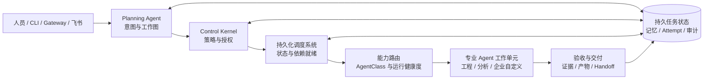

<p align="center">
  <a href="https://anyint.ai/"></a>
  
  <a href="https://www.metafusion.cc/"></a>
</p>

<div align="center">

# AnyFusion

**面向持久化、可治理智能体工作流的 AI 任务控制平面**

将企业级长周期工作转化为可持久化、受策略治理，并由专业智能体协同执行的任务图。

<strong>AnyFusion 是由 AnyInt 与 MetaFusion 共同推进的战略级开源项目，目前已部署至内部服务器进行小范围试用。</strong><br /><br />
[](docs/releases/v1.2.0-preview.0.md)
[](docs/releases/v1.2.0-preview.0.md#current-deployment-status)
[](https://github.com/MetaAny/AnyFusion/actions/workflows/ci.yml)
[](#许可证)

[产品概览](#面向长周期智能体工作的任务操作系统) · [核心能力](#核心能力) · [运行机制](#运行机制) · [快速开始](#快速开始) · [项目状态](#项目状态) · [English](README.md)

</div>

## 面向长周期智能体工作的任务操作系统

大多数 Agent 工具优化的是一次交互会话，而企业工作通常跨越数小时甚至数天，涉及多个代码库或业务领域，需要不同垂类 Agent 接力处理，也可能因为材料、权限或人工确认而暂停，但最终仍必须沿着一条受控路径完成交付。

AnyFusion 是位于人员、企业协作入口与 Agent Runtime 之间的本地优先任务控制平面。它持续保存任务目标和执行状态，将复杂工作拆解为具备依赖关系的任务图，为每个工作单元选择合适的 AgentClass，治理所有会改变状态的决策，并记录恢复、验收和交付所需的证据。

它服务的不是“再生成一次回复”，而是对连续性、控制力和责任边界有要求的复杂工作流。

## 核心能力

| 能力 | 提供的价值 |
| --- | --- |
| **持久化任务调度** | Task 与 Subtask 生命周期、依赖就绪、阻塞、挂起、恢复、取消和故障恢复均被持久记录，可跨进程和会话继续运行。 |
| **策略治理的规划链路** | 自然语言规划与执行授权严格分离：Planner 提案，Control Kernel 决策，Runtime 只执行已授权的副作用。 |
| **依赖感知工作图** | 复杂目标被表达为显式 DAG，包含验收标准、类型化依赖、受限上下文，以及工作单元之间可持久化的 handoff contract。 |
| **多垂类 Agent 编排** | 基于能力的路由将 Subtask 映射到有序 AgentClass 候选，包括 Codex、Pi、Hermes 或企业自定义垂类 Agent，而不是把调度策略散落在 Prompt 中。 |
| **隔离执行边界** | 每个 Agent 只获得一个明确任务、必要证据和直接依赖输出，不会无边界继承整段对话或重复执行兄弟节点工作。 |
| **验收、证据与审计** | 结构化完成协议在结果暴露或交付前记录验收证据、产物、handoff、attempt receipt 与审计事件。 |
| **业务记忆与多端交付** | 已确认偏好、任务历史、语义检索、终端工作流、Gateway 和飞书交付均连接至同一份持久任务状态。 |

## 面向复杂企业工作流

AnyFusion 适合协调跨越多个专业边界的长周期工作，例如：

- **软件工程交付：**由不同工程 Agent 承担规划、实现、测试、审查、文档和产物交付，并由统一任务状态控制整体进度。
- **研究与分析：**依次完成资料收集、垂类分析、证据复核、综合判断和报告生成，通过显式依赖传递必要成果。
- **企业业务流程：**从企业协作入口接收请求，分派给专业 Agent，在需要时请求人工澄清，经过验收后从原渠道交付结果。

Executor 层采用 Adapter 机制，企业可以接入自己的垂类 Agent，同时继续由同一个控制平面管理任务状态、路由事实、策略决策和完成证据。

## 运行机制



三条边界保证复杂工作流仍然可治理：

1. **Planner 只提出方案，不为自己授予执行权限。**
2. **Control Kernel 基于显式 Runtime 事实作出确定性策略决策。**
3. **Runtime 执行受限决策，并把规范化结果反馈给下一轮决策。**

当前工作图已经能够表达独立分支、垂类 Agent 分工和类型化依赖交付。Preview 版本仍有意串行执行就绪 Subtask，待资源分区、持久租约、冲突检测和崩溃安全的并发分发完成后，再开启安全异步并行。这保证了当前实现不会用不可靠的“表面并行”替代最终并发模型。

## 快速开始

AnyFusion 需要 Node.js 20+ 和类 Unix shell。Windows 推荐使用 WSL2 + Ubuntu 作为运行环境。

```bash
git clone https://github.com/MetaAny/AnyFusion.git
cd AnyFusion
./setup.sh
anyfusion
```

`setup.sh` 会安装依赖、构建 CLI、链接 `anyfusion`、创建本地配置，并检测当前 `PATH` 中可用的 Executor。

然后直接用自然语言交给 AnyFusion 一个多步骤目标：

```text
分析这些合同，将法律和商务审查分配给合适的专业 Agent，并交付一份附带证据的综合风险矩阵。
```

AnyFusion 会识别请求、在需要时创建持久任务、授权工作图、分发就绪工作单元、验证完成协议，并保存相关证据与产物。如已配置真实凭证，可另行运行 `npm run smoke:anyfusion` 完成端到端验证。

## 项目状态

| 项目 | 当前状态 |
| --- | --- |
| 版本 | `v1.2.0-preview.0` |
| 成熟度 | Developer Preview |
| 部署状态 | 已部署至内部服务器进行小范围试用 |
| 任务范围 | 一个活跃顶层任务，内部支持具备依赖关系的多个 Subtask |
| 调度方式 | 当前 Preview 串行执行就绪 Subtask；安全异步并发已列入公开路线图 |
| 兼容性 | CLI、配置和 Runtime contract 在稳定版前可能继续演进 |

AnyFusion 当前不会被描述为 Production Ready。Preview 阶段用于验证任务控制平面、工作图契约、专业 Agent 路由、验收模型与实际运行流程，再逐步形成稳定兼容性承诺。

## 文档

| 资源 | 内容 |
| --- | --- |
| [技术总览](docs/current/technical-overview.zh-CN.md) | Runtime 架构、运行环境、模块和实现细节 |
| [架构决策](docs/adr/README.md) | 已接受的系统边界和权威设计决策 |
| [并发收敛路线图](docs/plans/2026-07-16-planner-kernel-concurrency-convergence-roadmap.md) | 控制平面、资源分区、故障恢复和并发调度计划 |
| [Preview Release Notes](docs/releases/v1.2.0-preview.0.md) | 当前版本范围、部署状态和已知限制 |
| [Changelog](CHANGELOG.md) | 版本生命周期和重要变更 |
| [文档地图](docs/README.md) | 当前文档、历史材料和贡献者文档索引 |

## 许可证

AnyFusion 使用 [Apache License, Version 2.0](LICENSE)。

Copyright 2026 The AnyFusion Contributors.

<p align="center"><sub>项目由 MetaAny 作为中立开源品牌载体进行托管。</sub></p>
