<p align="center">
  <a href="https://anyint.ai/"></a>
  
  <a href="https://www.metafusion.cc/"></a>
</p>

<div align="center">

# AnyFusion

**面向持久化、可治理多智能体执行的 MetaWork Server**

AnyFusion 将自然语言目标转化为持久化工作图，通过确定性的 Control Kernel
授权每一次战略状态变更，并由相互隔离的 Planner 和 Executor Runtime 执行
已批准的 Subtask。

[](docs/releases/v1.2.0-preview.0.md)
[](https://github.com/IFOSR/metawork/actions/workflows/ci.yml)
[](#许可证)

[安装](#安装方式) · [架构](#核心架构) · [功能](#核心功能) ·
[开发](#开发与验证) · [English](README.md)

</div>

## 项目定位

本仓库是 AnyFusion 的 MetaWork Server，负责持久化 Task、Planner 到 Kernel
的授权链、Work Graph 执行、Executor 生命周期、结果验收、Git 发布、Gateway
接入与交付。

它面向需要跨进程恢复、多个专业 Agent 协作、等待材料或人工授权，并且要求
结果可验证、过程可审计的长周期工作，而不是只完成一次聊天回复。

当前产品边界是同一时间只允许一个活跃顶层 Task。该 Task 内可以包含有依赖
关系的多个 Subtask，并行运行最多四个互相独立的 attempt。

## 安装方式

### macOS 原生安装

当前产品化原生安装路径支持 macOS，不需要 Docker。

**一键部署。** 下面的前置依赖一次性装好后，整个部署就是一条命令。在任意
目录运行：

```bash
git clone https://github.com/IFOSR/metawork.git && cd metawork && \
  ANYFUSION_PROVIDER_KEY='你的-api-key' \
  ANYFUSION_PROVIDER_URL='https://你的-openai-compatible服务地址.example/v1' \
  ./setup.sh
```

这条命令会克隆仓库、构建 MetaWork Runtime 与内置 AnyFusion-Pi planner、
安装 `anyfusion` 启动器，并写入 AnyFusion 专用配置——一步完成。省略两行
`ANYFUSION_*` 环境变量会改为交互式询问 key 和 URL。若已克隆仓库，直接进入
`metawork/` 运行 `./setup.sh` 即可。

安装前需要：

- Node.js `>=22.19.0`
- npm
- Git
- 用于编译 `better-sqlite3` 的 macOS 原生构建工具
- 已经安装并位于 `PATH` 中的 `codex` 和 `pi`
- OpenAI-compatible Provider URL 与 API Key

安装依赖：

```bash
xcode-select --install
brew install node@22 git
export PATH="$(brew --prefix node@22)/bin:$PATH"

node --version
npm --version
git --version
codex --version
pi --version
```

克隆并安装：

```bash
git clone https://github.com/IFOSR/metawork.git
cd metawork

export ANYFUSION_PROVIDER_KEY='替换为你的密钥'
export ANYFUSION_PROVIDER_URL='https://你的-openai-compatible服务地址.example/v1'

./setup.sh
```

安装器会：

- 分别构建 MetaWork 和仓库内置的 AnyFusion-Pi planner，保持两套独立依赖树。
- 直接构建仓库内检入的 `metawork/planner/AnyFusion-Pi` 源码，不克隆任何外部仓库。
- 将启动器安装到 `~/.local/bin/anyfusion`。
- 将 AnyFusion 专用配置写入 `~/.config/anyfusion`。
- 将运行状态保存到 `~/.local/share/anyfusion`。
- 不安装、升级、降级、链接或重新配置 Codex/Pi。
- 不读取或写入用户个人的 `~/.codex` 和 `~/.pi`。

安装后打开一个新 shell，从 Planner 需要检查的目录启动：

```bash
cd /path/to/your/project
anyfusion
```

Planner 工作目录就是用户执行 `anyfusion` 时的当前目录，不会被强制设置为
MetaWork 仓库或固定 `/workspace`。

### 本机目录布局

```text
metawork/
└── planner/
    └── AnyFusion-Pi/          # 独立 Planner 源码和依赖树

~/.local/bin/
└── anyfusion                  # 启动器

~/.config/anyfusion/
├── provider.env              # 权限 0600
├── planner/                  # Planner 独立模型和设置 Home
├── codex/                    # AnyFusion Codex 模板 Home
└── pi-home/                  # AnyFusion Pi 模板 Home

~/.local/share/anyfusion/
├── metaclaw.db               # 持久化运行状态
├── planner-sessions/
└── workspaces/
```

每次 Executor attempt 会基于 AnyFusion 模板再生成一个私有临时 Runtime
Home。Executor 的 `cwd` 是对应 Subtask Git worktree；Runtime Home 与工作
目录是两个独立路径契约。

### 其他平台

Linux 和 WSL2 仍可用于开发和运行，但当前产品化原生安装器是 macOS 专用。
Docker 只保留为显式兼容模式和 CI 验证路径，不是正常本机安装的依赖。

## 核心架构

```mermaid
flowchart LR
  Client[CLI / TUI / Gateway / 飞书] --> Session[MetaclawSession<br/>Application Shell]
  Session --> Planner[AnyFusion-Pi Planner<br/>独立进程]
  Planner --> Proposal[PlanningAgentPlan v8]
  Proposal --> Workflow[DurableKernelWorkflow<br/>Inbox / Ledger / Application]
  Workflow --> Kernel[ControlKernel v5<br/>纯策略决策]
  Kernel --> Runtime[Execution Runtime<br/>执行已授权副作用]
  Runtime --> Supervisor[Attempt Supervisor<br/>最多四个 Attempt]
  Supervisor --> Adapter[BackendExecutorAdapter]
  Adapter --> Backend[AttemptExecutionBackend<br/>Worktree 或 Container]
  Backend --> Executors[Codex / Pi Executor]
  Executors --> Verify[Completion Protocol v3<br/>证据 / 产物]
  Verify --> Publish[确定性 Git Publication]
  Publish --> Delivery[Gateway / TUI / 飞书交付]

  Store[(SQLite v30<br/>Task / 工作图 / 决策 / Attempt / 审计)]
  Session <--> Store
  Workflow <--> Store
  Runtime <--> Store
```



### 权限与职责边界

| 组件 | 负责 | 不负责 |
| --- | --- | --- |
| **Planner** | 自然语言理解、Task 绑定提案、Work Graph 提案、直接回复 | 调度、授权、数据库写入、控制 Executor |
| **Control Kernel** | admission、dispatch、retry、fallback、取消、恢复、权限和发布策略 | Repository、启动进程、读取时钟和原始日志 |
| **Runtime** | 应用 Kernel Decision、持久化、WorkUnit、lease、workspace、进程和规范化事实 | 自行决定 retry、fallback、replan 或路由 |
| **Executor Adapter** | 执行一次已授权 attempt、probe/abort、命令生命周期和结果规范化 | Task 状态和战略决策 |
| **Gateway** | Client 与集成连接 | Planner、Kernel 或 Executor 策略 |

固定控制链如下：

```text
Planner proposes
  -> ControlKernel decides
  -> Runtime applies
  -> Executor performs one authorized attempt
  -> Runtime reports normalized facts
  -> ControlKernel decides the next action
```

系统中不存在第二套语义 Router，也不存在 Runtime 隐式拥有的 retry loop。

## 核心功能

### 持久化 Task OS

- Task 与 Subtask 状态可以跨 Session 和进程重启恢复。
- 单一活跃顶层 Task 内支持依赖感知的并发 Subtask。
- 持久 inbox、不可变 Kernel decision ledger、幂等 application 与恢复。
- 支持任务搜索、resume context、取消栅栏、部分结果接受和显式
  blocked/parked 状态。

### Planner 与 Work Graph

- AnyFusion-Pi 作为独立 Planner 进程运行，并维护自己的会话历史。
- Planner 只能只读检查用户启动目录。
- Planner 产出严格的 `PlanningAgentPlan v8` 提案。
- Work Graph v7 描述 DAG、验收标准、类型化 handoff、delivery kind、有序
  AgentClass 偏好，并绑定一个配置修订（configuration revision）。
- Planner 提案进入 Kernel workflow 前会由 MetaWork 再次校验。

### 可治理执行

- `ControlKernel.decide(event, snapshot)` 是唯一战略决策入口。
- 确定性 frontier batch 可并行运行最多四个 child attempt。
- Codex/Pi 复用用户已经安装的 CLI binary，但不共享个人 Home。
- Worktree 是默认受信任的本机执行后端。
- Docker 后端只作为显式兼容模式保留，并且只有 container backend 被称为
  sandbox。
- Resource lease、permission request、受限 grant 和取消清理均持久化且可恢复。

### 验收与发布

- Completion Protocol v3 要求结构化证据或受控失败。
- Runtime 计算权威 workspace delta。
- 成功 attempt 先生成不可变 receipt 和候选 Git commit。
- Publication 按确定性顺序集成候选提交。
- 只有发布成功后才公开结果、artifact 和 handoff。
- Merge conflict 进入有界、由 Kernel 授权的 repair 与 replan 链路。

### 接入与交付

- AnyFusion-Pi 原生 TUI 是默认本地入口。
- Local Gateway 支持多个终端或 Client 连接。
- 飞书集成支持远程请求、进度和 artifact 交付。
- 所有展示层只读取受限投影，不直接写 Kernel 或存储状态。

## 开发与验证

```bash
npm install
npm run lint
npm test
npm run build
npm run start
```

原生安装器专项验证：

```bash
npx vitest run tests/installation tests/configuration
bash -n setup.sh
```

真实 Planner smoke 需要有效 Provider 凭证和 AnyFusion-Pi 源码：

```bash
npm run smoke:anyfusion
npm run smoke:anyfusion -- --scenario artifact
```

smoke 命令不能替代模块级专项测试。修改架构或 Runtime contract 前应先阅读
[AGENTS.md](AGENTS.md) 和 [CONTEXT.md](CONTEXT.md)。

## 项目状态

| 项目 | 当前状态 |
| --- | --- |
| 版本 | `v1.2.0-preview.0` |
| 成熟度 | Developer Preview |
| Runtime | Node.js `>=22.19.0`，TypeScript ESM |
| Planner contract | PlanningAgentPlan v8 |
| Work Graph contract | v7 |
| Kernel contract | v5 |
| Completion contract | v3 |
| Persistence | SQLite schema v31 |
| Canonical Executor | Codex CLI 与 Pi Agent |

当前版本不是稳定生产版本。安装、配置和扩展契约在首个稳定版本前仍可能调整。

## 文档

| 文档 | 内容 |
| --- | --- |
| [当前技术总览](docs/current/technical-overview.zh-CN.md) | 完整 Runtime、部署、配置和仓库说明 |
| [运行时安全](docs/current/phase-5-runtime-security.md) | Workspace、resource lease、权限边界和执行后端 |
| [架构决策](docs/adr/README.md) | 已接受决策与权威矩阵 |
| [Server 升级技术设计](docs/plans/2026-08-07-metawork-server-upgrade-technical-design.md) | Server Installer、统一配置和扩展能力目标设计 |
| [文档地图](docs/README.md) | 当前文档、计划、技术债和归档索引 |

## 许可证

AnyFusion 使用 [Apache License, Version 2.0](LICENSE)。

Copyright 2026 The AnyFusion Contributors.
