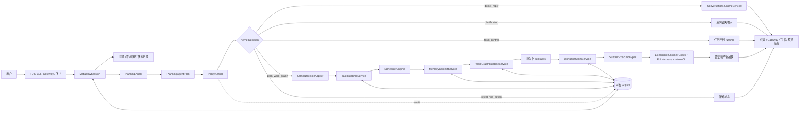

<p align="center">
  <a href="https://anyint.ai/"></a>
  
  <a href="https://www.metafusion.cc/"></a>
</p>

<div align="center">

# AnyFusion

**面向持久化智能体工作的本地 AI Task OS。**

把自然语言请求变成可以规划、调度、恢复、验证、记忆，并通过本地智能体运行时交付的任务。

[](https://nodejs.org/)
[](https://www.typescriptlang.org/)
[](#许可证)

[技术总览](docs/current/technical-overview.zh-CN.md) | [文档地图](docs/README.md) | [架构决策](docs/adr) | [English](README.md)

</div>

## AnyFusion 是什么？

AnyFusion 是一个开源的本地智能体工作运行时。它位于人和 Codex、Pi、Hermes 以及其他本地 executor CLI 之间，把聊天式请求转化为带有状态、记忆、规划、work-unit 分发、验证和交付链路的持久化任务。

普通助手回答当前这一轮。AnyFusion 给更长周期的工作提供一个操作系统：任务可以被创建、挂起、恢复、搜索、拆成子任务、分配给 executor work unit、按证据验收，并通过终端或 Gateway 返回给用户。

AnyFusion 当前适合 local-first 团队和研究型工作流：仓库修改、多步骤分析、产物生成、飞书交付，以及可重复恢复的任务执行。

## 为什么需要 AnyFusion？

Agent 正在变成可以承担工作的执行者，但大多数 agent run 仍然是脆弱的会话。终端关闭后，上下文会丢。任务阻塞后，系统会忘记原因。多个 executor 并存时，路由逻辑容易混进 prompt。结果返回后，也经常缺少持久化证据链。

AnyFusion 把 agent work 当作真正的 work 来处理：

- 一个请求会被归类为普通对话、任务控制，或持久化工作。
- 持久化工作拥有明确任务状态和恢复上下文。
- 规划和授权通过 `PlanningAgent` 与 `PolicyKernel` 分离。
- 子任务会作为 task-owned work graph 持久化。
- 空闲 executor work unit 认领 ready subtasks，而不是直接接收原始用户输入。
- 结果会被验证、记录，并和产物一起交付。

## 功能特性

- **持久化任务状态**：created、ready、running、parked、blocked、done、archived、cancelled 等状态可以跨中断保存。
- **Planner-first dispatch**：自然语言输入先经过 `PlanningAgent`、`PolicyKernel` 和 runtime services，再调用 executor。
- **Work graph 与 work unit**：复杂请求可以转化为带依赖、验收标准、executor candidates 和可认领运行槽位的持久化子任务。
- **本地 executor 适配**：默认 executor 是 Codex CLI；Pi Agent、Hermes Agent 和自定义 CLI executor 可以注册为专用工作者。
- **有边界的记忆**：只有明确适用的偏好、任务历史和上下文包会被自动召回。
- **混合任务检索**：历史任务可通过 SQLite FTS 和语义排序信号检索。
- **Gateway 交付**：终端、本地 Gateway、飞书进度卡片、文件上传和 Markdown 预览链接共享同一个 session runtime。
- **验证循环**：executor 输出可以按证据、产物、测试结果和缺失验收条件进行检查。
- **真实烟测入口**：`npm run smoke:metaclaw` 会通过构建后的 CLI 跑一个端到端任务，并验证生成产物。

## 快速安装

AnyFusion 需要 Node.js 20+ 和类 Unix shell。Windows 推荐使用 WSL2 + Ubuntu 作为运行环境。

```bash
git clone https://github.com/MetaAny/AnyFusion.git
cd AnyFusion
./setup.sh
metaclaw --help
npm run smoke:metaclaw
```

`setup.sh` 会安装依赖、构建 CLI、链接 `metaclaw`、创建本地配置，并检测当前 `PATH` 中可用的 executor 命令。

开发环境也可以手动安装：

```bash
npm install
npm run build
npm link
metaclaw --help
```

## 开始使用

在交互式终端中启动 AnyFusion：

```bash
metaclaw
```

然后直接用自然语言交给它一个任务：

```text
Compare these three contracts and create a concise risk matrix.
```

AnyFusion 会判断输入应当是直接回答、任务控制、澄清，还是持久化任务。持久化工作会被规划、授权、保存、分发给 executor work unit、验证，并在产生文件时记录为任务产物。

常用命令：

```bash
/tasks
/tasks active
/task <id>
/task <id> resume
/task <id> block waiting for source files
/task index search contract risk matrix
/dashboard
/memory
/config
/help
```

## 仓库结构

```text
.
|-- src/                 # CLI、TUI、runtime、planner、storage 和 integration 的 TypeScript 源码
|-- tests/               # 与源码领域对应的 Vitest 测试
|-- docs/                # 当前文档、ADR、历史计划和技术说明
|-- examples/            # 可运行/手动场景与 fixtures
|-- scripts/             # 烟测、安装辅助和运维脚本
|-- docker/              # 容器与 executor runtime 支持
|-- dist/                # tsup 生成的 CLI 构建产物
|-- CONTEXT.md           # 当前迁移词汇和架构上下文
|-- AGENTS.md            # 面向 coding agents 的仓库说明
|-- setup.sh             # 本地安装主脚本
|-- metaclaw.sh          # runtime 辅助脚本
`-- package.json         # Node 包信息和开发命令
```

源码模块按运行时职责组织：

| 路径 | 职责 |
| --- | --- |
| `src/cli/` | CLI 参数解析，例如 `--script`、`--gateway` 和连接模式。 |
| `src/tui/` | 基于 Ink 的终端 UI，用于交互输入、任务状态和进度展示。 |
| `src/session/` | 交互、脚本、Gateway、记忆、规划、策略和持久化流程的主协调层。 |
| `src/planning/` | `PlanningAgent` 接口、上下文构建、schema、校验和 Codex planner 适配器。 |
| `src/kernel/` | 对 planner decision 进行纯授权的 `PolicyKernel`。 |
| `src/task/` | 任务状态机、scheduler、恢复规划、排序和检索。 |
| `src/execution/` | 执行 runtime、work graph 应用、work-unit claiming、编排、聚合、进度和 conversation runtime。 |
| `src/executor/` | executor adapters、agent-class 注册、默认 seeding、prompts 和 skill packages。 |
| `src/memory/` | 记忆捕获、召回、审查、偏好、上下文包和 vault export。 |
| `src/storage/` | 任务、子任务、work units、planning decisions、memory 和 events 的 SQLite migrations 与 repositories。 |
| `src/gateway/` | 本地 Gateway server/client 和飞书 Gateway runtime。 |
| `src/delivery/` | 验证、产物提取、聚合检查和交付准备。 |
| `src/integrations/` | Markdown preview 等外部集成辅助。 |
| `src/commands/` | Slash command router 和命令处理器。 |
| `src/core/` | 精简共享 primitives、LLM bridge、capability classes 和 strategy primitives。 |

## 运行逻辑



关键边界是：自然语言规划不会直接执行工作。`PlanningAgent` 提出 intent、目标任务、executor candidates 和可选 work graph nodes。`PolicyKernel` 根据状态、冲突、置信度和 executor 可用性验证并授权该 proposal。runtime services 再应用被接受的 decision：直接回答、控制已有任务，或创建/绑定持久化任务状态并分发 ready subtasks。

当前生产路径有意保持同一时间只接纳一个活跃顶层任务。一个顶层任务内部仍然可以有多个 subtasks；当依赖满足时，ready subtasks 会被 executor work units 认领。这让本地执行在 planner、policy 和 work-unit 生命周期继续加固期间保持可预测。

## CLI 与开发

| 命令 | 说明 |
| --- | --- |
| `npm run dev` | 使用 tsup watch 模式构建。 |
| `npm run build` | 将 `src/index.ts` 打包到 `dist/index.js`。 |
| `npm run start` | 从 `dist/` 运行构建后的 CLI。 |
| `npm test` | 单次运行 Vitest 测试套件。 |
| `npm run test:watch` | 以 watch 模式运行 Vitest。 |
| `npm run lint` | 使用 `tsc --noEmit` 做类型检查。 |
| `npm run smoke:metaclaw` | 运行真实端到端任务烟测。 |

更深入的实现细节见 [技术总览](docs/current/technical-overview.zh-CN.md)。文档入口、ADR 和历史计划请从 [文档地图](docs/README.md) 开始。

## 许可证

AnyFusion 基于 [Apache License 2.0](LICENSE) 开源。

版权所有 © 2026 The AnyFusion Contributors。
