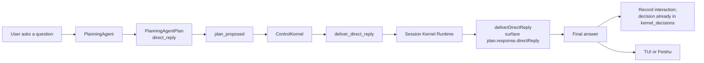
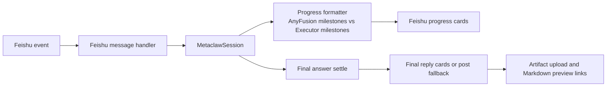

# AnyFusion

[English Home](../../README.md) | [中文技术总览](technical-overview.zh-CN.md)

AnyFusion is a local AI Task OS for agentic work. It turns natural-language requests into durable, searchable, schedulable, and verifiable tasks that can survive interruptions, recall prior context, plan subtasks, claim executor work units, and deliver artifacts back to the places where people review them.

It is built for teams who need agents to do more than answer the current turn. AnyFusion gives long-running AI work a task state machine, memory boundary, unified ControlKernel decision plane, work-unit dispatch runtime, verification loop, local Gateway, Feishu delivery path, and real end-to-end smoke gate.

## What AnyFusion Does

- Keeps durable tasks with explicit states: created, ready, running, parked, blocked, done, archived, and cancelled.
- Restores interrupted work with resume context instead of restarting from scratch.
- Enforces one active top-level task through a durable serial `KernelWorkflow`; Phase 5 adds resource partitions and sandboxed attempts without enabling Phase 6 concurrency.
- Keeps Planning and Runtime authorization in one append-only `kernel_decisions` ledger while durable inbox/application/outbox state owns recoverable execution.
- Searches historical tasks with a local SQLite FTS index and hybrid retrieval.
- Plans complex work as explicit subtasks with acceptance criteria and aggregation rules.
- Plans work as a task-owned capability-handoff graph, authorizes a complete ordered canonical AgentClass list per subtask, and lets idle executor work units claim ready subtasks.
- Validates every Subtask through Completion Protocol v2, persists clean results and immutable direct-edge handoffs, and blocks contract failures without implicit retry.
- Recalls only clearly applicable preferences and task memory; uncertain recall is skipped by default so Feishu and unattended executors never wait for confirmation.
- Captures generated files as task artifacts.
- Sends Feishu chat replies, file artifacts, and Markdown preview links through the backend delivery layer.
- Provides a local Gateway so multiple terminals can connect to one AnyFusion runtime.
- Shows the interactive TUI input, current task, planning and policy milestones, execution preparation, work-unit dispatch, executor progress, and final task result so users can follow the core execution path instead of seeing only the final answer.
- Supports terminal-native editing in the TUI composer, including spaces, multiline input, left/right cursor movement, Backspace at the cursor, and forward delete when the terminal emits a raw delete sequence.
- Ships with `npm run smoke:anyfusion`, a real AnyFusion end-to-end smoke gate that runs the CLI, executor, artifact capture, and regression checks.

## Core Architecture

AnyFusion is task-oriented rather than session-only. A normal agent session answers the current turn. AnyFusion decides whether an input should stay as a lightweight conversation, control an existing task, or become durable work that can be scheduled, blocked, resumed, searched, verified, delivered, and audited.

```mermaid
flowchart LR
  User[User] --> Surfaces[Client surfaces<br/>TUI, CLI, Gateway, Feishu]
  Surfaces --> Session[MetaclawSession<br/>single runtime coordinator]
  Session --> MemoryFast[Explicit memory and preference fast path]
  Session --> Planning[Planner Work Unit<br/>PlanningAgent]
  Planning --> Plan[PlanningAgentPlan v6<br/>intent, target, risk,<br/>v5 graph or authorization resolution]
  Plan --> Event[KernelEvent<br/>plan_proposed]
  Event --> Loop[Durable KernelWorkflow<br/>inbox, snapshot, decide, application, apply]
  Loop --> Kernel[ControlKernel<br/>one pure decide interface]
  Kernel --> Decision{KernelDecision<br/>one action}
  Decision --> Runtime[Runtime handlers]
  Runtime --> Observation[Normalized KernelEvent]
  Observation --> Loop

  Runtime --> GraphRuntime[WorkGraphRuntimeService<br/>apply authorized work graph]
  GraphRuntime --> Graph[Work Graph<br/>persisted Subtasks]
  Graph --> Attempt[SubtaskAttemptRunner<br/>one attempt, one WorkUnit]
  Attempt --> Context[SubtaskExecutionContext<br/>direct handoffs and selected evidence]
  Context --> Executors[ExecutionRuntime<br/>one disposable Docker attempt]
  Executors --> Verify[Completion Protocol v2<br/>evidence, handoffs, artifacts]
  Verify --> Delivery[Delivery and UI<br/>TUI progress, Feishu, files, preview links]
  Delivery --> User

  Session <--> Store[(Local SQLite<br/>tasks, subtasks, agent classes,<br/>work units, events, memory)]
  Loop --> Decisions[(kernel_decisions)]
  Graph <--> Store
  Attempt <--> Store
```



Every natural-language input becomes `plan_proposed`; deterministic commands become versioned Kernel events; attempts return capacity, structured outcome, permission, partition, sandbox or contract facts. `ControlKernel` validates Planning admission, selects the ready Subtask and ordered AgentClass, and remains the sole authority for recovery, retry, fallback, replan, partition waiting, permission decisions and derived availability. Runtime applies no unpersisted strategy.

The Codex `PlanningAgent` uses a dedicated runner rather than executor-oriented `LlmBridge` parameters. It runs with a separate `CODEX_HOME`, core Planner Skill, generated output schema, JSONL event parsing, read-only sandbox, and dedicated Planner MCP. It also has a read-only shell (`grep`/`cat`/`ls`) so it can read repository files and answer code questions directly; the read-only sandbox lets reads through and denies every write (on Linux this needs `--security-opt seccomp=unconfined`, granted once at container creation). Invalid output is repaired once; timeout, MCP failure, or repeated schema failure returns a safe clarification without a legacy rule fallback.

### Direct Reply Path



This path is still semantic. The PlanningAgent (read-only sandbox) resolves "continue" or "you stopped halfway" itself — inspecting recent session context and runtime facts through its read-only tools — and writes the final user-visible answer into `response.directReply`. The runtime surfaces that text as-is; it does not run an executor a second time for a reply turn.

### Durable Task Path

```mermaid
flowchart LR
  Input[User asks AnyFusion to do work] --> Planning[PlanningAgent]
  Planning --> Proposal[PlanningAgentPlan<br/>WorkGraphProposal]
  Proposal --> Kernel[ControlKernel<br/>authorize or reject]
  Kernel --> Decision[authorize_task_plan]
  Decision --> Apply[KernelWorkflow idempotent Runtime apply]
  Apply --> Task[TaskRuntimeService<br/>create or bind task]
  Task --> WorkGraphRuntime[WorkGraphRuntimeService<br/>apply authorized graph]
  WorkGraphRuntime --> WorkGraph[Work Graph<br/>persist Subtasks]
  WorkGraph --> Ready[Ready Subtask<br/>direct dependency handoffs satisfied]
  Ready --> Attempt[SubtaskAttemptRunner<br/>claim, context, one adapter call]
  Attempt --> Run[ExecutionRuntime<br/>transport and execute]
  Run --> Verify[Completion Protocol v2<br/>validate and persist atomically]
  Verify --> Done{Pass?}
  Done -->|yes| Result[Done with artifacts]
  Done -->|no| Blocked[Blocked with recovery hint]
```



This is the Task OS path. It is where task state, resume context, policy authorization, subtask state, work-unit leases, artifact capture, and verification matter. The first production version keeps one admitted top-level task and advances ready subtasks serially inside that task.

Phase 3 deliberately allows only one active top-level Task. Direct replies, clarifications and non-executing domain commands remain available. Both natural-language and deterministic execution entrypoints cross the persisted ControlKernel seam; there is no TaskAdmissionGate shortcut. Multi-Task queueing, preemption and parked auto-resume return in Phase 6 on the partition and lease foundations.

### Feishu And Progress Path



Feishu progress is intentionally split into AnyFusion milestones and concrete executor milestones. Users can see when AnyFusion is planning, recalling context, scheduling, claiming a work unit, or waiting for the actual executor.

The conversation/task boundary matters:

- Conversation: answer now, do not create durable state. Before each PlanningAgent turn, AnyFusion injects bounded confirmed global memory and current-session conversation history. Direct replies are persisted as interactions and automatically appear in the recalled context of later turns.
- Task control: inspect or change existing task state. Good for "what is running?", "resume that task", or "clear blocked tasks".
- Durable task: create or continue work that needs execution, persistence, artifacts, recovery, scheduling, or later retrieval.

The current direct-reply path is explicit: AnyFusion assembles bounded long-term memory and recent conversation history before planning, the PlanningAgent produces `response.directReply`, and runtime delivers that answer without claiming an executor work unit. Feishu final replies wait for direct-reply output to settle before sending the answer, so a progress card does not replace the final result.

The Task OS upgrade described in [AnyFusion Task OS Architecture And Strategy Upgrade](../archive/plans/2026-06-14-metaclaw-task-os-architecture-strategy-upgrade.md) is reflected in the codebase: task search indexing, hybrid task retrieval, PlanningAgent work graph proposals, unified `ControlKernel` authorization, persisted subtasks, work-unit claiming, aggregation, verification, and the Agentic Loop core are implemented and covered by targeted tests. Broad Executor Discovery, remote registries, elastic work-unit spawn, and large multi-client Gateway expansion remain intentionally out of scope for this cycle.

Important runtime boundary: the Agentic Loop is implemented as a core architecture layer and tested directly. The current interactive/script session path uses the session runtime unless a feature path explicitly calls the strategy/orchestration loop.

## Current Executors

AnyFusion supports these executor adapters:

| Executor | Command | Best For | Install Requirement |
| --- | --- | --- | --- |
| Codex CLI | `codex` | Repository edits, tests, deterministic implementation, code review with patches | Install and authenticate the OpenAI Codex CLI |
| Pi Agent | `pi` | Research tasks, report generation, multi-step synthesis, agentic CLI workflows | Install `@earendil-works/pi-coding-agent` and authenticate Pi |
| Hermes Agent | `hermes` | Research tasks, multi-tool orchestration, memory/gateway/assistant workflows | Install and authenticate Hermes |

The default runtime command is `codex`, represented by the static `codex-cli` AgentClass. No executor WorkUnit is pre-seeded. After authorization, `WorkUnitClaimService` claims an existing healthy idle instance or creates a `starting` instance and probes adapter availability; failed probes fall through the plan's ordered AgentClass candidates, and exhaustion blocks the task. Pi is the canonical current-web-research class. A configured non-canonical default that has not been registered is materialized as an unclassified AgentClass with no routing capabilities; an existing non-canonical class is preserved.

## Prerequisites

Required:

- Node.js `>=20.0.0`.
- npm.
- Git.
- A Unix-like shell environment. macOS and Linux are primary targets; Windows users should use WSL2 for the supported install path.
- Native build tooling for `better-sqlite3`.

Recommended native build tools:

```bash
# macOS
xcode-select --install

# Ubuntu / Debian
sudo apt-get update
sudo apt-get install -y build-essential python3 make g++
```

Executor prerequisites:

- Install and log in to OpenAI Codex CLI if you want the default `codex-cli` executor.
- Install and log in to Pi Agent or Hermes Agent if you want research-style work routed away from the default executor when those profiles are available.

Feishu prerequisites, only if you use Feishu Gateway integration:

- A Feishu app with message receive/send permissions.
- An app secret stored in an environment variable such as `FEISHU_APP_SECRET`.
- Event subscription configured for `im.message.receive_v1`.
- File upload/send-message permissions if you want generated artifacts sent back as Feishu file messages.
- WebSocket event delivery is recommended because it does not require a public callback URL.
- A public reverse proxy or tunnel is only required for webhook mode or external Markdown preview links.

Markdown preview prerequisites:

- `integrations.markdown_preview.enabled: true`.
- A reachable `public_base_url` if users open preview links outside the host machine.

## Install

For most users, install and verify in this order:

```bash
git clone https://github.com/MetaAny/AnyFusion.git
cd AnyFusion
./setup.sh
anyfusion --help
npm run smoke:anyfusion
```

The install is usable when `anyfusion --help` prints the CLI help and `npm run smoke:anyfusion` ends with:

```text
AnyFusion real task smoke passed.
Artifact: /tmp/.../smoke-result.md
```

`setup.sh` installs AnyFusion itself, builds the local CLI, links `anyfusion`, creates `~/.metaclaw/config.yaml`, and detects installed executors on `PATH`.

In an interactive terminal it shows the detected executor list, lets you choose which executors to connect, and asks which one should be the default. If a selected auto-installable executor is missing, setup can install it for you. Codex CLI is the default fallback when no executor is available:

```bash
npm install -g @openai/codex
```

If Codex CLI was installed during setup, open it once and finish login before running real tasks:

```bash
codex
```

Install checklist:

- `node --version` is `>=20`.
- `./setup.sh` finishes with "安装完成".
- `~/.metaclaw/config.yaml` exists.
- `anyfusion --help` works from a new shell.
- The default executor command works, for example `codex --help`.
- `npm run smoke:anyfusion` passes and prints the generated artifact path.

Setup options:

```bash
# Do not overwrite an existing ~/.metaclaw/config.yaml
METACLAW_OVERWRITE_CONFIG=false ./setup.sh

# Rewrite ~/.metaclaw/config.yaml
METACLAW_OVERWRITE_CONFIG=true ./setup.sh

# Build AnyFusion but skip npm link
METACLAW_INSTALL_MODE=none ./setup.sh

# Do not auto-install Codex CLI when no executor is found
METACLAW_INSTALL_CODEX=false ./setup.sh

# Force non-interactive defaults
METACLAW_SETUP_INTERACTIVE=false ./setup.sh
```

Manual fallback:

```bash
npm install
npm run build
npm link
```

Check the CLI:

```bash
anyfusion --help
```

If `anyfusion` is not found after setup, first open a new shell so your `PATH` picks up the npm global link. If it is still missing, run the manual fallback again and check `npm config get prefix` to confirm that npm's global bin directory is on `PATH`.

## Windows Install

The recommended Windows path is WSL2 with Ubuntu. This gives AnyFusion the Unix-like shell, native build tooling, sockets, process behavior, and executor compatibility that the runtime expects.

Install WSL2 from PowerShell:

```powershell
wsl --install -d Ubuntu
```

Restart Windows if prompted, then open Ubuntu and install prerequisites inside WSL:

```bash
sudo apt-get update
sudo apt-get install -y git curl build-essential python3 make g++

curl -fsSL https://deb.nodesource.com/setup_20.x | sudo -E bash -
sudo apt-get install -y nodejs

node --version
npm --version
git --version
```

Install and verify AnyFusion inside the WSL Ubuntu shell:

```bash
git clone https://github.com/MetaAny/AnyFusion.git
cd AnyFusion
./setup.sh
anyfusion --help
npm run smoke:anyfusion
```

If setup installs Codex CLI, open it once inside WSL and finish login before running real tasks:

```bash
codex
```

Windows install checklist:

- Run AnyFusion commands inside WSL Ubuntu, not Windows PowerShell.
- Keep the repository under the WSL filesystem, for example `~/AnyFusion`, not `/mnt/c/...`, for better file and SQLite performance.
- Confirm `node --version` is `>=20`.
- Confirm `anyfusion --help` works in a fresh WSL shell.
- Confirm the default executor works in WSL, for example `codex --help`.
- Confirm `npm run smoke:anyfusion` completes successfully

Native Windows PowerShell is not the primary supported runtime today. Advanced users can try the manual fallback with Node.js 20, Git, Visual Studio Build Tools, `npm install`, `npm run build`, and `node dist/index.js`, but `setup.sh`, `anyfusion.sh`, Unix socket Gateway behavior, and downstream executor CLIs may not behave the same way. Use WSL2 when you need a reliable installation.

## Install Executors

AnyFusion does not vendor the downstream executor CLIs. Install the ones you want to use and make sure each command is available on `PATH`.

### Register Custom Executors

Installed executors are runtime workers that AnyFusion can assign subtasks to. A registered executor now has three parts:

- The `AgentClass`: domains, capabilities, risk level, input/output types, use-case hints, route-intent affinity, and runtime defaults.
- The runtime binding: immutable Docker image ID, controlled permission profile, in-container command/arguments, install check command, and optional project URL.
- At least one executor `WorkUnit`: a concrete idle runtime slot that can claim one ready subtask at a time.

Use the guided registration flow when you are not sure what to fill in:

```bash
/executor register wizard
```

The wizard asks for the executor name, whether to infer from a project URL or fill fields manually, the local command, non-interactive args, install check command, domains, and capabilities. If you provide a GitHub URL, AnyFusion tries to infer CLI information from `package.json` or README examples. If inference is not reliable, it falls back to manual entry.

One-line registration is also supported:

```bash
/executor register research-bot \
  --image registry.example/research-bot:1.2.3 \
  --image-id sha256:<64-hex-digest> \
  --permission-profile restricted-custom \
  --command research-bot \
  --args "run --prompt {prompt}" \
  --check "research-bot --version" \
  --project-url https://github.com/example/research-bot \
  --domains research,reporting \
  --capabilities research,report_generation
```

`{prompt}` is replaced with the subtask prompt. If `--args` does not contain `{prompt}`, AnyFusion appends the prompt as the final argument. The image ID must match the referenced image and the permission profile must be one of the controlled profiles. A missing binding or changed tag fails closed until the class is explicitly updated; there is no host-process fallback. Static routing capabilities remain separate and Planner-safe.

`codex-cli` and `pi-agent` are owned completely by canonical definitions. Startup force-converges every persisted static field, immutable image binding and permission profile for those names, and normal registration APIs reject overwrite or deletion. Non-canonical capabilities remain free-form registration metadata and are never promoted into the controlled Planner catalog. Historical custom classes without image/profile bindings remain visible for audit but are non-executable.

Executor extension contract:

Required routing fields:

- `name`: stable executor name, such as `research-bot` or `finance-research-agent`.
- `domains`: where the executor fits, such as `research`, `finance`, or `software`.
- `capabilities`: what the executor can do, such as `research`, `report_generation`, `multi_tool`, `coding`, or `tests`.

Recommended routing fields:

- `inputTypes`: supported input types, such as `text`, `files`, or `image`.
- `outputTypes`: expected outputs, such as `markdown`, `report`, `code`, `patch`, or `json`.
- `primaryUseCases`: examples of tasks that should route to this executor.
- `avoidUseCases`: examples of tasks that should not route to this executor.
- `riskLevel`: `low`, `medium`, or `high`.
- `intentAffinity`: route-intent affinity by keys such as `repo_execution`, `research_workflow`, `memory_agent_ops`, and `general`.
- `projectUrl`: source repository or documentation URL.

Executor health and recent outcomes are dynamic status. Planner reads them through `list_executor_status`; they are not stored as static AgentClass routing metadata.

Required runtime binding:

- `runtimeCommand`: executable command available on `PATH`, for example `research-bot`.
- `runtimeArgs`: non-interactive arguments, for example `["run", "--prompt", "{prompt}"]`.
- `runtimeCheckCommand`: install or availability check, for example `research-bot --version`.

Runtime behavior requirements:

- The executor must run non-interactively; it cannot wait for human prompts.
- It must accept the full task prompt through `{prompt}` or as the final argument.
- It should write the final answer to stdout.
- Failures should return a non-zero exit code or a clear stderr error.
- Long-running tasks should emit progress periodically so the idle watchdog does not treat the process as stuck.
- File artifacts should be written into the task output directory provided in the prompt.
- Feishu delivery, file upload, and preview link generation should stay in AnyFusion's backend; executors should produce local artifacts instead of calling Feishu APIs directly.

Optional advanced adapter interfaces:

- `execute(input)`: run a task with structured context.
- `isAvailable()`: check whether the executor can run.
- `abort()`: cancel a running task.
- `installSkill(pkg)`, `updateSkill(pkg)`, `disableSkill(target)`, `deprecateSkill(target)`: support executor-specific Skill lifecycle management.

Executor management commands:

```bash
/executor list
/executor show <name>
/executor register wizard
/executor unregister <name>
/executor feedback <taskId>
```

### Codex CLI

Install and authenticate Codex CLI according to the official OpenAI Codex instructions. Then verify:

```bash
which codex
codex --help
```

Use Codex as the default executor:

```yaml
executor:
  command: codex
  timeout: 300
  max_duration: 3600
```

`timeout` is a continuous no-output watchdog, not a fixed wall-clock runtime limit. AnyFusion resets it whenever the executor writes stdout or stderr, so a live executor can keep running as long as it continues to show activity. `max_duration` is kept for backward-compatible configuration files and is not used to kill active executor processes.

### Pi Agent

Install the Pi coding agent CLI and authenticate it:

```bash
npm install -g @earendil-works/pi-coding-agent
which pi
pi --help
```

AnyFusion calls it as:

```bash
pi -p "<prompt>"
```

Pi research workflows often run longer than CLI coding tasks. AnyFusion automatically gives `pi-agent` at least `timeout: 900` seconds of continuous no-output idle time, even if the global executor config is shorter. Active Pi processes are not stopped by a hard total-duration limit.

Use Pi as the default executor if desired:

```yaml
executor:
  command: pi
```

### Hermes Agent

Install and authenticate Hermes, then verify:

```bash
which hermes
hermes --help
```

AnyFusion calls it as:

```bash
hermes --oneshot "<prompt>" --yolo --accept-hooks
```

`--oneshot` runs Hermes in script/headless mode, `--yolo` bypasses dangerous-command approval prompts, and `--accept-hooks` auto-accepts unseen hooks. Current research dispatch does not race Pi Agent and Hermes Agent. The planner ranks available executor agent classes for each subtask, then the platform claims an idle work unit from that candidate set. If no idle or available work unit can claim the subtask, the task is blocked for recovery; automatic platform fallback is intentionally deferred to planner replanning.

### Retired Legacy Adapters

The `deepseek-tui`, `claude-code`, and `openclaw` adapters are retained for compatibility and explicit local configuration, but they are not seeded into the default executor registry unless explicitly configured as the default executor.

```bash
executor:
  command: hermes        # legacy/manual
  # command: deepseek-tui # legacy/manual
```

## Run

Start the TUI:

```bash
anyfusion
```

The interactive TUI is designed to keep the user oriented while work is running:

- Submitted user input is echoed into the transcript.
- The composer shows `processing`, `running <executor>`, `blocked`, or `idle`.
- The status panel shows the current task id, status, and title when a task is active.
- Core progress lines are shown during planning and execution, including request understanding, work graph planning, context recall, context construction, work-unit claim, executor progress, verification, and final result.
- AnyFusion orchestration milestones are labeled as `【AnyFusion｜...】`; worker milestones are labeled as `【Executor: <name>｜...】` and executor progress lines include the concrete executor name, so users can distinguish scheduler/routing work from the runtime that is actually answering or executing.
- The input composer supports normal terminal editing: spaces, multiline input with modified Enter/Ctrl+J, left/right cursor movement, Backspace deleting the character before the cursor, and forward delete for raw delete escape sequences.
- Slash commands autocomplete: typing `/` shows a prioritized suggestion list; `↑`/`↓` selects, `Tab` or `Enter` completes the highlighted command into the composer (without submitting it), so you can keep typing arguments. `↑`/`↓` fall back to input-history recall when no suggestion list is open.

Or use the project helper:

```bash
./anyfusion.sh start
```

On first launch, AnyFusion creates its local state under:

```text
~/.metaclaw/
├── config.yaml
├── metaclaw.db
└── gateway.sock
```

Connect a second terminal to the same runtime:

```bash
./anyfusion.sh connect
```

Runtime utilities:

```bash
./anyfusion.sh status
./anyfusion.sh logs
./anyfusion.sh logs -f
./anyfusion.sh restart
./anyfusion.sh stop
```

Install or manage AnyFusion as a user-level service:

```bash
./anyfusion.sh gateway install
./anyfusion.sh gateway start
./anyfusion.sh gateway status
./anyfusion.sh gateway restart
./anyfusion.sh gateway stop
```

Direct Gateway modes:

```bash
anyfusion --gateway
anyfusion --connect
```

### Running in Docker (Windows / containerized)

On Windows, `docker exec -it` does not give the Ink TUI a real terminal and the
local install path assumes WSL2. The `docker/` workflow instead runs the
container as an SSH server, giving a genuine PTY for the TUI plus a shell for
browsing `/workspace` output files (and VS Code Remote-SSH access). The default
planner + executor is Codex with separate Planner/Executor homes; Pi is retained as an executor
candidate. Docker mounts `planner-codex.env`, `executor-codex.env`, and
`executor-pi.env` read-only. Planner Codex, Executor Codex, and Executor Pi load
only their assigned provider file, and `docker/entrypoint.sh` renders each config
template with the base URL from that file.

The hermetic runtime image contains the CLI, Planner MCP, generated v6 schema,
Planner Skill, and isolated Planner/Executor Codex templates. Host `dist`,
Codex/PI configs, and entrypoint are not mounted. Source changes require
`docker/shell.ps1 -Rebuild`; only workspace and data volumes persist. Executor attempts are sibling containers created through a trusted Engine endpoint. They mount source, inputs, handoffs and `.git` read-only, mount only their private `/workspace` read-write, use a tmpfs `/tmp`, and never receive the Docker socket or provider credential. The trusted Runtime exposes an attempt-scoped model gateway with a random scoped token. Use `docker/shell.ps1` for the maintained Windows Docker + SSH workflow, and see [Phase 5 Runtime Security](phase-5-runtime-security.md) for network, image and Engine requirements.

## Configuration

Edit:

```bash
~/.metaclaw/config.yaml
```

Example:

```yaml
version: 1

executor:
  command: codex
  timeout: 300
  max_duration: 3600

orchestration:
  reminder_enabled: true
  reminder_throttle: 300
  top_k_preferences: 5
  blocked_recheck_enabled: true
  blocked_recheck_interval: 60

ui:
  language: en-US
  dashboard_on_start: true

notifications:
  feishu:
    enabled: false
    webhook_url: ""
    secret: ""

gateway:
  enabled: true
  platforms:
    feishu:
      enabled: true
      domain: feishu
      connection_mode: websocket
      app_id: ""
      app_secret_env: FEISHU_APP_SECRET
      event_port: 8787
      event_path: /feishu/events
      verification_token: ""
      encrypt_key_env: FEISHU_ENCRYPT_KEY
      home_channel: ""
      access:
        dm_policy: pairing
        allowed_users: []
        group_policy: open
        require_mention: true
      delivery:
        final_markdown_mode: card
        fallback_mode: post
        final_file_fallback: true

integrations:
  markdown_preview:
    enabled: true
    host: 127.0.0.1
    port: 8790
    public_base_url: ""
```

Export the Feishu app secret before starting the runtime:

```bash
export FEISHU_APP_SECRET="your Feishu app secret"
./anyfusion.sh start
```

## Feishu Gateway Delivery And Markdown Preview

AnyFusion separates document generation from Feishu delivery:

- The executor writes Markdown or other files into the task output directory.
- AnyFusion records those files as task artifacts.
- The Feishu Gateway sends the final answer back to the origin chat.
- The Feishu Gateway uploads generated artifact files when file upload is available.
- Markdown artifacts get online preview links when Markdown Preview is configured.
- Delivery attempts are written to `~/.metaclaw/gateway-audit.jsonl`.

Executors should not call Feishu Docs or cloud-document APIs directly. If a user asks for a "Feishu cloud document" or "online preview", AnyFusion instructs the executor to produce local Markdown artifacts; the Gateway handles Feishu synchronization and preview links.

Feishu progress cards show the execution chain explicitly. AnyFusion first performs intent parsing and execution preparation, then shows planner work-graph decisions, work-unit claim status, and the actual executor that starts the subtask. This prevents Feishu users from mistaking the intent parser, planner, or dispatcher for the final executor.

Final Feishu replies use Markdown message cards first. Long answers are split into multiple cards. If a card chunk fails, AnyFusion retries that chunk as a rich-text post; if any chunk still cannot be delivered, AnyFusion uploads the complete final answer as a Markdown file so the user does not receive a partial result.

Access control is handled by the Gateway:

- Direct messages default to `dm_policy: pairing`. The first DM user is approved automatically; later users can be approved or revoked with `anyfusion gateway pairing`.
- Group chats default to `group_policy: open` with `require_mention: true`.
- `/sethome` sent in a Feishu chat records that chat as `gateway.platforms.feishu.home_channel`.
- Legacy `integrations.feishu` settings are still read as a compatibility source, but new deployments should use `gateway.platforms.feishu`.

Useful Feishu Gateway commands:

```bash
anyfusion gateway doctor
anyfusion gateway pairing list
anyfusion gateway pairing approve <open_id>
anyfusion gateway pairing revoke <open_id>
```

Default preview URL:

```text
http://127.0.0.1:8790/preview/<artifact>
```

For Feishu users outside the host machine, expose the preview service and set:

```yaml
integrations:
  markdown_preview:
    enabled: true
    host: 127.0.0.1
    port: 8790
    public_base_url: https://preview.example.com
```

## Task Workflow

Create a task in natural language:

```text
> Compare these three contracts and create a risk matrix.
```

AnyFusion will:

1. Classify the input as conversation, task control, or durable work.
2. Create or resolve the target task.
3. Retrieve relevant historical task context when available.
4. Apply semantic task priority.
5. Ask the planner to choose a planner outcome or build a subtask work graph.
6. Persist ready subtasks with dependencies, required capabilities, an ordered canonical AgentClass list, and acceptance criteria.
7. Claim an idle executor work unit for each ready subtask and stream progress.
8. Store result summaries, artifacts, and task memory.
9. Suggest what to do next.

Useful commands:

```bash
/task list
/task list active
/task list ready
/task list parked
/task list blocked
/task list done

/task show <id>
/task pause <id>
/task resume <id>
/task block <id> waiting for customer data
/task unblock <id>
/task unblock <id> /tmp/evidence-v4.pdf
/task cancel <id>
/task complete <id>
/task index rebuild
/task index search <query>

/task dashboard
/task attach <taskId> <file paths...>
/task history <taskId>
/config
/help
/exit
```

The main TUI obtains completion state from the same `CommandCatalog` used by `/help`, validation, and execution. `Up`/`Down` selects a candidate, `Tab` completes only the token at the cursor, and `Enter` submits only a complete valid command. Directory nodes, missing arguments, and invalid dynamic references remain in the editor. Flat legacy entrypoints and aliases are not registered.

## Task Search And Hybrid Retrieval

AnyFusion keeps a local SQLite FTS5 search index for tasks and task-related text. This makes historical work recoverable even when the user does not remember the exact task id.

Commands:

```bash
/task index rebuild
/task index search contract risk matrix
```

The hybrid retriever combines several signals:

- Explicit task references from the current request.
- Focused task context from the current session.
- Full-text matches from the task search index.
- Related tasks through task relations.
- Recent task activity.
- Feedback and prior execution traces.
- Semantic reranking across the candidate set.

Implicit recall excludes the current task, so a task does not accidentally recall itself during first execution. Uncertain memory is not injected blindly; unattended Gateway and Feishu flows keep moving instead of blocking on confirmation prompts.

## Serial Kernel Control Model

AnyFusion currently admits one active top-level Task and has no production multi-Task scheduler. Queueing, priority selection, preemption, parked auto-resume and cross-Task fairness are deferred to Phase 6, after partition and lease foundations exist. Direct replies, clarifications, status/query commands and explicit non-executing pause/block/cancel commands remain available.

Every natural-language proposal and deterministic execution entrypoint enters the same persisted control chain: `event → bounded snapshot → ControlKernel.decide → kernel_decisions → Runtime apply → normalized event`. Multiple Subtasks may exist inside the admitted Task, but the Kernel authorizes one ready Subtask and one AgentClass at a time. Timer ticks may only recheck a live `wait_for_capacity` decision; ordinary execution, network, timeout, permission and heartbeat failures do not auto-resume.

## Planning Agent, Control Kernel, And Work Units

Natural-language dispatch is split into Planner understanding, kernel authorization, and runtime execution. Raw natural-language input enters `PlanningAgent`; only slash commands and deterministic IDs, paths, URLs, and attachments bypass semantic planning. Natural-language memory capture is not a fast path. The dedicated Codex runner produces a strict v6 `PlanningAgentPlan` and queries bounded read-only MCP tools when evidence is needed. Work Graph remains v5; v6 adds only exact pending-request authorization resolution and does not add resource claims.

- `direct_reply`, `clarification`, `task_control`, or `no_action`: no executor work unit should be claimed unless the kernel rewrites the plan into executable work.
- `plan_work_graph`: the planner must propose a non-empty capability-minimal work graph whose nodes are future `Subtask` records. Each proposal carries dependencies, acceptance criteria, expected output, non-empty controlled `requiredCapabilities`, and the complete ordered set of statically eligible canonical AgentClasses in `preferredAgentClassList`.

`ControlKernel` exposes only `decide(event, snapshot)`. Kernel contract v3 validates Planning proposals, single-active-Task admission, graph and canonical coverage facts, then decides dispatch, capacity handling, execution landing, timer rechecks, contract correction, permission grant/deny/escalation, partition waiting and sandbox recovery without reading repositories, clocks, adapters or raw logs. Every event/snapshot/decision uses a versioned discriminated union, and the decision ID and attempt authorization are deterministic from the event.

`DurableKernelWorkflow` first writes every event to `kernel_events`, atomically issues one immutable `kernel_decisions` authorization plus a pending application, then invokes an idempotent Runtime handler. Stable observations return to the inbox. Duplicate events resume the existing application instead of issuing a second Decision, and startup reconciles processing/application state before accepting input. `planning_decisions_legacy_audit` is read-only history; Planner runs and bounded redacted tool summaries remain audited separately. `WorkGraphRuntimeService` derives graph/frontier facts without selecting strategy. `KernelExecutionRuntime` builds snapshots and applies decisions; `SubtaskAttemptRunner` executes the exact authorized attempt, persists receipts/handoffs/results, releases its WorkUnit, and reports a normalized event.

The older `ExecutorRouter`, `ExecutorRoutingCoordinator`, `ExecutionPolicyPlanner`, and the `IntentOrchestrator` routing subsystem have been removed entirely — there is no separate executor-selection layer. Legacy route-intent names such as `repo_execution` and `research_workflow` survive only as affinity keys for ranking agent classes.

## Complex Task Strategy And Agentic Loop

AnyFusion can represent complex requests as a work graph instead of a single undifferentiated prompt. The graph has no explicit single/multi execution mode. `CodexPlanningAgent` keeps work that one canonical AgentClass can deliver as one node and creates another node only at a controlled Routing Capability handoff. The shared pure rules reject malformed DAGs, same-layer preferred-class conflicts, and mergeable same-AgentClass single chains.

In the active session path, proposed nodes become persisted v5 `Subtask` records only after a durable `authorize_task_plan` application. Migration v22 preserves Phase 1 rows in read-only `subtasks_v3_audit`; v23 adds the unified decision ledger; v24 adds durable inbox/application/outbox and graph revisions; v25 adds resource, workspace, permission and sandbox records. `dependencies` is the only topology and typed handoff source. The serial shell executes one Kernel-authorized ready node, injects completed direct-edge handoffs, their versioned `workspace_state`, or controlled task evidence, and never absorbs sibling state implicitly.

`SubtaskExecutionContext` is the only production Executor input. The Task ID/title/goal are background, the current Subtask goal is the sole operational instruction, siblings expose only ID/title as out of scope, and Planner-selected evidence has deterministic per-reference and total preview budgets. Ordinary assistant/Executor history never enters the context. Codex and Pi may access eligible Task evidence through the same attempt-bound read-only authorization; unsupported Adapters receive only selected previews.

Every Executor response must end with Completion Protocol v2. `SubtaskAttemptRunner` strips the machine envelope, checks exact acceptance and outgoing-edge contracts, budgets, patch/artifact gates, realpath containment, and direct-edge aggregate limits. Success atomically persists the terminal receipt, immutable normalized handoffs, clean Subtask body, artifacts, workspace state and `done`; Git outputs are committed only to a MetaClaw-managed task branch. A non-success attempt checkpoints the persistent workspace before Kernel recovery policy selects a new disposable container or blocks. General retry/fallback, durable application recovery, resource partitions and permission elevation are active; concurrent dispatch remains Phase 6.

The retired `ExecutionStrategyPlanner`, `ExecutionPolicy`, `MultiExecutorOrchestrator`, and `AgenticLoopController` implementations have been removed. They were no longer connected to the production path after work-graph and work-unit dispatch became authoritative. `ExecutionAggregator` remains available to the verification pipeline for structured multi-result evidence checks.

## Executors Vs Skills

Executors and Skills are different layers of the ecosystem.

An Executor is who does the work. A Skill is the method, knowledge, or operating guide the worker uses while doing it.

Executors are agent runtimes such as Codex CLI, Pi Agent, Hermes Agent, DeepSeek TUI, or a domain-specific local agent. An executor determines the model, toolchain, permissions, runtime environment, context window, file access, non-interactive command, cost profile, and reliability boundary.

Skills are lighter capability packages. They describe how to perform a specific class of work: how to analyze futures contracts, how to review code, how to run a research workflow, or what output format to use. A Skill can improve an executor's behavior, but it does not automatically change the executor's runtime, permissions, tools, or installation state.

Executor strengths:

- Adds a new runtime boundary: model, tools, credentials, permissions, and command-line behavior.
- Lets AnyFusion assign ready subtasks to the executor work unit best suited for that work.
- Enables planner-driven reassignment, cross-checking, and audit trails across different agents.
- Can integrate private or domain-specific systems that a generic Skill cannot access.

Executor tradeoffs:

- Heavier to install and configure.
- Requires a non-interactive command and an availability check.
- Needs permission, timeout, failure, heartbeat, and recovery handling.
- Can create operational complexity if many runtimes behave differently.

Skill strengths:

- Lightweight and fast to add.
- Good for encoding repeatable methods, checklists, domain heuristics, and output conventions.
- Can improve consistency within a single executor.
- Lower operational overhead than adding a new runtime.

Skill tradeoffs:

- Bound by the Executor image, permission profile, scoped context and model gateway.
- Cannot make an unavailable CLI, private API, browser, file permission, or enterprise integration appear by itself.
- Usually improves execution quality rather than expanding the runtime boundary.

AnyFusion uses executor registration when the missing capability is a different worker or runtime. It uses Skills when the worker exists but needs better procedure, domain knowledge, or formatting discipline.

## Memory And Recall Review

AnyFusion stores confirmed preferences, observations, task memory cards, recall events, and learning candidates in SQLite.

Memory is never injected blindly. Clearly applicable memories are applied automatically with an audit trail; uncertain memories are skipped by default instead of asking for confirmation. Feishu and unattended executor flows therefore keep moving without interactive prompts.

Commands:

```bash
/memory
/memory candidates
/memory confirm obs_123 --scope contact --subject Alex
/memory add Alex prefers formal updates with legal copied
/memory search formal
/memory edit <pref_id> --scope project Use tables for outputs
/memory delete <pref_id>
/memory stats
/memory review-policy
```

## Learning Loop

AnyFusion can turn successful tasks, failures, artifacts, and executor skill usage into learning candidates.

Commands:

```bash
/learning candidates
/learning approve <candidate_id> [note]
/learning reject <candidate_id> [reason]
/learning promote <candidate_id>
/learning cards
/learning skills
/learning summary
/learning weekly
```

## Scripted Smoke Test

```bash
cat > /tmp/anyfusion-flow.txt <<'EOF'
Compare the risk points across three contracts and produce a concise table.
/task list done
EOF

anyfusion --script /tmp/anyfusion-flow.txt
```

`--script` executes input line by line. Blank lines and lines starting with `#` are ignored.

## Development

```bash
npm run dev
npm run build
npm test
npm run lint
npm run smoke:anyfusion
```

`npm run smoke:anyfusion` is the required real end-to-end smoke gate for feature work. It builds AnyFusion, starts `node dist/index.js --script` with an isolated temporary `METACLAW_HOME` and workspace, submits a real task, lets the configured executor create an artifact, and verifies the artifact path and file content. By default the smoke config uses `codex`; pass another executor/scenario with `npm run smoke:anyfusion -- --executor pi --scenario python-hello` or `METACLAW_SMOKE_EXECUTOR=pi METACLAW_SMOKE_SCENARIO=python-hello npm run smoke:anyfusion`. New runtime features should pass this smoke path, or the failure/skip reason must be called out explicitly.

Targeted tests:

```bash
npm test -- tests/session/planner-work-unit-bugfix.test.ts
npm test -- tests/execution/work-unit-claim-service.test.ts
npm test -- tests/storage/subtask-repo.test.ts
npm test -- tests/task/scheduler.test.ts
npm test -- tests/session/task-admission-gate.test.ts
npm test -- tests/execution/execution-runtime.test.ts
npm test -- tests/integrations/feishu-app.test.ts
npm test -- tests/session/scripted-session.test.ts
```

## Repository Layout

```text
src/
├── cli/            # CLI args: --script, --gateway, --connect
├── commands/       # Slash command router and handlers
├── core/           # Shared primitives, LLM bridge, capability classes, strategy primitives
├── delivery/       # Verification, artifact extraction, aggregation checks, and final delivery preparation
├── execution/      # Execution runtime, work-unit claims, orchestration, aggregation, progress, workspace, conversation runtime
├── executor/       # Executor adapters plus AgentClass admin/seeder services, prompt builders, skill packages
├── gateway/        # Local Gateway server/client and Feishu gateway runtime
├── guidance/       # Proactive guidance, task signals, guidance policy, dashboard orchestration
├── integrations/   # External integration helpers such as Markdown preview
├── intent/         # Inline resource normalization and non-routing intent/material helpers
├── kernel/         # Pure ControlKernel contracts/decisions and synchronous control-loop seam
├── learning/       # Reflection, weekly review, skill governance, promotion gates, safety scanning
├── memory/         # Memory capture, recall, recall review, preferences, context bundles, vault export
├── notifications/  # Notification adapters such as Feishu notifications
├── planning/       # PlanningAgent interface (CodexPlanningAgent), context builder, plan schema/vocabulary, validation
├── session/        # Application-shell intake, projections, and Kernel runtime wiring
├── storage/        # SQLite migrations and repositories
├── task/           # Task domain state machine/runtime, ranking, semantic/embedding retrieval
├── tui/            # Ink terminal UI
└── utils/          # Config, paths, logger, IDs
```

Tests mirror these domains under `tests/<domain>/`. `src/core` is intentionally narrow: it keeps shared primitives and the generic memory/ranking `llm-bridge`; the obsolete `CapabilityClass` vocabulary has been removed in favor of controlled Routing Capability IDs. Keyword RuleHints, task-routing intent guesses, and the legacy routing subsystem have been removed. The active natural-language path lives in `src/planning/`, `src/kernel/control-kernel.ts`, `src/kernel/kernel-workflow.ts`, the Session Kernel runtime, `src/execution/`, and the storage repositories.

## License

AnyFusion is licensed under the [Apache License, Version 2.0](../../LICENSE). Copyright 2026 The AnyFusion Contributors.
