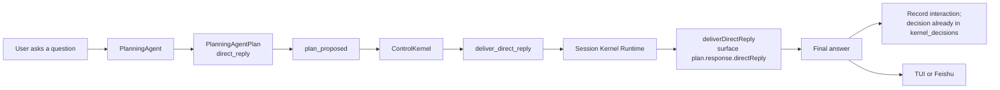
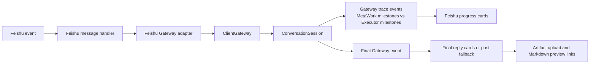

# MetaWork

[English Home](../../README.md) | [中文技术总览](technical-overview.zh-CN.md)

MetaWork is the proprietary commercial product represented by this repository.
AnyFusion is a separate open-source upstream; `AnyFusion-Pi` and other retained
AnyFusion names below identify attributed components or compatibility
contracts, not this repository's product identity.

MetaWork is a local AI Task OS for agentic work. It turns natural-language requests into durable, searchable, schedulable, and verifiable tasks that can survive interruptions, recall prior context, plan subtasks, claim executor work units, and deliver artifacts back to the places where people review them.

It is built for teams who need agents to do more than answer the current turn. MetaWork gives long-running AI work a task state machine, memory boundary, unified ControlKernel decision plane, work-unit dispatch runtime, verification loop, local Gateway, Feishu delivery path, and real end-to-end smoke gate.

> Current implementation baseline (2026-08-21): PlanningAgentPlan v8, Work
> Graph v7, Kernel event/snapshot/decision contract v5, Completion Protocol v4,
> and SQLite schema v33 with transactional 30→31→32→33 upgrade support.

> ADR-0027 through ADR-0030 govern the active revisioned Configuration Control
> Plane, generation-scoped AgentClass/Model/Harness binding, future
> transport-only A2A seam, and signed crash-recoverable native update
> transaction.

The transition keeps the existing ownership path:

```text
Planner proposes -> ControlKernel decides -> Runtime applies
-> ExecutorAdapter transports one authorized attempt
```

The target configuration uses one immutable revision per Work Graph generation.
All graph revisions, deferred recovery, decisions, dispatches, attempts and
receipts remain pinned to that revision. Provider/Model health is a
revision-scoped Kernel projection; Runtime and adapters report facts but do not
choose fallback. Permission Profile semantics remain code-owned under
Resource/Kernel policy. The target schema change is one transaction from v30 to
v31, coordinated with signed release verification, Task-admission closure,
dispatch quiescence, database backup, candidate health checks and rollback. A2A
implementation is deferred to a separate roadmap.

## What MetaWork Does

- Keeps durable tasks with explicit states: created, ready, running, parked, blocked, done, archived, and cancelled.
- Restores interrupted work with resume context instead of restarting from scratch.
- Enforces one active or cleaning-up top-level Task per Conversation through durable Conversation slots, while one AccountRuntime schedules Tasks from different Conversations concurrently and Phase 6 authorizes deterministic batches of isolated child attempts.
- Keeps Planning and Runtime authorization in one append-only `kernel_decisions` ledger while durable inbox/application/outbox state owns recoverable execution.
- Exposes historical tasks through a local SQLite FTS index that the PlanningAgent queries explicitly.
- Plans complex work as explicit subtasks with acceptance criteria and aggregation rules.
- Plans work as a task-owned capability-handoff graph, authorizes a complete ordered canonical AgentClass list per subtask, and lets idle executor work units claim ready subtasks.
- Validates every Subtask through Completion Protocol v4, persists immutable Result Objects and direct-edge references, and separates safe result delivery from completion certification.
- Binds each Conversation to one persisted AnyFusion-Pi Planner session; MetaWork-owned preferences and runtime facts may cross only bounded read-only Planner query contracts and are not replayed as conversation history.
- Captures generated files as task artifacts.
- Sends Feishu chat replies, file artifacts, and Markdown preview links through the backend delivery layer.
- Provides a local Gateway so multiple terminals can connect to one MetaWork runtime.
- Uses the nested `planner/AnyFusion-Pi` fork as the default local Planner conversation surface, with an isolated process/dependency tree and MetaWork-managed provider/model configuration in both native and optional container runtimes.
- Runs the native AnyFusion-Pi interface as an independent Gateway-only client with a single Turn timeline, cursor-based replay, reconnect, versioned slash/permission commands, and no local semantic runtime. The original Ink UI remains source-preserved as a standby module.
- Ships with `npm run smoke:metawork`, whose default gate verifies two-turn memory in one persisted AnyFusion-Pi Planner session; artifact scenarios remain available explicitly.

## Core Architecture

MetaWork is task-oriented rather than session-only. A normal agent session answers the current turn. MetaWork decides whether an input should stay as a lightweight conversation, control an existing task, or become durable work that can be scheduled, blocked, resumed, searched, verified, delivered, and audited.

### Unified Multi-Client Architecture

ADR-0031, accepted on August 18, 2026, defines the Server architecture and is
now delivered as of August 19, 2026. TUI, Web conversation and Feishu use
one versioned Gateway command/event plane. Authenticated clients for the same
Account share one `AccountRuntime` containing configuration, memory, Task,
Kernel, Executor and recovery services, while each Conversation retains an
independent stable Planner session, serialized input mailbox, trace and
presentation stream.

The active cardinality is:

```text
ServerProcess -> RuntimeRegistry -> AccountRuntime
  -> WorkspaceDirectory -> Workspace
    -> ConversationRegistry references -> ConversationSession -> ClientConnection
```

ADR-0034, accepted on August 26, 2026, fixes the process lifecycle around that
domain model. `metawork server start` is the only Runtime-owning startup path
and remains alive independently of all Clients. Bare `metawork` launches only
the TUI Client, `metawork web` only opens the existing Server-owned loopback
Web origin, and configured Feishu connectivity is owned by Server. Server
startup is Workspace-neutral. Existing Conversations restore their immutable
Workspace binding. Local TUI/Web cwd is an untrusted Workspace selection hint.
`/workspace /absolute/path` selects the Client Workspace and never reparents an
existing Conversation; attach/replay restores the Conversation binding.

Runtime-wide KernelWorkflow, execution and startup recovery are constructed once
per AccountRuntime. One account Kernel coordinator owns durable
decision/application draining. Each Conversation has one durable top-level Task
execution slot; different Conversations may execute in parallel and later
same-Conversation Tasks queue. Accounts use separate data roots and SQLite databases; the
current installation is activated as `local-default`.

Detailed Gateway live delivery is origin-scoped (ADR-0036). A turn's
`turn_started`, trace, task/execution projection, permission, artifact, result
and terminal events stream only to the authenticated connection that initiated
the turn. Conversation snapshots and history pages are attach/replay/read
projections rather than cross-client live notifications. A detailed event
without a live origin — a startup recovery projection or a background fact after
the originating client disconnected — remains durable history only and is not
broadcast to every attached client. Replay and explicit history reads remain
Account/Conversation complete and origin-unfiltered, so Web, Feishu and TUI
recover every authorized turn after attach, refresh, switch or reconnect.
Workspace directory activity remains a bounded shared summary.

The production composition below is the executable baseline.
See [ADR-0031](../adr/0031-account-runtime-and-unified-client-gateway.md), the
[approved design](../plans/2026-08-18-account-runtime-unified-gateway-design.md),
and the [implementation plan](../plans/2026-08-18-account-runtime-unified-gateway-implementation-plan.md).

```mermaid
flowchart LR
  User[User] --> Surfaces[Client surfaces<br/>TUI, CLI, Web, Feishu]
  Surfaces --> Gateway[ClientGateway<br/>versioned command/event plane]
  Gateway --> Conversation[ConversationSession<br/>mailbox and presentation]
  Conversation --> Account[AccountRuntime<br/>shared runtime owner]
  Conversation --> MemoryFast[Explicit memory and preference fast path]
  Conversation --> Planning[Planner Work Unit<br/>PlanningAgent]
  Planning --> Plan[PlanningAgentPlan v8<br/>intent, target, risk,<br/>v7 graph or authorization resolution]
  Plan --> Event[KernelEvent<br/>plan_proposed]
  Event --> Loop[Durable KernelWorkflow v5<br/>inbox, snapshot, decide, application, apply]
  Loop --> Kernel[ControlKernel<br/>one pure decide interface]
  Kernel --> Decision{KernelDecision<br/>one action}
  Decision --> Runtime[Runtime handlers]
  Runtime --> Observation[Normalized KernelEvent]
  Observation --> Loop

  Runtime --> GraphRuntime[WorkGraphRuntimeService<br/>apply authorized work graph]
  GraphRuntime --> Graph[Work Graph<br/>persisted Subtasks]
  Graph --> Frontier[Runnable frontier<br/>dependency and publication facts]
  Frontier --> Batch[Kernel dispatch_batch<br/>durable child items]
  Batch --> Supervisor[AttemptSupervisor<br/>up to four attempts]
  Supervisor --> Attempt[SubtaskAttemptRunner<br/>one attempt, one WorkUnit]
  Attempt --> Context[SubtaskExecutionContext<br/>direct handoffs and selected evidence]
  Context --> Executors[ExecutionRuntime<br/>one worktree Executor process]
  Executors --> Verify[Completion Protocol v4<br/>result-first assessment,<br/>authoritative workspace delta]
  Verify --> Publication[Git publication gate<br/>stable integration order]
  Publication --> Delivery[Delivery and UI<br/>TUI progress, Feishu, files, preview links]
  Delivery --> User

  Account <--> Store[(Account SQLite<br/>tasks, subtasks, agent classes,<br/>work units, events, memory)]
  Loop --> Decisions[(kernel_decisions)]
  Graph <--> Store
  Attempt <--> Store
```



Every natural-language input becomes `plan_proposed`; deterministic commands become versioned Kernel events; attempts return capacity, structured outcome, publication conflict, permission, partition, execution-backend or contract facts. `ControlKernel` validates Planning admission, derives one deterministic dispatch batch from the runnable frontier, and remains the sole authority for recovery, retry, fallback, merge repair, replan, partition waiting, permission decisions and derived availability. Runtime applies no unpersisted strategy.

The AnyFusion-Pi `PlanningAgent` uses a dedicated process runner rather than an Executor adapter. One Conversation maps to one persisted Pi session file. Semantic turns launch the Planner with `--mode rpc`, exchange JSONL over stdin/stdout, and serialize writers per Conversation so only one process writes that file at a time. The interactive Pi process is separate: it is launched with `--gateway-socket` and `--conversation-id`, creates no local model/tool/session runtime, and submits raw user commands to the Server Gateway. The fork owns dialogue history for server-side Planner RPC, a small stable system prompt and exactly one fixed `metaclaw-planner/SKILL.md`; MetaWork does not rebuild history from SQLite interactions. Dynamic facts are queried through exactly seven read-only MetaWork MCP tools: `search_tasks`, `get_task_context`, `get_current_session_context`, `get_planning_context`, `get_runtime_state`, `list_executor_status` and `get_executor_diagnostics`. Semantic RPC mode exposes no Pi-native repository readers, preventing source inspection from being used to reverse-engineer Runtime or Kernel semantics. The interactive client-only TUI may retain read-only `read`, `grep`, `find` and `ls` for workspace questions; `bash`, `edit` and `write` remain disabled in every mode. Provider/model selection, external Skills/extensions/MCP configuration, prompt templates, installation and updates are fixed or disabled by MetaWork. Every semantic turn uses the restricted native `submit_planning_proposal({ plan })` tool. Runtime identity is injected outside the model, rejection is structured feedback in the current ReAct turn, and proposal-host transport uncertainty remains distinct from MCP unavailability. A missing fixed MCP tool fails startup; mid-turn MCP loss locks proposal submission and aborts that loop. There is no assistant-text proposal parser, proposal-specific retry count, repair prompt or outer validation loop.

Planner provider/model activation is revision-pinned at the process boundary.
The supervisor selects `generated/agent-runtime/<configurationRevision>/planner`
before legacy home variables, injects the selected Provider credential from
SecretStore after any legacy env-file overlay, and issues an RPC `get_state`
before the prompt. A persisted session may retain conversation history across a
configuration change, but if Pi restores a provider/model different from the
authorized Planner binding, the supervisor terminates the process before any
user prompt reaches a model. Native launchers therefore do not set a static
Planner home or runtime provider env file.

Repository readers may inspect user-requested workspace content, but they may
not be used to reverse-engineer MetaClaw Runtime, Kernel, validation, recovery,
scheduling or Executor semantics. Those facts remain MCP/schema-authoritative.
The supervisor also enforces a convergence budget of eight processing cycles
and twelve non-proposal tool calls; exceeding either budget without submitting
a proposal produces an immediate terminal error instead of consuming the full
RPC timeout.

Task-control proposals also require explicit current-turn user intent. Topic
overlap, a blocked or parked Task, and single-active-Task admission pressure do
not authorize implicit resume, recovery, clearing, cancellation or repurposing;
Planner asks one clarification when that conflict prevents newly requested
schedulable work.

The local AnyFusion-Pi TUI and the non-interactive PlanningAgent runner use the same vendored application but have different trusted roles. The TUI is a client-only process connected to the versioned Unix Gateway protocol. It renders replay/live `turn_started`, `trace_delta`, `task_projection`, execution, permission, artifact, final and terminal events; raw input, slash commands, permission decisions and cancellation requests enter `ClientGateway`. The controlled RPC runner alone connects to `PlannerHostBridge` for proposal submission. `ConversationSession` reruns `PlanningAgentPlanSchema` and `validatePlanningAgentPlan()` before the existing `plan_proposed → DurableKernelWorkflow → ControlKernel` path. Persisted proposal submissions provide replay, rejected-revision, accepted-turn-lock and conflict semantics without duplicating Kernel events. Neither client mode nor the bridge can write the database or directly call Kernel, scheduling, Execution or Executor APIs.

Executor health recovery is event-driven. `ExecutorRecoveryRefreshService`
inspects only enabled AgentClasses whose persisted class health is already
`error`, coalesces concurrent checks per class, applies a 30-second probe
timeout, and records bounded redacted recovery evidence separately from attempt
history. A successful structured probe may perform only `error -> healthy`;
`disabled` remains an administrative lock, and healthy/unverified classes are
not polled for new faults. Session startup, planning cycles, Task
resume/recovery, Executor configuration changes, and
`/executor refresh [name|all]` are the supported triggers.

Planning and recovery refresh begin concurrently, but Kernel admission waits for
both. If a preferred/eligible class recovered, the Planner may revise the
proposal once in the same persisted AnyFusion-Pi Planner session. If an existing Task still has no
usable eligible class, Kernel persists the exact proposal as
`waiting_for_availability` and blocks the Task with a structured availability
fact. A later `executor_recovered` event re-admits that proposal and moves the
Task to `ready` without another Planner call or immediate dispatch.

### Direct Reply Path



This path is still semantic. The persisted AnyFusion-Pi Planner session preserves dialogue such as "continue" or "you stopped halfway"; durable MetaClaw facts remain explicit MCP queries. The PlanningAgent writes the final user-visible answer into `response.directReply`, and runtime surfaces it as-is.

### Durable Task Path

```mermaid
flowchart LR
  Input[User asks MetaWork to do work] --> Planning[PlanningAgent]
  Planning --> Proposal[PlanningAgentPlan<br/>WorkGraphProposal]
  Proposal --> Kernel[ControlKernel<br/>authorize or reject]
  Kernel --> Decision[authorize_task_plan]
  Decision --> Apply[KernelWorkflow idempotent Runtime apply]
  Apply --> Task[TaskRuntimeService<br/>create or bind task]
  Task --> WorkGraphRuntime[WorkGraphRuntimeService<br/>apply authorized graph]
  WorkGraphRuntime --> WorkGraph[Work Graph<br/>persist Subtasks]
  WorkGraph --> Ready[Runnable frontier<br/>published direct dependencies]
  Ready --> Batch[dispatch_batch<br/>durable attempt items]
  Batch --> Attempt[Attempt supervisor<br/>claim and run independently]
  Attempt --> Run[ExecutionRuntime<br/>transport and execute]
  Run --> Verify[Completion Protocol v4<br/>result objects, delta and candidate commit]
  Verify --> Integrate[Git publication gate<br/>deterministic order]
  Integrate --> Done{Integrated?}
  Done -->|yes| Result[Atomically publish result,<br/>handoffs, artifacts and done]
  Done -->|conflict| Repair[Kernel-authorized merge repair]
```



This is the Task OS path. It is where task state, resume context, policy authorization, subtask state, work-unit leases, artifact capture, verification and Git publication matter. ADR-0037 permits independent top-level Tasks from different Conversations to run concurrently, while independent Subtasks inside each Task retain their existing concurrency.

ADR-0037 replaces the account-wide single-active rule with one durable execution slot per Conversation. Same-Conversation Tasks are persistently queued; different Conversations are selected by the account-scoped Kernel scheduler using configured capacity, priority, aging and fairness. Direct replies, clarifications and non-executing domain commands remain available. Both natural-language and deterministic execution entrypoints cross the persisted ControlKernel seam; there is no `TaskAdmissionGate` shortcut.

### Feishu And Progress Path



Feishu progress is intentionally split into MetaWork milestones and concrete executor milestones. Users can see when MetaWork is planning, recalling context, scheduling, claiming a work unit, or waiting for the actual executor.

The conversation/task boundary matters:

- Conversation: answer now, do not create durable state. The persisted AnyFusion-Pi Planner session owns dialogue continuity. Direct replies are persisted as audit facts, not replayed into later prompts.
- Task control: inspect or change existing task state. Good for "what is running?", "resume that task", or "clear blocked tasks".
- Durable task: create or continue work that needs execution, persistence, artifacts, recovery, scheduling, or later retrieval.

The current direct-reply path is explicit: MetaClaw sends the current turn through the bound persisted AnyFusion-Pi Planner session, the PlanningAgent queries confirmed preferences or runtime facts only when needed, and runtime delivers `response.directReply` without claiming an executor work unit.

The Task OS upgrade described in [MetaWork Task OS Architecture And Strategy Upgrade](../archive/plans/2026-06-14-metaclaw-task-os-architecture-strategy-upgrade.md) is reflected in the codebase: deterministic task search indexing, PlanningAgent work graph proposals, unified `ControlKernel` authorization, persisted subtasks, work-unit claiming, aggregation, and verification are implemented and covered by targeted tests. Broad Executor Discovery, remote registries and elastic work-unit spawn remain outside the current implementation. Multi-client Gateway convergence under ADR-0031 has been delivered: Web, Feishu and the native TUI route through the unified Gateway and share one AccountRuntime.

Important runtime boundary: there is no second strategy/orchestration loop
beside the active PlanningAgent → ControlKernel → Runtime chain. Work Graph
frontier derivation is pure structure; retry, fallback, replan, permission,
availability, and recovery remain explicit Kernel policy.

## Current Executors

MetaWork ships two canonical Executor AgentClasses. The default Runtime
executes them as child processes in the Subtask worktree. The legacy Docker
attempt backend remains available explicitly for compatibility:

| Executor | Command | Best For | Install Requirement |
| --- | --- | --- | --- |
| Codex CLI | `codex` | Repository edits, tests, deterministic implementation, code review with patches | Native install reuses the existing command without changing its installation or personal home |
| Pi Agent | `pi` | Research tasks, report generation, multi-step synthesis, agentic CLI workflows | Native install reuses the existing command without changing its installation or personal home |

`codex-cli` and `pi-agent` are canonical AgentClasses with permission-profile
bindings. In `METACLAW_EXECUTOR_BACKEND=worktree` mode, their trusted CLI
commands run as child processes inside the unified Runtime and use the Subtask
Git worktree as their working directory. In `docker` mode, the AgentClass also
requires its immutable image pin and internal control network. No executor
WorkUnit is pre-seeded. After authorization, `WorkUnitClaimService` claims or
provisions a WorkUnit, and `ExecutorRegistry` resolves the AgentClass through
the backend-aware `BackendExecutorAdapter`.

## Prerequisites

Required:

- Node.js `>=22.19.0`.
- npm.
- Git.
- A Unix-like shell environment. macOS and Linux are primary targets; Windows users should use WSL2 for the supported install path.
- Native build tooling for `better-sqlite3`.

Recommended native build tools:

```bash
# macOS
xcode-select --install

# Ubuntu / Debian
sudo apt-get update
sudo apt-get install -y build-essential python3 make g++
```

Executor prerequisites:

- Native worktree mode: existing `codex` and `pi` commands must already be on
  `PATH`; setup does not install, upgrade, downgrade, or reconfigure them.
- Docker compatibility mode: build or pull the canonical Codex and Pi executor
  images used by the configured AgentClasses.

Feishu prerequisites, only if you use Feishu Gateway integration:

- A Feishu app with message receive/send permissions.
- An app secret stored in an environment variable such as `FEISHU_APP_SECRET`.
- Event subscription configured for `im.message.receive_v1`.
- File upload/send-message permissions if you want generated artifacts sent back as Feishu file messages.
- WebSocket event delivery is recommended because it does not require a public callback URL.
- A public reverse proxy or tunnel is only required for webhook mode or external Markdown preview links.

Markdown preview prerequisites:

- `integrations.markdown_preview.enabled: true`.
- A reachable `public_base_url` if users open preview links outside the host machine.

## Install

Native macOS installation uses the nested `planner/AnyFusion-Pi` fork without Docker and
without a global Planner package. Install and verify in this order:

```bash
git clone https://github.com/IFOSR/metawork.git
cd metawork
export ANYFUSION_PROVIDER_KEY='replace-with-your-key'
export ANYFUSION_PROVIDER_URL='https://your-openai-compatible-endpoint.example/v1'
./setup.sh
metawork --help
```

On macOS, `setup.sh` requires Node.js 22.19+, Git, npm, and existing `codex`
and `pi` commands. It builds MetaClaw and the vendored `planner/AnyFusion-Pi` planner
sources (checked into this repository) with separate dependency trees, writes mode-`0600`
MetaWork-only provider and model configuration under
`~/.config/metawork`, installs only `~/.local/bin/anyfusion`, and stores
account runtime state under `~/.metawork/accounts/local-default`. It does not run either
Executor during installation and does not write `~/.codex` or `~/.pi`.

The installed launcher captures the current directory at invocation time.
Start MetaWork from the repository or directory the Planner should inspect:

```bash
cd /path/to/project
anyfusion
```

Install checklist:

- `node --version` is `>=22.19.0`.
- `./setup.sh` reports native installation complete.
- `~/.config/metawork/provider.env` is mode `0600`.
- `metawork --help` works from a new shell.
- `command -v codex`, `codex --version`, `command -v pi`, and `pi --version`
  are unchanged after setup.

Re-run `./setup.sh` after updating either repository. A dirty nested
AnyFusion-Pi checkout is preserved and built without being overwritten.

## Windows Install

The recommended Windows path is WSL2 with Ubuntu. This gives MetaWork the Unix-like shell, native build tooling, sockets, process behavior, and executor compatibility that the runtime expects.

Install WSL2 from PowerShell:

```powershell
wsl --install -d Ubuntu
```

Restart Windows if prompted, then open Ubuntu and install prerequisites inside WSL:

```bash
sudo apt-get update
sudo apt-get install -y git curl build-essential python3 make g++

curl -fsSL https://deb.nodesource.com/setup_22.x | sudo -E bash -
sudo apt-get install -y nodejs

node --version
npm --version
git --version
```

Install and verify MetaWork inside the WSL Ubuntu shell:

```bash
git clone https://github.com/IFOSR/metawork.git
cd metawork
./setup.sh
metawork --help
npm run smoke:metawork
```

Install and authenticate Codex/Pi independently before setup; MetaWork setup
must not be used to change an existing Executor installation.

Windows install checklist:

- Run MetaWork commands inside WSL Ubuntu, not Windows PowerShell.
- Keep the repository under the WSL filesystem, for example `~/MetaWork`, not `/mnt/c/...`, for better file and SQLite performance.
- Confirm `node --version` is `>=22.19.0`.
- Confirm `metawork --help` works in a fresh WSL shell.
- Confirm the default executor works in WSL, for example `codex --help`.
- Confirm `npm run smoke:metawork` completes successfully

Native Windows PowerShell is not the primary supported runtime today. Advanced users can try direct development with Node.js 22.19+, Git, Visual Studio Build Tools, `npm install`, `npm run build`, and `node dist/index.js`, but `setup.sh`, `anyfusion.sh`, Unix socket Gateway behavior, and downstream executor CLIs may not behave the same way. Use WSL2 for direct Linux development; the container runtime remains an optional compatibility path.

## Install Executors

MetaWork does not vendor the downstream executor CLIs. Install the ones you want to use and make sure each command is available on `PATH`.

### Register Custom Executors

Installed executors are runtime workers that MetaWork can assign subtasks to. A registered executor now has three parts:

- The `AgentClass`: domains, capabilities, risk level, input/output types, use-case hints, route-intent affinity, and runtime defaults.
- The runtime binding: immutable Docker image ID, controlled permission profile, in-container command/arguments, install check command, and optional project URL.
- At least one executor `WorkUnit`: a concrete idle runtime slot that can claim one ready subtask at a time.

Use the guided registration flow when you are not sure what to fill in:

```bash
/executor register wizard
```

The wizard asks for the executor name, whether to infer from a project URL or fill fields manually, the local command, non-interactive args, install check command, domains, and capabilities. If you provide a GitHub URL, MetaWork tries to infer CLI information from `package.json` or README examples. If inference is not reliable, it falls back to manual entry.

One-line registration is also supported:

```bash
/executor register research-bot \
  --image registry.example/research-bot:1.2.3 \
  --image-id sha256:<64-hex-digest> \
  --permission-profile restricted-custom \
  --command research-bot \
  --args "run --prompt {prompt}" \
  --check "research-bot --version" \
  --project-url https://github.com/example/research-bot \
  --domains research,reporting \
  --capabilities research,report_generation
```

`{prompt}` is replaced with the subtask prompt. If `--args` does not contain `{prompt}`, MetaWork appends the prompt as the final argument. The image ID must match the referenced image and the permission profile must be one of the controlled profiles. A missing binding or changed tag fails closed until the class is explicitly updated; there is no host-process fallback. Static routing capabilities remain separate and Planner-safe.

`codex-cli` and `pi-agent` are owned completely by canonical definitions. Startup force-converges every persisted static field, immutable image binding and permission profile for those names, and normal registration APIs reject overwrite or deletion. Non-canonical capabilities remain free-form registration metadata and are never promoted into the controlled Planner catalog. Historical custom classes without image/profile bindings remain visible for audit but are non-executable.

The Phase 5 permission product boundary is the selected execution backend plus
the permission profile and durable request/grant/use audit budgets.
`use_capability` atomically consumes attempt, expiry, call and byte limits, but
it is not a universal operation broker and does not prove fine-grained
mediation of every native file, network or external action. Container mounts
and sandbox policy apply only to the container backend; egress profiles and
resource leases remain Runtime enforcement boundaries.

Executor extension contract:

Required routing fields:

- `name`: stable executor name, such as `research-bot` or `finance-research-agent`.
- `domains`: where the executor fits, such as `research`, `finance`, or `software`.
- `capabilities`: the executor's configured strengths and routing preferences, such as `research`, `report_generation`, `multi_tool`, `coding`, or `tests`. An omitted label is not a hard prohibition; provider/model availability, harness compatibility, permissions, and Runtime affordances remain the actual execution constraints.

Recommended routing fields:

- `inputTypes`: supported input types, such as `text`, `files`, or `image`.
- `outputTypes`: expected outputs, such as `markdown`, `report`, `code`, `patch`, or `json`.
- `primaryUseCases`: examples of tasks that should preferentially route to this executor.
- `avoidUseCases`: examples of tasks that are less preferred for this executor, not physically disabled operations.
- `riskLevel`: `low`, `medium`, or `high`.
- `intentAffinity`: route-intent affinity by keys such as `repo_execution`, `research_workflow`, `memory_agent_ops`, and `general`.
- `projectUrl`: source repository or documentation URL.

Executor health and recent outcomes are dynamic status. Planner reads them through `list_executor_status`; they are not stored as static AgentClass routing metadata.

Required runtime binding:

- `runtimeCommand`: executable command available on `PATH`, for example `research-bot`.
- `runtimeArgs`: non-interactive arguments, for example `["run", "--prompt", "{prompt}"]`.
- `runtimeCheckCommand`: install or availability check, for example `research-bot --version`.

Runtime behavior requirements:

- The executor must run non-interactively; it cannot wait for human prompts.
- It must accept the full task prompt through `{prompt}` or as the final argument.
- It should write the final answer to stdout.
- Failures should return a non-zero exit code or a clear stderr error.
- Long-running tasks should emit progress periodically so the idle watchdog does not treat the process as stuck.
- File artifacts should be written into the task output directory provided in the prompt.
- Feishu delivery, file upload, and preview link generation should stay in MetaWork's backend; executors should produce local artifacts instead of calling Feishu APIs directly.

Optional advanced adapter interfaces:

- `execute(input)`: run a task with structured context.
- `isAvailable()`: check whether the executor can run.
- `abort(attemptId?)`: abort one exact attempt; Task cancellation enumerates every active attempt through the Runtime control port.
- `installSkill(pkg)`, `updateSkill(pkg)`, `disableSkill(target)`, `deprecateSkill(target)`: support executor-specific Skill lifecycle management.

Executor management commands:

```bash
/executor list
/executor show <name>
/executor register wizard
/executor unregister <name>
/executor feedback <taskId>
```

### Codex CLI

Install and authenticate Codex CLI according to the official OpenAI Codex instructions. Then verify:

```bash
which codex
codex --help
```

Codex attempts use `BackendExecutorAdapter`: worktree mode runs the trusted local
`codex` process with an isolated attempt `CODEX_HOME`; Docker compatibility mode
runs the canonical `metaclaw-executor-codex:phase5` image.

### Pi Agent

Install and authenticate Pi independently before running MetaWork, then verify:

```bash
which pi
pi --help
```

MetaWork calls it as:

```bash
pi -p "<prompt>"
```

Pi attempts use the same execution seam in either backend. Docker compatibility
mode runs them in `metaclaw-executor-pi:phase5`; worktree mode runs the trusted
`pi` binary in the current Subtask worktree.

## Run

Start the TUI:

```bash
anyfusion
```

The default command launches the pinned AnyFusion-Pi Gateway client:

- The executable is `anyfusion-planner`, launched with a Server-owned Gateway socket and stable Conversation ID.
- Client mode branches before model, tool, project-resource or semantic session creation.
- Pi's editor submits raw text, versioned slash commands, permission decisions and cancellation requests to `ClientGateway`.
- The execution-trace area renders ordered Planner, routing, Kernel and Executor-safe milestones as they arrive; the conversation area renders replayed/live output and the final answer.
- Reconnect attaches to the same Conversation from the last event cursor and deduplicates event IDs across replay and live delivery.
- Permission requests remain bounded UI facts; `/approve` and `/deny` submit only the request ID and resolution.
- The client cannot write Task state, choose policy, schedule attempts, call Kernel, or control Executor processes.
- The raw v8 plan, prompts, hidden reasoning, credentials and raw process output remain server-side.
- Set `METACLAW_STANDBY_TUI=1` to start the preserved Ink implementation for fallback investigation. That module is not the default and any future activation must remain Gateway-backed.

Start the persistent Server before launching a Client:

```bash
metawork server start
metawork server status
```

To rebuild every shipped component and activate one coherent release from any
directory, run:

```bash
metawork server stop
metawork build
metawork server start
```

The build source is installation metadata, not the user's current Workspace.
The command rebuilds Runtime, Planner, and Web, preserves account data, and
atomically switches `app/current`. It fails while Server is running. Server,
TUI, and Web validate the same release identity before connecting, so old and
new releases cannot silently mix.

Launch independent Clients:

```bash
metawork
metawork tui --conversation <id>
metawork web
metawork web --conversation <id>
```

Server lifecycle is explicit:

```bash
metawork server stop
metawork server restart
metawork server doctor
```

Only Server owns `runtime.lock`, Runtime, recovery and transport listeners.
TUI and Web resolve the atomic endpoint manifest and fail with a concrete
`metawork server start` instruction when no compatible ready Server exists.
Closing a terminal or browser does not stop Server or accepted Task work.

Server startup never binds a user Workspace. Existing Conversations restore
their immutable Workspace binding. A local TUI/Web Client applies its startup
directory through the same Server-owned selection as:

```text
/workspace /absolute/path/to/project
```

Server canonicalizes and authorizes the path, finds or creates one Account
Workspace, and updates the Client's `activeWorkspaceId`. A rejected hint leaves
no selected Workspace, returns `workspace_required` before Conversation
creation, and prompts for the explicit command. Attach/replay restores the
Conversation Workspace and ignores cwd. `/workspace` never moves an existing
Conversation.

`metawork web` registers its startup directory in a short-lived single-use
Server launch context. The URL contains only an opaque bootstrap fragment and
never contains a Workspace path. HTTP snapshots, WebSocket replay, and live
`workspace_changed` events expose the Server-confirmed canonical Workspace to
the existing Web interface without narrowing its richer projections.

The Web surface binds only to `127.0.0.1`. Normal startup opens a short-lived,
single-use URL-fragment bootstrap that is exchanged for an HttpOnly,
SameSite=Strict process-local session cookie and removed from the address bar.
No token is copied or stored by browser JavaScript. `metawork web --no-open`
prints a manual fallback token for SSH and port-forwarded use. WebSocket
upgrades require the session cookie and an allowed loopback Origin before the
protocol switches; stale cookies return the browser to the fallback gate
instead of reconnecting indefinitely.

The Web surface is a persistent Conversation workspace. A fixed history rail
selects bounded Conversation projections, and `WebGatewaySessionRuntime`
attaches to the selected stable Conversation through `WebGatewayAdapter`.
There is no Web-owned live Runtime or `MetaclawSession`. Sanitized terminal
turns are stored in the account Conversation root under
`accounts/local-default/conversations/web/`.

Conversation embeds the detailed execution narrative before the final answer;
Trajectory reprojects the same facts into timing bands, metrics, filters, and
dense event rows. `ConversationSession` emits a
bounded current-turn trace for query intake, Planner lifecycle, structured
intent, Kernel decisions, exact authorized AgentClass/Harness/Provider/Model
bindings and delivery. WebSocket reconnect sends the full snapshot and then
ordered deltas. The existing durable execution projector supplies Subtask,
attempt, verification and publication state, including the latest normalized
Executor progress summary. These are auditable events and schema summaries,
not model chain-of-thought; secret-like fields, raw prompts and raw process
output do not cross the browser boundary. Planner RPC lifecycle and safe tool
milestones are forwarded as they arrive, so a long model turn shows process
startup, request acceptance, processing cycles, model response start, tool
start/completion, and agent completion instead of appearing idle until the
final proposal returns. The primary Web presentation is an inline `LIVE
EXECUTION` panel with one card per active Subtask; a settled turn keeps the
same panel as `EXECUTION SUMMARY`. Clicking a card opens an `Executor Detail`
drawer backed by the ordered safe trace plus the durable attempt-runtime
progress history and ExecutionProjector timeline. Heartbeat, dependency wait,
capacity wait and blocked states are rendered distinctly from actual Executor
activity. Stable event cursors and event IDs make replay idempotent across
reconnects, and the persisted turn keeps the trace/timeline after the current
turn ends. No progress event is Completion Protocol evidence.

Execution presentation uses the Runtime Subtask ID as its canonical identity.
`src/work-graph/subtask-identity.ts` is the single pure owner of proposal-to-
Runtime ID mapping, and Management applies it to historical reads, reconnect
snapshots and live deltas before Web groups cards or opens detail streams.
There is no title, list-order or ID-suffix merge heuristic.

Routing presentation is revision-pinned and user-facing. Configuration resolves
the authorized binding against the Task generation's configuration snapshot,
then Management emits only public Executor, Harness, Provider and configured
model names plus normalized rejected-candidate reasons. Internal `modelRef`,
`providerRef`, configuration revision and binding fingerprint do not enter the
ordinary Web contract; unrecoverable historical identity is rendered as
unavailable rather than falling back to an internal ref. The routing card
separates the final selection from model candidates that were not selected, so
one rejected model under Codex CLI does not imply that the Codex CLI Executor
was rejected.

Attempt IDs remain durable correlation keys but are not visible labels.
Execution narrative projects attempt kind and ordinal into `主执行`,
`继续执行`, `回退执行`, `结果修正` or `合并修复`, and maps internal lifecycle
states to localized user status. The three-part attempt header keeps label,
status and duration non-overlapping on desktop and mobile. Trajectory is
read-only and does not render the Composer; draft and pending attachments stay
owned by the App and return with Conversation. The header also provides
system/light/dark theme preference, persisted in `metawork.theme` and applied
before the first application render through semantic color tokens.

Pending dependency publication is a wait fact, not an ordinary user blocker.
Missing handoff, Result Object, workspace state or identity mismatch is exposed
as a bounded structured materialization diagnostic. Explicit Task resume enters
the Kernel as `task_resume_requested`; only the resulting Kernel-authorized
`resume_task` application may restore Task/Subtask readiness and dispatch a
new attempt.

The `/task resume` command result is a projection of the first authoritative
Kernel Decision, not an optimistic acknowledgement. Only `resume_task` is
reported as execution started. `no_op`, `block_work`, and `park_for_replan`
explicitly state that no new Executor was launched and include the safe Kernel
reason. `Command completed` means only that command handling settled; any actual
background work remains visible through the Task/Subtask/Executor trace.

Account startup and explicit Resume also repair one known legacy pre-apply
failure: a replan `authorize_task_plan` application made uncertain only because
the system Conversation binding lacked the optional `onDecisionApplying`
presentation callback. The repair is allowed only when the exact error,
submitted replan request, generation and next graph revision match. It submits
a durable `recovery_resolution_requested(retry)` and replays the original
Decision through ControlKernel; all other uncertain applications and effects
retain ordinary explicit recovery semantics.

Only the persistent Server shares `runtime.lock` with native
update/rollback. Account migration uses SQLite online backup to include
committed WAL data, verifies a staged tree manifest, and archives the legacy
layout outside writable authority. Periodic durable recovery is AccountRuntime
owned and does not depend on open Conversations; expired Gateway cursors reset
to a compacted current/terminal snapshot. Planner Host startup probes live
sockets before reclaiming a confirmed stale socket and records the created
device/inode so shutdown cannot unlink a replacement. Planner RPC preserves
structured transport uncertainty and partial tool audit.

The native AnyFusion-Pi TUI remains the default Client for bare `metawork`.
Web and TUI own only connection and presentation state; both attach to the same
persistent Server-owned RuntimeRegistry, AccountRuntime, WorkspaceDirectory,
ConversationRegistry and ClientGateway. `anyfusion` and `metaclaw` remain
compatibility CLI aliases,
but removed lifecycle forms such as `gateway run`, `--connect`, foreground Web
and script mode are rejected.

Configuration activation is AccountRuntime-scoped. Provider base URLs and
credential references, the Provider model catalog, and Planner/Executor routing
policies are hot-activatable while the activation gate is idle. The settings
surface is Provider-first: catalog models form the candidate source, Planner is
fixed-only, Codex Auto is limited to GPT-family models across enabled Providers,
and Pi Auto may use all enabled Provider models. The gate
rechecks Planner turns, running Tasks, blocking Dispatch/Attempt facts, child
processes, leases, publication/merge work, recovery, and concurrent activation
inside the backend transaction; connected clients and idle ready/parked/blocked
Tasks do not block it. Application releases, schema, Harness/process
artifacts, Permission Profile semantics, Planner RPC, and runtime directory
protocol changes remain restart-required.

`ConfigurationRuntimeCoordinator` validates, compiles, probes, renders and
persists the immutable candidate before pointer cutover, then updates the live
Planner/Kernel/Runtime views and broadcasts `configuration_runtime_state` and
`configuration_activated`. Existing Work Graph generations and attempts remain
pinned to their original revision. The next Planner turn resolves a concrete
model from the new active revision before sending a prompt; a running child
process is never rewritten. Executor Auto is resolved by ControlKernel into a
complete concrete binding and Runtime only transports that binding. Deleting a
Provider or model is allowed only while idle; Auto pools are cleaned
automatically, while a Fixed reference is left invalid and must be repaired
rather than silently replaced. The API returns `runtime_busy` for a busy gate
and `invalid_configuration` for an unrepairable draft.

Web settings exposes active/runtime revision, gate status, structured blocking
reasons, and HTTP 409 responses for busy, revision-conflict, or
restart-required activation. Work Graph presentation is a read-only projection
of validated graph, Kernel decision, Dispatch, Attempt, Verification, and
Publication facts. It renders dependency/handoff/artifact edges, parallel
groups, runnable frontier, routing policy, public Provider/Model names,
estimated cost/latency, and model-level candidates that were not selected; it
cannot schedule, cancel, retry, fallback, mutate bindings, or access storage.

The native launcher stores account-owned state under:

```text
~/.metawork/accounts/local-default/
├── config/
├── secrets/
├── generated/
│   ├── agent-runtime/
│   └── current
├── data/
│   ├── anyfusion.db
│   ├── database-revisions/
│   └── backups/
├── planner/sessions/
├── conversations/
├── workspace-catalog/
├── gateway/
├── workspace-store/
└── attempts/
```

Installation-global transport state remains outside the account root:

```text
~/.metawork/
├── gateway.sock
└── runtime.lock
```

Launch an independent client after the Server is ready:

```bash
metawork
metawork tui
metawork web
```

Server utilities:

```bash
metawork server start
metawork server status
metawork server doctor
metawork server restart
metawork server stop
```

### Optional container compatibility validation

Docker is not required for native macOS installation or normal local use. The
`docker/` workflow remains available for optional Linux compatibility and CI
validation. In that mode the container working directory remains `/workspace`,
one BuildKit build consumes MetaClaw and the vendored AnyFusion-Pi planner sources,
and the final image keeps the MetaClaw control process and Planner process
isolated with separate dependency trees. The Docker attempt path is
compatibility-only and is not started by the native launcher.

The Runtime image contains the MetaClaw CLI, generated v8 schema, versioned host bridge, compiled Planner MCP server, built AnyFusion-Pi application, Codex/Pi CLIs and their attempt configuration. `docker/Dockerfile.runtime` builds the checked-in MetaClaw and vendored planner sources and copies two independent application trees into the final image. The Planner launcher and MetaClaw-injected `/app/dist/planner-mcp.js` command both use `/usr/local/bin/node`; `/opt/anyfusion-planner/node` is forbidden. Worktree mode runs the trusted Executor CLI in the managed Subtask worktree and uses loopback attempt services; it does not require sibling Executor images or a Docker socket. Source changes require `docker/shell.ps1 -Rebuild`; only workspace and data volumes persist. The trusted Runtime exposes an attempt-scoped model gateway with a random scoped token. Use `docker/shell.ps1` for Docker + SSH compatibility validation.

Local validation covers TypeScript lint/build, focused Planner RPC and host-protocol tests, the Docker Vitest suite, Unix-socket bridge behavior, Session validation, and unchanged Kernel/Execution/Executor regressions. Linux container smoke additionally verifies the single Node 22.19+ executable, isolated application dependency trees and processes, absence of an embedded Planner Node, Planner RPC JSONL, entrypoint config separation, and the final unified image.

## Configuration

Use the Web settings surface or the
`metawork config|provider|model|planner|executor` administration commands.
Configuration activation validates, compiles and probes an immutable
account-scoped revision. Hot-safe catalog and routing changes apply without
restarting the Server; process-level changes return `restart_required`. The
active pointer is:

```text
~/.metawork/accounts/local-default/config/active
  -> revisions/<revision-id>/
```

Do not edit immutable revision files in place. Provider credentials resolve
through the account SecretStore, with macOS Keychain as the default and
mode-`0600` files only when `METAWORK_SECRET_STORE=file` is explicit.

Export the Feishu app secret before starting the runtime:

```bash
export FEISHU_APP_SECRET="your Feishu app secret"
./anyfusion.sh start
```

## Feishu Gateway Delivery And Markdown Preview

MetaWork separates document generation from Feishu delivery:

- The executor writes Markdown or other files into the task output directory.
- MetaWork records those files as task artifacts.
- The Feishu Gateway sends the final answer back to the origin chat.
- The Feishu Gateway uploads generated artifact files when file upload is available.
- Markdown artifacts get online preview links when Markdown Preview is configured.
- Delivery attempts are written to `~/.metaclaw/gateway-audit.jsonl`.

Executors should not call Feishu Docs or cloud-document APIs directly. If a user asks for a "Feishu cloud document" or "online preview", MetaWork instructs the executor to produce local Markdown artifacts; the Gateway handles Feishu synchronization and preview links.

Feishu progress cards show the execution chain explicitly. MetaWork first performs intent parsing and execution preparation, then shows planner work-graph decisions, work-unit claim status, and the actual executor that starts the subtask. This prevents Feishu users from mistaking the intent parser, planner, or dispatcher for the final executor.

Final Feishu replies use Markdown message cards first. Long answers are split into multiple cards. If a card chunk fails, MetaWork retries that chunk as a rich-text post; if any chunk still cannot be delivered, MetaWork uploads the complete final answer as a Markdown file so the user does not receive a partial result.

Access control is handled by the Gateway:

- Direct messages default to `dm_policy: pairing`. The first DM user is approved automatically; later users can be approved or revoked with `metawork gateway pairing`.
- Group chats default to `group_policy: open` with `require_mention: true`.
- `/sethome` sent in a Feishu chat records that chat as `gateway.platforms.feishu.home_channel`.
- Feishu configuration is read only from `gateway.platforms.feishu`.

Useful Feishu Gateway commands:

```bash
metawork gateway doctor
metawork gateway pairing list
metawork gateway pairing approve <open_id>
metawork gateway pairing revoke <open_id>
```

Default preview URL:

```text
http://127.0.0.1:8790/preview/<artifact>
```

For Feishu users outside the host machine, expose the preview service and set:

```yaml
integrations:
  markdown_preview:
    enabled: true
    host: 127.0.0.1
    port: 8790
    public_base_url: https://preview.example.com
```

## Task Workflow

Create a task in natural language:

```text
> Compare these three contracts and create a risk matrix.
```

MetaWork will:

1. Classify the input as conversation, task control, or durable work.
2. Create or resolve the target task.
3. Retrieve relevant historical task context when available.
4. Apply semantic task priority.
5. Ask the planner to choose a planner outcome or build a subtask work graph.
6. Persist ready subtasks with dependencies, required capabilities, an ordered canonical AgentClass list, and acceptance criteria.
7. Claim an idle executor work unit for each ready subtask and stream progress.
8. Store result summaries, artifacts, and task memory.
9. Suggest what to do next.

Useful commands:

```bash
/task list
/task list active
/task list ready
/task list parked
/task list blocked
/task list done

/task show <id>
/task pause <id>
/task resume <id>
/task block <id> waiting for customer data
/task unblock <id>
/task unblock <id> /tmp/evidence-v4.pdf
/task cancel <id>
/task <taskId> subtask cancel <subtaskId...>
/task <taskId> accept-partial
/task index rebuild
/task index search <query>

/task dashboard
/task attach <taskId> <file paths...>
/task history <taskId>
/config
/help
/exit
```

The AnyFusion-Pi Gateway TUI is the default local surface. The client owns only
editor and presentation state; `ClientGateway`, `ConversationSession`,
AccountRuntime and ControlKernel retain command validation, semantic planning,
durable mutation and execution authority. The old Ink TUI remains intact under
`src/tui/` and can be selected with `METACLAW_STANDBY_TUI=1`, but it is a
standby source-preservation module rather than a second actively maintained
frontend.

## Task Search

MetaWork keeps a local SQLite FTS5 search index for tasks and task-related text. This makes historical work recoverable even when the user does not remember the exact task id.

Commands:

```bash
/task index rebuild
/task index search contract risk matrix
```

The index is a deterministic read model, not a semantic router. The PlanningAgent decides when historical work is relevant, calls `search_tasks`, and reads selected records with `get_task_context`. Runtime code does not infer task continuity, related history, timeline intent, or resume/reference mode from user wording.

## Single-Task Concurrent Kernel Control Model

MetaWork admits one executing or cleaning-up top-level Task per Conversation. An account-scoped scheduler selects Tasks from different Conversations under `maxConcurrentTasks`, `maxConcurrentAttempts`, `maxConcurrentAttemptsPerTask`, aging and fair-share policy; same-Conversation Tasks remain queued. Within each Task, Work Graph facts derive a stable runnable frontier and Kernel v5 may authorize up to four independent attempt items in one batch. Scheduling is non-preemptive; direct replies, clarifications, status/query commands and explicit task-control commands remain available. This parallel rollout is governed by ADR-0037 and is implemented incrementally under the active implementation plan.

Every natural-language proposal and deterministic execution entrypoint enters the same persisted control chain: `event → bounded snapshot → ControlKernel.decide → kernel_decisions → Runtime apply → normalized event`. `KernelWorkflow` remains serial, but applying `dispatch_batch` only persists `kernel_dispatch_items`; an Execution-owned supervisor launches them asynchronously and submits each outcome independently. A sibling failure never cancels the rest of the batch.

Whole-Task and explicit Subtask cancellation use the same durable control chain. The cancellation fence commits before process termination; `cancelling` dispatch/publication rows continue to own capacity until the exact backend execution has exited or is confirmed missing and WorkUnit/resource leases are released. Late outcomes are `no_op`. Subtask cancellation atomically includes every downstream dependent while independent siblings continue. After the surviving graph drains, the Task blocks until the user either cancels it or explicitly accepts the published subset with `/task <taskId> accept-partial`.

## Planning Agent, Control Kernel, And Work Units

Natural-language dispatch is split into Planner understanding, kernel authorization, and runtime execution. Raw natural-language input enters `PlanningAgent`; only slash commands and deterministic IDs, paths, URLs, and attachments bypass semantic planning. Natural-language memory capture is not a fast path. The dedicated AnyFusion-Pi runner submits a strict v8 `PlanningAgentPlan` through the native proposal tool and queries bounded read-only MCP tools when evidence is needed. Work Graph uses the v7 contract and pins one configuration revision with complete Executor bindings; authorization resolution remains limited to an exact pending request and does not add resource claims.

- `direct_reply`, `clarification`, `task_control`, or `no_action`: no executor work unit should be claimed unless the kernel rewrites the plan into executable work.
- `plan_work_graph`: the planner must propose a non-empty capability-minimal work graph whose nodes are future `Subtask` records. Each proposal carries dependencies, acceptance criteria, `deliveryKind: edit | report`, non-empty controlled `requiredCapabilities`, and the complete ordered set of statically eligible canonical AgentClasses in `preferredAgentClassList`.

`ControlKernel` exposes only `decide(event, snapshot)`. Kernel contract v5 validates Planning proposals, single-active-Task admission, graph and canonical coverage facts, then decides batch dispatch, capacity handling, execution landing, Task/Subtask cancellation, partial-result acceptance, generation replan, deferred availability, Executor recovery, merge repair/conflict replan, timer rechecks, contract correction, permission grant/deny/escalation, partition waiting and execution-backend recovery without reading repositories, clocks, adapters or raw logs. Every event/snapshot/decision uses a versioned discriminated union, and decision and attempt identities are deterministic from the event and batch item.

`DurableKernelWorkflow` first writes every event to `kernel_events`, atomically issues one immutable `kernel_decisions` authorization plus a pending application, then invokes an idempotent Runtime handler. Stable observations return to the inbox. Duplicate events resume the existing application instead of issuing a second Decision, and startup reconciles applications, child dispatch items, execution-backend records and publication state before accepting input. Planner runs and bounded redacted tool summaries remain audited separately. `WorkGraphRuntimeService` derives graph facts without selecting strategy. `KernelExecutionRuntime` builds snapshots and applies decisions; `AttemptSupervisor` owns child launch; `SubtaskAttemptRunner` produces receipts and candidate commits; `WorkspacePublicationWorker` owns ordered integration and atomic completion publication.

The older `ExecutorRouter`, `ExecutorRoutingCoordinator`, `ExecutionPolicyPlanner`, and the `IntentOrchestrator` routing subsystem have been removed entirely — there is no separate executor-selection layer. Legacy route-intent names such as `repo_execution` and `research_workflow` survive only as affinity keys for ranking agent classes.

## Complex Task Strategy And Agentic Loop

MetaWork can represent complex requests as a work graph instead of a single undifferentiated prompt. The graph has no explicit single/multi execution mode. `AnyFusionPlanningAgent` keeps work that one canonical AgentClass can deliver as one node and creates another node only at a controlled Routing Capability handoff. The shared pure rules reject malformed DAGs and mergeable same-AgentClass single chains, while reentrant adapters may now own multiple independent nodes in one frontier.

In the active session path, proposed nodes become persisted Work Graph v7 `Subtask` records only after a durable `authorize_task_plan` application. The unreleased product uses SQLite schema v33 and supports transactional 30→31→32→33 upgrades; unsupported older schemas are refused. The schema includes the durable planning, Kernel, resource, workspace, permission, execution-backend, dispatch, publication, cancellation and recovery facts plus immutable Result Objects, direct-edge ResultReferences, and Planner proposal configuration-revision pins for safe replay. The physical names `attempt_sandboxes`, `sandbox_container_id` and `sandbox_lost` remain durable compatibility names and are not the current abstraction names. `dependencies` is the only topology and typed handoff source. Downstream work becomes runnable only after direct dependencies are published, receives authorized references and full Git ancestry, and never absorbs sibling or integration-branch state implicitly.

`SubtaskExecutionContext` is the only production Executor input. Task title/goal are background, the current Subtask goal is the sole operational instruction, siblings expose only titles as out of scope, and Planner-selected evidence has deterministic per-reference and total preview budgets. Runtime keeps Task/Subtask/attempt/WorkUnit identities and acceptance/handoff keys outside the model-facing prompt and report. Ordinary assistant/Executor history never enters the context. Codex and Pi may access eligible Task evidence through the same attempt-bound read-only authorization; unsupported Adapters receive only selected previews.

Every Executor response is assessed by Completion Protocol v4 on result deliverability, completion certification and safety disposition. A safe body may be delivered as `partial` and `uncertified` when metadata is missing or malformed, or when a physical transport boundary requires chunking; it cannot certify the Subtask or release downstream work. Runtime stores raw stream, business body and safe projection as immutable Result Objects, streams the safe projection through `result_delivery_available` / `result_chunk` / `result_completed`, and uses edge-scoped ResultReferences for authorized downstream reads. Workspace containment, permission and secret boundaries remain fail-closed. Certified results persist the terminal receipt and candidate commit, then enter `awaiting_integration`; publication later atomically publishes authorized handoffs, artifacts, workspace state and `done`. Correction repairs metadata only and never discards a safe body or repeats the business task.

The retired `ExecutionStrategyPlanner`, `ExecutionPolicy`, `MultiExecutorOrchestrator`, and `AgenticLoopController` implementations have been removed. They were no longer connected to the production path after work-graph and work-unit dispatch became authoritative. `ExecutionAggregator` remains available to the verification pipeline for structured multi-result evidence checks.

## Executors Vs Skills

Executors and Skills are different layers of the ecosystem.

An Executor is who does the work. A Skill is the method, knowledge, or operating guide the worker uses while doing it.

Executors are AgentClass runtimes such as the canonical Codex CLI and Pi Agent.
They may be launched as trusted child processes in a managed worktree or as
Docker-sandboxed attempts during compatibility operation. An executor
determines the model, toolchain, permissions, runtime environment, context
window, file access, non-interactive command, cost profile, and reliability
boundary.

Skills are lighter capability packages. They describe how to perform a specific class of work: how to analyze futures contracts, how to review code, how to run a research workflow, or what output format to use. A Skill can improve an executor's behavior, but it does not automatically change the executor's runtime, permissions, tools, or installation state.

Executor strengths:

- Adds a new runtime boundary: model, tools, credentials, permissions, and command-line behavior.
- Lets MetaWork assign ready subtasks to the executor work unit best suited for that work.
- Enables planner-driven reassignment, cross-checking, and audit trails across different agents.
- Can integrate private or domain-specific systems that a generic Skill cannot access.

Executor tradeoffs:

- Heavier to install and configure.
- Requires a non-interactive command and an availability check.
- Needs permission, timeout, failure, heartbeat, and recovery handling.
- Can create operational complexity if many runtimes behave differently.

Skill strengths:

- Lightweight and fast to add.
- Good for encoding repeatable methods, checklists, domain heuristics, and output conventions.
- Can improve consistency within a single executor.
- Lower operational overhead than adding a new runtime.

Skill tradeoffs:

- Bound by the Executor image, permission profile, scoped context and model gateway.
- Cannot make an unavailable CLI, private API, browser, file permission, or enterprise integration appear by itself.
- Usually improves execution quality rather than expanding the runtime boundary.

MetaWork uses executor registration when the missing capability is a different worker or runtime. It uses Skills when the worker exists but needs better procedure, domain knowledge, or formatting discipline.

## Explicit Memory

MetaWork stores explicitly confirmed preferences, task memory cards, and learning candidates in SQLite.

Natural-language requests never create, promote, or apply memory through a code-side heuristic. Users manage preferences through explicit `/memory` commands. Bounded confirmed global preferences are provided to the PlanningAgent, which may reference an exact confirmed preference in a Subtask `contextRef`.

Commands:

```bash
/memory
/memory add Alex prefers formal updates with legal copied
/memory search formal
/memory edit <pref_id> --scope project Use tables for outputs
/memory delete <pref_id>
/memory stats
/memory vault export
/memory vault status
```

## Learning Loop

MetaWork can turn successful tasks, failures, artifacts, and executor skill usage into learning candidates.

Commands:

```bash
/learning candidates
/learning approve <candidate_id> [note]
/learning reject <candidate_id> [reason]
/learning promote <candidate_id>
/learning cards
/learning skills
/learning summary
/learning weekly
```

## Development

```bash
npm run dev
npm run build
npm test
npm run lint
npm run smoke:metawork
npm run smoke:gateway
```

`npm run smoke:metawork` is the required live Planner smoke gate. Its default `planner-session` scenario sends two turns in one Conversation, verifies the second reply recalls a marker absent from that turn, and verifies exactly one persisted AnyFusion-Pi session file was created. Executor artifact gates remain available with `--scenario artifact` or `--scenario python-hello`. Smokes run natively against the installed MetaWork configuration (`METAWORK_CONFIG_HOME`, default `~/.config/metawork`); pass `--mode docker` to force the container path, which requires the `docker/*.env` provider files.

`npm run smoke:gateway` is the provider-independent production-boundary gate
for Gateway admission, replay, reconnect, account recovery, and independent
Client/Server composition.

Targeted tests:

```bash
npm test -- tests/planner-process-runner.test.ts
npm test -- tests/session/planning-agent-session-routing.test.ts
npm test -- tests/session/planning-kernel-path.test.ts
npm test -- tests/kernel/control-kernel.test.ts
npm test -- tests/kernel/kernel-workflow.test.ts
npm test -- tests/execution/executor-recovery-refresh-service.test.ts
npm test -- tests/execution/work-unit-claim-service.test.ts
npm test -- tests/storage/subtask-repo.test.ts
```

## Repository Layout

```text
src/
├── cli/            # Canonical server, tui, web, and administration commands
├── client/         # Endpoint resolution and independent TUI/Web launchers
├── commands/       # Slash command router and handlers
├── core/           # Narrow shared primitives and normalized KernelFailure facts
├── delivery/       # Verification, artifact extraction, aggregation checks, and final delivery preparation
├── execution/      # Authorized side effects: workflow apply, probes, claims, execution backends, Git publication
├── executor/       # Executor adapters plus AgentClass admin/seeder services, prompt builders, skill packages
├── gateway/        # Local Gateway server/client and Feishu gateway runtime
├── guidance/       # Proactive guidance, task signals, guidance policy, dashboard orchestration
├── integrations/   # External integration helpers such as Markdown preview
├── intent/         # Inline resource normalization and non-routing intent/material helpers
├── kernel/         # Pure ControlKernel v5 contracts/decisions and durable workflow seam
├── learning/       # Reflection, weekly review, skill governance, promotion gates, safety scanning
├── memory/         # Explicit preferences, deterministic conversation context, vault export
├── notifications/  # Notification adapters such as Feishu notifications
├── server/         # Persistent Server composition, lifecycle, and manifest
├── planning/       # PlanningAgent interface (AnyFusionPlanningAgent), context builder, plan schema/vocabulary, validation
├── resource/       # Partition identity, conflicts, permission profiles, grants, and capability-use rules
├── session/        # Application-shell intake, projections, and Kernel runtime wiring
├── storage/        # SQLite migrations and repositories
├── task/           # Task domain state machine and runtime
├── tui-bridge/     # Native Planner TUI process and read-only Unix JSONL bridge
├── tui/            # Preserved standby Ink terminal UI
├── utils/          # Config, paths, logger, IDs
└── work-graph/     # Shared graph types, validation, cancellation closure, and runnable frontier
```

Tests mirror these domains under `tests/<domain>/`. `src/core` is intentionally narrow and keeps shared primitives plus the shared `KernelFailure` fact. Keyword RuleHints, task-routing intent guesses, the generic memory/ranking LLM bridge, and the legacy routing subsystem have been removed. The active natural-language path lives in `src/planning/`, `src/kernel/control-kernel.ts`, `src/kernel/kernel-workflow.ts`, the Session Application Shell, `src/execution/`, and the storage repositories.

## License

MetaWork is proprietary. Company-approved commercial terms must be supplied
separately before external distribution. AnyFusion-derived and other
third-party open-source components retain their own licenses and notices; the
root `LICENSE` file remains unchanged for historical and third-party review and
does not license MetaWork as a whole.
