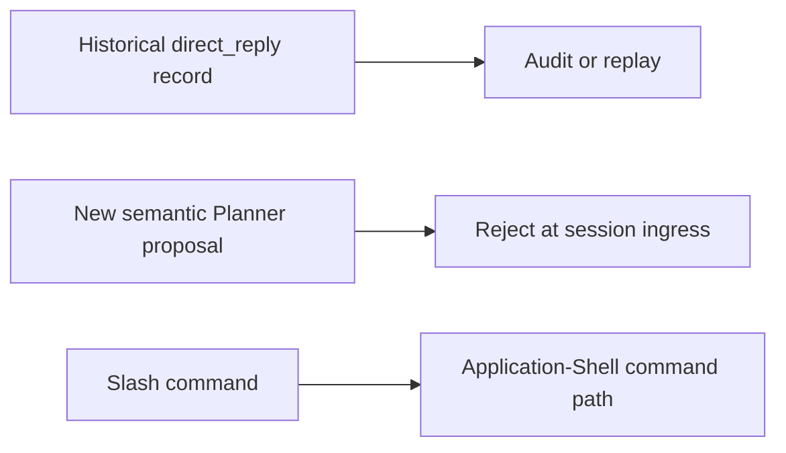
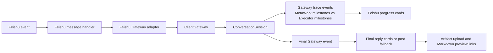

# MetaWork

[English Home](../../README.md) | [中文技术总览](technical-overview.zh-CN.md)

MetaWork is the proprietary commercial product represented by this repository.
AnyFusion is a separate open-source upstream; `AnyFusion-Pi` and other retained
AnyFusion names below identify attributed components or compatibility
contracts, not this repository's product identity.

MetaWork is a local AI Task OS for agentic work. It turns natural-language requests into durable, searchable, schedulable, and verifiable tasks that can survive interruptions, recall prior context, plan subtasks, claim executor work units, and deliver artifacts back to the places where people review them.

It is built for teams who need agents to do more than answer the current turn. MetaWork gives long-running AI work a task state machine, memory boundary, unified ControlKernel decision plane, work-unit dispatch runtime, verification loop, local Gateway, Feishu delivery path, and real end-to-end smoke gate.

> Current implementation baseline (2026-09-30): PlanningAgentPlan v8, Work
> Graph v7, Kernel event/snapshot/decision contract v5, Completion Protocol v4,
> and SQLite schema v47 with transactional 31→32→33→34→35→36→37→38→39→40→41→42→43→44→45→46→47 upgrade support.
> Schema v39/v40 adds the Query usage/billing facts (Query attribution contexts,
> metering spans/observations, immutable price versions, cost entries, per-Query
> bills and lines, the consumption outbox/receipts and bill adjustments) that
> ADR-0042 governs. Server-side observe/shadow billing and read-only projections
> are delivered; external consumption export remains release-gated.

> ADR-0027 through ADR-0030 govern the active revisioned Configuration Control
> Plane, generation-scoped AgentClass/Model/Harness binding, future
> transport-only A2A seam, and signed crash-recoverable native update
> transaction.

The transition keeps the existing ownership path:

```text
Planner proposes -> ControlKernel decides -> Runtime applies
-> ExecutorAdapter transports one authorized attempt
```

The target configuration uses one immutable revision per Work Graph generation.
All graph revisions, deferred recovery, decisions, dispatches, attempts and
receipts remain pinned to that revision. Provider/Model health is a
revision-scoped Kernel projection; Runtime and adapters report facts but do not
choose fallback. Permission Profile semantics remain code-owned under
Resource/Kernel policy. The target schema change is one transaction from v30 to
v31, coordinated with signed release verification, Task-admission closure,
dispatch quiescence, database backup, candidate health checks and rollback. A2A
implementation is deferred to a separate roadmap.

## What MetaWork Does

### Navigation And Observation Status (2026-10-03)

The source schema is 47. Web and the single native TUI browse indexed metadata
and a bounded Conversation read model, independently of execution attachment.
A baseline contains at most 20 recent Turn summaries within 256 KiB; long
bodies, history pages, trace, Task details and billing load separately. An
explicit observation follows the committed projection epoch/revision and resets
when its bounded tail cannot resume. Ordinary navigation never folds the audit.
The Conversation tab retains the existing Planning/Execution cards, report links
and fee cards. Mounted Turns automatically fetch these resources independently;
body ranges are assembled into complete Markdown without an extra read-more
button. Recent card progress uses an indexed trace suffix. Running cards refresh
every second, settled cards every five seconds for late publication/billing, with
immediate refresh on Turn updates. Turn count and warm resource caches remain
bounded; a single complete body has no fixed DOM-size bound.
Workspace directory cursors retain their revision guards; historical Turn pages
retain stable insertion order. Same-Account Web/TUI/Feishu have equal business
permissions regardless of which surface originated the Task (ADR-0043).

`createAccountEventJournal` selects the immutable-segment journal with bounded
background maintenance. Legacy SQLite Turn parsing runs in a worker with a
128 MiB old-generation limit and a ten-second deadline. It reuses the canonical
projector and notification hooks. Write transactions, including application
outer transactions, use `BEGIN IMMEDIATE` so concurrent worker commits cannot
invalidate a read snapshot that a writer later attempts to upgrade. Read-only
baselines/pages retain deferred snapshot transactions. Legacy file import is
still maintenance work and can parse an aggregate on the Server; its first
migration cost is separate from indexed navigation performance.

Historical Task association uses the Account/Conversation/Turn trace index;
ambiguous association remains fail-closed. Task activity uses indexed witnesses
and the canonical TaskView projection. Native update checkpoints retain the
immutable segment bodies required by the database. Schema 43 introduced the
navigation read models; schema 44 introduced indexed command admissions with
atomic legacy receipt import. Both were previously installed on the normal
account; this is historical evidence, not evidence of a schema-47 deployment.

Schema-47 production browser, isolated installed Server/TUI identity, multi-client
adapter matrix and native tests have passed locally. Implementation is uncommitted
and unpushed pending user acceptance. The normal installation has not been
replaced; Docker and external Feishu delivery acceptance remain open. Commands,
measured budgets, performance and limitations are in the
[implementation record](../plans/2026-10-02-frontend-observation-implementation.md).

The native TUI Dashboard now shows Workspace task summaries (execution, queue,
blocking and other canonical TaskView phases). F6 focuses the list, arrows select,
Enter opens the Task's original Turn, and Esc returns to the editor. Wide terminals
also support clicking; compact terminals use the same list in an overlay. The left
pane retains execution details and Turn billing. Activity reads refresh the loaded
directory at no more than two background requests per second; selected observation
updates apply immediately. Counts cover loaded pages and further pages have explicit
entries. The Gateway `locate` resource reuses the authorized Task-to-Turn index.
See [implementation and validation](../plans/2026-10-03-tui-workspace-task-dashboard.md).

### Product Capabilities

- Keeps durable tasks with explicit states: created, ready, running, parked, blocked, done, archived, and cancelled.
- Restores interrupted work with resume context instead of restarting from scratch.
- Enforces one active or cleaning-up top-level Task per Conversation through durable Conversation slots, while one AccountRuntime schedules Tasks from different Conversations concurrently and Phase 6 authorizes deterministic batches of isolated child attempts.
- Keeps Planning and Runtime authorization in one append-only `kernel_decisions` ledger while durable inbox/application/outbox state owns recoverable execution.
- Exposes historical tasks through a local SQLite FTS index that the PlanningAgent queries explicitly.
- Plans complex work as explicit subtasks with acceptance criteria and aggregation rules.
- Plans work as a task-owned capability-handoff graph, authorizes a complete ordered canonical AgentClass list per subtask, and lets idle executor work units claim ready subtasks.
- Validates every Subtask through Completion Protocol v4, persists immutable Result Objects and direct-edge references, and separates safe result delivery from completion certification.
- Binds each Conversation to one persisted AnyFusion-Pi Planner session; MetaWork-owned preferences and runtime facts may cross only bounded read-only Planner query contracts and are not replayed as conversation history.
- Captures generated files as task artifacts.
- Sends Feishu chat replies, file artifacts, and Markdown preview links through the backend delivery layer.
- Provides a local Gateway so multiple terminals can connect to one MetaWork runtime.
- Uses the nested `planner/AnyFusion-Pi` fork as the default local Planner conversation surface, with an isolated process/dependency tree and MetaWork-managed provider/model configuration in both native and optional container runtimes.
- Runs the single MetaWork TUI (`modes/metawork-tui` in the vendored AnyFusion-Pi fork) as an independent Gateway-only client: multi-Turn conversation projection, Pi editor/theme/components, Task Dashboard, projection-cursor recovery and bounded resource reads, reconnect, versioned slash/permission/cancel commands and the read-only `complete_command`/`get_task_view` queries (ADR-0041), with no local semantic runtime. The former simplified client mode and the Ink UI are deleted under ADR-0041.
- Ships with `npm run smoke:metawork`, whose default gate verifies two-turn memory in one persisted AnyFusion-Pi Planner session; artifact scenarios remain available explicitly.

## Core Architecture

Explicit Resume recognizes incomplete model streams (`model_response_incomplete`)
without treating them as successful results or enabling automatic unknown retries.
The Kernel still authorizes recovery and checks external-effect safety, including
blocked nodes with no runnable frontier. Gateway command results retain the actual
authorization or refusal explanation alongside explicitly uncertified partial output.
See the [September 24 recovery repair](../plans/2026-09-24-incomplete-response-resume-fix.md).

The September 20 TUI review fixes isolate CLI mode dispatch from
`main-runtime.ts`, connect Workspace/Conversation navigation and Task snapshot
queries, and render existing routing/Attempt facts. History selection and
PgUp/PgDn use a bounded terminal viewport. Permission controls refresh the
authoritative Task view before submitting a decision; receipt acceptance alone
does not resolve a permission. These fixes do not change the Gateway v2 wire
contract or Web/Feishu production handlers.

MetaWork is task-oriented rather than session-only. A normal agent session answers the current turn. MetaWork decides whether an input should stay as a lightweight conversation, control an existing task, or become durable work that can be scheduled, blocked, resumed, searched, verified, delivered, and audited.

### Unified Multi-Client Architecture

ADR-0031, accepted on August 18, 2026, defines the Server architecture and is
now delivered as of August 19, 2026. TUI, Web conversation and Feishu use
one versioned Gateway command/event plane. Authenticated clients for the same
Account share one `AccountRuntime` containing configuration, memory, Task,
Kernel, Executor and recovery services, while each Conversation retains an
independent stable Planner session, serialized input mailbox, trace and
presentation stream.

The active cardinality is:

```text
ServerProcess -> RuntimeRegistry -> AccountRuntime
  -> WorkspaceDirectory -> Workspace
    -> ConversationRegistry references -> ConversationSession -> ClientConnection
```

ADR-0034, accepted on August 26, 2026, fixes the process lifecycle around that
domain model. `metawork server start` is the only Runtime-owning startup path
and remains alive independently of all Clients. Bare `metawork` launches only
the TUI Client, `metawork web` only opens the existing Server-owned loopback
Web origin, and configured Feishu connectivity is owned by Server. Server
startup is Workspace-neutral. Existing Conversations restore their immutable
Workspace binding. Local TUI/Web cwd is an untrusted Workspace selection hint.
`/workspace /absolute/path` selects the Client Workspace and never reparents an
existing Conversation; metadata selection restores the Conversation binding without execution attachment.

Runtime-wide KernelWorkflow, execution and startup recovery are constructed once
per AccountRuntime. One account Kernel coordinator owns durable
decision/application draining. Each Conversation has one durable top-level Task
execution slot; different Conversations may execute in parallel and later
same-Conversation Tasks queue. Accounts use separate data roots and SQLite databases; the
current installation is activated as `local-default`.

ADR-0043 supersedes origin-exclusive live delivery. Same-Account Web, native TUI
and Feishu use shared, explicit Conversation observations and equal command
rights. Metadata selection, bounded baseline/tail, independent detail ranges,
Task activity and pending approvals are independent of execution attachment.
Web stores entities per Conversation and renders a bounded virtual window;
full-history search uses the safe content index and can locate older Turns.
Native follows the same read protocol. Feishu uses resource queries and durable
notification routes with destination-bound signed actions. Notifications retain
their captured chat/thread when another client browses or controls the Task.
`cancel_task` adds generation-fenced background control; `cancel_turn` is unchanged.
Permission acceptance and application are durable, separate facts.
Schema 47 is implemented locally; validation evidence and remaining deployment
gates are recorded in the observation implementation plan.

The production composition below is the executable baseline.
See [ADR-0031](../adr/0031-account-runtime-and-unified-client-gateway.md), the
[approved design](../plans/2026-08-18-account-runtime-unified-gateway-design.md),
and the [implementation plan](../plans/2026-08-18-account-runtime-unified-gateway-implementation-plan.md).


```mermaid
flowchart LR
  User[User] --> Surfaces[Client surfaces<br/>TUI, CLI, Web, Feishu]
  Surfaces --> Gateway[ClientGateway<br/>versioned command/event plane]
  Gateway --> Conversation[ConversationSession<br/>mailbox and presentation]
  Conversation --> Account[AccountRuntime<br/>shared runtime owner]
  Conversation --> MemoryFast[Explicit memory and preference fast path]
  Conversation --> Planning[Planner Work Unit<br/>PlanningAgent]
  Planning --> Plan[PlanningAgentPlan v8<br/>intent, target, risk,<br/>v7 graph or authorization resolution]
  Plan --> Event[KernelEvent<br/>plan_proposed]
  Event --> Loop[Durable KernelWorkflow v5<br/>inbox, snapshot, decide, application, apply]
  Loop --> Kernel[ControlKernel<br/>one pure decide interface]
  Kernel --> Decision{KernelDecision<br/>one action}
  Decision --> Runtime[Runtime handlers]
  Runtime --> Observation[Normalized KernelEvent]
  Observation --> Loop

  Runtime --> GraphRuntime[WorkGraphRuntimeService<br/>apply authorized work graph]
  GraphRuntime --> Graph[Work Graph<br/>persisted Subtasks]
  Graph --> Frontier[Runnable frontier<br/>dependency and publication facts]
  Frontier --> Batch[Kernel dispatch_batch<br/>durable child items]
  Batch --> Supervisor[AttemptSupervisor<br/>up to four attempts]
  Supervisor --> Attempt[SubtaskAttemptRunner<br/>one attempt, one WorkUnit]
  Attempt --> Context[SubtaskExecutionContext<br/>direct handoffs and selected evidence]
  Context --> Executors[ExecutionRuntime<br/>one worktree Executor process]
  Executors --> Verify[Completion Protocol v4<br/>result-first assessment,<br/>authoritative workspace delta]
  Verify --> Publication[Git publication gate<br/>stable integration order]
  Publication --> Delivery[Delivery and UI<br/>TUI progress, Feishu, files, preview links]
  Delivery --> User

  Account <--> Store[(Account SQLite<br/>tasks, subtasks, agent classes,<br/>work units, events, memory)]
  Loop --> Decisions[(kernel_decisions)]
  Graph <--> Store
  Attempt <--> Store
```

Every natural-language input becomes `plan_proposed`; deterministic commands become versioned Kernel events; attempts return capacity, structured outcome, publication conflict, permission, partition, execution-backend or contract facts. `ControlKernel` validates Planning admission, derives one deterministic dispatch batch from the runnable frontier, and remains the sole authority for recovery, retry, fallback, merge repair, replan, partition waiting, permission decisions and derived availability. Runtime applies no unpersisted strategy.

The AnyFusion-Pi `PlanningAgent` uses a dedicated process runner rather than an Executor adapter. One Conversation maps to one persisted Pi session file. Semantic turns launch the Planner with `--mode rpc`, exchange JSONL over stdin/stdout, and serialize writers per Conversation so only one process writes that file at a time. The interactive Pi process is separate: it is launched with `--gateway-socket` and `--conversation-id`, creates no local model/tool/session runtime, and submits raw user commands to the Server Gateway. The fork owns dialogue history for server-side Planner RPC, a small stable system prompt and exactly one fixed `metaclaw-planner/SKILL.md`; MetaWork does not rebuild history from SQLite interactions. Dynamic facts are queried through exactly seven read-only MetaWork MCP tools: `search_tasks`, `get_task_context`, `get_current_session_context`, `get_planning_context`, `get_runtime_state`, `list_executor_status` and `get_executor_diagnostics`. Semantic RPC mode exposes no Pi-native repository readers, preventing source inspection from being used to reverse-engineer Runtime or Kernel semantics. The interactive client-only TUI may retain read-only `read`, `grep`, `find` and `ls` for workspace questions; `bash`, `edit` and `write` remain disabled in every mode. Provider/model selection, external Skills/extensions/MCP configuration, prompt templates, installation and updates are fixed or disabled by MetaWork. Every semantic turn uses the restricted native `submit_planning_proposal({ plan })` tool. Runtime identity is injected outside the model, rejection is structured feedback in the current ReAct turn, and proposal-host transport uncertainty remains distinct from MCP unavailability. A missing fixed MCP tool fails startup; mid-turn MCP loss locks proposal submission and aborts that loop. There is no assistant-text proposal parser, proposal-specific retry count, repair prompt or outer validation loop.

Planner continuity follows one explicit Context Bridge contract:

```text
Pi session history + current user input
  -> Planner understands natural references and chooses contextRefs
  -> MetaWork Context Bridge supplies bounded facts
  -> ControlKernel validates Artifact identity, ownership, status and hash
  -> Runtime materializes selected files into attempt-local inputs
  -> Executor consumes only the current Subtask and materialized inputs
```

The existing `get_current_session_context` projection includes bounded
interactions, Tasks, Executor results and same-Conversation Artifact facts.
It is a fact directory, not a semantic searcher or a second router. Historical
images, reports, HTML and text use `ContextRef.kind = "artifact"`; the older
`task_resource` kind remains limited to current Task resources. Context Bridge
never returns private published paths, absolute Workspace paths or credentials.
Published Artifact facts are marked available only when their source is a
regular file and its content hash still matches the durable record.

Current-Turn uploads use an opaque `attachment` ContextRef rather than being
converted into Planner text. The Gateway exposes only attachment ID, name,
MIME, size and availability to Planner; bytes, base64, extracted text and
private storage paths do not cross the Planner RPC boundary. MetaWork validates
the Account/Conversation/Workspace binding and SHA-256 again at attempt start,
then materializes the original file under the attempt-local `inputs/`
directory. Web click, drop and clipboard-file paste share the same upload
path; ordinary text paste remains textarea input.

Document parsing is Executor-owned. The default engineering Executor
advertises the `document-processing` Routing Capability and processes
materialized originals with its own base model and tools; MetaWork ships no
document parser. Upload availability and document
processing capability remain separate contracts.

Semantic RPC does not expose Web reconnaissance tools. Historical `direct_reply`
proposals remain replayable for compatibility, but production semantic
proposal ingress rejects new `direct_reply`; work-like requests must be routed
to an Executor through `plan_work_graph`. Real-time/source-dependent facts,
supplied URLs and public research requests are routed to an AgentClass covering
`current-web-research`; the Executor performs final Web retrieval and receives
the bounded current user input through `contextRefs`. Shell execution,
unavailable Workspace inspection, file/Git/storage mutation, authenticated
external actions, other side effects, durable progress, monitoring, artifacts
and downstream handoffs require `plan_work_graph` and the Kernel-authorized
Executor path. This is Planner-owned semantic routing, not a Session/Kernel
keyword router.

Planner provider/model activation is revision-pinned at the process boundary.
The supervisor selects `generated/agent-runtime/<configurationRevision>/planner`
before legacy home variables, injects the selected Provider credential from
SecretStore after any legacy env-file overlay, and issues an RPC `get_state`
before the prompt. A persisted session may retain conversation history across a
configuration change, but if Pi restores a provider/model different from the
authorized Planner binding, the supervisor terminates the process before any
user prompt reaches a model. Native launchers therefore do not set a static
Planner home or runtime provider env file.

Repository readers may inspect user-requested workspace content, but they may
not be used to reverse-engineer MetaClaw Runtime, Kernel, validation, recovery,
scheduling or Executor semantics. Those facts remain MCP/schema-authoritative.
The supervisor also enforces a convergence budget of eight processing cycles
and twelve non-proposal tool calls. Exceeding either budget without submitting
a proposal produces a typed fail-closed terminal result, distinct from
`transport_uncertain`; no fallback proposal, Task, Kernel event or Executor
attempt is created, and the user is asked to retry or narrow the request.

Task-control proposals also require explicit current-turn user intent. Topic
overlap, a blocked or parked Task, and single-active-Task admission pressure do
not authorize implicit resume, recovery, clearing, cancellation or repurposing;
Planner asks one clarification when that conflict prevents newly requested
schedulable work.

Each enabled Executor AgentClass has one independent revision-scoped capability
profile. Configuration compiles the profile from its effective ModelPolicy,
Model capability evidence, controlled Executor affordances, configured
declarations, and persisted user semantics. The profile emits
`executors/<agentClassRef>/CAPABILITY.md`, read-only tags, capability evidence,
routable capabilities, dispositions, and the Routing Catalog entry with one
source fingerprint. The final manual is Planner's authoritative semantic
routing profile; the Catalog is its machine-readable validation projection.
User semantics override conflicting generated positioning and preferences, but
cannot create unknown capabilities or make unsupported intent routable.

Optional model-assisted normalization receives the selected Executor's current
manual and model facts directly, exposes only
`submit_executor_manual_proposal`, starts no Planner MCP extension, and uses a
bounded configuration timeout. Timeout, model unavailability, missing tool
submission, and invalid semantic assertions produce a successful
`source-preserved` preview, preserve the source text, and still recompile model
evidence. This fallback is a successful preview, not activation approval:
every changed semantic payload requires a server-issued receipt bound to the
exact source and assertions. Clearing existing guidance is normalized
deterministically without invoking the Planner model; changed non-empty guidance
remains blocked when semantic normalization fails. Adding or
removing effective Models therefore adds or removes actual Routing Capability
qualification in the same candidate profile. The profile
cannot widen permissions, authorize an unconfigured Model, alter dynamic
health, or bypass Kernel binding validation. Provider secrets, URLs and
commands are excluded.

Historical `direct_reply` records remain explicit audit/replay facts. Production
semantic Planner ingress rejects new `direct_reply`; MetaWork routes work-like
requests through an Executor Work Graph instead of delivering Planner text as
task completion.

The local AnyFusion-Pi TUI and the non-interactive PlanningAgent runner use the same vendored application but have different trusted roles. The TUI is a client-only process connected to the versioned Unix Gateway protocol. It renders bounded Conversation baselines/changes, activity, pending permissions and explicitly loaded resources; raw input, slash commands, permission decisions and cancellation requests enter `ClientGateway`. The controlled RPC runner alone connects to `PlannerHostBridge` for proposal submission. `ConversationSession` reruns `PlanningAgentPlanSchema` and `validatePlanningAgentPlan()` before the existing `plan_proposed → DurableKernelWorkflow → ControlKernel` path. Persisted proposal submissions provide replay, rejected-revision, accepted-turn-lock and conflict semantics without duplicating Kernel events. Neither client mode nor the bridge can write the database or directly call Kernel, scheduling, Execution or Executor APIs.

Executor health recovery is event-driven. `ExecutorRecoveryRefreshService`
inspects only enabled AgentClasses whose persisted class health is already
`error`, coalesces concurrent checks per class, applies a 30-second probe
timeout, and records bounded redacted recovery evidence separately from attempt
history. A successful structured probe may perform only `error -> healthy`;
`disabled` remains an administrative lock, and healthy/unverified classes are
not polled for new faults. Session startup, planning cycles, Task
resume/recovery, Executor configuration changes, and
`/executor refresh [name|all]` are the supported triggers.

Planning and recovery refresh begin concurrently, but Kernel admission waits for
both. If a preferred/eligible class recovered, the Planner may revise the
proposal once in the same persisted AnyFusion-Pi Planner session. If an existing Task still has no
usable eligible class, Kernel persists the exact proposal as
`waiting_for_availability` and blocks the Task with a structured availability
fact. A later `executor_recovered` event re-admits that proposal and moves the
Task to `ready` without another Planner call or immediate dispatch.

### Legacy Direct Reply Compatibility


```mermaid
flowchart LR
  Historical[Historical direct_reply record] --> Replay[Audit or replay]
  Current[New semantic Planner proposal] --> Reject[Reject at session ingress]
  Slash[Slash command] --> Shell[Application-Shell command path]
```

New semantic Planner turns do not complete work through `direct_reply`.
Historical records remain readable for audit/replay, and slash-prefixed system
commands continue through the Application-Shell path. Work-like requests use
the Durable Task path below.

### Durable Task Path


```mermaid
flowchart LR
  Input[User asks MetaWork to do work] --> Planning[PlanningAgent]
  Planning --> Proposal[PlanningAgentPlan<br/>WorkGraphProposal]
  Proposal --> Kernel[ControlKernel<br/>authorize or reject]
  Kernel --> Decision[authorize_task_plan]
  Decision --> Apply[KernelWorkflow idempotent Runtime apply]
  Apply --> Task[TaskRuntimeService<br/>create or bind task]
  Task --> WorkGraphRuntime[WorkGraphRuntimeService<br/>apply authorized graph]
  WorkGraphRuntime --> WorkGraph[Work Graph<br/>persist Subtasks]
  WorkGraph --> Ready[Runnable frontier<br/>published direct dependencies]
  Ready --> Batch[dispatch_batch<br/>durable attempt items]
  Batch --> Attempt[Attempt supervisor<br/>claim and run independently]
  Attempt --> Run[ExecutionRuntime<br/>transport and execute]
  Run --> Verify[Completion Protocol v4<br/>result objects, delta and candidate commit]
  Verify --> Integrate[Git publication gate<br/>deterministic order]
  Integrate --> Done{Integrated?}
  Done -->|yes| Result[Atomically publish result,<br/>handoffs, artifacts and done]
  Done -->|conflict| Repair[Kernel-authorized merge repair]
```

This is the Task OS path. It is where task state, resume context, policy authorization, subtask state, work-unit leases, artifact capture, verification and Git publication matter. ADR-0037 permits independent top-level Tasks from different Conversations to run concurrently, while independent Subtasks inside each Task retain their existing concurrency.

ADR-0037 replaces the account-wide single-active rule with one durable execution slot per Conversation. Same-Conversation Tasks are persistently queued; different Conversations are selected by the account-scoped Kernel scheduler using configured capacity, priority, aging and fairness. Clarifications and non-executing domain commands remain available; new semantic Planner turns do not complete through `direct_reply`. Both natural-language and deterministic execution entrypoints cross the persisted ControlKernel seam; there is no `TaskAdmissionGate` shortcut.

### Feishu And Progress Path


```mermaid
flowchart LR
  Feishu[Feishu event] --> Handler[Feishu message handler]
  Handler --> Adapter[Feishu Gateway adapter]
  Adapter --> Gateway[ClientGateway]
  Gateway --> Conversation[ConversationSession]
  Conversation --> Progress[Gateway trace events<br/>MetaWork milestones vs Executor milestones]
  Progress --> Cards[Feishu progress cards]
  Conversation --> Final[Final Gateway event]
  Final --> Reply[Final reply cards or post fallback]
  Reply --> Files[Artifact upload and Markdown preview links]
```

Feishu progress is intentionally split into MetaWork milestones and concrete executor milestones. Users can see when MetaWork is planning, recalling context, scheduling, claiming a work unit, or waiting for the actual executor.

The conversation/task boundary matters:

- Conversation: preserve dialogue continuity and handle non-executing state transitions without claiming Executor work. Historical direct replies remain audit facts for compatibility, not a production completion path and not replayed into later prompts.
- Task control: inspect or change existing task state. Good for "what is running?", "resume that task", or "clear blocked tasks".
- Durable task: create or continue work that needs execution, persistence, artifacts, recovery, scheduling, or later retrieval.

New semantic turns reject `direct_reply` at proposal ingress. Work-like requests are routed through a focused Work Graph and completed by the Kernel-authorized Executor; slash-prefixed system commands remain on the Application-Shell path. Historical `direct_reply` facts can still be read for audit and replay without being re-executed or rewritten.

The Task OS upgrade described in [MetaWork Task OS Architecture And Strategy Upgrade](../archive/plans/2026-06-14-metaclaw-task-os-architecture-strategy-upgrade.md) is reflected in the codebase: deterministic task search indexing, PlanningAgent work graph proposals, unified `ControlKernel` authorization, persisted subtasks, work-unit claiming, aggregation, and verification are implemented and covered by targeted tests. Broad Executor Discovery, remote registries and elastic work-unit spawn remain outside the current implementation. Multi-client Gateway convergence under ADR-0031 has been delivered: Web, Feishu and the native TUI route through the unified Gateway and share one AccountRuntime.

Important runtime boundary: there is no second strategy/orchestration loop
beside the active PlanningAgent → ControlKernel → Runtime chain. Work Graph
frontier derivation is pure structure; retry, fallback, replan, permission,
availability, and recovery remain explicit Kernel policy.

## Current Executors

MetaWork ships two canonical Executor AgentClasses. The default Runtime
executes them as child processes in the Subtask worktree. The legacy Docker
attempt backend remains available explicitly for compatibility:

| Executor | Command | Best For | Install Requirement |
| --- | --- | --- | --- |
| Codex CLI | `codex` | Repository edits, tests, deterministic implementation, code review with patches | Native install reuses the existing command without changing its installation or personal home |
| Pi Agent | `pi` | Research tasks, report generation, multi-step synthesis, agentic CLI workflows, image generation and editing when an authorized image model is selected | Native install reuses the existing command without changing its installation or personal home; MetaWork supplies the image runner |

`codex-cli` and `pi-agent` are canonical AgentClasses with permission-profile
bindings. In `METACLAW_EXECUTOR_BACKEND=worktree` mode, their trusted CLI
commands run as child processes inside the unified Runtime and use the Subtask
Git worktree as their working directory. In `docker` mode, the AgentClass also
requires its immutable image pin and internal control network. No executor
WorkUnit is pre-seeded. After authorization, `WorkUnitClaimService` claims or
provisions a WorkUnit, and `ExecutorRegistry` resolves the AgentClass through
the backend-aware `BackendExecutorAdapter`.

`pi-agent` is one user-visible Executor with two internal execution engines.
Ordinary work uses the standard operator-provided `pi --mode json` process.
Image generation and editing use MetaWork's Image API Runner, selected only
from the Subtask's validated `image-generation` or `image-editing` capability.
The Runner uses the Kernel-authorized Provider/Model binding and writes
verified PNG, JPEG, WebP, or GIF artifacts through the same Completion Protocol.
It is not a second AgentClass, does not use the vendored Planner Pi image mode,
and is not replaced when the operator upgrades the local Pi CLI.

## Prerequisites

Required:

- Node.js `>=22.19.0`.
- npm.
- Git.
- A native macOS, Linux, or Windows x64 environment. macOS and Linux use
  filesystem Unix sockets; Windows uses named pipes and the PowerShell
  installer.
- Native build tooling for `better-sqlite3`.

Recommended native build tools:

```bash
# macOS
xcode-select --install

# Ubuntu / Debian
sudo apt-get update
sudo apt-get install -y build-essential python3 make g++
```

Executor prerequisites:

- Native worktree mode: existing `codex` and `pi` commands must already be on
  `PATH`; setup does not install, upgrade, downgrade, or reconfigure them.
- Docker compatibility mode: build or pull the canonical Codex and Pi executor
  images used by the configured AgentClasses.

Feishu prerequisites, only if you use Feishu Gateway integration:

- A Feishu app with message receive/send permissions.
- An app secret stored in an environment variable such as `FEISHU_APP_SECRET`.
- Event subscription configured for `im.message.receive_v1`.
- File upload/send-message permissions if you want generated artifacts sent back as Feishu file messages.
- WebSocket event delivery is recommended because it does not require a public callback URL.
- A public reverse proxy or tunnel is only required for webhook mode or external Markdown preview links.

Markdown preview prerequisites:

- `integrations.markdown_preview.enabled: true`.
- A reachable `public_base_url` if users open preview links outside the host machine.

## Install

Native macOS installation uses the nested `planner/AnyFusion-Pi` fork without Docker and
without a global Planner package. Install and verify in this order:

```bash
git clone https://github.com/IFOSR/metawork.git
cd metawork
export ANYFUSION_PROVIDER_KEY='replace-with-your-key'
export ANYFUSION_PROVIDER_URL='https://your-openai-compatible-endpoint.example/v1'
./setup.sh
metawork --help
```

On macOS, `setup.sh` requires Node.js 22.19+ and builds MetaClaw and the
vendored `planner/AnyFusion-Pi` planner sources (checked into this repository)
with separate dependency trees. Pi is required for new-work admission; Codex
is an optional enhancement detected by MetaWork and is not required to start
the product. Configuration, runtime state, and the production Provider
credential file are stored under the MetaWork root:
`~/.metawork/accounts/local-default` and
`~/.metawork/credentials.json` by default. The setup does not write `~/.codex`
or `~/.pi`.

The installed launcher captures the current directory at invocation time.
Start MetaWork from the repository or directory the Planner should inspect:

```bash
cd /path/to/project
anyfusion
```

Install checklist:

- `node --version` is `>=22.19.0`.
- `./setup.sh` reports native installation complete.
- `~/.metawork/credentials.json` is mode `0600` when present.
- `metawork --help` works from a new shell.
- `command -v pi` and `pi --version` are available for new work.
- `codex --version` is shown as an optional enhancement when Codex is installed.

Re-run `./setup.sh` after updating either repository. A dirty nested
AnyFusion-Pi checkout is preserved and built without being overwritten.

## Windows Install

The native Windows x64 release uses Node named pipes for the local Gateway and
Planner Host. Windows Developer Mode (or an elevated terminal) is required for
the transactional NTFS release pointers. WSL2 remains a supported Linux
compatibility path when native Windows executor tooling is unavailable.

Install WSL2 from PowerShell:

```powershell
wsl --install -d Ubuntu
```

Restart Windows if prompted, then open Ubuntu and install prerequisites inside WSL:

```bash
sudo apt-get update
sudo apt-get install -y git curl build-essential python3 make g++

curl -fsSL https://deb.nodesource.com/setup_22.x | sudo -E bash -
sudo apt-get install -y nodejs

node --version
npm --version
git --version
```

Install and verify MetaWork inside the WSL Ubuntu shell:

```bash
git clone https://github.com/IFOSR/metawork.git
cd metawork
./setup.sh
metawork --help
npm run smoke:metawork
```

Install and authenticate Pi independently before using new-work features.
Codex may be installed independently for its optional GPT/Codex compatibility
and coding benefits; MetaWork setup does not change either agent installation.

Windows install checklist:

- Run MetaWork commands inside WSL Ubuntu, not Windows PowerShell.
- Keep the repository under the WSL filesystem, for example `~/MetaWork`, not `/mnt/c/...`, for better file and SQLite performance.
- Confirm `node --version` is `>=22.19.0`.
- Confirm `metawork --help` works in a fresh WSL shell.
- Confirm the default executor works in WSL, for example `codex --help`.
- Confirm `npm run smoke:metawork` completes successfully

Native Windows development uses Node.js 22.19+, Git, Visual Studio Build
Tools, `npm install`, `npm run build`, and `node dist/index.js`. The native
release path uses `scripts/install.ps1`; WSL2 and the container runtime remain
optional compatibility paths.

## Install Executors

MetaWork does not vendor the downstream executor CLIs. Install the ones you want to use and make sure each command is available on `PATH`.

### Register Custom Executors

Installed executors are runtime workers that MetaWork can assign subtasks to. A registered executor now has three parts:

- The `AgentClass`: domains, capabilities, risk level, input/output types, use-case hints, route-intent affinity, and runtime defaults.
- The runtime binding: immutable Docker image ID, controlled permission profile, in-container command/arguments, install check command, and optional project URL.
- At least one executor `WorkUnit`: a concrete idle runtime slot that can claim one ready subtask at a time.

Use the guided registration flow when you are not sure what to fill in:

```bash
/executor register wizard
```

The wizard asks for the executor name, whether to infer from a project URL or fill fields manually, the local command, non-interactive args, install check command, domains, and capabilities. If you provide a GitHub URL, MetaWork tries to infer CLI information from `package.json` or README examples. If inference is not reliable, it falls back to manual entry.

One-line registration is also supported:

```bash
/executor register research-bot \
  --image registry.example/research-bot:1.2.3 \
  --image-id sha256:<64-hex-digest> \
  --permission-profile restricted-custom \
  --command research-bot \
  --args "run --prompt {prompt}" \
  --check "research-bot --version" \
  --project-url https://github.com/example/research-bot \
  --domains research,reporting \
  --capabilities research,report_generation
```

`{prompt}` is replaced with the subtask prompt. If `--args` does not contain `{prompt}`, MetaWork appends the prompt as the final argument. The image ID must match the referenced image and the permission profile must be one of the controlled profiles. A missing binding or changed tag fails closed until the class is explicitly updated; there is no host-process fallback. Static routing capabilities remain separate and Planner-safe.

`codex-cli` and `pi-agent` are owned completely by canonical definitions. Startup force-converges every persisted static field, immutable image binding and permission profile for those names, and normal registration APIs reject overwrite or deletion. Non-canonical capabilities remain free-form registration metadata and are never promoted into the controlled Planner catalog. Historical custom classes without image/profile bindings remain visible for audit but are non-executable.

The Phase 5 permission product boundary is the selected execution backend plus
the permission profile and durable request/grant/use audit budgets.
`use_capability` atomically consumes attempt, expiry, call and byte limits, but
it is not a universal operation broker and does not prove fine-grained
mediation of every native file, network or external action. Container mounts
and sandbox policy apply only to the container backend; egress profiles and
resource leases remain Runtime enforcement boundaries.

Executor extension contract:

Required routing fields:

- `name`: stable executor name, such as `research-bot` or `finance-research-agent`.
- `domains`: where the executor fits, such as `research`, `finance`, or `software`.
- `capabilities`: the executor's configured strengths and routing preferences, such as `research`, `report_generation`, `multi_tool`, `coding`, or `tests`. An omitted label is not a hard prohibition; provider/model availability, harness compatibility, permissions, and Runtime affordances remain the actual execution constraints.

Recommended routing fields:

- `inputTypes`: supported input types, such as `text`, `files`, or `image`.
- `outputTypes`: expected outputs, such as `markdown`, `report`, `code`, `patch`, or `json`.
- `primaryUseCases`: examples of tasks that should preferentially route to this executor.
- `avoidUseCases`: examples of tasks that are less preferred for this executor, not physically disabled operations.
- `riskLevel`: `low`, `medium`, or `high`.
- `intentAffinity`: route-intent affinity by keys such as `repo_execution`, `research_workflow`, `memory_agent_ops`, and `general`.
- `projectUrl`: source repository or documentation URL.

Executor health and recent outcomes are dynamic status. Planner reads them through `list_executor_status`; they are not stored as static AgentClass routing metadata.

Required runtime binding:

- `runtimeCommand`: executable command available on `PATH`, for example `research-bot`.
- `runtimeArgs`: non-interactive arguments, for example `["run", "--prompt", "{prompt}"]`.
- `runtimeCheckCommand`: install or availability check, for example `research-bot --version`.

Runtime behavior requirements:

- The executor must run non-interactively; it cannot wait for human prompts.
- It must accept the full task prompt through `{prompt}` or as the final argument.
- It should write the final answer to stdout.
- Failures should return a non-zero exit code or a clear stderr error.
- Long-running Harness operations stay independently monitored after start; a start without subsequent activity cannot suspend health observation.
- File artifacts should be written into the task output directory provided in the prompt.
- Feishu delivery, file upload, and preview link generation should stay in MetaWork's backend; executors should produce local artifacts instead of calling Feishu APIs directly.

`runtimePolicy.executorIdleTimeoutMs` is the sustained-inactivity health-check
threshold, not a termination deadline (default 300 seconds). MetaWork imposes no
Attempt wall-clock limit, tool-call budget, processing-cycle budget, or global
shell timeout. Waiting is shown after 60 seconds; health checks have a 30-second
response window. Actual model deltas and new per-tool checkpoints renew activity;
duplicate keepalives and Runtime presentation heartbeats do not. PID-only checks
report unknown and retain user wait/cancel controls. Adapter observations never
authorize Task state changes. Existing Kernel cancellation/recovery remains the
only control path; no automatic silence-based death or retry is inferred. A Kernel automatic retry is exposed as
`waiting_retry`; Web keeps the originating turn running and rehydrates its final
status from the durable execution timeline.

Optional advanced adapter interfaces:

- `execute(input)`: run a task with structured context.
- `isAvailable()`: check whether the executor can run.
- `abort(attemptId?)`: abort one exact attempt; Task cancellation enumerates every active attempt through the Runtime control port.
- `installSkill(pkg)`, `updateSkill(pkg)`, `disableSkill(target)`, `deprecateSkill(target)`: support executor-specific Skill lifecycle management.

Executor management commands:

```bash
/executor list
/executor show <name>
/executor register wizard
/executor unregister <name>
/executor feedback <taskId>
```

### Codex CLI

Install and authenticate Codex CLI according to the official OpenAI Codex instructions. Then verify:

```bash
which codex
codex --help
```

Codex attempts use `BackendExecutorAdapter`: worktree mode runs the trusted local
`codex` process with an isolated attempt `CODEX_HOME`; Docker compatibility mode
runs the canonical `metaclaw-executor-codex:phase5` image.

### Pi Agent

Install and authenticate Pi independently before running MetaWork, then verify:

```bash
which pi
pi --help
```

MetaWork calls it as:

```bash
pi -p "<prompt>"
```

Pi attempts use the same execution seam in either backend. Docker compatibility
mode runs them in `metaclaw-executor-pi:phase5`; worktree mode runs the trusted
`pi` binary in the current Subtask worktree.

## Run

Start the TUI:

```bash
anyfusion
```

The default command launches the pinned AnyFusion-Pi Gateway client:

- The executable is `anyfusion-planner`, launched with a Server-owned Gateway socket and stable Conversation ID.
- Client mode branches before model, tool, project-resource or semantic session creation.
- Pi's editor submits raw text, versioned slash commands, permission decisions and cancellation requests to `ClientGateway`.
- The execution-trace area renders ordered Planner, routing, Kernel and Executor-safe milestones as they arrive; the conversation area renders observed Turn entities, bounded body ranges and the final answer.
- Reconnect negotiates Server/Account identity and the observation/resource/control capabilities, then resumes each Conversation projection cursor or requests a bounded reset. It does not attach execution or replay the journal.
- Permission requests remain bounded UI facts; decisions submit the exact request ID, revision and generation with approve/deny through `permission_resolution_v2`.
- The client cannot write Task state, choose policy, schedule attempts, call Kernel, or control Executor processes.
- The raw v8 plan, prompts, hidden reasoning, credentials and raw process output remain server-side.
- The former `METACLAW_STANDBY_TUI=1` Ink path and the Ink sources under
  `src/tui/` are deleted (ADR-0041); the single TUI is selected for every
  `metawork tui` invocation. Client UI preferences (theme) are stored in the
  MetaWork config home (`METAWORK_TUI_PREFERENCES`, otherwise
  `$METAWORK_CONFIG_HOME/tui-preferences.json`), never in Planner home or the
  SecretStore.

Start the persistent Server before launching a Client:

```bash
metawork server start
metawork server status
```

To rebuild every shipped component and activate one coherent release from any
directory, run:

```bash
metawork server stop
metawork build
metawork server start
```

The build source is installation metadata, not the user's current Workspace.
The command rebuilds Runtime, Planner, and Web, preserves account data, and
atomically switches `app/current`. It fails while Server is running. Server,
TUI, and Web validate the same release identity before connecting, so old and
new releases cannot silently mix.

The workspace `dist/` is a build artifact only and is never a Server runtime.
The repository `npm run server:*` and `npm start` commands also delegate to
the installed `app/current` release, so running lifecycle commands from the
source checkout cannot create a second Runtime. After changing source code,
stop Server, run `npm run setup:native` to build and activate one release, then
start Server again. A plain `npm run build` refreshes the workspace artifact
but does not activate it.

Launch independent Clients:

```bash
metawork
metawork tui --conversation <id>
metawork web
metawork web --conversation <id>
```

Server lifecycle is explicit:

```bash
metawork server stop
metawork server restart
metawork server doctor
```

Only Server owns `runtime.lock`, Runtime, recovery and transport listeners.
TUI and Web resolve the atomic endpoint manifest and fail with a concrete
`metawork server start` instruction when no compatible ready Server exists.
Closing a terminal or browser does not stop Server or accepted Task work.

Server startup never binds a user Workspace. Existing Conversations restore
their immutable Workspace binding. A local TUI/Web Client applies its startup
directory through the same Server-owned selection as:

```text
/workspace /absolute/path/to/project
```

Server canonicalizes and authorizes the path, finds or creates one Account
Workspace, and updates the Client's `activeWorkspaceId`. A rejected hint leaves
no selected Workspace, returns `workspace_required` before Conversation
creation, and prompts for the explicit command. Metadata selection restores the
Conversation Workspace and ignores cwd. `/workspace` never moves an existing
Conversation.

`metawork web` registers its startup directory in a short-lived single-use
Server launch context. The URL contains only an opaque launch-hint fragment and
never contains a Workspace path. After explicit login, the Browser applies the
hint through the ordinary authorized Workspace selection path. HTTP snapshots,
observation baselines, and live
`workspace_changed` events expose the Server-confirmed canonical Workspace to
the existing Web interface without narrowing its richer projections.

The Web surface binds only to `127.0.0.1`. Normal startup opens a short-lived,
single-use launch-hint fragment that cannot authenticate the Browser and is
removed from the address bar after resolution. Login remains explicit; a valid
login creates the HttpOnly, SameSite=Strict process-local session cookie.
`metawork web --no-open` prints a manual fallback token for SSH and
port-forwarded use. WebSocket
upgrades require the session cookie and an allowed loopback Origin before the
protocol switches; stale cookies return the browser to the fallback gate
instead of reconnecting indefinitely.

The Web surface is a persistent Conversation workspace. A fixed history rail
selects bounded Conversation projections. Browser stores keep focus, drafts and
observation cursors separately; `WebGatewayAdapter` submits commands with an
explicit Conversation target through the same Account Gateway.
There is no Web-owned live Runtime or `MetaclawSession`. Sanitized terminal
turns are stored in the account Conversation root under
`accounts/local-default/conversations/web/`.

Conversation embeds the detailed execution narrative before the final answer;
Trajectory reprojects the same facts into timing bands, metrics, filters, and
dense event rows. `ConversationSession` emits a
bounded current-turn trace for query intake, Planner lifecycle, structured
intent, Kernel decisions, exact authorized AgentClass/Harness/Provider/Model
bindings and delivery. WebSocket reconnect resumes bounded projection changes or a framed baseline;
older trace details use independent resource pages. The existing durable execution projector supplies Subtask,
attempt, verification and publication state, including the latest normalized
Executor progress summary. These are auditable events and schema summaries,
not model chain-of-thought; secret-like fields, raw prompts and raw process
output do not cross the browser boundary. Planner RPC lifecycle and safe tool
milestones are forwarded as they arrive, so a long model turn shows process
startup, request acceptance, processing cycles, model response start, tool
start/completion, and agent completion instead of appearing idle until the
final proposal returns. The primary Web presentation is an inline `LIVE
EXECUTION` panel with one card per active Subtask; a settled turn keeps the
same panel as `EXECUTION SUMMARY`. Clicking a card opens an `Executor Detail`
drawer backed by the ordered safe trace plus the durable attempt-runtime
progress history and ExecutionProjector timeline. Heartbeat, dependency wait,
capacity wait and blocked states are rendered distinctly from actual Executor
activity. Projection epoch/revision makes observation changes idempotent across
reconnects; durable indexed trace/timeline remains readable after the Turn ends. No progress event is Completion Protocol evidence.

Web presentation follows
`Conversation -> Turn -> one presentation Task -> Subtasks -> Attempts`.
The first Task identity bound to a Turn is monotonic. Live execution and
artifact messages carry both `turnId` and `taskId`, and the browser applies
them only when both identities match. Task-bound trace events from another
Task cannot create cards, replace status, or enter the selected Turn's
Trajectory. Trajectory defaults to the newest Turn; opening a historical
Turn selects that exact Turn. Existing mixed records are filtered during
read projection without mutating durable Task, trace, artifact, or audit
history, and all concurrent Subtasks inside the selected Task remain visible.

Execution presentation uses the Runtime Subtask ID as its canonical identity.
`src/work-graph/subtask-identity.ts` is the single pure owner of proposal-to-
Runtime ID mapping, and Management applies it to historical reads, reconnect
snapshots and live deltas before Web groups cards or opens detail streams.
There is no title, list-order or ID-suffix merge heuristic.

Routing presentation is revision-pinned and user-facing. Configuration resolves
the authorized binding against the Task generation's configuration snapshot,
then Management emits only public Executor, Harness, Provider and configured
model names plus normalized rejected-candidate reasons. Internal `modelRef`,
`providerRef`, configuration revision and binding fingerprint do not enter the
ordinary Web contract; unrecoverable historical identity is rendered as
unavailable rather than falling back to an internal ref. The routing card
separates the final selection from model candidates that were not selected, so
one rejected model under Codex CLI does not imply that the Codex CLI Executor
was rejected.

Attempt IDs remain durable correlation keys but are not visible labels.
Execution narrative projects attempt kind and ordinal into `主执行`,
`继续执行`, `回退执行`, `结果修正` or `合并修复`, and maps internal lifecycle
states to localized user status. The three-part attempt header keeps label,
status and duration non-overlapping on desktop and mobile. Running duration
uses the current time, while a settled Attempt freezes at its receipt
`completedAt` projection. Trajectory is
read-only and does not render the Composer; draft and pending attachments stay
owned by the Conversation-scoped ComposerStore and return with that Conversation. The header also provides
system/light/dark theme preference, persisted in `metawork.theme` and applied
before the first application render through semantic color tokens.

Web attachment uploads are streamed from the browser `File` through
Management into a Conversation-scoped `.uploading` file. The store computes
size and SHA-256 incrementally, retains only the leading bytes needed for
signature sniffing, and atomically publishes the data and metadata after a
successful stream. The retired fixed 10 MiB image and 5 MiB text limits are
not enforced at the application upload boundary. Filesystem capacity,
deployment quotas, and downstream Provider or model limits remain explicit
failure conditions. Semantic Planner RPC keeps the original image in the
prompt input but redacts image data from session event echoes, so a large
attachment is not duplicated into JSONL control frames.

Pending dependency publication is a wait fact, not an ordinary user blocker.
Missing handoff, Result Object, workspace state or identity mismatch is exposed
as a bounded structured materialization diagnostic. Explicit Task resume enters
the Kernel as `task_resume_requested`; only the resulting Kernel-authorized
`resume_task` application may restore Task/Subtask readiness and dispatch a
new attempt.

Adapter normalization classifies generic Provider connection messages such as
`Connection error.`, `fetch failed`, socket disconnects and connection resets
as retryable network failures. For explicit Resume only, Runtime may re-run the
current normalization against the latest immutable receipt's bounded safe
summary when an older release stored that failure as `unknown`. Only an
unambiguous network result changes the submitted blocker category to `retry`;
the receipt and ledger are not rewritten, permissions and external effects are
not broadened, generic unknown failures remain fail-closed, and ControlKernel
still authorizes or rejects `resume_task`.

The `/task resume` command result is a projection of the first authoritative
Kernel Decision, not an optimistic acknowledgement. Only `resume_task` is
reported as execution started. `no_op`, `block_work`, and `park_for_replan`
explicitly state that no new Executor was launched and include the safe Kernel
reason. `Command completed` means only that command handling settled; any actual
background work remains visible through the Task/Subtask/Executor trace.

Account startup and explicit Resume also repair one known legacy pre-apply
failure: a replan `authorize_task_plan` application made uncertain only because
the system Conversation binding lacked the optional `onDecisionApplying`
presentation callback. The repair is allowed only when the exact error,
submitted replan request, generation and next graph revision match. It submits
a durable `recovery_resolution_requested(retry)` and replays the original
Decision through ControlKernel; all other uncertain applications and effects
retain ordinary explicit recovery semantics.

Only the persistent Server shares `runtime.lock` with native
update/rollback. Server shutdown and exit cleanup verify the unique acquisition
token and are idempotent; an old exit hook cannot remove a successor's lock.
The macOS Desktop development refresh additionally checks old database revision
holders when recovering installations affected by the earlier lock bug. Its
explicit directory-journal repair preserves forensic backups and expires only
missing directory delivery events; production upgrade backups still require
every indexed body. See `apps/desktop/README.md` for the recovery command.
Account migration uses SQLite online backup to include
committed WAL data, verifies a staged tree manifest, and archives the legacy
layout outside writable authority. Periodic durable recovery is AccountRuntime
owned and does not depend on open Conversations; expired Gateway cursors reset
to a compacted current/terminal snapshot. Planner Host startup probes live
sockets before reclaiming a confirmed stale socket and records the created
device/inode so shutdown cannot unlink a replacement. Planner RPC preserves
structured transport uncertainty and partial tool audit.

### Task lifecycle state convergence (2026-09-25)

Attempt settlement, Kernel application and Task lifecycle are separated by
explicit ownership. The canonical Task/Subtask/Attempt lifecycle vocabulary,
its transition table and the raw-status mapping functions live in
`src/task/task-lifecycle.ts`; the read-only `TaskView` projection lives in
`src/task/task-view.ts`. Presentation surfaces render
`TaskView.phase` (`queued`, `executing`, `retrying`, `waiting_for_plan`,
`waiting_for_user`, `publishing`, `recovery_required`, `blocked`, `completed`,
`failed`, `cancelled`) and never interpret raw `tasks.status`,
`kernel_dispatch_items.status`, `work_units.state` or
`kernel_decision_applications.status`. The Gateway exposes the same projection
additively as `GatewayTaskViewSnapshot.lifecycle`.

Automatic replan no longer invokes a foreground Conversation Planner callback.
ControlKernel authorizes `schedule_replan`, whose only Runtime postcondition is
that the Replan Job is durably schedulable under the Decision-derived
quiescence token. The Decision application is `applied` immediately. An
account-scoped `GenerationReplanWorker`, driven by the AccountRuntime periodic
review, claims the Job with a bounded Planner lease, performs one Planner turn,
and inserts the `plan_proposed` event together with the `submitted` transition.
The claim is fenced by `planner_claim_token`: proposal submission, recovered
proposal completion, retryable release and fail-closed failure all verify the
current token in the same transaction or conditional update, so an expired
Worker cannot clear or fail a newer claim.
The deterministic Job id and single conditional claim make the turn idempotent
across restarts and concurrent session/account passes, and the Planner turn has a
durable identity of its own: the proposal event id is derived from the Job and
the proposal is persisted in the Kernel inbox before the `submitted` transition,
so a worker pass reuses a persisted proposal instead of running a second Planner
turn. A retryable Planner failure backs off and keeps the Job identity; past the
absolute retry budget the Job fails closed as `planner_unavailable`, and recovery
emits a deterministic `recovery_required_observed` event that ControlKernel turns
into an explicit `block_work` — the Task cannot stay `running`.

One shared convergence entry runs at startup and on the account periodic review,
selected from durable pending facts rather than a blocked-only Task scan, so a
Task that never reaches `blocked` still converges. It inspects each action
family's declared postcondition. The replan postcondition inspector marks an
uncertain `schedule_replan`/`request_replan` application `applied` once the Job
carries `quiescence_<decisionId>`, and retries the same Decision only while the
Job is still `pending_quiescence`. The sweep requires an action's full durable
effect, never half of it: `dispatch_batch` matches attempt id, Subtask, attempt
kind, binding fingerprint and configuration revision; `block_work` requires the
Task block **and** the named Subtask resolved, while a missing named Subtask is
`unresolved`; `defer_task_plan_for_availability` requires the deferred proposal
**and** the Task block; `resume_task` requires every named Subtask to exist, be
unblocked, and have a causally descended downstream dispatch in the same
generation. Recovery resumes additionally match attempt kind, source attempt,
binding fingerprint and configuration revision; the following `dispatch_batch`
carries its own Decision id, so recovery follows its causation back to the
resume Decision. `authorize_task_plan` /
`activate_deferred_task_plan` additionally require the revision to have been
authorized by this Decision. `wait_for_retry` requires the Task blocker and
the exact Decision-derived Retry Wake to be durable; a separate startup/
periodic Worker owns Timer delivery, so the Decision application never emits
the Timer directly. `wait_for_partition` remains retry-safe through its
dedicated recheck path.
Cancellation, external effects and the merge path keep their dedicated
reconcilers. An application that cannot converge — declared `unresolved`, or
`retry_safe` past its bounded `applyAttempts < 3` budget — produces
`recovery_required`, and the pass drains whatever it re-queued so the next
verdict is actually observed. A failed Replan Job only blocks the Task when it
belongs to the *currently active* graph revision, and no active revision is
required for the escalation to fire. All slot-release paths read the single
`TaskResidueReader`; `/task recovery <taskId>` and the Gateway
`listCompletionResidue()` print the same `family/verdict` and residue diagnosis
the sweep acts on.

Strategic Task and Subtask status writes have one owner, the Task Domain:
`createTaskLifecyclePort()` and `createSubtaskLifecyclePort()` in
`src/task/task-lifecycle-transition-port.ts`. Work Graph owns topology, node
identity and the runnable frontier, not Subtask run state. Every call validates the canonical
transition, records the requesting actor and reason, treats a replayed
cancellation or block as idempotent, and rejects any transition out of a
terminal lifecycle. The Kernel Execution Runtime, cancellation coordinator, work
graph runtime, publication worker, attempt runner and session Kernel runtime no
longer write a status directly.

Conversation slot release is a residue question. A slot is released only when
the Task is terminal, or blocked, and no blocking dispatch, publication,
backend execution, lease, WorkUnit claim, uncertain Kernel application or
outstanding Replan Job remains; the released slot promotes the next
same-Conversation Task exactly once. The Feishu/Web activity card and the
vendored TUI dashboard consume the same projection, so a persisted `running`
Task with no active Attempt is never presented as executing.

Full contracts, the Task transition table and the projection priority are
recorded in
[Task lifecycle state contracts](task-lifecycle-state-contracts.md).

The native AnyFusion-Pi TUI remains the default Client for bare `metawork`.
Web and TUI own only connection and presentation state; both observe the same
persistent Server-owned RuntimeRegistry, AccountRuntime, WorkspaceDirectory,
ConversationRegistry and ClientGateway. `anyfusion` and `metaclaw` remain
compatibility CLI aliases,
but removed lifecycle forms such as `gateway run`, `--connect`, foreground Web
and script mode are rejected.

Configuration activation is AccountRuntime-scoped. Provider base URLs and
credential references, the Provider model catalog, and Planner/Executor routing
policies are hot-activatable while the activation gate is idle. The settings
surface is Provider-first: catalog models form the candidate source, Planner is
fixed-only, Codex Auto is limited to GPT-family models across enabled Providers,
and Pi Auto may use all enabled Provider models. The gate
rechecks Planner turns, running Tasks, blocking Dispatch/Attempt facts, child
processes, leases, publication/merge work, recovery, and concurrent activation
inside the backend transaction; connected idle clients do not block it, but
continuable ready/parked/blocked Tasks do. Application releases, schema, Harness/process
artifacts, Permission Profile semantics, Planner RPC, and runtime directory
protocol changes remain restart-required.

ADR-0033's 2026-09-19 amendment implements the strict idle rule for
Web/Management configuration writes: any continuable Task
(`created`/`ready`/`running`/`parked`/`blocked`), Planner turn,
accepted-but-unprocessed work request, execution, publication, cancellation
cleanup, or recovery marks the whole account busy, and unknown activity fails
closed. New-work admission and configuration transactions share one
account-scoped interlock, with a work reservation spanning authenticated
admission through Planner completion or Task persistence. While strictly idle,
Executor AgentClasses backed by existing `pi-cli`/`codex-cli` Harnesses can be
created, edited (display name, model policy, existing permission-profile
reference, manual text, enablement), enabled, disabled, and removed with hot
activation; tool compatibility derives from the resolved Harness driver, never
from names (ADR-0028 §6). Provider/Model and credential changes through the Server join the single
full-configuration activation transaction and use the same gate. Compensation
remains inside that transaction; standalone settings rollback is not exposed. CLI administration
was explicitly deferred to its upcoming redesign; the unchanged CLI direct
write path must not be used alongside a live Server.

Settings supports assistant creation/editing and confirmed enable/disable/
removal in the current page draft. `GET /api/config/executors` projects active
settings; `POST /api/config/executors` projects a supplied draft, and
`POST /api/config/executors/prepare` constructs a bounded candidate against that
draft without compilation, probing or persistence. This allows editing newly
added agents and selecting newly added models before activation. Dialogs offer
“保存”; only the page's “保存并激活” action validates and activates the entire
candidate. Busy accounts can edit drafts, while the final activation retains
the strict idle gate. Provider/Span Keys are staged with compensation in that
same transaction; the standalone credential-write and configuration-rollback
HTTP routes are retired. Model connection dialogs only save drafts and perform
read-only discovery. The task concurrency setting (`runtimePolicy.maxConcurrentTasks`)
is hot-activatable; account recovery/queue promotion reads the current active
Kernel projection. Other attempt/backend policy limits remain restart-required.
Missing model prices are checked at activation. Models'
Fixed/Auto tool compatibility is
projected server-side. Disabled assistants remain editable and previewable;
no enabled assistants means new work is rejected with `no_enabled_executor`.
Installation cards describe shared Pi/Codex tools and derive required status
from enabled assistants. Live AgentClass queries refresh with activation,
while common tool homes no longer choose a built-in assistant's model.
Execution resolves permission aliases from the exact authorized revision.
Enable/disable preserves that assistant's unsaved routing edits in Settings.
Activation failures restore the observed pointer, including pre-cutover failures.
Failed compensation holds the account in a recovery-required state.

`ConfigurationRuntimeCoordinator` validates, compiles, probes, renders and
persists the immutable candidate before pointer cutover, then updates the live
Planner/Kernel/Runtime views and broadcasts `configuration_runtime_state` and
`configuration_activated`. Existing Work Graph generations and attempts remain
pinned to their original revision. The next Planner turn resolves a concrete
model from the new active revision before sending a prompt; a running child
process is never rewritten. Executor Auto is resolved by ControlKernel into a
complete concrete binding and Runtime only transports that binding. The Auto
default is a preference rather than an exact binding: mandatory model
capabilities derived from Routing Capabilities filter candidates first.
`image-generation` and `image-editing` are projected only from effective models
that structurally advertise those capabilities, so image Subtasks select an
image-capable model and ordinary models are rejected. Deleting a
Provider or model is allowed only while idle; Auto pools are cleaned
automatically, while a Fixed reference is left invalid and must be repaired
rather than silently replaced. The API returns `runtime_busy` for a busy gate
and `invalid_configuration` for an unrepairable draft.

Web settings exposes active/runtime revision, gate status, structured blocking
reasons, and HTTP 409 responses for busy, revision-conflict, or
restart-required activation. Work Graph presentation is a read-only projection
of validated graph, Kernel decision, Dispatch, Attempt, Verification, and
Publication facts. It renders dependency/handoff/artifact edges, parallel
groups, runnable frontier, routing policy, public Provider/Model names,
estimated cost/latency, and model-level candidates that were not selected; it
cannot schedule, cancel, retry, fallback, mutate bindings, or access storage.

The native launcher stores account-owned state under:

```text
~/.metawork/accounts/local-default/
├── config/
├── secrets/
├── generated/
│   ├── agent-runtime/
│   └── current
├── data/
│   ├── anyfusion.db
│   ├── database-revisions/
│   └── backups/
├── planner/sessions/
├── conversations/
├── workspace-catalog/
├── gateway/
├── workspace-store/
└── attempts/
```

Installation-global transport state remains outside the account root:

```text
~/.metawork/
├── gateway.sock
└── runtime.lock
```

Launch an independent client after the Server is ready:

```bash
metawork
metawork tui
metawork web
```

Server utilities:

```bash
metawork server start
metawork server status
metawork server doctor
metawork server restart
metawork server stop
```

### Optional container compatibility validation

Docker is not required for native macOS installation or normal local use. The
`docker/` workflow remains available for optional Linux compatibility and CI
validation. In that mode the container working directory remains `/workspace`,
one BuildKit build consumes MetaClaw and the vendored AnyFusion-Pi planner sources,
and the final image keeps the MetaClaw control process and Planner process
isolated with separate dependency trees. The Docker attempt path is
compatibility-only and is not started by the native launcher.

The Runtime image contains the MetaClaw CLI, generated v8 schema, versioned host bridge, compiled Planner MCP server, built AnyFusion-Pi application, Codex/Pi CLIs and their attempt configuration. `docker/Dockerfile.runtime` builds the checked-in MetaClaw and vendored planner sources and copies two independent application trees into the final image. The Planner launcher and MetaClaw-injected `/app/dist/planner-mcp.js` command both use `/usr/local/bin/node`; `/opt/anyfusion-planner/node` is forbidden. Worktree mode runs the trusted Executor CLI in the managed Subtask worktree and uses loopback attempt services; it does not require sibling Executor images or a Docker socket. Source changes require `docker/shell.ps1 -Rebuild`; only workspace and data volumes persist. The trusted Runtime exposes an attempt-scoped model gateway with a random scoped token. Use `docker/shell.ps1` for Docker + SSH compatibility validation.

Local validation covers TypeScript lint/build, focused Planner RPC and host-protocol tests, the Docker Vitest suite, Unix-socket bridge behavior, Session validation, and unchanged Kernel/Execution/Executor regressions. Linux container smoke additionally verifies the single Node 22.19+ executable, isolated application dependency trees and processes, absence of an embedded Planner Node, Planner RPC JSONL, entrypoint config separation, and the final unified image.

## Configuration

Use the Web settings surface or the
`metawork config|provider|model|planner|executor` administration commands.
Configuration activation validates, compiles and probes an immutable
account-scoped revision. Hot-safe catalog and routing changes apply without
restarting the Server; process-level changes return `restart_required`. The
active pointer is:

```text
~/.metawork/accounts/local-default/config/active
  -> revisions/<revision-id>/
```

Do not edit immutable revision files in place. Production Provider credentials
resolve through the existing account SecretStore seam backed by
`~/.metawork/credentials.json` by default, or
`<install-root>/credentials.json` when the MetaWork root is overridden. Web
shows only a masked Key and accepts raw Keys only on update; legacy Keychain
and account secret files are used only for one-time migration where applicable.
That migration also runs in the upgrade transaction before the candidate
configuration probe, because an older installation would otherwise fail every
update with an unavailable Provider secret.
Local Codex/Pi discovery also preserves existing MetaWork credentials: it only
bootstraps a missing Key for an unambiguous Provider match, with matching URL
when the local source supplies one. URL-only matches and conflicting local keys
are ignored. Restarting the Server never refreshes a saved Key from local Agent
configuration. Web connection deduplication uses URL plus full-key fingerprint;
unsaved key replacements take precedence over the previous saved fingerprint.

### Span Routing Advisor

The advanced settings section offers one optional external routing advisor:
`inception/mercury-decide:free` on OpenRouter. Its OpenRouter Key uses the same secret
flow as a Provider Key — the Server writes it to the account SecretStore under a
fixed reference in the non-Provider `internal` namespace and the revision stores
only that reference, so a Provider named `routing-span` can never share the slot.
Configuration validation accepts only that exact reference and the Server
re-checks it before reading the secret. Provider references into that internal
namespace are rejected as well. The section has no Provider or Model
picker, and a blank Key field keeps the
stored value. Existing immutable revisions that still name the retired Span
model are normalized to this fixed Mercury model when read. Startup verifies
that historical content hash by reversing only the known model substitution;
other changed content still fails validation. No immutable revision file, hash,
revision ID or active pointer is rewritten.

When enabled, the Server evaluates only the candidates that already passed the
shared hard filter and attaches a bounded `spanRouting` observation to the
`plan_proposed` event before it is durably enqueued. If that event is already
stored, the stored event is reused and no second request is made. The Server
resolves the credential for the proposal's pinned configuration revision, and
that read is bounded by the proposal deadline. `ControlKernel` re-validates the
observation and uses the probabilities solely to order already-authorized
AgentClass and Model candidates. Disabled, missing-key, timeout, HTTP error,
invalid response, candidate mismatch, or over-budget input all fall back to the
deterministic resolver. Captured Turn cancellation prevents late admission even
when a new Turn replaces the controller. Shutdown interruption leaves replan
applications recoverable instead of cancelling user work. Planning, scoring,
admission and Runtime use the pinned configuration snapshot; system replan and
merge replan use an isolated validation-only Planner host without a client.
Concurrent preparation coalesces identical event IDs and rejects changed
identities. Span usage is internal routing observation only and adds no separate
user billing stage. The Server caps physical requests at two and queued requests
at 128, removes expired waiters and rejects late responses. A transport ignoring
abort retains its physical slot until it settles.

`npm run smoke:span-routing -- --integration` exercises four representative
workloads through the real advisor, Kernel and SQLite replay, reports ordering,
latency and usage, and requires zero extra calls on replay. It requires a valid
OpenRouter key and local development dependencies. The SDK boundary sends the
structured state as a JSON string and includes escaping in the request budget.
Mercury and Jev use the same OpenRouter System One protocol. The default smoke
mode only checks System One transport.

Export the Feishu app secret before starting the runtime:

```bash
export FEISHU_APP_SECRET="your Feishu app secret"
./anyfusion.sh start
```

## Feishu Gateway Delivery And Markdown Preview

MetaWork separates document generation from Feishu delivery:

- The executor writes Markdown or other files into the task output directory.
- MetaWork records those files as task artifacts.
- The Feishu Gateway sends the final answer back to the origin chat.
- The Feishu Gateway uploads generated artifact files when file upload is available.
- Markdown artifacts get online preview links when Markdown Preview is configured.
- Delivery attempts are written to `~/.metaclaw/gateway-audit.jsonl`.

Executors should not call Feishu Docs or cloud-document APIs directly. If a user asks for a "Feishu cloud document" or "online preview", MetaWork instructs the executor to produce local Markdown artifacts; the Gateway handles Feishu synchronization and preview links.

Feishu progress cards show the execution chain explicitly. MetaWork first performs intent parsing and execution preparation, then shows planner work-graph decisions, work-unit claim status, and the actual executor that starts the subtask. This prevents Feishu users from mistaking the intent parser, planner, or dispatcher for the final executor.

Final Feishu replies use Markdown message cards first. Long answers are split into multiple cards. If a card chunk fails, MetaWork retries that chunk as a rich-text post; if any chunk still cannot be delivered, MetaWork uploads the complete final answer as a Markdown file so the user does not receive a partial result.

Access control is handled by the Gateway:

- Direct messages default to `dm_policy: pairing`. The first DM user is approved automatically; later users can be approved or revoked with `metawork gateway pairing`.
- Group chats default to `group_policy: open` with `require_mention: true`.
- `/sethome` sent in a Feishu chat records that chat as `gateway.platforms.feishu.home_channel`.
- Feishu configuration is read only from `gateway.platforms.feishu`.

Useful Feishu Gateway commands:

```bash
metawork gateway doctor
metawork gateway pairing list
metawork gateway pairing approve <open_id>
metawork gateway pairing revoke <open_id>
```

Default preview URL:

```text
http://127.0.0.1:8790/preview/<artifact>
```

For Feishu users outside the host machine, expose the preview service and set:

```yaml
integrations:
  markdown_preview:
    enabled: true
    host: 127.0.0.1
    port: 8790
    public_base_url: https://preview.example.com
```

## Task Workflow

Create a task in natural language:

```text
> Compare these three contracts and create a risk matrix.
```

MetaWork will:

1. Classify the input as conversation, task control, or durable work.
2. Create or resolve the target task.
3. Retrieve relevant historical task context when available.
4. Apply semantic task priority.
5. Ask the planner to choose a planner outcome or build a subtask work graph.
6. Persist ready subtasks with dependencies, required capabilities, an ordered canonical AgentClass list, and acceptance criteria.
7. Claim an idle executor work unit for each ready subtask and stream progress.
8. Store result summaries, artifacts, and task memory.
9. Suggest what to do next.

Useful commands:

```bash
/task list
/task list active
/task list ready
/task list parked
/task list blocked
/task list done

/task show <id>
/task pause <id>
/task resume <id>
/task block <id> waiting for customer data
/task unblock <id>
/task unblock <id> /tmp/evidence-v4.pdf
/task cancel <id>
/task <taskId> subtask cancel <subtaskId...>
/task <taskId> accept-partial
/task index rebuild
/task index search <query>

/task dashboard
/task attach <taskId> <file paths...>
/task history <taskId>
/config
/help
/exit
```

The MetaWork TUI (`metawork`, `metawork tui`) is the only product terminal
surface. The client owns only editor, layout and presentation state;
`ClientGateway`, `ConversationSession`, AccountRuntime and ControlKernel retain
command validation, semantic planning, durable mutation and execution
authority. The unique component tree lives under
`planner/AnyFusion-Pi/packages/coding-agent/src/modes/metawork-tui/` and is
loaded lazily by the `--gateway-socket` branch. The earlier simplified client
mode, the vendored standalone agent TUI (`InteractiveMode`) and the Ink UI under
`src/tui/` are deleted; ADR-0041 keeps exactly one TUI and no fallback switch.

## Task Search

MetaWork keeps a local SQLite FTS5 search index for tasks and task-related text. This makes historical work recoverable even when the user does not remember the exact task id.

Commands:

```bash
/task index rebuild
/task index search contract risk matrix
```

The index is a deterministic read model, not a semantic router. The PlanningAgent decides when historical work is relevant, calls `search_tasks`, and reads selected records with `get_task_context`. Runtime code does not infer task continuity, related history, timeline intent, or resume/reference mode from user wording.

## Single-Task Concurrent Kernel Control Model

MetaWork admits one executing or cleaning-up top-level Task per Conversation. An account-scoped scheduler selects Tasks from different Conversations under `maxConcurrentTasks`, `maxConcurrentAttempts`, `maxConcurrentAttemptsPerTask`, aging and fair-share policy; same-Conversation Tasks remain queued. Within each Task, Work Graph facts derive a stable runnable frontier and Kernel v5 may authorize up to four independent attempt items in one batch. Scheduling is non-preemptive; clarifications, status/query commands and explicit task-control commands remain available, while new semantic Planner turns cannot complete through `direct_reply`. This parallel rollout is governed by ADR-0037 and is implemented incrementally under the active implementation plan.

Every natural-language proposal and deterministic execution entrypoint enters the same persisted control chain: `event → bounded snapshot → ControlKernel.decide → kernel_decisions → Runtime apply → normalized event`. `KernelWorkflow` remains serial, but applying `dispatch_batch` only persists `kernel_dispatch_items`; an Execution-owned supervisor launches them asynchronously and submits each outcome independently. A sibling failure never cancels the rest of the batch.

Whole-Task and explicit Subtask cancellation use the same durable control chain. The cancellation fence commits before process termination; `cancelling` dispatch/publication rows continue to own capacity until the exact backend execution has exited or is confirmed missing and WorkUnit/resource leases are released. Late outcomes are `no_op`. Subtask cancellation atomically includes every downstream dependent while independent siblings continue. After the surviving graph drains, the Task blocks until the user either cancels it or explicitly accepts the published subset with `/task <taskId> accept-partial`.

## Query Usage And Billing (Target)

ADR-0042 accepts Query-scoped usage metering, exact MetaCoin billing and
idempotent external consumption submission as a target contract. Nothing in
this section is a delivered capability until the governing implementation plan's
release gate passes; the release order is `observe -> shadow -> export`.

A **Query** is one Server-accepted semantic request or one explicit user action
that starts a new execution segment. It is the durable accrual root; it is not a
Task, and it may exist without a Task (clarification, planning failure,
explanation of an existing Task, control-only request). A Query links to at most
one cost-bearing Task, and only through a Kernel-authorized application fact.
`TaskAssessedTotal` sums the finalized amounts of the Queries assigned to that
Task; it never re-prices history and never issues a second charge.

Metering keeps three orthogonal dimensions — `stage`, `reason`, `resource` —
that are never summed into each other, one authoritative coverage level per
covered range, and an explicit quality marker (`reported`/`estimated`/
`unavailable`) with coverage and missing counts. Missing usage is never `0`. The
payer (`platform`, `user_direct`, `system`, `unknown`) is derived from trusted
Server configuration or verifiable credential relationships, so custom
Providers stay supported and are never restricted for billing reasons.

Billing stores exact rational quantities and unit prices, uses
`1 MetaCoin = 1_000_000 microCoin` and `1 CNY = 1_000_000_000 nanoCny`, rounds
once per Query total with half-even, and distributes stage-level display amounts
from the finalized total so detail sums to the total. A final Query bill is
immutable; local state is `collecting -> pending_reconciliation -> finalized`
and the external leg is `not_exported -> pending -> received -> confirmed` plus
`unknown`/`rejected`. `received` never means deducted, and late cost becomes a
separate `bill_adjustments` fact instead of a silent top-up. MetaWork stores no
balance and performs no top-up, payment, refund or balance-based admission.

External submission publishes the `ExternalConsumptionPort` domain port whose
concrete protocol translation lives in `src/integrations/`. A finalized bill and
its `consumption_outbox` row are written in one transaction; the idempotency key
is `sourceInstanceId + billId` and a payload digest covers account, unit,
amount, version and attribution. Timeouts are `unknown` and are reconciled by
querying the original key. Web, TUI and Feishu project bills, Task usage
summaries and account usage summaries through Gateway read-only queries under
the optional `usage_billing_v1` capability (ADR-0041 branch rules); clients
never compute authoritative prices and never send a consumption charge. Export
is blocked unless the trusted deployment boundary, third-party idempotency and
state query, amount precision and stable instance identity are all verified.

## Planning Agent, Control Kernel, And Work Units

Natural-language dispatch is split into Planner understanding, kernel authorization, and runtime execution. Raw natural-language input enters `PlanningAgent`; only slash commands and deterministic IDs, paths, URLs, and attachments bypass semantic planning. Natural-language memory capture is not a fast path. The dedicated AnyFusion-Pi runner submits a strict v8 `PlanningAgentPlan` through the native proposal tool and queries bounded read-only MCP tools when evidence is needed. Work Graph uses the v7 contract and pins one configuration revision with complete Executor bindings; authorization resolution remains limited to an exact pending request and does not add resource claims.

- `direct_reply`, `clarification`, `task_control`, or `no_action`: no executor work unit should be claimed unless the kernel rewrites the plan into executable work.
- `plan_work_graph`: the planner must propose a non-empty capability-minimal work graph whose nodes are future `Subtask` records. Each proposal carries dependencies, acceptance criteria, `deliveryKind: edit | report`, non-empty controlled `requiredCapabilities`, and the complete ordered set of statically eligible canonical AgentClasses in `preferredAgentClassList`.

`ControlKernel` exposes only `decide(event, snapshot)`. Kernel contract v5 validates Planning proposals, single-active-Task admission, graph and canonical coverage facts, then decides batch dispatch, capacity handling, execution landing, Task/Subtask cancellation, partial-result acceptance, generation replan, deferred availability, Executor recovery, merge repair/conflict replan, timer rechecks, contract correction, permission grant/deny/escalation, partition waiting and execution-backend recovery without reading repositories, clocks, adapters or raw logs. Every event/snapshot/decision uses a versioned discriminated union, and decision and attempt identities are deterministic from the event and batch item.

`DurableKernelWorkflow` first writes every event to `kernel_events`, atomically issues one immutable `kernel_decisions` authorization plus a pending application, then invokes an idempotent Runtime handler. Stable observations return to the inbox. Duplicate events resume the existing application instead of issuing a second Decision, and startup reconciles applications, child dispatch items, execution-backend records and publication state before accepting input. Planner runs and bounded redacted tool summaries remain audited separately. `WorkGraphRuntimeService` derives graph facts without selecting strategy. `KernelExecutionRuntime` builds snapshots and applies decisions; `AttemptSupervisor` owns child launch; `SubtaskAttemptRunner` produces receipts and candidate commits; `WorkspacePublicationWorker` owns ordered integration and atomic completion publication.

The older `ExecutorRouter`, `ExecutorRoutingCoordinator`, `ExecutionPolicyPlanner`, and the `IntentOrchestrator` routing subsystem have been removed entirely — there is no separate executor-selection layer. Legacy route-intent names such as `repo_execution` and `research_workflow` survive only as affinity keys for ranking agent classes.

## Complex Task Strategy And Agentic Loop

MetaWork can represent complex requests as a work graph instead of a single undifferentiated prompt. The graph has no explicit single/multi execution mode. `AnyFusionPlanningAgent` keeps work that one canonical AgentClass can deliver as one node and creates another node only at a controlled Routing Capability handoff. The shared pure rules reject malformed DAGs and mergeable same-AgentClass single chains, while reentrant adapters may now own multiple independent nodes in one frontier.

In the active session path, proposed nodes become persisted Work Graph v7 `Subtask` records only after a durable `authorize_task_plan` application. The source uses SQLite schema v47 and supports transactional 31→32→33→34→35→36→37→38→39→40→41→42→43→44→45→46→47 upgrades; unsupported older schemas are refused. Schema v38 keeps one Planner Turn's attachment facts in `planner_turn_inputs` so a host-bridge submission stays admissible across a Server restart. Schema v39/v40 stores the ADR-0042 Query usage and billing facts: `query_usage_contexts` with one request-scoped idempotency key, `query_task_links`, `execution_usage_contexts`, `metering_spans`, `usage_observations` with one `(source_id, source_event_key, metric)` row per measurement, `usage_normalization_issues`, `billing_price_versions`, `cost_entries`, `query_bills`/`query_bill_lines`, `consumption_outbox`/`consumption_receipts`, `bill_adjustments` and the stable `billing_source_instance` identity. Schema v41 adds resolved routing identity columns to usage observations. Schema v42 adds the fenced `generation_replan_requests.planner_claim_token`. Schema v43 adds the navigation projections, indexed history and Gateway segment/Turn-observation indexes; v44 adds indexed Gateway command admissions and atomic legacy import markers; v45 adds durable Retry Wake continuation facts for timeout recovery; v46 adds the indexed latest Task-creation timestamp used to order Conversation history; v47 adds body-separated Conversation entities, projection checkpoints/tail/staging rebuild, activity invalidation and witness indexes, trace/content-search indexes, client navigation, durable approval acceptance/application and notification routes/outbox. Amounts are constrained decimal text; aggregation happens in exact money code, not SQLite floats. The schema includes the durable planning, Kernel, resource, workspace, permission, execution-backend, dispatch, publication, cancellation and recovery facts plus immutable Result Objects, direct-edge ResultReferences, revision-pinned `artifact` ContextRefs and Planner proposal configuration-revision pins for safe replay. Schema v37 also permits image preview kinds in `task_artifacts`. The physical names `attempt_sandboxes`, `sandbox_container_id` and `sandbox_lost` remain durable compatibility names and are not the current abstraction names. `dependencies` is the only topology and typed handoff source. Downstream work becomes runnable only after direct dependencies are published, receives authorized references and full Git ancestry, and never absorbs sibling or integration-branch state implicitly.

`SubtaskExecutionContext` is the only production Executor input. Task title/goal are background, the current Subtask goal is the sole operational instruction, siblings expose only titles as out of scope, and Planner-selected evidence has deterministic per-reference and total preview budgets. Historical Artifact refs are validated against Account/Conversation/Workspace ownership, publication status, regular-file safety and content hash, then copied to attempt-local `inputs/` with stable `input-XX-*` names. Runtime keeps Task/Subtask/attempt/WorkUnit identities and acceptance/handoff keys outside the model-facing prompt and report. Ordinary assistant/Executor history never enters the context. Codex and Pi may access eligible Task evidence through the same attempt-bound read-only authorization; image-capable adapters consume only the materialized input directory.

Every Executor response is assessed by Completion Protocol v4 on result deliverability, completion certification and safety disposition. A safe body may be delivered as `partial` and `uncertified` when metadata is missing or malformed, or when a physical transport boundary requires chunking; it cannot certify the Subtask or release downstream work. Runtime stores raw stream, business body and safe projection as immutable Result Objects, streams the safe projection through `result_delivery_available` / `result_chunk` / `result_completed`, and uses edge-scoped ResultReferences for authorized downstream reads. Ordinary Workspace and user-space file operations are allowed for Executor work, including report research caches and intermediate output; system-control access, credentials, privilege changes, devices, Docker control-plane access and unsafe ResultReference access remain fail-closed. Certified results persist the terminal receipt and candidate commit, then enter `awaiting_integration`; publication later atomically publishes authorized handoffs, artifacts, workspace state and `done`. Correction repairs metadata only and never discards a safe body or repeats the business task.

Image generation and editing nodes require `deliveryKind: edit`. Certification
requires at least one changed PNG, JPEG, WebP, or GIF whose extension and
bounded signature read agree; report-only, missing, unreadable, or forged image
outputs remain uncertified.

The retired `ExecutionStrategyPlanner`, `ExecutionPolicy`, `MultiExecutorOrchestrator`, and `AgenticLoopController` implementations have been removed. They were no longer connected to the production path after work-graph and work-unit dispatch became authoritative. `ExecutionAggregator` remains available to the verification pipeline for structured multi-result evidence checks.

## Executors Vs Skills

Executors and Skills are different layers of the ecosystem.

An Executor is who does the work. A Skill is the method, knowledge, or operating guide the worker uses while doing it.

Executors are AgentClass runtimes such as the canonical Codex CLI and Pi Agent.
They may be launched as trusted child processes in a managed worktree or as
Docker-sandboxed attempts during compatibility operation. An executor
determines the model, toolchain, permissions, runtime environment, context
window, file access, non-interactive command, cost profile, and reliability
boundary.

Skills are lighter capability packages. They describe how to perform a specific class of work: how to analyze futures contracts, how to review code, how to run a research workflow, or what output format to use. A Skill can improve an executor's behavior, but it does not automatically change the executor's runtime, permissions, tools, or installation state.

Executor strengths:

- Adds a new runtime boundary: model, tools, credentials, permissions, and command-line behavior.
- Lets MetaWork assign ready subtasks to the executor work unit best suited for that work.
- Enables planner-driven reassignment, cross-checking, and audit trails across different agents.
- Can integrate private or domain-specific systems that a generic Skill cannot access.

Executor tradeoffs:

- Heavier to install and configure.
- Requires a non-interactive command and an availability check.
- Needs permission, timeout, failure, heartbeat, and recovery handling.
- Can create operational complexity if many runtimes behave differently.

Skill strengths:

- Lightweight and fast to add.
- Good for encoding repeatable methods, checklists, domain heuristics, and output conventions.
- Can improve consistency within a single executor.
- Lower operational overhead than adding a new runtime.

Skill tradeoffs:

- Bound by the Executor image, permission profile, scoped context and model gateway.
- Cannot make an unavailable CLI, private API, browser, file permission, or enterprise integration appear by itself.
- Usually improves execution quality rather than expanding the runtime boundary.

MetaWork uses executor registration when the missing capability is a different worker or runtime. It uses Skills when the worker exists but needs better procedure, domain knowledge, or formatting discipline.

## Explicit Memory

MetaWork stores explicitly confirmed preferences, task memory cards, and learning candidates in SQLite.

Natural-language requests never create, promote, or apply memory through a code-side heuristic. Users manage preferences through explicit `/memory` commands. Bounded confirmed global preferences are provided to the PlanningAgent, which may reference an exact confirmed preference in a Subtask `contextRef`.

Commands:

```bash
/memory
/memory add Alex prefers formal updates with legal copied
/memory search formal
/memory edit <pref_id> --scope project Use tables for outputs
/memory delete <pref_id>
/memory stats
/memory vault export
/memory vault status
```

## Learning Loop

MetaWork can turn successful tasks, failures, artifacts, and executor skill usage into learning candidates.

Commands:

```bash
/learning candidates
/learning approve <candidate_id> [note]
/learning reject <candidate_id> [reason]
/learning promote <candidate_id>
/learning cards
/learning skills
/learning summary
/learning weekly
```

## Development

```bash
npm run dev
npm run build
npm test
npm run lint
npm run smoke:metawork
npm run smoke:gateway
```

`npm run smoke:metawork` is the required live Planner smoke gate. Its default `planner-session` scenario sends two turns in one Conversation, verifies the second reply recalls a marker absent from that turn, and verifies exactly one persisted AnyFusion-Pi session file was created. Executor artifact gates remain available with `--scenario artifact` or `--scenario python-hello`. Smokes run natively against the installed MetaWork configuration (`METAWORK_CONFIG_HOME`, default `~/.config/metawork`); pass `--mode docker` to force the container path, which requires the `docker/*.env` provider files.

`npm run smoke:gateway` is the provider-independent production-boundary gate
for Gateway admission, replay, reconnect, account recovery, and independent
Client/Server composition.

Targeted tests:

```bash
npm test -- tests/planner-process-runner.test.ts
npm test -- tests/session/planning-agent-session-routing.test.ts
npm test -- tests/session/planning-kernel-path.test.ts
npm test -- tests/kernel/control-kernel.test.ts
npm test -- tests/kernel/kernel-workflow.test.ts
npm test -- tests/execution/executor-recovery-refresh-service.test.ts
npm test -- tests/execution/work-unit-claim-service.test.ts
npm test -- tests/storage/subtask-repo.test.ts
```

## Repository Layout

```text
src/
├── cli/            # Canonical server, tui, web, and administration commands
├── client/         # Endpoint resolution and independent TUI/Web launchers
├── commands/       # Slash command router and handlers
├── core/           # Narrow shared primitives and normalized KernelFailure facts
├── delivery/       # Verification, artifact extraction, aggregation checks, and final delivery preparation
├── execution/      # Authorized side effects: workflow apply, probes, claims, execution backends, Git publication
├── executor/       # Executor adapters plus AgentClass admin/seeder services, prompt builders, skill packages
├── gateway/        # Local Gateway server/client and Feishu gateway runtime
├── guidance/       # Proactive guidance, task signals, guidance policy, dashboard orchestration
├── integrations/   # External integration helpers such as Markdown preview
├── intent/         # Inline resource normalization and non-routing intent/material helpers
├── kernel/         # Pure ControlKernel v5 contracts/decisions and durable workflow seam
├── learning/       # Reflection, weekly review, skill governance, promotion gates, safety scanning
├── memory/         # Explicit preferences, deterministic conversation context, vault export
├── notifications/  # Notification adapters such as Feishu notifications
├── server/         # Persistent Server composition, lifecycle, and manifest
├── planning/       # PlanningAgent interface (AnyFusionPlanningAgent), context builder, plan schema/vocabulary, validation
├── resource/       # Partition identity, conflicts, permission profiles, grants, and capability-use rules
├── session/        # Application-shell intake, projections, and Kernel runtime wiring
├── storage/        # SQLite migrations and repositories
├── task/           # Task domain state machine and runtime
├── tui-bridge/     # Native Planner TUI process and read-only Unix JSONL bridge
├── utils/          # Config, paths, logger, IDs
└── work-graph/     # Shared graph types, validation, cancellation closure, and runnable frontier
```

Tests mirror these domains under `tests/<domain>/`. `src/core` is intentionally narrow and keeps shared primitives plus the shared `KernelFailure` fact. Keyword RuleHints, task-routing intent guesses, the generic memory/ranking LLM bridge, and the legacy routing subsystem have been removed. The active natural-language path lives in `src/planning/`, `src/kernel/control-kernel.ts`, `src/kernel/kernel-workflow.ts`, the Session Application Shell, `src/execution/`, and the storage repositories.

## License

MetaWork is proprietary. Company-approved commercial terms must be supplied
separately before external distribution. AnyFusion-derived and other
third-party open-source components retain their own licenses and notices; the
root `LICENSE` file remains unchanged for historical and third-party review and
does not license MetaWork as a whole.

### Internal LLM service (2026-10-05)

The settings AI rewrite action calls the installation-owned SettingsAssistant
through InternalLlmService. Developer configuration lives in
`<installRoot>/internal/llm.json`; credentials live in a separate
`<installRoot>/internal/llm-credentials.json` SecretStore. Both are read on each
request, independently of Planner and account Provider configuration. The
installed model uses the existing Provider's actual `deepseek-flash` API ID,
with a 60-second timeout and 4096-token output budget. The default timeout for
configurations that omit it is 30 seconds.
The LLM receives the user's duty text and selected model facts as background,
and generates structured Chinese mission, task, deliverable, quality and boundary
content. The server validates the response and renders headings only; it never
appends model descriptions or canned duties. Failures preserve the user's text
and report a safe diagnostic. Missing internal credentials require maintenance
of the installation's internal configuration; public OpenRouter catalog access
does not supply an LLM credential. Ordinary settings edits and capability
compilation remain available.

The model editor's public-information action retrieves OpenRouter metadata
without credentials, then uses the same internal service to summarize the
selected catalog model into Chinese routingNotes. The server resolves the
catalog ID; browser input cannot supply replacement public facts to this
endpoint. Notes flow through the existing configuration and routing projections,
without granting hard capabilities or permissions. Public facts can still be
updated if summarization fails, with explicit partial-failure feedback and the
previous routing notes retained. See ADR-0044 and
[the developer configuration guide](internal-llm-service.md).

Agent settings separately request `/api/config/agent-capabilities` for a Chinese
Agent-oriented explanation derived from selected model evidence and tool
affordances. It is a read-only presentation operation, with bounded input,
validated generated output and a bounded in-memory cache keyed by the full
input. Changing selected-model facts regenerates the explanation; the refresh
button bypasses the cache. The browser rejects late responses from a previous
selection and never falls back to displaying model marketing copy. No routing,
permission or responsibility facts are written by this operation.


### Natural-language routing evidence (2026-10-05)

Mercury receives the pinned Agent responsibility, model description, detailed
strengths/limitations and suitable/unsuitable tasks, public facts, available tool
conditions, policy objective and CNY per-million-token input/output prices. It
compares practical task fit and likely delivery quality for each Agent-model
pair. These are claims/evidence, not measured reliability guarantees. Generic
coding/planning/long-context labels no longer reject or score candidates, and
Kernel no longer does keyword/phrase matching. Validated decision probability
precedes deterministic tie-breaking; advisor failure uses configured quantitative
policy and stable order. Question version is `span-fit-v5`; new resolver policy
versions end in `v2`. Existing durable decisions stay immutable.

Vision input, image generation/editing, tools and structured-output requirements,
context, Harness/Provider, permissions, health and explicit policy limits remain
execution checks. Planner image input requires vision. Unknown price is null,
never a free model; a hard cost limit requires known pricing. Cost/balanced
fallback ranks known pricing ahead of unknown pricing. Missing generic tags no
longer require user completion.

Model settings show capability prose in four sections (strengths, suitable tasks,
limitations, unsuitable tasks) and retain public fact cards; both prose and facts
are decision evidence after activation. Agent capability wording remains a
read-only LLM explanation of the underlying facts. Routing reads the same model
and tool evidence from its pinned revision and infers abilities for the actual
candidate; no transient UI explanation is injected into runtime authority.


### Settings activation without Planner (2026-10-05 correction)

The activation prepare hook now adjusts credential references only; it no longer
calls ExecutorManualPlanner.compileAll. That class and its 60-second-per-Agent
semantic loop have been removed. Saving user duties needs no interpretation:
they are already natural-language routing input. Existing manual analyze/compile
endpoints use ExecutorManualPreviewService with no Planner or LLM dependency;
new source drops stale generated assertions, while unchanged persisted guidance
remains readable. Exact revision resolution and the activation assertion trust
check are retained.

Only explicit AI actions call the installation-owned InternalLlmService:
responsibility rewriting, Agent capability explanation, and OpenRouter model
information summarization. Activation validates/compiles/persists the revision
and switches runtime views; Planner binding refresh does not run a prompt.
This supersedes older descriptions of Planner-backed manual interpretation in
the settings activation flow. See the settings-activation-without-planner plan
for regression coverage and measured installation results.

After successful activation, Web refreshes only the committed local configuration
and credential status. It does not wait for another public catalog retrieval;
cached public catalog data cannot restore deleted Providers or overwrite the
saved model facts. A local page refresh error does not relabel a committed
activation as failed.

## Desktop implementation boundary (2026-10-05)

[ADR-0045](../adr/0045-desktop-thin-shell-and-local-session.md) accepts the isolated Desktop implementation: `apps/desktop`
loads the shared Web UI and connects to the canonical independent Server. The
local installation adapter is the only client exception allowed to invoke
formal Server lifecycle commands. Window close/desktop quit never stop Server.
Local desktop tickets are separate from browser login and workspace launch
hints. Implementation and release validation remain in progress; this is not
a signed desktop release announcement.


Desktop source checkpoint (2026-10-06): shared Web now consumes the optional
native directory/save/menu/preferences adapter. Account-scoped bounded drafts,
viewports and route hints persist independently of the HTTP port. The local
session exchange checks Unix ownership, release/instance identity and HTTP
proof; tickets never enter Renderer. Generic notification hints use a bounded
account feed, separate from Conversation observation and approval authority.
The signed-payload preparer consumes formal Runtime/Planner archives plus
explicit Node/Git/Pi distributions; installation and update helpers call the
existing native installer/updater. Joint activation waits for the new Server
identity and a new Desktop authenticated-render receipt before committing;
interrupted recovery does not depend on executing the staged candidate.
Desktop Pi provisioning covers engineering
and research without requiring optional Codex. Actual Electron/production-Web
smoke passed locally, including Renderer recovery and Server survival on client
exit. A distributable signed payload, clean-machine task acceptance, signed
joint-update tests, Intel validation and long-duration acceptance remain open.
This checkpoint does not declare a production Desktop release.

The v0.1.5 release preparation adds joint native/Desktop publication: the same
source revision supplies Runtime/Web/Planner and both macOS DMGs, with draft
download verification before latest promotion. Production Desktop installation
does not require developer internal LLM credentials; absent configuration leaves
optional internal AI unavailable without blocking installation. See the
[release runbook](releasing.md) and
[pending publication record](../plans/2026-10-07-v0.1.5-release.md).


On macOS, development launch, smoke and benchmark entry points use a cached
`MetaWork.app` shell under `.tmp/desktop-shell`. Its `CFBundleName` and
`CFBundleDisplayName` are `MetaWork`, with bundle ID
`com.metawork.desktop.development`. The npm Electron bundle is left intact;
`app.setName` alone does not change macOS menu-bar or Dock identity. The copied
shell keeps the existing icon and Electron development-mode executable, receives
an ad-hoc local signature, and runs against the isolated development Server.
Production packaging retains the separate signed `com.metawork.desktop`
identity and release requirements. The native smoke verifies AppKit's running
application name and bundle path, in addition to authenticated Renderer health.


### Executor baseline operations (2026-10-06; implemented locally)

[ADR-0046](../adr/0046-agent-baseline-operations-and-responsibility-separation.md)
and the [baseline operations plan](../plans/2026-10-06-agent-baseline-permissions-design.md)
replace the ordinary research/engineering permission choice with a system-owned
baseline supporting task file/command work and public HTTP(S). Responsibility
text only guides work allocation; actual tools/models supply capabilities and
Kernel retains authorization authority. Eligible standard profiles migrate in
the next unified settings activation; software upgrade or viewing settings does
not widen the active configuration. Planner, custom restrictions and historical
revision-pinned attempts remain unchanged. New installations seed
`standard-agent` immediately. Migration recognizes exact default definitions,
including aliases, and preserves the old engineering read-partition limit of 8
using `standard-agent-read-8`. Arbitrary constraints, commands and backend
changes remain outside the bounded hot-update exception. Rollback skips
normalization and restores the original profile meaning.

The Executor editor no longer accepts a permission-profile field. It shows a
read-only baseline or custom-restriction notice and stores new profile
references and definitions in the same page draft. Known legacy template
specializations are replaced by combined CLI affordances; user duties and
custom hints are retained. Existing capability compilation derives delivery
contracts from actual declared affordances when legacy labels are absent;
image support still requires model/protocol evidence. Docker adapters resolve
egress from the authorized revision's profile definition, including aliases,
instead of testing the profile reference's spelling.

Validation: 585 configuration/resource/routing/executor regressions, 30 Web
unit tests, 7 browser workflows, native backend public fetch/file/analysis/test
commands and missing-tool/network failures, and live Electron unified
activation passed. Software refresh preserved existing active permissions;
activation migrated them without restarting Server. Real Docker execution
remains unverified on this host because Docker is not installed. Native
validation does not claim a full Planner/LLM task or whole-host sandbox.


### Native PDF and vision preparation (2026-10-06)

`npm run build` runs `scripts/prepare-pi-pdf.mjs`. It verifies a pinned
python-build-standalone archive (CPython 3.12.12, build 20251014; hashes in
`scripts/pi-pdf-python.json`), installs pinned binary wheels into an isolated
cache and ships the interpreter, packages, licenses and reviewed Pi extension
in `dist/pi-pdf`. The Desktop payload preparer checks relocated Python imports
alongside Node/Git/Pi. No Xcode/system Python or runtime pip install is required.
Darwin arm64 is validated; hashes are declared for Darwin x64 and Linux
x64/arm64 but those platforms and optional Docker execution are not certified
by this native acceptance.

`PiCliDriver` injects only the extension loader into each independent attempt
home; model credentials remain revision-bound. It probes release-local Python
imports when that bundle is installed. The extension is the MIT read/inspect
subset of `@joemccann/pi-pdf` 1.0.1 (`integrations/pi-pdf/UPSTREAM.md` records
provenance and local modifications). It keeps pdf_info/pdf_extract_text/
pdf_extract_tables/pdf_to_images and uses Pi read for rendered PNGs. PDF parsing
is Executor-owned, not a new MetaWork read_document API or Planner tool.
Text, scans, mixed pages, encrypted/corrupt input and explicit ranges have
verified paths; batches are at most 5 pages, input 50 MiB, capture 2 MiB, image
edge 2048px. Render manifests preserve source hash, completed and remaining pages.
OFD is not advertised as PDF support.

Official DeepSeek Flash endpoint facts are normalized only into new candidates;
“保存并激活” creates a revision and explicit models.json input modalities.
Third-party endpoints do not inherit vision merely from the model name.
A real system-Pi/DeepSeek smoke checks image requests and expected synthetic
invoice values: build, run the bundled Python on
`scripts/generate-pi-pdf-fixtures.py`, then provide DEEPSEEK_API_KEY to
`npm run smoke:pi-pdf`. API keys are never written into the test home. The real
Desktop invoice task is also verified through Kernel publication and billing,
not only by an HTTP success or standalone command. See the PDF repair plan.
