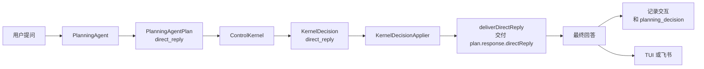
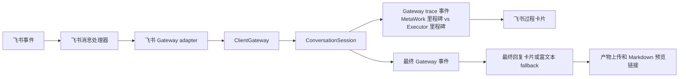

# MetaWork

[English Technical Overview](technical-overview.md) | [中文首页](../../README.zh-CN.md)

MetaWork 是本仓库统一呈现的闭源商业产品。AnyFusion 是独立的开源上游；下文保留的
`AnyFusion-Pi` 及其他 AnyFusion 名称用于标识已归属组件或兼容契约，不代表本仓库的
产品身份。

> 当前实现基线（2026-08-21）：PlanningAgentPlan v8、Work Graph
> v7、Kernel event/snapshot/decision contract v5、Completion Protocol v4，
> 以及支持事务式 30→31→32→33 升级路径的 SQLite schema v33。`KernelWorkflow` 串行完成
> event、Decision 和 application，attempt supervisor 在单一活跃顶层 Task
> 内并行启动最多四个隔离 attempt。ADR-0011 保持有效；多顶层 Task 调度
> 属于未来独立路线图。

> ADR-0027 至 ADR-0030 约束当前生效的 Configuration Control Plane、
> generation 级 AgentClass/Model/Harness 绑定、future A2A transport seam，
> 以及带签名和崩溃恢复的原生 update transaction。

升级保持唯一控制链：

```text
Planner 提案 -> ControlKernel 决策 -> Runtime 应用
-> ExecutorAdapter 传输一个已授权 attempt
```

目标配置对每个 Work Graph generation 固定一个 immutable revision；graph
revision、deferred recovery、decision、dispatch、attempt 和 receipt 都继续引用
该 revision。Provider/Model health 是带 revision identity 的 Kernel 投影，
Runtime 与 Adapter 只上报事实，不决定 fallback。Permission Profile 语义仍由
Resource/Kernel 的代码契约拥有。数据库采用 v30→v31→v32 事务升级，并与
release 验签、关闭 Task admission、dispatch quiesce、数据库备份、candidate
health check 和 rollback 协调。A2A 实现移入独立后续路线图。

MetaWork 是一个本地优先的 AI Task OS。它把自然语言需求变成可持久化、可检索、可调度、可验收的任务，让 AI 工作不再只是“回答这一轮”，而是可以跨中断继续执行、恢复上下文、规划子任务、claim executor work unit，并把最终产物交付到用户真正查看的地方。

它适合需要 AI Agent 长时间可靠工作的团队：任务有状态机，记忆有边界，自然语言主路径采用 PlanningAgent / ControlKernel / Durable KernelWorkflow / work-unit runtime，复杂任务有拆解和验收，文件产物有记录，飞书交付有后端，真实端到端烟测可以验证用户路径是否跑通。

## 核心能力

- 持久任务状态：created、ready、running、parked、blocked、done、archived、cancelled。
- 中断后通过 resume context 继续，不从头重做。
- timer 仅重查由 decision ledger 标记的容量阻塞；Executor `error` 恢复使用重要节点触发的结构化 probe，不做周期轮询。
- Kernel v5 根据纯 runnable frontier 一次授权确定性的 batch；Runtime 可并行运行最多四个 sibling attempt，但不运行多 Task 优先级调度。
- 当前强制单一活跃顶层任务，避免 ControlKernel 与 work-unit dispatch 加固期间出现多任务并存的歧义。
- 通过本地 SQLite FTS 索引向 PlanningAgent 提供显式的历史任务检索。
- 将复杂任务规划为显式 subtasks、验收标准和聚合规则。
- 将工作表示为 task-owned subtask graph，排序候选 agent classes，并让空闲 executor work units claim ready subtasks。
- Planner → ControlKernel → Runtime 是唯一策略主链；验收、retry、fallback、replan 和 recovery 不再由第二套 Agentic Loop 解释。
- 每个 Conversation 绑定一个持久 AnyFusion-Pi Planner session；已确认偏好和运行时事实通过只读查询边界按需获取。
- 生成文件自动记录为任务产物。
- 飞书回复、文件同步和 Markdown 在线预览由后端统一处理。
- 本地 Gateway 支持多个终端连接同一个 MetaWork runtime。
- 默认本地界面使用 `planner/AnyFusion-Pi` 下的 Gateway-only TUI，以独立的执行轨迹和对话区域流式展示安全事件，不创建本地语义 runtime。
- 支持按游标重放与重连、版本化斜杠命令和权限决议；原 Ink UI 完整保留为备用模块。
- 提供 `npm run smoke:metawork` 烟测，默认验证同一持久 AnyFusion-Pi Planner session 的两轮对话记忆；文件产物场景可显式选择。

## 核心架构

MetaWork 是面向任务的系统，而不是纯 session agent。普通 agent session 主要回答当前这一轮。MetaWork 会判断用户输入应该保持为轻量对话、控制已有任务，还是变成一个可以调度、阻塞、恢复、检索、验收、交付和审计的持久任务。

### 已实施的多客户端架构

ADR-0031 已于 2026 年 8 月 19 日完成代码交付。TUI、Web 对话、飞书和
Unix 客户端统一使用带版本的 Gateway command/event
协议。同一认证 Account 的客户端共享一个 `AccountRuntime`，其中包含配置、
记忆、Task、Kernel、Executor 和恢复服务；不同 Conversation 继续拥有独立的
持久 Planner session、串行输入 mailbox、trace 和展示流。

当前基数关系为：

```text
ServerProcess -> RuntimeRegistry -> AccountRuntime
  -> ConversationRegistry -> ConversationSession -> ClientConnection
```

ADR-0034 已于 2026 年 8 月 26 日接受，固定了该领域模型的进程生命周期：
`metawork server start` 是唯一拥有 Runtime 的启动路径，并独立于所有 Client
持续运行。裸 `metawork` 只启动 TUI Client，`metawork web` 只打开已有
Server 的 loopback Web origin，飞书连接由 Server 按配置持有。Server 启动时
不绑定 Workspace；每个 Conversation 必须先通过
`/workspace /absolute/path` 建立持久 Workspace 才能进入语义准入。

KernelWorkflow、Execution Runtime 和启动恢复等账号级服务由
`AccountRuntime` 单例持有。每个 Account 只有一个 Kernel coordinator
负责 durable decision/application drain，ADR-0011 继续保持每个
AccountRuntime 只允许一个活跃顶层 Task。不同 Account 使用独立数据根和
SQLite；现有安装以 `local-default` Account 激活。参见
[ADR-0031](../adr/0031-account-runtime-and-unified-client-gateway.md)、
[已批准设计](../plans/2026-08-18-account-runtime-unified-gateway-design.md)和
[实施计划](../plans/2026-08-18-account-runtime-unified-gateway-implementation-plan.md)。

```mermaid
flowchart LR
  User[用户] --> Surfaces[客户端入口<br/>TUI、CLI、Web、飞书]
  Surfaces --> Gateway[ClientGateway<br/>版本化 command/event]
  Gateway --> Conversation[ConversationSession<br/>mailbox 与展示状态]
  Conversation --> Account[AccountRuntime<br/>共享 runtime owner]
  Conversation --> MemoryFast[显式记忆和偏好快路]
  Conversation --> Planning[Planner Work Unit<br/>PlanningAgent]
  Planning --> Plan[PlanningAgentPlan v8<br/>意图、目标、候选、<br/>v7 graph 或授权确认]
  Plan --> Event[KernelEvent<br/>plan_proposed]
  Event --> Workflow[Durable KernelWorkflow v5<br/>inbox、snapshot、decision、application]
  Workflow --> Kernel[ControlKernel<br/>frontier、batch、资源、<br/>permission 与恢复]
  Kernel --> Decision{KernelDecision}
  Decision -->|direct_reply| Conversation[KernelDecisionApplier<br/>交付 plan.response.directReply，不调 executor]
  Decision -->|clarification| Clarify[澄清<br/>请求缺失输入]
  Decision -->|task_control| Control[Task control runtime<br/>状态、恢复、清理、解除阻塞]
  Decision -->|plan_work_graph| Runtime[KernelDecisionApplier<br/>创建或绑定任务]
  Decision -->|reject/no_action| Stop[不执行<br/>保留状态]

  Runtime --> TaskOS[Task OS<br/>TaskRuntimeService]
  TaskOS --> ExecCoord[KernelExecutionRuntime<br/>构造 scheduling snapshot]
  ExecCoord --> GraphRuntime[WorkGraphRuntimeService<br/>应用已授权 work graph]
  GraphRuntime --> Graph[Work Graph<br/>持久化 Subtasks]
  Graph --> Frontier[纯 runnable frontier<br/>依赖与 publication 事实]
  Frontier --> Batch[dispatch_batch<br/>持久 child items]
  Batch --> Attempt[AttemptSupervisor<br/>最多四个 attempt]
  Attempt --> Context[SubtaskExecutionContext<br/>直接 handoff 与选定 evidence]
  Context --> Executors[ExecutionRuntime<br/>canonical Codex / Pi execution backend]
  Executors --> Verify[Completion Protocol v4<br/>result-first assessment、delta 与 receipt]
  Verify --> Publish[Git publication gate<br/>稳定顺序集成]
  Publish --> Delivery[交付和 UI<br/>TUI 进度、飞书、文件、预览链接]
  Conversation --> Delivery
  Clarify --> Delivery
  Control --> Delivery
  Stop --> Delivery
  Delivery --> User

  Session <--> Store[(本地 SQLite<br/>任务、subtasks、agent classes、<br/>work units、events、memory)]
  Workflow -. audit .-> Decisions[(kernel_decisions)]
  TaskOS <--> Store
  Graph <--> Store
  Attempt <--> Store
```



所有自然语言输入统一进入隔离的 AnyFusion-Pi `PlanningAgent`，产出严格 v8 `PlanningAgentPlan`。Work Graph 使用 v7 契约，固定一个配置 revision 并携带完整 Executor bindings；Planner 不枚举资源 claim 或 execution layer。`ControlKernel` 根据 frontier、pending/active item、AgentClass、资源和 slot 事实授权确定性 batch；Execution 并行运行 attempt，并由 publication worker 按拓扑层、首次授权顺序和 Subtask ID 发布成果。

AnyFusion-Pi `PlanningAgent` 使用专用 process runner，而不复用 Executor adapter。一个 Conversation 对应一个持久 Pi session 文件。语义入口以 `--mode rpc` 启动 Planner，通过 stdin/stdout 交换 JSONL；同一 Conversation 的 writer 串行执行，避免多个进程并发写入 session 文件。交互 Pi 进程则以 `--gateway-socket` 和 `--conversation-id` 启动，在创建模型、工具或本地会话 runtime 之前进入 client-only 模式，把原始用户命令提交给 Server。Planner fork 管理服务端 RPC 对话历史和固定 system instructions；MetaWork 不从 SQLite interaction 重建提示词。Provider/Model 与 Planner 工具由 MetaWork 固定管理。语义 RPC 模式不暴露 Pi 原生文件读取工具，避免 Planner 通过源码反推 Runtime 或 Kernel 语义；交互式 client-only TUI 可为工作区问题保留只读的 `read`、`grep`、`find` 和 `ls`。所有模式都禁用 `bash`、`edit` 和 `write`。每个语义 turn 通过受限原生 `submit_planning_proposal({ plan })` 工具提交；runtime 注入 session、turn、user input 和 deterministic submission identity。rejection 是当前 ReAct turn 的结构化反馈，transport uncertain 与 rejection 严格分离；不存在 assistant 文本 proposal parser、proposal 专用 retry、repair prompt 或外层 validation loop。

本地 AnyFusion-Pi TUI 和 RPC runner 使用同一 vendored 应用，但承担不同角色。TUI 只连接版本化 Unix Gateway，流式展示 replay/live 的 `turn_started`、`trace_delta`、`task_projection`、执行、权限、产物、最终答案和终态错误事件；原始输入、斜杠命令、权限决议与取消请求全部进入 `ClientGateway`。只有受控 RPC runner 连接 mode-`0600` 的 `PlannerHostBridge` 提交 proposal。`ConversationSession` 重新执行 v8 schema 和语义校验，再进入 `plan_proposed → DurableKernelWorkflow → ControlKernel`。client mode 和 bridge 都不能直接访问数据库、Kernel、调度、Execution 或 Executor。

Executor 健康恢复是事件驱动的。`ExecutorRecoveryRefreshService` 只检查
enabled 且持久健康状态已经是 `error` 的 AgentClass，对同一 class 的并发
刷新进行合并，单次 probe 最长 30 秒，并把有界、脱敏的恢复证据和真实
attempt 历史分开保存。成功 probe 只允许 `error -> healthy`；`disabled`
是管理锁，healthy/unverified 不会被反向巡检。触发点是 Session 启动、
planning cycle、Task resume/recovery、Executor 配置变化和
`/executor refresh [name|all]`。

Planning 与恢复刷新并行开始，但 Kernel 准入前必须等待两者汇合。相关候选
恢复时，Planner 可在同一个持久 AnyFusion-Pi Planner session 中修订一次提案。已有 Task
仍无可用 eligible class 时，Kernel 会把精确提案保存为
`waiting_for_availability` 并结构化阻塞；后续 `executor_recovered` 事实
可重新准入该提案，将 Task 转为 `ready`，不会再次调用 Planner，也不会立即
dispatch。

### 普通问答路径



这条路径仍然是语义驱动。持久 AnyFusion-Pi Planner session 保留“继续”或“你刚才回答了一半”等对话上下文；持久 MetaClaw 事实仍通过 MCP 显式查询。PlanningAgent 把最终答案写入 `response.directReply`，runtime 原样交付。

### 持久任务路径

```mermaid
flowchart LR
  Input[用户要求执行工作] --> Planning[PlanningAgent]
  Planning --> Proposal[PlanningAgentPlan<br/>WorkGraphProposal]
  Proposal --> Kernel[ControlKernel<br/>授权或重写]
  Kernel --> Decision[KernelDecision<br/>plan_work_graph]
  Decision --> Apply[KernelDecisionApplier]
  Apply --> Task[TaskRuntimeService<br/>创建或绑定任务]
  Task --> KernelRuntime[KernelExecutionRuntime<br/>构造 snapshot、应用 Decision]
  KernelRuntime --> WorkGraphRuntime[WorkGraphRuntimeService<br/>应用已授权 graph]
  WorkGraphRuntime --> WorkGraph[Work Graph<br/>持久化 Subtasks]
  WorkGraph --> Ready[Runnable frontier<br/>直接依赖已发布]
  Ready --> Batch[Kernel dispatch_batch<br/>持久 attempt items]
  Batch --> Attempt[Attempt supervisor<br/>独立 claim 与运行]
  Attempt --> Run[ExecutionRuntime<br/>传输并执行]
  Run --> Verify[Completion Protocol v4<br/>result objects、delta 与 candidate]
  Verify --> Publish[Git publication gate]
  Publish --> Done{是否集成？}
  Done -->|是| Result[原子发布 result、handoff、<br/>artifact、workspace state 与 done]
  Done -->|冲突| Repair[Kernel 授权原 AgentClass repair]
```



这就是 Task OS 路径。任务状态、恢复上下文、Kernel 授权、Subtask 状态、WorkUnit/resource lease、产物捕获、验收和 Git publication 都在这里发生。ADR-0011 仍保持一个已接纳的顶层任务，但该 Task 内互不依赖的 Subtasks 已可并行。

当前自然语言路径有一个明确约束：同一时间只接纳一个活跃顶层任务。普通问答、澄清、状态查询、清理任务命令，以及明确指向当前活跃任务本身的请求仍然允许通过。新的无关顶层任务由 `ControlKernel` 拒绝并给出可见提示，直到当前任务完成，或取消后的容器与 lease 清理完毕。多 Task candidate、优先级、公平性和饥饿保护不属于已完成的 Phase 6，统一移入未来独立路线图。

### 飞书和进度展示路径



飞书进度会刻意区分 MetaWork 里程碑和具体 executor 里程碑。用户能看到当前是 MetaWork 在规划、召回上下文、调度、claim work unit，还是具体 executor 正在执行。

conversation / task 的边界很重要：

- Conversation：即时回答，不创建持久任务。持久 AnyFusion-Pi Planner session 负责对话连续性；direct reply 持久化为审计事实，但不会被回放进后续提示词。
- Task control：查看或改变已有任务状态。适合“当前在跑什么”“继续那个任务”“清空阻塞任务”。
- Durable task：创建或继续需要执行、持久化、产物、恢复、调度或后续检索的工作。

当前 direct reply 路径是显式的：MetaClaw 把当前轮发送给已绑定的持久 AnyFusion-Pi Planner session，PlanningAgent 仅在需要时通过 MCP 查询确认偏好或运行时事实，runtime 直接交付 `response.directReply`，不 claim executor work unit。

[MetaWork Task OS 架构与策略升级方案](../archive/plans/2026-06-14-metaclaw-task-os-architecture-strategy-upgrade.md) 中的本轮主线已经进入代码：确定性任务检索索引、PlanningAgent work graph proposal、统一 `ControlKernel` authorization、持久化 subtasks、work-unit claiming、汇总与验收都已实现并有针对性测试覆盖。Executor Discovery、远程 Registry 和弹性 work-unit spawn 仍不属于当前实现；ADR-0031 的多客户端 Gateway 收敛已于 2026 年 8 月 19 日完成。

重要边界：不存在第二套策略或编排循环。TUI、Web、飞书与 Unix 输入都先进入
`ClientGateway` 和 Conversation mailbox，再由服务端
PlanningAgent → ControlKernel → Runtime 链处理；已删除 script Client。

## 当前执行器

| 执行器 | 命令 | 适合任务 | 安装要求 |
| --- | --- | --- | --- |
| Codex CLI | `codex` | 仓库修改、测试、确定性实现、带 patch 的代码审查 | 原生安装复用现有命令，不改变其安装或个人 home |
| Pi Agent | `pi` | 调研、报告生成、多步骤信息综合、agentic CLI 工作流 | 原生安装复用现有命令，不改变其安装或个人 home |

默认 worktree 后端只执行 canonical `codex-cli` 与 `pi-agent`。获批后，Runtime claim 或创建 WorkUnit，再把对应 CLI 作为统一 Runtime 的子进程启动，并把 `cwd` 设为当前 Subtask Git worktree。该路径不扩展第三方 Executor 注册；旧 Docker attempt 后端仍可通过 `METACLAW_EXECUTOR_BACKEND=docker` 显式启用。

## 前提条件

必须具备：

- Node.js `>=22.19.0`。
- npm。
- Git。
- Unix-like shell 环境，优先支持 macOS 和 Linux；Windows 用户推荐使用 WSL2，这是当前支持的可靠安装路径。
- `better-sqlite3` 的原生编译工具链。

推荐安装编译工具：

```bash
# macOS
xcode-select --install

# Ubuntu / Debian
sudo apt-get update
sudo apt-get install -y build-essential python3 make g++
```

执行器前提：

- 原生 worktree 模式要求现有 `codex` 和 `pi` 命令已在 `PATH` 中；
  setup 不安装、升级、降级或重新配置它们。
- 只有 Docker 兼容模式才需要构建或拉取 canonical attempt 镜像。

飞书集成前提：

- 飞书应用具备消息接收和发送权限。
- 将 app secret 放入环境变量，例如 `FEISHU_APP_SECRET`。
- 使用双向飞书对话时，订阅 `im.message.receive_v1`。
- 如需回传文件，开启文件上传和发送消息能力。
- 推荐使用 WebSocket 事件投递，因为它不需要公网回调 URL。
- 公网反代或内网穿透仅在 webhook 模式或外部 Markdown 预览链接时需要。

Markdown 在线预览前提：

- `integrations.markdown_preview.enabled: true`。
- 如果用户不在宿主机上打开链接，需要配置可访问的 `public_base_url`。

## 安装

macOS 原生安装不依赖 Docker，也不安装全局 Planner package。按以下顺序安装：

```bash
git clone https://github.com/IFOSR/metawork.git
cd metawork
export ANYFUSION_PROVIDER_KEY='替换为你的密钥'
export ANYFUSION_PROVIDER_URL='https://你的-openai-兼容服务地址.example/v1'
./setup.sh
metawork --help
```

macOS 上，`setup.sh` 要求 Node.js 22.19+、Git、npm，以及已经存在的
`codex` 和 `pi` 命令。它会直接构建仓库内检入的 `planner/AnyFusion-Pi` planner
源码（不克隆外部仓库），两者使用独立依赖树，构建后把 mode-`0600` 的 MetaWork 专用 provider
和模型配置写入 `~/.config/metawork`，只安装
`~/.local/bin/anyfusion`，并将账户运行状态保存在
`~/.metawork/accounts/local-default`。安装期间不会运行两个 Executor，也不会
写入 `~/.codex` 或 `~/.pi`。

安装后的 launcher 在每次执行时读取当前目录。请从 Planner 需要检查的
仓库或目录启动：

```bash
cd /path/to/project
anyfusion
```

安装核验清单：

- `node --version` 是 `>=22.19.0`。
- `./setup.sh` 输出原生安装完成。
- `~/.config/metawork/provider.env` 权限为 `0600`。
- 新开一个 shell 后，`metawork --help` 可用。
- 安装前后的 `command -v codex`、`codex --version`、`command -v pi`
  和 `pi --version` 保持不变。

任一仓库更新后重新运行 `./setup.sh`。如果 nested AnyFusion-Pi 有未提交
修改，安装器会保留并直接构建，不覆盖这些修改。

## Windows 安装

Windows 用户推荐使用 WSL2 + Ubuntu。这样可以提供 MetaWork 当前需要的 Unix-like shell、原生编译工具链、socket、进程行为和 executor 兼容性。

先在 Windows PowerShell 中安装 WSL2：

```powershell
wsl --install -d Ubuntu
```

如果系统提示重启，重启后打开 Ubuntu，在 WSL 内安装依赖：

```bash
sudo apt-get update
sudo apt-get install -y git curl build-essential python3 make g++

curl -fsSL https://deb.nodesource.com/setup_22.x | sudo -E bash -
sudo apt-get install -y nodejs

node --version
npm --version
git --version
```

然后在 WSL Ubuntu shell 内安装并验证 MetaWork：

```bash
git clone https://github.com/IFOSR/metawork.git
cd metawork
./setup.sh
metawork --help
npm run smoke:metawork
```

请在 setup 之外独立安装并登录 Codex/Pi；MetaWork setup 不应用来改变
现有 Executor 安装。

Windows 安装核验清单：

- 在 WSL Ubuntu 里运行 MetaWork 命令，不要在 Windows PowerShell 里直接运行。
- 仓库建议放在 WSL 文件系统，例如 `~/MetaWork`，不要放在 `/mnt/c/...`，这样文件和 SQLite 性能更稳定。
- `node --version` 是 `>=22.19.0`。
- 新开一个 WSL shell 后，`metawork --help` 可用。
- 默认 executor 在 WSL 内可用，例如 `codex --help`。
- `npm run smoke:metawork` 成功完成

Windows 原生 PowerShell 不是当前推荐的主要运行环境。高级用户可以使用 Node.js 22.19+、Git、Visual Studio Build Tools、`npm install`、`npm run build` 和 `node dist/index.js` 直接开发，但 `setup.sh`、`anyfusion.sh`、Unix socket Gateway 行为以及下游 executor CLI 可能和 Linux/macOS 不一致。直接 Linux 开发使用 WSL2；容器 runtime 只保留为可选兼容路径。

## 安装执行器

MetaWork 不内置下游执行器 CLI。你需要自己安装要使用的执行器，并确保命令在 `PATH` 中。

### 注册自定义 Executor

Executor 是 MetaWork 可以分配 subtask 的运行时工人。一个已注册 Executor 现在包含三层信息：

- `AgentClass`：适用领域、能力、风险等级、输入/输出类型、适用场景、route-intent affinity 和 runtime 默认配置。
- 运行绑定：不可变 Docker image ID、受控 permission profile、容器内命令/参数、安装检测命令和可选项目地址。
- 至少一个 executor `WorkUnit`：一个具体的空闲 runtime slot，一次 claim 一个 ready subtask。

如果不确定具体该填什么，使用问答式注册向导：

```bash
/executor register wizard
```

向导会依次询问 Executor 名称、是否从项目地址推断、运行命令、非交互参数、安装检测命令、适用领域和能力。如果提供 GitHub 项目地址，MetaWork 会尝试从 `package.json` 或 README 示例推断 CLI 信息；如果无法可靠推断，会自动回到手动填写。

也可以一次性注册：

```bash
/executor register research-bot \
  --image registry.example/research-bot:1.2.3 \
  --image-id sha256:<64-hex-digest> \
  --permission-profile restricted-custom \
  --command research-bot \
  --args "run --prompt {prompt}" \
  --check "research-bot --version" \
  --project-url https://github.com/example/research-bot \
  --domains research,reporting \
  --capabilities research,report_generation
```

`{prompt}` 会被替换为 subtask 提示词。如果 `--args` 不包含 `{prompt}`，MetaWork 会把 prompt 追加为最后一个参数。image ID 必须匹配引用镜像，permission profile 必须来自受控目录。缺少绑定、镜像标签漂移或 profile 无效都会 fail closed；不存在宿主进程 fallback。路由 capability 仍与权限事实分离，不把权限细节暴露给 Planner。

`codex-cli` 与 `pi-agent` 完全由 canonical built-in definitions 管理。启动时会把这两个名称对应的全部静态字段、不可变镜像绑定和 permission profile 强制收敛，常规注册接口也拒绝覆盖或删除。非 canonical capability 仍是自由注册元数据，不会自动进入受控 Planner catalog；缺少 image/profile 的历史自定义类保留审计记录但不可执行。

Phase 5 的权限产品边界是所选 execution backend、permission profile 和持久 request/grant/use 审计预算。`use_capability` 会原子消费 attempt identity、expiry、调用次数和字节预算，但它不是通用 operation broker，也不证明每个原生文件、网络或外部动作都经过细粒度中介。容器 mount 与 sandbox policy 只适用于 container backend；egress profile 和 resource lease 仍是 Runtime 强制边界。

Executor 扩展契约：

必需的路由字段：

- `name`：稳定的 Executor 名称，例如 `research-bot` 或 `finance-research-agent`。
- `domains`：适用领域，例如 `research`、`finance`、`software`。
- `capabilities`：能力标签，例如 `research`、`report_generation`、`multi_tool`、`coding`、`tests`。

建议的路由字段：

- `inputTypes`：支持输入类型，例如 `text`、`files`、`image`。
- `outputTypes`：输出类型，例如 `markdown`、`report`、`code`、`patch`、`json`。
- `primaryUseCases`：适合路由给它的典型任务。
- `avoidUseCases`：不适合路由给它的任务。
- `riskLevel`：`low`、`medium` 或 `high`。
- `intentAffinity`：按 route intent 记录的 affinity，例如 `repo_execution`、`research_workflow`、`memory_agent_ops` 和 `general`。
- `projectUrl`：项目仓库或文档地址。

Executor 健康状态与近期结果属于动态状态。Planner 通过 `list_executor_status` 读取，不再将其保存为 AgentClass 的静态路由元数据。Runtime 在故障发生点持久化有界、脱敏的诊断事实，但不把它们被动注入每轮 Planner 上下文；用户追问执行为何失败或阻塞时，Planner 才通过显式只读诊断工具查询并用自然语言解释。

必需的运行绑定：

- `runtimeCommand`：本机 `PATH` 上可执行的命令，例如 `research-bot`。
- `runtimeArgs`：非交互运行参数，例如 `["run", "--prompt", "{prompt}"]`。
- `runtimeCheckCommand`：安装或可用性检测命令，例如 `research-bot --version`。

运行行为要求：

- 必须能非交互运行，不能等待人工输入。
- 必须能通过 `{prompt}` 或最后一个参数接收完整任务提示词。
- 最终答案应输出到 stdout。
- 失败时应返回非 0 exit code，或在 stderr 输出明确错误。
- 长任务应周期性输出进度，避免被 idle watchdog 判断为卡死。
- 文件产物应写入 prompt 中指定的任务输出目录。
- 飞书交付、文件上传和预览链接生成应由 MetaWork 后端完成；Executor 应产出本地文件，不应自己直接调用飞书 API。

可选高级 Adapter 接口：

- `execute(input)`：用结构化上下文执行任务。
- `isAvailable()`：检测 Executor 是否可运行。
- `abort(attemptId?)`：精确中止一个 attempt；整 Task 取消由 Runtime control port 枚举其全部 active attempts。
- `installSkill(pkg)`、`updateSkill(pkg)`、`disableSkill(target)`、`deprecateSkill(target)`：支持 Executor 自己的 Skill 生命周期管理。

常用管理命令：

```bash
/executor list
/executor show <name>
/executor register wizard
/executor unregister <name>
/executor feedback <taskId>
```

### Codex CLI

安装并登录 Codex CLI 后验证：

```bash
which codex
codex --help
```

默认配置：

```yaml
executor:
  command: codex
  timeout: 300
  max_duration: 3600
```

`timeout` 表示连续无输出 watchdog，不是固定墙钟总时长限制。只要 executor 仍在 stdout 或 stderr 输出内容，MetaWork 就会续期，不会因为运行时间长而杀掉仍活跃的进程。`max_duration` 仅保留用于兼容旧配置，不再用于终止活跃 executor。

### Pi Agent

在 MetaWork 之外独立安装并登录 Pi，然后验证：

```bash
which pi
pi --help
```

MetaWork 调用方式：

```bash
pi -p "<prompt>"
```

Pi attempt 默认通过统一的 `BackendExecutorAdapter` seam 在当前 Subtask worktree 中运行 `pi` 子进程；Docker 兼容模式仍使用 canonical `metaclaw-executor-pi:phase5` 镜像。

## Executor 与 Skill 的差异

Executor 和 Skill 是生态里的不同层。

Executor 是“谁来干活”。Skill 是“干活时带什么方法、知识和工具规范”。

Executor 是 AgentClass runtime，例如 canonical Codex CLI 与 Pi Agent。它可以作为 worktree 子进程运行，也可以走 Docker 兼容后端；它决定模型、工具链、权限、运行环境、上下文窗口、文件读写能力、非交互执行方式、成本和可靠性边界。

Skill 更像轻量能力包。它描述某一类工作应该怎么做：怎么做期货分析、怎么做代码审查、怎么跑调研流程、怎么输出报告格式。Skill 可以改善某个 Executor 的表现，但不会自动改变这个 Executor 的 runtime、权限、工具或安装状态。

Executor 的优势：

- 增加新的 runtime 边界，包括模型、工具、凭证、权限和命令行行为。
- 让 MetaWork 可以把 ready subtask 分配给最适合该工作的 executor work unit。
- 支持 planner-driven reassignment、交叉验证和审计。
- 可以接入通用 Skill 无法访问的私有系统或垂直领域系统。

Executor 的代价：

- 安装和配置更重。
- 必须明确非交互运行命令和可用性检测方式。
- 需要处理权限、超时、失败、heartbeat 和恢复。
- 多个 runtime 行为不一致时，会增加运维复杂度。

Skill 的优势：

- 更轻量，添加速度快。
- 适合沉淀可重复的方法、清单、领域启发和输出规范。
- 能提高同一个 Executor 在特定任务上的一致性。
- 运维成本比新增 runtime 更低。

Skill 的限制：

- 受限于 Executor 镜像、permission profile、受控上下文和 model gateway。
- 不能凭空获得不存在的 CLI、私有 API、浏览器能力、文件权限或企业系统集成。
- 通常提升执行质量，而不是扩展 runtime 边界。

当缺失能力来自“需要不同工人或不同 runtime”时，MetaWork 通过注册 Executor 扩展能力；当已有工人需要更好的流程、领域知识或输出规范时，通过 Skill 扩展能力。

## 运行

```bash
anyfusion
```

默认命令启动固定版本的 AnyFusion-Pi Gateway client：

- `anyfusion-planner` 由 Server 传入 Gateway socket 和稳定 Conversation ID。
- client mode 在创建模型、工具、项目资源或本地语义 session 之前分流。
- Pi 编辑器把原始文本、版本化斜杠命令、权限决议和取消请求提交给 `ClientGateway`。
- 执行轨迹区域按事件到达顺序展示安全的 Planner、路由、Kernel 和 Executor 里程碑；对话区域展示 replay/live 输出和最终答案。
- 重连从最后事件游标附着到同一 Conversation，并对 replay/live 的 event ID 去重。
- 权限请求只作为有界 UI 事实；`/approve` 与 `/deny` 只提交 request ID 和决议。
- client 不能写 Task 状态、选择策略、调度 attempt、调用 Kernel 或控制 Executor。
- 原始 v8 plan、prompt、隐藏推理、凭据和原始进程输出都保留在服务端。
- 设置 `METACLAW_STANDBY_TUI=1` 可启动完整保留的 Ink 备用实现；该模块不是默认入口，未来启用也必须通过 Gateway。

先启动常驻 Server：

```bash
metawork server start
metawork server status
```

再独立启动任意 Client：

```bash
metawork
metawork tui --conversation <id>
metawork web
metawork web --conversation <id>
```

Server 生命周期使用显式命令：

```bash
metawork server stop
metawork server restart
metawork server doctor
```

只有 Server 持有 `runtime.lock`、Runtime、恢复和 transport listener。TUI 与
Web 读取同一份原子 endpoint manifest；没有兼容且 ready 的 Server 时，明确
提示执行 `metawork server start`。关闭终端或浏览器不会停止 Server 或已接纳
的 Task。

Server 启动时不绑定用户 Workspace。新 Conversation 在所有 Client 中都会先
返回 `workspace_required`，直到用户提交同一条命令：

```text
/workspace /absolute/path/to/project
```

Server 对路径做 canonicalize 和授权并持久化到 Conversation；活动工作期间切换
返回 `workspace_busy`。Web 继续使用现有 Composer 提交该命令，不增加 Web
专属 Workspace selector 或 mutation API。

Web 交互面只监听 `127.0.0.1`。正常启动会打开一个短时、单次使用的 URL
fragment bootstrap；前端将它交换为 `HttpOnly`、`SameSite=Strict` 的
进程级会话 Cookie 后立即清除地址栏 fragment。用户无需复制 token，浏览器
JavaScript 也不持久化 token。`metawork web --no-open` 仅为 SSH、端口转发
和手工打开浏览器场景打印兜底 token。WebSocket 在协议升级前验证 Cookie
和同源 loopback Origin；旧 Cookie 会返回兜底输入页，而不是无限重连。

Web 现在采用持久 Conversation 工作区：左侧固定历史栏用于浏览有界投影，
`WebGatewaySessionRuntime` 通过 `WebGatewayAdapter` 附着到选定的稳定
Conversation。Web 不再拥有 live Runtime 或 `MetaclawSession`。清洗后的终态
turn 存放于账户 Conversation 根
`accounts/local-default/conversations/web/`。

Conversation 会在最终答案前内嵌详细执行叙事；Trajectory 使用同一份事实展示
耗时带、指标、筛选和高密度事件行。`ConversationSession` 以有界事件流展示 query
接收、Planner 生命周期、结构化意图、Kernel 决策、精确授权的
AgentClass/Harness/Provider/Model binding 和交付；WebSocket 重连先发送完整
snapshot，再发送有序 delta。现有 durable execution projector 继续提供
Subtask、attempt、验证、publication 和最新的规范化 Executor 进度摘要。
这些内容是可审计事件和 schema 摘要，不是模型隐藏思维链；secret、原始
prompt 和原始 stdout/stderr 不会进入浏览器。Planner RPC 运行期间会实时
转发安全的生命周期与工具里程碑，包括进程启动、请求接收、处理周期、模型
响应开始、工具开始/完成和 Planner 回合结束；长时间的模型处理不再等到最终
proposal 返回后才一次性显示。Web 主对话中的 `LIVE EXECUTION` 信息卡按
Subtask 分组展示 Executor、Harness、Provider、Model、当前安全步骤和耗时；
回合结束后保留为 `EXECUTION SUMMARY`。点击卡片打开 `Executor Detail` 抽屉，
抽屉使用有序安全 trace、attempt runtime 的有界进度历史和 durable
ExecutionProjector 时间线，因此重连、切换会话和回合结束后仍能查看同一条
Subtask 详情。心跳、等待依赖、等待容量和 blocked 会与真实 Executor 活动
明确区分。执行进度只是展示事实，不会成为 Completion Protocol 验收证据。

执行展示统一使用 Runtime Subtask ID 作为 canonical identity。
`src/work-graph/subtask-identity.ts` 是 proposal ID 到 Runtime ID 映射的唯一纯
函数 owner；Management 在历史读取、重连 snapshot 和实时 delta 进入 Web 前
统一转换，不按标题、数组顺序或 ID 后缀猜测合并关系。因此同一逻辑 Subtask
在对话、轨迹和详情抽屉中始终只有一张卡片。

路由展示固定使用 Task generation 对应的 configuration revision。
Configuration 根据已授权 binding 解析公开的 Executor、Harness、Provider
显示名称和用户配置的真实 model ID，Management 只输出这些公开字段与规范化
的候选未入选原因。普通 Web 契约不包含内部 `modelRef`、`providerRef`、
configuration revision 或 binding fingerprint；历史 revision 无法恢复名称时
显示“历史模型信息不可用”，不会回退暴露内部引用。路由卡明确分开“最终选择”
和“未入选模型候选”，所以 Codex CLI 下某个模型未入选不再被误解为整个
Codex CLI Executor 被拒绝。

原始 `attemptId` 继续用于服务端幂等、恢复和关联，但不作为用户标签。
Execution Narrative 根据 attempt kind 和序号显示“主执行”“继续执行”“回退执行”
“结果修正”或“合并修复”，并把内部 lifecycle 状态转换为本地化用户状态。
Attempt header 在桌面和移动端都稳定分隔标签、状态和耗时。Trajectory 是只读
页面，不渲染 Composer；草稿和待上传附件仍由 App 持有，切回 Conversation
后恢复。Workspace Header 提供跟随系统、浅色和深色三态主题，偏好保存在
`metawork.theme`，并在应用首屏渲染前通过语义颜色 token 生效。

依赖 publication 尚未完成时，Kernel/Runtime 会记录等待事实，不会错误地产生
普通用户阻塞；缺少 handoff、Result Object、workspace 状态或身份不匹配时，
会给出有界、结构化的材料化诊断。显式恢复通过
`task_resume_requested` 进入 Kernel，只有 Kernel 授权并应用
`resume_task` 后才恢复 Task/Subtask 并再次 dispatch。

账号启动恢复和显式 Resume 还会修复一种已知旧版 pre-apply 故障：system
Conversation binding 缺少可选的 `onDecisionApplying` 展示回调，导致 replan
的 `authorize_task_plan` application 在进入状态变更分支前被记为 uncertain。
只有错误文本、`submitted` replan request、generation 和下一 graph revision
全部精确匹配时，Runtime 才会提交 durable
`recovery_resolution_requested(retry)`，再由 ControlKernel 授权并按原 Decision
ID 幂等重放。其他 uncertain application 和外部 effect 仍保留普通显式恢复语义。

只有常驻 Server 与原生 update/rollback 共享 `runtime.lock`。Planner Host
启动时先探测活动 socket，
只回收确认 stale 的路径；停止时校验创建时记录的 device/inode，不能删除后来
替换的 socket。Planner RPC 会保留结构化 transport uncertainty 及其部分工具
审计。

原生 AnyFusion-Pi TUI 仍是裸 `metawork` 的默认 Client。Web 与 TUI 只拥有
连接和展示状态，都附着到同一个常驻 Server 所拥有的 `RuntimeRegistry`、
`AccountRuntime`、`ConversationRegistry` 和 `ClientGateway`。`anyfusion`
和 `metaclaw` 保留为兼容 CLI alias，但 `gateway run`、`--connect`、前台 Web
和 script mode 等旧生命周期形式会被明确拒绝。Server 通过
`metawork server start` 独立常驻，TUI/Web 只作为独立 Client 连接。

运行中的 Planner、Kernel 和 Executor 始终固定使用进程启动时加载的配置
revision。Web 设置页激活仍完整执行 validate、compile、probe 和 immutable
repository activation，但新 active revision 会显示为“下次启动 revision”，
并返回 `restartRequired: true`。Planner 子进程及其 MCP server 显式接收当前
运行 revision，因此配置激活不会造成 Planner 上下文与 Kernel/Execution
策略分裂。重启 MetaWork 后新 revision 才会生效。

原生 launcher 将账户状态保存在：

```text
~/.metawork/accounts/local-default/
├── config/
├── secrets/
├── generated/
│   ├── agent-runtime/
│   └── current
├── data/
│   ├── anyfusion.db
│   ├── database-revisions/
│   └── backups/
├── planner/sessions/
├── conversations/
├── gateway/
├── workspace-store/
└── attempts/
```

安装级 transport 状态保留在账户根之外：

```text
~/.metawork/
├── gateway.sock
└── runtime.lock
```

Server 管理：

```bash
metawork server start
metawork server status
metawork server doctor
metawork server restart
metawork server stop
```

### 可选容器兼容验证

macOS 原生安装和日常本机使用不需要 Docker。`docker/` 工作流仅保留给
可选 Linux 兼容与 CI 验证；该模式中的容器工作目录仍为 `/workspace`，
BuildKit 同时读取 MetaClaw 与仓库内置的 AnyFusion-Pi planner 源码，并在最终镜像中
保持 MetaClaw control process、Planner process 和依赖树相互隔离。
Docker attempt 路径只是兼容模式，原生 launcher 不会启动它。

完整 Runtime image 内置 MetaClaw CLI、v8 schema、编译后的 Planner MCP server、构建后的 AnyFusion-Pi 应用、版本化 host bridge、Codex/Pi CLI 与对应配置。`docker/Dockerfile.runtime` 构建仓库内检入的 MetaClaw 与 vendored planner 源码，并把两个独立应用树复制进最终镜像。Planner launcher 与 MetaClaw 注入的 `/app/dist/planner-mcp.js` 命令都使用 `/usr/local/bin/node`，禁止存在 `/opt/anyfusion-planner/node`。默认 launcher 只启动这一个 Runtime 容器，不挂 Docker socket、不构建 sibling Executor 镜像，也不创建 attempt control network。源码变化后使用 `docker/shell.ps1 -Rebuild`；只保留 workspace/data volume。完整要求见 [Phase 5 Runtime Security](phase-5-runtime-security.md)。

## 配置

通过 Web 设置页或 `metawork config|provider|model|planner|executor` 管理命令
修改配置。激活流程会 validate、compile、probe 并生成账户级不可变 revision；
运行中的 Server 在重启后应用新 revision。当前生效指针是：

```text
~/.metawork/accounts/local-default/config/active
  -> revisions/<revision-id>/
```

不要原地编辑不可变 revision 文件。Provider 凭据由账户 SecretStore 解析；
macOS 默认使用 Keychain，只有显式设置 `METAWORK_SECRET_STORE=file` 时才使用
权限为 `0600` 的文件。

启动前导出飞书密钥：

```bash
export FEISHU_APP_SECRET="your Feishu app secret"
./anyfusion.sh start
```

## 飞书交付和在线预览

MetaWork 将“文档生成”和“飞书交付”分开处理：

- 执行器只负责把 Markdown 或其他文件写入任务输出目录。
- MetaWork 将文件记录为 task artifacts。
- 飞书后端把最终答案发回聊天。
- 如果文件上传能力可用，飞书后端会上传任务产物。
- 如果配置了 Markdown Preview，Markdown 产物会附带在线预览链接。
- 投递尝试会写入 `~/.metaclaw/gateway-audit.jsonl`。

执行器不应该直接调用飞书云文档 API。用户说“飞书云文档”或“在线预览”时，MetaWork 会要求执行器产出本地 Markdown 产物，后端负责飞书同步和预览链接。

飞书进度卡片会明确展示执行链路。MetaWork 先进行意图解析和执行准备，然后展示 planner work-graph 决策、work-unit claim 状态，以及真正启动 subtask 的执行器。这样飞书用户不会把意图解析器、planner 或 dispatcher 误认为最终执行器。

最终飞书回复优先使用 Markdown message card。长回复会拆成多张卡片；如果某个卡片 chunk 失败，MetaWork 会把该 chunk 重试为富文本 post；如果仍有 chunk 无法投递，会上传完整最终答案 Markdown 文件，避免用户只收到半截结果。

访问控制由 Gateway 处理：

- 私聊默认使用 `dm_policy: pairing`。第一个私聊用户会自动通过，后续用户可用 `metawork gateway pairing` 审批或撤销。
- 群聊默认使用 `group_policy: open` 和 `require_mention: true`。
- 在飞书聊天里发送 `/sethome` 会把该聊天记录为 `gateway.platforms.feishu.home_channel`。
- Feishu 配置只从 `gateway.platforms.feishu` 读取。

常用飞书 Gateway 命令：

```bash
metawork gateway doctor
metawork gateway pairing list
metawork gateway pairing approve <open_id>
metawork gateway pairing revoke <open_id>
```

默认预览 URL：

```text
http://127.0.0.1:8790/preview/<artifact>
```

如果飞书用户不在宿主机上打开链接，需要暴露 preview 服务并设置：

```yaml
integrations:
  markdown_preview:
    enabled: true
    host: 127.0.0.1
    port: 8790
    public_base_url: https://preview.example.com
```

## 任务工作流

用自然语言创建任务：

```text
> 对比三份合同的风险点，并生成风险矩阵。
```

MetaWork 会：

1. 判断输入是轻量对话、任务控制，还是持久任务。
2. 创建新任务或定位已有任务。
3. 检索可用的历史任务上下文。
4. 计算语义优先级。
5. 让 planner 选择 planner outcome，或构建 subtask work graph。
6. 持久化带依赖、候选 agent classes 和验收标准的 ready subtasks。
7. 为每个 ready subtask claim 一个空闲 executor work unit，并持续记录进展。
8. 保存结果摘要、文件产物和任务记忆。
9. 给出下一步建议。

常用命令：

```bash
/task list
/task list active
/task list ready
/task list parked
/task list blocked
/task list done

/task show <id>
/task pause <id>
/task resume <id>
/task block <id> waiting for customer data
/task unblock <id>
/task unblock <id> /tmp/evidence-v4.pdf
/task cancel <id>
/task <taskId> subtask cancel <subtaskId...>
/task <taskId> accept-partial
/task index rebuild
/task index search <query>

/task dashboard
/task attach <taskId> <file paths...>
/task history <taskId>
/config
/help
/exit
```

AnyFusion-Pi Gateway TUI 是默认本地入口。client 只拥有编辑器和展示状态；
`ClientGateway`、`ConversationSession`、AccountRuntime 和 ControlKernel
继续独占命令校验、语义规划、持久化 mutation 和执行权限。原 Ink TUI 完整
保留在 `src/tui/`，可通过 `METACLAW_STANDBY_TUI=1` 启动，但它只是源码保留
的备用模块，不是第二套持续维护的前端。

## 任务检索

MetaWork 会用本地 SQLite FTS5 建立任务检索索引，让历史工作可以被重新发现。用户不需要记住准确 task id；Planner 可先用查询文本搜索，再读取明确选中的任务上下文。

命令：

```bash
/task index rebuild
/task index search 合同 风险 矩阵
```

该索引是确定性读模型，不是语义路由器。PlanningAgent 决定历史任务是否相关，调用 `search_tasks` 搜索，再通过 `get_task_context` 读取选中的记录。Runtime 不根据用户措辞推断任务连续性、相关历史、时间线意图或恢复/参考模式。

## 单 Task 并发调度模型

MetaWork 当前只调度一个活跃顶层 Task。Work Graph 纯函数从依赖、Subtask 生命周期和 pending/active item 推导稳定 runnable frontier；Kernel v5 在全局上限四个 slot 内一次授权 batch。`KernelWorkflow` 仍串行决定和落应用，attempt supervisor 才异步 claim/run child item，因此 sibling 的启动 race、容量不足或失败不会取消其余 item。

当一个顶层任务正在运行时，`ControlKernel` 会拒绝新的无关自然语言 durable task，以及针对其他任务的执行请求。它仍允许普通问答、澄清、状态查询、清理任务命令，以及明确指向当前活跃任务的请求。Slash command 和确定性执行入口也进入统一 Kernel seam。第二个顶层任务的排队、紧急抢占和自动恢复在当前范围内刻意关闭；ADR-0011 把这记录为一个可逆决策。

单个已接纳的顶层任务内部可以存在多个并行 Subtasks。一个 Subtask 同时最多一个 pending/active attempt；attempt、WorkUnit 和短命 Executor 进程一一绑定。完成顺序不决定发布顺序，`awaiting_integration` 期间下游不可运行。

整 Task 取消和显式 Subtask 取消也必须进入 durable Kernel seam。取消栅栏先提交，`cancelling` dispatch/publication 在精确执行后端实例退出或确认缺失、WorkUnit 与 lease 释放前继续占用容量；晚到 outcome 只记为 `no_op`。Subtask 取消按下游闭包原子执行，不影响独立 sibling；剩余工作收束后 Task 进入 `blocked`，用户只能取消整个 Task，或通过 `/task <taskId> accept-partial` 显式接受已发布部分。

## PlanningAgent、ControlKernel 和 Work Unit

自然语言 dispatch 拆成 Planner 理解、Kernel 授权和 Runtime 执行三层。除 slash command、显式 ID、路径、URL 和附件外，raw input 都进入 `PlanningAgent`；自然语言“记住”不再是快路。Planner 可按需调用只读 MCP，并通过原生 proposal 工具提交严格 v8 `PlanningAgentPlan`。Work Graph 使用 v7 契约，固定配置 revision 并携带完整 Executor bindings；授权确认只能解释同一 Task 中既有精确 request ID，不能修改 target、scope 或 grant。

- `direct_reply`、`clarification`、`task_control` 或 `no_action`：除非 kernel 把 plan 重写为可执行工作，否则不应 claim executor work unit。
- `plan_work_graph`：planner 提出一个 work graph proposal，节点是未来的 `Subtask` 记录。每个 proposal 都带有依赖、验收标准、`deliveryKind: edit | report`、受控的 `requiredCapabilities` 和完整有序的 canonical AgentClass 候选集合。

`ControlKernel` v5 验证 schema、priority、task status、单活跃任务冲突、Work Graph、AgentClass 和 scheduling snapshot，也唯一决定 batch dispatch、Task/Subtask 取消、显式部分接受、generation replan、deferred availability、Executor recovery、retry/fallback、merge repair/conflict replan、permission grant/deny/escalate、partition wait 和执行后端恢复。

`DurableKernelWorkflow` 负责 event inbox、Decision/application 原子 issuance、幂等 Runtime apply 和 observation drain。`WorkGraphRuntimeService` 只持久化或投影 Kernel 授权的 v7 Work Graph revision。`KernelExecutionRuntime` 构造快照并应用授权；`AttemptSupervisor` 管理 durable child launch；`SubtaskAttemptRunner` 负责 attempt-aware claim、唯一 context、Completion Protocol、receipt 和 candidate commit；`WorkspacePublicationWorker` 负责稳定 Git 集成与原子 completion 发布。

旧版 `ExecutorRouter`、`ExecutorRoutingCoordinator`、`ExecutionPolicyPlanner` 以及 `IntentOrchestrator` 路由子系统已整体删除——不再有独立的 executor-selection 层。`repo_execution`、`research_workflow` 等旧 route intent 名称仅作为 agent class 排序的 affinity key 保留。

## 复杂任务策略和 Agentic Loop

MetaWork 可以把复杂需求表示成 work graph，而不是把整段需求一次性塞给一个 executor。图没有 single/multi execution mode；Planner 只在受控能力交接或必要交付边界建立多个 Subtasks。每条 `dependencies` 边同时是拓扑与 keyed `text`/`artifact` handoff contract。

`SubtaskExecutionContext` 是唯一生产 Executor 输入。Task 标题/目标仅作背景，当前 Subtask 目标是唯一操作指令，越界 sibling 只暴露标题。Runtime 不把 Task/Subtask/attempt/WorkUnit 身份及 acceptance/handoff key 交给模型复制。Completion Protocol v4 将正文交付、完成认证和安全处置分轴评估：marker、trailer、evidence 数量/长度和物理传输限制不能丢弃安全正文；路径逃逸、未授权写入、秘密暴露和未授权 ResultReference 仍 fail-closed。Runtime 以 Result Object 保存 raw stream、business result 和 safe projection，并以 Gateway 分块事件交付 safe projection。

在 active session path 中，proposal 只有在 `ControlKernel` 授权并创建 durable application 后才会成为持久化 Work Graph v7 `Subtask` revision。未发布产品使用 SQLite schema v33，支持事务式 30→31→32→33 升级路径，unsupported older schema 会拒绝启动。当前 schema 还包含 immutable Result Objects、direct-edge ResultReferences、Planner proposal configuration-revision pin 和结果分块交付事实。下游只有在直接依赖 publication 成功后才进入 frontier，并通过授权引用按需读取上游结果；integration branch 不会隐式成为 sibling 基线。Certified Executor 成功先进入 `awaiting_integration`，publication 成功后才原子发布 completion facts；safe uncertified body 可以先交付给用户，但不会释放下游。

已经脱离生产链路的 `ExecutionStrategyPlanner`、`ExecutionPolicy`、`MultiExecutorOrchestrator` 和 `AgenticLoopController` 实现已删除。work graph 与 work unit dispatch 成为权威路径后，这些旧实现不再参与运行时。`ExecutionAggregator` 继续供验证流水线执行结构化的多结果证据检查。

## 显式记忆

MetaWork 把显式确认的偏好、任务记忆卡片和学习候选保存在 SQLite 中。

自然语言请求不会通过代码侧启发式创建、提升或应用记忆。用户只通过显式 `/memory` 命令管理偏好。PlanningAgent 会收到有界的全局已确认偏好，并可在 Subtask `contextRef` 中精确引用某条确认偏好。

命令：

```bash
/memory
/memory add Alex prefers formal updates with legal copied
/memory search formal
/memory edit <pref_id> --scope project Use tables for outputs
/memory delete <pref_id>
/memory stats
/memory vault export
/memory vault status
```

## 学习循环

MetaWork 可以把成功任务、失败任务、文件产物和 executor skill 使用情况沉淀成学习候选。

命令：

```bash
/learning candidates
/learning approve <candidate_id> [note]
/learning reject <candidate_id> [reason]
/learning promote <candidate_id>
/learning cards
/learning skills
/learning summary
/learning weekly
```

## 开发

```bash
npm run dev
npm run build
npm test
npm run lint
npm run smoke:metawork
npm run smoke:gateway
```

`npm run smoke:metawork` 默认运行 `planner-session`：在同一个 Conversation 中发送两轮对话，确认第二轮能回忆本轮未重复的口令，并确认只创建一个持久 AnyFusion-Pi Planner session 文件。执行器产物回归仍可显式运行 `--scenario artifact` 或 `--scenario python-hello`。烟测默认以原生进程运行，使用已安装的 MetaWork 配置（`METAWORK_CONFIG_HOME`，默认 `~/.config/metawork`）；传入 `--mode docker` 可强制容器路径，该路径需要 `docker/*.env` provider 文件。

`npm run smoke:gateway` 是不依赖外部模型凭据的生产边界门禁，覆盖 Gateway
准入、replay、重连、账户恢复和独立 Client/Server composition。

针对性测试：

```bash
npm test -- tests/planner-process-runner.test.ts
npm test -- tests/session/planning-agent-session-routing.test.ts
npm test -- tests/session/planning-kernel-path.test.ts
npm test -- tests/kernel/control-kernel.test.ts
npm test -- tests/kernel/kernel-workflow.test.ts
npm test -- tests/execution/executor-recovery-refresh-service.test.ts
npm test -- tests/execution/work-unit-claim-service.test.ts
npm test -- tests/storage/subtask-repo.test.ts
```

## 目录结构

```text
src/
├── cli/            # canonical server、tui、web 与管理命令
├── client/         # endpoint 解析与独立 TUI/Web launcher
├── commands/       # Slash command 路由和命令处理
├── core/           # 窄共享基础类型和规范化 KernelFailure 事实
├── delivery/       # 验收、产物抽取、聚合检查和最终交付准备
├── execution/      # 已授权副作用：workflow apply、probe、claim、执行后端、Git publication
├── executor/       # Executor adapter，以及 AgentClass admin/seeder、prompt、skill package
├── gateway/        # 本地 Gateway server/client 和飞书 Gateway runtime
├── guidance/       # 主动引导、任务信号、引导策略和仪表盘编排
├── integrations/   # 外部集成辅助能力，例如 Markdown preview
├── intent/         # 内联资源归一化和非路由意图/材料辅助函数
├── kernel/         # 纯 ControlKernel v5 contract/decision 与 durable workflow seam
├── learning/       # 反思、周报、技能治理、晋升门禁和安全扫描
├── memory/         # 显式偏好、确定性会话上下文和 vault 导出
├── notifications/  # 通知适配器，例如飞书通知
├── server/         # 常驻 Server composition、lifecycle 与 manifest
├── planning/       # PlanningAgent 接口（AnyFusionPlanningAgent）、context builder、plan schema/词汇、校验
├── resource/       # Partition identity、冲突、permission profile 与 bounded grant 纯规则
├── session/        # Session 协调、PlanningAgent/ControlKernel wiring 与状态投影
├── storage/        # SQLite migrations 和 repositories
├── task/           # 任务状态机和 runtime
├── tui-bridge/     # 原生 Planner TUI 进程与只读 Unix JSONL bridge
├── tui/            # 完整保留的备用 Ink 终端 UI
├── utils/          # 配置、路径、日志、ID 等通用工具
└── work-graph/     # 共享 graph 类型、校验、取消闭包和 runnable frontier
```

测试按同样分区放在 `tests/<domain>/`。`src/core` 刻意保持很窄，只保留共享基础类型和共享 `KernelFailure` 事实。关键词 RuleHints、通用记忆/排序 LLM bridge、task-routing 意图猜测和旧路由子系统已删除。Active natural-language path 位于 `src/planning/`、`src/kernel/`、Session Application Shell、`src/execution/` 和 storage repositories。

## License

MetaWork 是闭源商业软件。对外分发前必须由公司提供正式批准的商业许可条款。
AnyFusion 衍生组件及其他第三方开源组件继续遵守各自的许可证与 NOTICE；根目录
`LICENSE` 暂时保留用于历史和第三方审查，不代表 MetaWork 整体采用该许可证。
