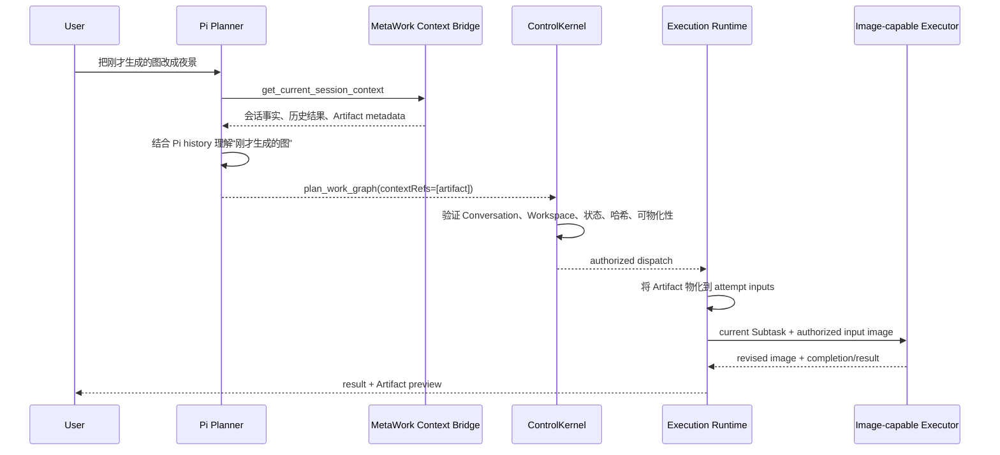
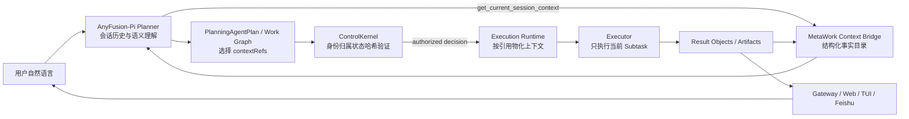

# Planner、MetaWork 与 Executor 上下文连续性实施方案

> **For Claude:** REQUIRED SUB-SKILL: Use superpowers:executing-plans to implement this plan task-by-task.

**Goal:** 让 Planner 依靠 Pi 会话历史理解用户意图并选择所需的历史上下文，由 MetaWork 提供并验证稳定的上下文引用，再由 Executor 使用经过授权和物化的输入完成连续任务。

**Architecture:** 保留 `Planner -> ControlKernel -> Runtime -> Executor` 控制主轴。Planner 是唯一的自然语言语义理解者，负责判断用户是在延续已有结果、引用某个文件/图片、继续某个 Task，还是提出全新任务，并把选择结果写入 Work Graph。MetaWork 不新增第二个语义检索器，只通过现有 Planner MCP/应用上下文桥提供会话事实、Task 结果和 Artifact 候选，并由 Kernel 验证引用的身份、归属、状态与可用性。Executor 不理解跨轮语义，只消费 Kernel 授权后由 Runtime 物化的上下文。

**Tech Stack:** Node 22.19+, TypeScript ESM, SQLite/better-sqlite3, AnyFusion-Pi persisted session, Planner MCP JSON-RPC, Work Graph v7, ControlKernel v5, Result Object/Artifact projection, native worktree Executor backend and optional Docker compatibility backend.

---

**Status:** Implemented

**Plan date:** 2026-09-02

**Completion date:** 2026-09-02

**Scope:** Conversation 内跨轮上下文理解、历史 Executor 结果延续、Artifact/图片/文档引用、Planner Context Bridge、Kernel 引用验证和 Executor 输入物化。

**Related authority:** ADR-0015, ADR-0020, ADR-0021, ADR-0023, ADR-0032, ADR-0033, ADR-0035, ADR-0036, ADR-0037.

## 1. Decision Summary

MetaWork 的上下文职责固定为：

```text
Planner 负责“理解和选择”
MetaWork 负责“提供和验证”
Executor 负责“执行”
```

目标链路：

```text
用户自然语言
  ↓
AnyFusion-Pi Planner 会话历史 + 当前用户输入
  ↓
Planner 理解指代、延续关系和任务意图
  ↓
Planner 从 MetaWork Context Bridge 提供的事实中选择上下文
  ↓
PlanningAgentPlan / Work Graph.contextRefs
  ↓
MetaWork / ControlKernel 验证引用归属、状态、哈希和权限
  ↓
Execution Runtime 物化已授权的图片、文档、文本或结果
  ↓
Executor 使用当前 Subtask + 已授权上下文执行
  ↓
Result / Artifact 发布并重新进入后续 Conversation 上下文
```

这不是“Planner 语义检索器 + MetaWork 路由器 + Executor”的三层竞争关系，而是一个单向职责链：

- Planner 决定“用户想继续什么”和“哪些历史事实对本次任务有用”。
- MetaWork 只回答“这些对象是否存在、属于谁、是否仍可用、能否安全交给该 Task”。
- Executor 只执行当前 Subtask，不自行搜索 Conversation，不自行猜测历史文件，也不自行扩大上下文。

## 2. Current Problem

### 2.1 连续图片任务的实际断点

当前连续图片修改失败的行为链是：

```text
上一轮 Executor 生成图片
  ↓
Artifact 已发布并在 Web 中展示
  ↓
用户自然表达“对这张图继续修改”
  ↓
Pi Planner 能够从会话历史理解用户指向上一张图
  ↓
Planner 仍提交旧的 task_resource/原始上传路径
  ↓
Kernel 按“本 Task 资源或本轮上传资源”校验
  ↓
历史 Artifact 不属于新 Task
  ↓
request_clarification / unqualified context refs
```

根因不是 Planner 没有上下文理解能力，而是：

1. Artifact 只有展示和下载语义，没有成为 Work Graph 的合法历史输入引用。
2. `task_resource` 同时承担“本轮输入文件”和“历史文件”的错误职责。
3. Context Ref Eligibility 仍要求历史 Assistant 结果出现在近期记录或用户显式引用中。
4. Runtime 的图片物化逻辑只读取 `task.resources`，不会根据历史 Artifact 引用准备输入。
5. Planner、Kernel、Runtime 对“历史上下文”的数据模型不一致。

### 2.2 当前代码中的对应位置

- Planner 会话事实：`src/planning/planner-mcp-server.ts`
  的 `PlannerDataReader.getCurrentSessionContext()`。
- 当前 Artifact projection：`src/delivery/user-artifact-types.ts`、
  `src/storage/task-artifact-repo.ts`。
- 当前 Context Ref 类型和校验：`src/work-graph/types.ts`、
  `src/work-graph/context-ref-eligibility.ts`、
  `src/work-graph/validation.ts`。
- Kernel 引用资格检查：`src/kernel/control-kernel.ts`。
- Runtime 上下文构建：`src/execution/subtask-execution-context.ts`。
- 图片输入物化：`src/execution/subtask-attempt-runner.ts`
  中的 `materializeImageTaskResources()`。
- Executor 结果被动回写 Planner：现有
  `executor_result` Host Protocol projection 和 Gateway result/artifact
  projection。

本方案不通过修改这些模块的职责来解决问题，而是为它们增加同一个历史上下文引用契约。

## 3. Non-Goals

本方案不做以下事情：

- 不新增关键词路由器、向量检索器或第二个 LLM 语义路由器。
- 不让 MetaWork 根据关键词判断“这个”指向哪个 Artifact。
- 不要求用户说“上一轮”“上两轮”“第三轮”或手动填写 Artifact ID。
- 不要求用户把图片重新上传一遍才能继续编辑。
- 不把全部 Conversation 历史无差别塞给 Planner 或 Executor。
- 不让 Planner 访问 SQLite、内部 Workspace Store、绝对路径或任意本地文件。
- 不让 Executor 自己搜索 Conversation 或跨 Conversation 读取历史结果。
- 不把 Web 的点击预览行为强行变成语义输入协议。
- 不改变 Provider 配置、Executor 能力画像、模型选择和 Routing Catalog 的既有职责。
- 不改变 Workspace 的操作系统级安全边界、Permission Profile 或 Kernel 授权规则。

## 4. Core Principles

### 4.1 Pi 会话是语义连续性的第一来源

同一个 Conversation 映射到一个持久化 AnyFusion-Pi session。Planner 使用：

- 当前用户输入；
- Pi 自身保留的历史用户消息；
- Pi 自身保留的 Planner/Executor 结果事实；
- 当前会话的上下文压缩和指代消解能力；
- MetaWork Context Bridge 返回的结构化事实。

MetaWork 不把 SQLite interaction 表重新拼成一份“伪对话”塞回 Planner prompt。Context Bridge 只补充 Pi 会话中不能可靠表达或需要实时验证的事实，例如：

- 当前仍存在的 Task 和其状态；
- 历史结果的稳定身份和内容摘要；
- Artifact 的名称、类型、来源、哈希、可用状态；
- 当前 Workspace/Conversation 归属；
- 结果或文件是否可以被本次 Task 继续使用。

### 4.2 Planner 只选择，不创造事实

Planner 可以从 Context Bridge 看到候选对象并在 Work Graph 中引用它们，但不能：

- 编造不存在的 Artifact；
- 编造文件路径；
- 将一个 Conversation 的对象引用到另一个 Conversation；
- 通过自然语言把无关对象变成当前 Task 的输入；
- 把“用户希望具备的能力”当成已授权的运行时权限。

如果 Planner 选择了不存在、过期或不属于当前 Conversation 的引用，MetaWork 返回结构化验证错误。Planner 可以在同一语义回合修正；不能靠猜路径绕过验证。

### 4.3 MetaWork 提供事实并做确定性验证

MetaWork 的判断全部是确定性事实检查：

- 引用 ID 是否存在；
- 对象是否属于当前 Account；
- 来源 Task 是否属于当前 Conversation；
- Artifact 是否处于可用状态；
- 内容哈希是否一致；
- 物化源是否存在且未发生符号链接逃逸；
- 当前 Task 是否有资格接收该上下文；
- 当前 Executor 是否收到完整、有限、授权的输入。

MetaWork 不回答“用户说的这个到底是哪一个”，也不根据文件名或关键词自动替 Planner 选对象。

### 4.4 Executor 只消费授权上下文

Executor 收到的上下文必须已经完成：

1. Planner 选择；
2. Schema 验证；
3. Kernel 引用验证；
4. Runtime 物化；
5. Attempt/Task/Subtask 绑定。

Executor 不获得原始 Conversation 数据库访问权，不获得任意历史路径访问权，也不获得跨 Task 的隐式 Workspace 权限。

## 5. Responsibilities

| 层 | 负责 | 不负责 |
| --- | --- | --- |
| Planner / AnyFusion-Pi | 理解自然语言、解析指代、识别新任务与延续任务、选择历史 Artifact/interaction/Task 结果、生成 focused Work Graph | 读取数据库、验证路径、授权 Executor、启动进程、决定 retry/fallback |
| Context Bridge | 提供当前 Conversation 的结构化事实、候选引用、摘要、稳定 ID、来源关系和可用性投影 | 做语义排序、猜用户指代、替 Planner 选择对象、执行文件读取 |
| Planning Schema / Work Graph | 表达 Planner 选择的 `contextRefs`，维护引用的结构合法性和去重 | 判断语义是否正确、读取文件、授权跨 Conversation 访问 |
| ControlKernel | 验证引用是否属于授权范围，决定是否接受 Work Graph，保持失败关闭 | 读取原始日志、调用文件系统、替 Planner 猜测对象 |
| Execution Runtime | 按 Kernel 已授权的引用读取 Result/Artifact/interaction，复制到 attempt 输入目录，建立 evidence capability | 重新解释用户意图、添加未在 Graph 中声明的历史上下文 |
| Executor | 执行当前 Subtask，读写已授权的输入和 Workspace，返回结果与 Artifact | 搜索历史会话、选择上下文、改变 Task 状态或调用另一个 Executor |
| Web / TUI / Feishu | 展示 Conversation、结果、Artifact 和执行状态，允许用户继续自然表达 | 直接修改 contextRefs、直接访问 Repository、直接调度 Executor |

## 6. Context Bridge Design

### 6.1 Context Bridge 是事实投影，不是语义检索器

复用现有 `get_current_session_context` 作为 Planner 的入口，扩展其返回内容。不得新增一个独立的 `semantic_context_search` 或 `context_router` MCP 工具。

Planner 在需要判断连续性、历史结果或 Artifact 时调用该工具。返回的是当前可信 Conversation 的结构化“上下文目录”，而不是一份无边界全文历史。

建议返回形态：

```ts
interface PlannerContextBridgeSnapshot {
  sessionId: string;
  conversationId: string;
  workspaceId: string;
  generatedAt: string;
  interactions: PlannerInteractionFact[];
  tasks: PlannerTaskFact[];
  artifacts: PlannerArtifactFact[];
  executorResults: PlannerExecutorResultFact[];
}

interface PlannerInteractionFact {
  interactionId: string;
  taskId: string | null;
  role: 'user' | 'assistant';
  summary: string;
  contentHash: string | null;
  createdAt: string;
  hasFullContent: boolean;
}

interface PlannerTaskFact {
  taskId: string;
  title: string;
  status: string;
  summary: string;
  createdAt: string;
  updatedAt: string;
  resultAvailable: boolean;
}

interface PlannerArtifactFact {
  artifactId: string;
  taskId: string;
  subtaskId: string | null;
  displayName: string;
  relativePath: string;
  mediaType: string;
  previewKind: 'markdown' | 'text' | 'code' | 'image' | 'unsupported';
  contentHash: string;
  byteLength: number;
  availability: 'available' | 'unavailable' | 'expired';
  sourceLabel: string;
  createdAt: string;
}

interface PlannerExecutorResultFact {
  resultId: string;
  taskId: string;
  subtaskId: string | null;
  summary: string;
  contentHash: string | null;
  createdAt: string;
  artifactIds: string[];
}
```

字段规则：

- `artifactId`、`interactionId`、`taskId` 是给 Planner 生成 proposal 的内部稳定引用，不展示给用户作为操作要求。
- `relativePath` 只用于帮助 Planner 理解文件名称和类型，不能用于执行授权，也不能成为 Runtime 的物化地址。
- Context Bridge 不返回 `absolutePath`、`workspaceRoot`、`storageUri`、Provider secret、命令、原始 stderr 或隐藏思维链。
- 摘要是受限事实摘要，不是基于关键词对候选对象做语义结论。
- 历史对象可以超过最近 20 条，只要仍在 Conversation 的可查询保留范围内；返回总量、摘要长度和对象数量必须有硬上限。
- 对已经通过 Executor result projection 写回 Pi 会话的结果，Bridge 仍提供结构化 Artifact identity，避免仅依赖自然语言结果文本。

### 6.2 Planner 如何自然理解“这个”

Planner 的语义流程不是：

```text
查找包含“图片”的最近文件 -> 自动选第一个
```

而是：

```text
读取当前 Pi 会话历史
  ↓
理解“这个图片”“刚才的结果”“继续这个方案”的语义指向
  ↓
将会话中的候选对象与 Context Bridge 的 Artifact/Result 身份对应
  ↓
选择一个或多个 contextRefs
  ↓
生成新的 focused Subtask
```

例如用户说：

> 把刚才生成的图改成夜景，并把主体往左移。

Planner 应从 Pi 历史理解“刚才生成的图”指向上一轮生成的图片，并提交：

```json
{
  "deliveryKind": "edit",
  "requiredCapabilities": ["image-editing"],
  "contextRefs": [
    { "kind": "artifact", "artifactId": "artifact_generated_image_..." }
  ]
}
```

用户不需要知道或输入 `artifactId`。如果上一轮有多个同等相关图片，Planner 才需要提出一次简短澄清，例如“你要修改刚才的商品主图，还是海报预览图？”。这只在语义确实无法消解时发生，不由代码关键词规则触发。

### 6.3 新任务和旧 Task 的区分

“继续修改刚才的图片”通常表示：

- 新建一个 focused Task；
- 将历史 Artifact 作为新 Task 的 `artifact` contextRef；
- 不自动恢复、重用或改写已经完成的旧 Task。

只有用户明确表达恢复、重试、取消或控制某个现有 Task 时，Planner 才生成现有 `task_control` 语义。Topic 相似、同一个 Artifact 或同一个 Workspace 都不能让 Kernel 隐式恢复旧 Task。

## 7. Work Graph Context Contract

### 7.1 新增 Artifact ContextRef

在现有 `ContextRef` 联合类型中增加：

```ts
type ContextRef =
  | { kind: 'current_user_input' }
  | { kind: 'interaction'; interactionId: string; side: 'user' | 'assistant' }
  | { kind: 'artifact'; artifactId: string }
  | { kind: 'task_resource'; locator: string }
  | { kind: 'task_evidence'; evidenceId: string }
  | { kind: 'preference'; preferenceId: string };
```

语义区别：

| 引用 | 用途 | 授权来源 |
| --- | --- | --- |
| `current_user_input` | 本轮用户请求 | 当前 Turn |
| `interaction` | Conversation 中的用户或 Assistant 文字事实 | 同一 Planner session/Conversation |
| `artifact` | 历史生成图片、文档、代码、HTML、TXT 或其他已发布文件 | 同一 Conversation 下可用 Artifact |
| `task_resource` | 本 Task 已登记的原始资源或本轮材料 | 当前 Task resources |
| `task_evidence` | 当前 Task 已物化的证据 | 当前 Task evidence repo |
| `preference` | 已确认的用户偏好 | Confirmed preference |

`task_resource` 保持原语义，不再承载历史 Artifact。历史图片不能通过伪造一个旧绝对路径继续传递。

### 7.2 ContextRef 的结构验证

Work Graph 纯结构验证只负责：

- `artifactId` 非空；
- 同一 Subtask 中引用去重；
- 每个 Subtask 仍遵守最大 Context Ref 数量；
- 其他字段满足现有长度和格式限制。

它不访问数据库，也不判断 Artifact 是否存在。

### 7.3 Kernel 的确定性资格验证

Kernel 接收由 Application/Runtime 准备的 `eligibleContextRefKeys` 或等价的已验证引用事实，并执行确定性检查：

```text
artifact:
  artifact exists
  AND artifact.accountId == current account
  AND artifact.task belongs to current conversation
  AND artifact.workspaceId == current turn workspace
  AND artifact.status == available
  AND artifact content hash is known
  AND artifact source is materializable

interaction:
  interaction exists
  AND interaction.sessionId == current Planner session
  AND interaction.conversationId == current conversation
  AND interaction is within configured retention

task_resource:
  locator belongs to current Task resources
  OR is an explicitly admitted current-turn attachment
```

关键变化：

- `interaction` 不再要求用户在输入中重复 interaction ID。
- Assistant interaction 不再要求用户原文引用一段超过固定长度的文本。
- 是否选择某条历史 interaction 由 Planner 的 Pi 语义理解决定。
- Kernel 只验证身份和归属，不验证这条 interaction 是否“语义上最相关”。
- 不能通过自然语言或用户输入把另一个 Conversation 的对象加入资格集合。

如果引用无法验证，返回结构化错误：

```text
context_ref_not_found
context_ref_wrong_conversation
context_ref_unavailable
context_ref_content_missing
context_ref_materialization_failed
```

错误信息可以包含受限的引用种类和内部 correlation ID，但不得向用户暴露绝对路径或凭据。

## 8. Runtime Materialization

### 8.1 统一物化入口

Execution Runtime 增加一个统一的历史上下文物化 seam：

```ts
interface AuthorizedContextMaterializer {
  materialize(input: {
    taskId: string;
    generationId: string;
    subtaskId: string;
    attemptId: string;
    contextRefs: ContextRef[];
    workspaceContext: WorkspaceContext;
  }): Promise<MaterializedContext>;
}
```

`MaterializedContext` 至少包含：

```ts
interface MaterializedContext {
  selectedEvidence: SelectedExecutionEvidence[];
  inputFiles: Array<{
    artifactId: string;
    relativeInputPath: string;
    displayName: string;
    mediaType: string;
    contentHash: string;
  }>;
  sourceFacts: Array<{
    ref: ContextRef;
    sourceTaskId: string;
    sourceSubtaskId: string | null;
    contentHash: string | null;
  }>;
}
```

### 8.2 图片、文档和文本的处理

统一规则：

- 图片 Artifact 复制到当前 attempt 的受控输入目录，并只向 Executor 暴露物化后的相对路径。
- 文档、HTML、TXT、代码等文件也复制到受控输入目录，或通过现有 evidence capability 以分块方式读取。
- Assistant/user interaction 作为受限文本 evidence 注入，不把整个 Conversation transcript 传给 Executor。
- Result Object 的文本和 Artifact 通过其已授权引用读取，不从 Planner 的自然语言摘要反推真实内容。
- 每个物化对象保留内容哈希，Runtime 在读取和复制前后校验一致性。
- 物化失败要区分暂时性基础设施错误与身份/归属错误，不能统一变成 `unknown`。
- Runtime 不允许因为“用户后来又提到同一文件”而自动增加未在 Work Graph 中声明的对象。

### 8.3 图片编辑路径

当前 `materializeImageTaskResources()` 只根据 `task.resources` 选择图片。改造后：

1. `image-editing` Subtask 优先读取已经通过 Kernel 验证的 `artifact` refs。
2. 仍支持本轮上传的 `task_resource`，保持现有图片输入兼容。
3. 历史 Artifact 和本轮附件统一进入 attempt 的 `inputs/` 目录。
4. 多张图片按 Planner 声明顺序和稳定引用顺序命名，避免依赖用户机器上的原始绝对路径。
5. Pi Image API Runner 或其他 image-capable Executor 只读取物化输入，不接触 Artifact Store 原路径。

## 9. End-to-End Flows

### 9.1 历史图片继续编辑



### 9.2 历史文档继续修改

```text
用户：“把刚才的调研报告压缩成一页给管理层看”
  ↓
Planner 从会话历史理解目标报告
  ↓
选择 artifact(report.md) 或对应 Executor result
  ↓
生成一个 focused report/edit Subtask
  ↓
Kernel 验证 artifact 仍可用
  ↓
Runtime 将 report.md 物化到当前 attempt
  ↓
Executor 生成新报告
```

### 9.3 多个候选对象

```text
只有一个语义可解释的目标
  -> Planner 直接选择，不向用户暴露内部 ID

存在两个以上无法区分的候选目标
  -> Planner 发起一次最小澄清
  -> 不创建错误 Task，不猜测，不读取全部候选文件

用户澄清后
  -> 同一个 Pi Planner session 继续规划
  -> 选择对应 Artifact，提交 Work Graph
```

### 9.4 Artifact 不可用

```text
Planner 选择历史 Artifact
  ↓
Kernel/Runtime 发现 Artifact unavailable 或 content missing
  ↓
MetaWork 返回结构化事实
  ↓
Planner 根据事实决定：
  - 选择同一结果的另一个可用 Artifact；
  - 向用户说明需要重新上传；
  - 请求用户确认替代输入；
  - 不提交无法执行的 Graph。
```

这不允许 Runtime 用同名文件、旧绝对路径或当前 Workspace 中的任意文件“猜一个替代品”。

## 10. Artifact Lifecycle Integration

### 10.1 产物发布

现有 Artifact 发布链路继续作为唯一 Artifact 来源：

```text
Executor result
  -> Completion/Result Object assessment
  -> Git publication / user artifact publication
  -> task_artifacts
  -> ArtifactProjection
  -> Gateway/Web/Feishu display
  -> Planner Context Bridge
```

Artifact 只有在内容已经被 Runtime 验证、状态为 `available` 且具备稳定内容哈希后，才能成为新的 `artifact` ContextRef 候选。

### 10.2 Pi 被动结果消息

现有 `executor_result` 被动消息继续存在，但它只负责让 Pi 会话知道“发生过什么”。它不自动触发新 Planner turn，也不自动把 Artifact 加入下一 Task。

下一轮用户自然表达需求时：

1. Pi 根据被动结果消息理解语义连续性；
2. Planner 调用 Context Bridge 获取稳定 Artifact identity；
3. Planner 明确选择 `artifact` ref；
4. Kernel 验证并授权；
5. Runtime 物化。

### 10.3 Web 预览和语义引用的关系

点击右侧预览只改变 Web 的展示状态，不承担路由授权，也不要求 Web 直接修改 Planner transcript。

用户可以：

- 点击查看图片或文档；
- 不点击，直接说“把刚才那张图改一下”；
- 切换 Conversation 后再回来继续自然表达。

只要 Conversation 历史和 Artifact 仍可用，Planner 都应通过语义理解和 Context Bridge 找到对象。若未来产品要支持“明确选中当前预览对象”，应作为额外的客户端 hint 传入当前 Turn，不能替代 Planner 的语义选择，也不能绕过 Kernel 验证。

## 11. API, MCP and Persistence Changes

### 11.1 Planner MCP

扩展现有 `get_current_session_context`：

- 返回 interaction、Task、Executor result、Artifact 的有界结构化事实；
- 保持 Conversation 过滤；
- 返回稳定引用和内容哈希；
- 不返回任意绝对路径；
- 不新增第二个语义搜索工具；
- 更新工具描述，明确 Planner 可以依靠 Pi 会话历史做语义理解，MetaWork 只提供事实目录。

`get_task_context` 继续提供具体 Task 的状态、结果、Artifact 和 blocker；它不负责跨 Task 语义检索。

如果保留 `get_session_interaction` 作为内部精确读取工具，其描述必须从“只有用户显式引用才可读”改为“只读取当前 Conversation 中已存在且通过身份校验的精确 interaction”。不得让用户承担内部 ID 协议。

### 11.2 Planning Schema

修改 `src/planning/planning-agent-plan-schema.ts`，增加：

```ts
z.object({
  kind: z.literal('artifact'),
  artifactId: z.string().trim().min(1).max(240),
}).strict()
```

Schema 仍只做结构验证；语义/归属资格由 MetaWork/Kernel 完成。

### 11.3 Persistence

优先复用现有 `task_artifacts` 表和 `ArtifactProjection`。不新增一套独立的 Conversation Artifact 表。

需要确保现有记录能够支持：

- `artifactId`；
- `accountId`；
- 来源 `taskId`、`subtaskId`、`publicationId`；
- 可用状态；
- 内容哈希；
- 用户可见相对路径；
- 后端物化源；
- 创建时间和失效时间（如有）。

若当前表缺少 `conversationId`，由来源 Task 解析并在查询中强制校验；如性能或恢复需要，可增加冗余字段，但必须与 Task 归属一致并通过迁移校验。

历史 `tasks.artifacts_json` 中只有绝对路径、没有稳定 Artifact ID 的记录：

- 不允许直接把路径转换为新的 `artifact` ref；
- 如果能从现有发布记录确定内容哈希和归属，则建立确定性的补录记录；
- 无法确认来源、哈希或安全物化边界的记录保持历史展示兼容，但不作为新的 Planner 输入。

### 11.4 Gateway Projection

现有 `ArtifactProjection` 继续用于 Web、TUI 和 Feishu。可以增加只读的来源摘要字段，但不得暴露：

- `absolutePath`；
- `workspaceRoot`；
- `storageUri`；
- attempt 私有目录；
- Provider/Executor secret；
- 内部安全策略细节。

## 12. Error and Recovery Semantics

### 12.1 Planner 阶段错误

Planner 无法理解用户指代时：

- 只有在候选确实无法区分时提出澄清；
- 不生成一个猜测路径；
- 不把普通理解失败伪装成“无网络”或“Executor 不可用”；
- 不创建不完整 Task。

Planner RPC timeout、MCP transport failure 和 proposal validation rejection 继续保持现有不同错误类别。Context Bridge 失败不能被转换成一个无上下文的直接回答。

### 12.2 Kernel 阶段错误

Kernel 对历史引用失败采用 fail-closed：

- `not_found`：引用不存在；
- `wrong_conversation`：跨 Conversation；
- `unavailable`：Artifact 已失效或未完成发布；
- `content_missing`：Result Object 或文件内容不可读；
- `materialization_failed`：Runtime 复制/读取失败；
- `identity_mismatch`：哈希、Task、Subtask 或 revision 不一致。

Kernel 不自动替换引用、不自动放宽 Workspace 边界、不自动重新规划。

### 12.3 Runtime 阶段错误

Runtime 将错误分成：

- 可重试的基础设施暂时失败，例如对象存储读取瞬时失败、受控文件复制失败；
- 不可重试的身份/授权失败，例如跨 Conversation、哈希不匹配、符号链接逃逸；
- 需要 Planner/用户决策的业务事实，例如 Artifact 已删除、多个对象无法区分。

原始路径和原始异常只保留在受限审计中，用户事件使用稳定、安全摘要。

### 12.4 重启和恢复

Context Ref 在 Work Graph 中随 generation 持久化。服务重启后：

- Planner session 仍由 AnyFusion-Pi 持有；
- 已接受的 Work Graph 和 contextRefs 从数据库恢复；
- Kernel 重新验证 Artifact/Result 的可用性；
- Runtime 重新物化未完成 attempt 所需的输入；
- 不因为 Planner 子进程重启而丢失已接受的引用；
- 不因为用户重新打开 Web 而自动创建新 Task。

## 13. Implementation Plan

以下任务按“先契约、再验证、再物化、最后界面回归”的顺序执行。每个任务都应先写失败测试，再写最小实现。

### Task 1: 固定 ContextRef 类型与 Schema

**Files:**

- Modify: `src/work-graph/types.ts`
- Modify: `src/work-graph/validation.ts`
- Modify: `src/planning/planning-agent-plan-schema.ts`
- Modify: `src/work-graph/index.ts`
- Test: `tests/planning/planning-agent-plan-schema.test.ts`
- Test: `tests/planning/work-graph-structure-rules.test.ts`

**Steps:**

1. 为 `ContextRef` 增加 `artifact` 分支。
2. 为 Planner Zod schema 增加严格的 `artifactId` 校验。
3. 更新 `contextRefKey()`，确保 Artifact 引用可以稳定去重。
4. 添加通过、空 ID、重复 Artifact ref 和超长 ID 的失败测试。
5. 运行：

```bash
npm test -- tests/planning/planning-agent-plan-schema.test.ts tests/planning/work-graph-structure-rules.test.ts
```

### Task 2: 扩展 Planner Context Bridge

**Files:**

- Modify: `src/planning/planner-mcp-server.ts`
- Modify: `src/delivery/user-artifact-types.ts` if projection fields are needed
- Modify: `src/storage/task-artifact-repo.ts`
- Test: `tests/planning/planner-mcp-server.test.ts`

**Steps:**

1. 扩展 `getCurrentSessionContext()` 返回有界 interactions、Tasks、Executor results 和 Artifact facts。
2. 强制按当前 `conversationId` 过滤来源 Task 和 Artifact。
3. 只返回 display name、relative path、media type、hash、status 等安全字段。
4. 保留稳定 ID 供 Planner 生成 contextRefs，但不在 UI 中作为用户操作提示。
5. 更新工具描述，明确“Pi 负责语义理解，MetaWork 提供事实”。
6. 增加跨 Conversation、不可用 Artifact、多个历史结果和边界截断测试。
7. 运行：

```bash
npm test -- tests/planning/planner-mcp-server.test.ts
```

### Task 3: 重构历史引用资格验证

**Files:**

- Modify: `src/work-graph/context-ref-eligibility.ts`
- Modify: `src/kernel/control-kernel.ts`
- Modify: `src/session/conversation-session.ts`
- Modify: `src/session/metaclaw-session.ts`
- Modify: `src/account/account-startup-recovery-service.ts`
- Test: `tests/session/assistant-reference-eligibility.test.ts`
- Test: `tests/kernel/control-kernel.test.ts`
- Test: `tests/session/conversation-session.test.ts`

**Steps:**

1. 为 `artifact` ref 增加 Account/Conversation/Workspace/availability/hash 资格检查。
2. 让同一 Conversation 的 interaction ref 不再依赖用户显式写出 interaction ID。
3. 删除“只允许最近 20 条且必须匹配 Assistant 原文片段”的语义限制。
4. 保留同一 session、同一 Conversation、保留期和安全状态校验。
5. 让不合格引用返回稳定的错误类别，不暴露绝对路径。
6. 确认跨 Conversation 引用、失效 Artifact、伪造 ID 都失败关闭。
7. 运行：

```bash
npm test -- tests/session/assistant-reference-eligibility.test.ts tests/kernel/control-kernel.test.ts tests/session/conversation-session.test.ts
```

### Task 4: 让 Work Graph Runtime 传递历史引用

**Files:**

- Modify: `src/execution/work-graph-runtime-service.ts`
- Modify: `src/storage/subtask-repo.ts` only if persistence mapping needs adjustment
- Test: `tests/execution/work-graph-runtime-service.test.ts`
- Test: `tests/storage/subtask-repo.test.ts`

**Steps:**

1. 确认 `artifact` contextRefs 随 Work Graph generation 原样持久化。
2. 确认 graph revision、Task、Subtask 和 contextRefs 的 identity 一起固定。
3. 确认旧版本 `task_resource` 不会被自动转换成 `artifact`。
4. 添加 graph reload/recovery 测试，验证重启后引用不丢失。
5. 运行：

```bash
npm test -- tests/execution/work-graph-runtime-service.test.ts tests/storage/subtask-repo.test.ts
```

### Task 5: 建立统一 Authorized Context Materializer

**Files:**

- Modify: `src/execution/subtask-execution-context.ts`
- Modify: `src/execution/subtask-attempt-runner.ts`
- Modify: `src/execution/execution-evidence-port.ts`
- Modify: `src/execution/execution-result-reference-port.ts`
- Modify: `src/storage/task-artifact-repo.ts`
- Test: `tests/execution/subtask-execution-context.test.ts`
- Test: `tests/execution/subtask-attempt-runner.test.ts`
- Create if needed: `tests/execution/historical-artifact-context.test.ts`

**Steps:**

1. 为 `artifact` ref 增加确定性读取和内容哈希校验。
2. 将 Artifact 物化到 attempt 输入目录，并只向 Executor 传递受控相对路径。
3. 将 interaction/result 文本接入现有 selected evidence 预算和 evidence capability。
4. 统一图片 Artifact 与本轮 `task_resource` 的输入准备路径。
5. 对符号链接、路径穿越、哈希变化、缺失对象分别返回稳定错误。
6. 添加“上一轮生成图片 -> 下一轮修改图片”的完整执行上下文测试。
7. 运行：

```bash
npm test -- tests/execution/subtask-execution-context.test.ts tests/execution/subtask-attempt-runner.test.ts tests/execution/historical-artifact-context.test.ts
```

### Task 6: 补齐 Artifact 发布到 Context Bridge 的生命周期

**Files:**

- Modify: `src/execution/workspace-publication-worker.ts`
- Modify: `src/delivery/user-artifact-publication-service.ts`
- Modify: `src/storage/task-artifact-repo.ts`
- Modify: `src/management/artifact-preview-service.ts` only if availability projection is incomplete
- Test: `tests/execution/workspace-publication-cancellation.test.ts`
- Test: `tests/storage/workspace-publication-result-query.test.ts`
- Test: `tests/management/artifact-preview-service.test.ts` if present

**Steps:**

1. 确保只有完成发布和哈希校验的 Artifact 进入可引用状态。
2. 确保新 Artifact 可以被同一 Conversation 的 Context Bridge 发现。
3. 确保取消、失败、删除、不可用 Artifact 不会成为可执行输入。
4. 保持现有 Web preview/download API 行为不变。
5. 添加发布后下一轮可发现、发布失败不可发现的测试。
6. 运行：

```bash
npm test -- tests/execution/workspace-publication-cancellation.test.ts tests/storage/workspace-publication-result-query.test.ts
```

### Task 7: 修正图片 Executor 输入路径

**Files:**

- Modify: `src/execution/subtask-attempt-runner.ts`
- Modify: `src/executor/pi-agent.ts` if the input manifest needs an additional safe field
- Modify: image Runner adapter files identified by current implementation
- Test: `tests/executor/pi-agent.test.ts`
- Test: `tests/execution/subtask-attempt-runner.test.ts`

**Steps:**

1. 让 image-editing Subtask 优先使用授权的历史 Artifact refs。
2. 保持本轮上传图片的 `task_resource` 兼容。
3. 验证 Pi Image API Runner 收到的是 attempt-local input，而非内部 Artifact path。
4. 验证多个输入图片的稳定顺序和文件名。
5. 添加历史图片编辑的 native path 和 Docker compatibility path 测试。
6. 运行：

```bash
npm test -- tests/executor/pi-agent.test.ts tests/execution/subtask-attempt-runner.test.ts
```

### Task 8: 更新 Planner instructions 与结果投影

**Files:**

- Modify: `planner/AnyFusion-Pi/.../metaclaw-planner/SKILL.md`
- Modify: `src/tui-bridge/planner-host-bridge.ts` only if result facts need projection adjustments
- Modify: `src/gateway/conversation-gateway-runtime.ts` only if artifact relation is missing
- Test: `tests/tui-bridge/planner-host-bridge.test.ts`
- Test: `tests/gateway/conversation-gateway-runtime.test.ts`

**Steps:**

1. 明确 Planner 应利用 Pi 会话历史理解自然语言指代。
2. 明确 Planner 必须通过 Context Bridge 获取稳定 Artifact identity。
3. 明确禁止猜绝对路径、要求用户输入轮次或把历史 Artifact 当作 `task_resource`。
4. 明确 Planner 只有在语义确实歧义时才澄清。
5. 保持 Executor result passive message 不触发新 Planner turn。
6. 添加两轮、三轮和跨结果自然表达测试。
7. 运行：

```bash
npm test -- tests/tui-bridge/planner-host-bridge.test.ts tests/gateway/conversation-gateway-runtime.test.ts
```

### Task 9: 增加端到端连续上下文验收

**Files:**

- Create: `tests/e2e/conversation-artifact-continuation.test.ts`
- Modify: `tests/e2e/artifact-preview-and-ime.test.ts` if shared fixtures are useful
- Modify: `scripts/` smoke scenario registry if a native smoke entry is required

**Scenarios:**

1. 第一轮生成图片，第二轮说“把刚才的图改成夜景”，Planner 选择正确 Artifact，Executor 成功执行。
2. 第一轮生成报告，第三轮说“把这个报告压缩成管理层摘要”，无需用户说“第三轮”。
3. 两个历史图片候选无法区分时，Planner 只提出一次澄清。
4. 历史 Artifact 属于另一个 Conversation 时，Kernel 拒绝引用。
5. Artifact 已不可用时，不允许回退到同名本地路径。
6. 服务重启后继续编辑已发布 Artifact，contextRef、哈希和物化输入保持一致。
7. Web 预览、TUI 和 Feishu 都能展示结果，但没有任何界面要求用户填写内部 ID。

**Validation:**

```bash
npm run lint
npm run build
npm test -- tests/e2e/conversation-artifact-continuation.test.ts
```

### Task 10: 文档、迁移和回归收口

**Files:**

- Modify: `CONTEXT.md`
- Modify: `docs/current/technical-overview.md`
- Modify: `docs/current/technical-overview.zh-CN.md`
- Modify: `docs/adr/README.md` if a new ADR is accepted
- Modify: `docs/README.md`
- Modify: this plan with completion evidence

**Steps:**

1. 将 Context Bridge、Artifact ContextRef 和三层职责写入当前架构文档。
2. 如果需要改变现有 ADR 的正式职责或持久化契约，先新增/修订 ADR，不由实施计划静默覆盖。
3. 记录 Schema/JSON migration、旧数据兼容和不可引用历史 Artifact 的处理。
4. 运行完整验证：

```bash
npm run lint
npm run build
npm test
git diff --check
```

5. 按仓库规则补充 Docker compatibility validation 和 native smoke evidence。

## 14. Acceptance Criteria

### Planner understanding

- Planner 能从 Pi 会话历史理解“这个图片”“刚才的结果”“继续这个方案”等自然表达。
- Planner 不要求用户提供轮次、内部 ID 或文件绝对路径。
- Planner 能在两个或更多候选无法区分时提出一次最小澄清。
- Planner 不通过关键词或最近一条结果猜测上下文。

### MetaWork provision and validation

- `get_current_session_context` 能提供当前 Conversation 范围内的 Artifact、Task、Result 和 interaction 事实。
- 任何 `artifact` ref 都能被确定性验证到 Account、Conversation、Workspace、来源 Task、状态和内容哈希。
- 跨 Conversation、失效对象、伪造 ID、哈希变化和路径逃逸全部 fail closed。
- MetaWork 不新增第二个 LLM 或语义路由层。

### Executor execution

- Executor 收到的是当前 Subtask 和受控物化输入。
- 历史图片、文档、HTML、TXT 和文本结果都可以作为合法连续任务输入。
- Executor 不读取 Conversation 数据库，不猜历史路径，不扩大 contextRefs。
- 图片生成/编辑继续遵循现有 Pi Image API Runner 和 Kernel-authorized binding。

### Recovery and presentation

- 服务重启后已接受 Work Graph 的历史引用仍可恢复或产生明确结构化不可用事实。
- Web/TUI/Feishu 继续展示 Artifact preview 和执行结果。
- 点击预览不是唯一的上下文选择方式；用户直接自然表达也能完成连续任务。
- 内部 Artifact ID、绝对路径、attempt 目录和凭据永远不进入用户界面。

## 15. Risks and Mitigations

| 风险 | 后果 | 缓解 |
| --- | --- | --- |
| Planner 选择了错误的历史对象 | Executor 修改错误文件 | 保留 Pi 语义历史、提供结构化 Artifact 摘要；多候选无法区分时澄清；Kernel 只接受合法对象 |
| Context Bridge 返回过多历史 | Planner 上下文膨胀、成本上升 | 有界摘要、分页/分块、按 Conversation 过滤；不复制完整 transcript |
| 历史 Artifact 失效 | 连续任务无法执行 | 明确 `unavailable` 事实，不回退到同名路径；Planner 决定重传或换对象 |
| 旧 `task_resource` 路径混入新任务 | Kernel 错误拒绝或错误读取 | 增加独立 `artifact` ref，禁止历史 Artifact 复用 `task_resource` |
| Runtime 物化过程中内容变化 | Executor 使用错误输入 | 内容哈希校验、受控复制、失败关闭 |
| 多客户端同时查看 Conversation | 展示和语义历史混乱 | 继续遵守 ADR-0035/0036 的 Conversation 隔离和 origin-scoped live delivery |
| 为修复问题新增第二套语义检索 | 架构职责再次分裂 | 只扩展现有 Context Bridge 和 Pi Planner，不引入独立 LLM/关键词路由 |

## 16. Final Architecture

最终上下文架构固定为：



这条链路的关键不是让某个模块“拥有更多上下文”，而是让每个模块只做自己擅长且有权限做的事情：

- Planner 负责理解和选择；
- MetaWork 负责提供和验证；
- Executor 负责执行。

## 17. Completion Evidence

已完成：

- `ContextRef` 新增 `artifact` 分支，Schema、Work Graph 结构校验和持久化恢复已接入。
- 现有 `get_current_session_context` 扩展为有界 Context Bridge，提供当前 Conversation 的 Artifact、Task、Executor result 和 interaction 事实，并过滤跨 Conversation、不可用和哈希不一致产物。
- 同一 Planner session 的历史 interaction 不再要求用户暴露内部 ID、轮次或 Assistant 原文片段；跨 session、跨 Conversation 和非法 Artifact 仍 fail closed。
- Runtime 会校验 Artifact 的 Account/Conversation/Workspace 归属、发布状态、普通文件/符号链接安全和内容哈希，并物化到 attempt-local `inputs/`。
- 图片 Native Image API Runner 与 Docker compatibility Runner 均消费物化输入；历史 Artifact 与本轮图片资源使用稳定 `input-XX-*` 命名。
- Artifact 发布服务完成哈希校验、不可用记录隔离和同内容 Artifact 重新发布恢复；SQLite schema v37 允许图片 preview kind，并提供 v36→v37 迁移。
- Planner Skill 和当前架构文档明确“Planner 负责理解和选择、MetaWork 负责提供和验证、Executor 负责执行”，没有新增第二个语义检索器或路由器。

验证：

```text
npm run lint
git diff --check
npm test -- tests/planning/planner-mcp-server.test.ts tests/session/assistant-reference-eligibility.test.ts tests/storage/migrations.test.ts
npm test -- tests/execution/subtask-execution-context.test.ts tests/executor/image-input-loader.test.ts tests/executor/image-api-runner.test.ts
npm test -- tests/e2e/conversation-artifact-continuation.test.ts
```

上述定向测试均已通过。最终收口验证已完成：

- `npm run lint` 通过。
- `npm run build` 通过，包含 MetaWork、Planner schema、Pi attempt 扩展和 Web 构建。
- `npm test` 通过：384 个测试文件通过、8 个跳过；1941 个测试通过、20 个跳过。
- `git diff --check` 通过。
- Docker compatibility 的 shell/schema、统一 Node 运行时和 worktree backend 套件通过；实际 Docker 容器 smoke 仍按仓库环境要求作为可选运行时验证。
