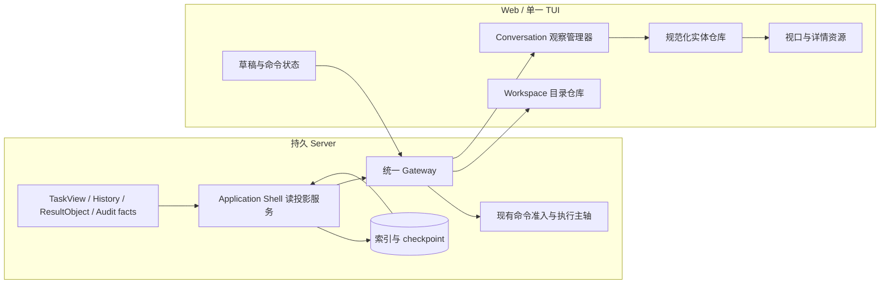
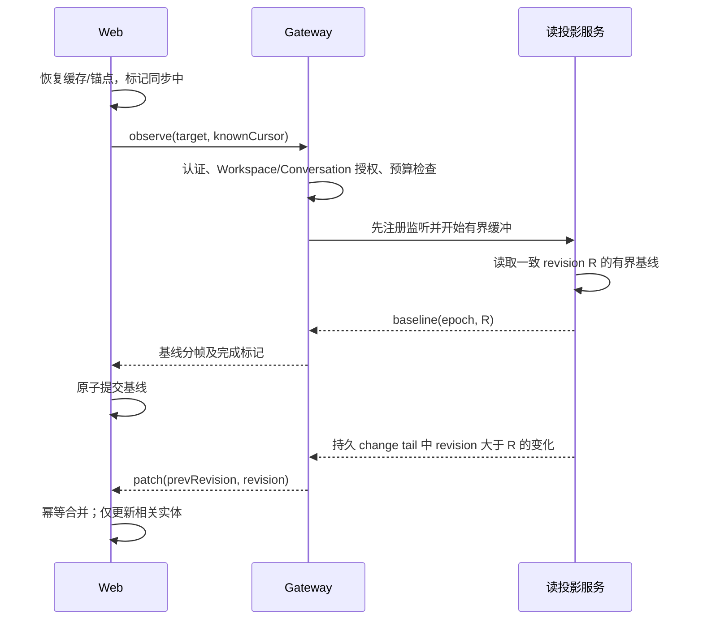
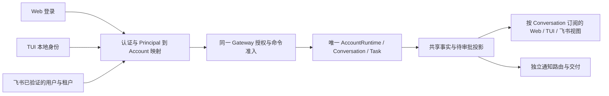

# MetaWork 前端观察架构全盘升级方案

- 方案日期：2026-10-02。
- 状态：**本地代码已实施并通过自动化验证，待用户验收**。ADR-0043 已接受；正式上线门尚未全部通过，证据与限制见[实施记录](2026-10-02-frontend-observation-implementation.md)。
- 修订：2026-10-02 按用户要求补充 DeepSeek 式同账户多端同权。原稿“非来源端只读、保留来源端专属审批”的限制已撤回；详细契约见 §12。
- 展示约束修订（2026-10-03）：按用户反馈保留原对话页面、执行状态卡片、报告与费用卡片；架构优化不得增加默认活动条、搜索行或“阅读全文”按钮。以下相关条款已按此修订。
- 关联决策：[ADR-0043](../adr/0043-explicit-conversation-observation-and-client-read-models.md)。
- 设计范围：Web 的导航、历史、并行任务、结果、轨迹、草稿、预览与渲染；Web/单一 TUI/Feishu 的统一查看、实时订阅、发送、停止、审批、通知及其 Gateway 读写契约。
- 本地实施日期：**2026-10-03**；实际行为、预算及验证见实施记录。设计提交 `7a6a71c` 已推送；实施未提交、未推送，收尾 commit 待用户验证后明确通知。
- 证据基线：2026-10-02 当前工作树；DeepSeek Harness 固定源码 commit `639ed015397290b3745d163aafe02ffee4aa3f84`。外部源码机制分析不是实机性能测量。

## 1. 决策摘要

建议把当前围绕“一个活动会话、一份大 record、一个 liveTurn”的 Web，升级为**围绕 Conversation 的独立观察资源、按实体维护的客户端状态和有界增量读模型**。

**同一 Server、同一 Account 下，Web、TUI、Feishu 是同一个操作者使用任务的不同入口。任意端发起的任务，都可在其他端查看实时进度、继续发送、停止和审批。无需先申请接管，不按来源端设置只读角色。** 身份与资源归属检查继续存在，但不得以端类型或任务来源制造权限差异。

用户切换的是观看对象。执行由 Server 持续拥有；恢复页面不应重走任务执行、Planner 激活或完整事件重放。架构上拆开四条链路：

1. **目录和活动摘要**：持续知道当前 Workspace 哪些会话在执行、排队、等待用户或刚完成。
2. **显式会话观察**：打开指定 Conversation，先得到近期历史和当前所有活动任务的基线，再接收安全增量。
3. **统一操作与定向通知**：发送、停止、审批经同一 Gateway 准入，目标身份明确；origin 仅记录来源、提供默认回复位置，不控制操作权限或观察资格。
4. **按需详情**：完整正文、轨迹、产物、账单、图结构按资源分页读取，不阻塞主视图。

对用户的直接变化：热切换立即恢复原位置；冷切换先显示可读的近期记录；任何正在执行的任务都能重新打开查看当前进度；离开页面不停止任务；旧任务的新进度不会挤掉正在写的草稿或当前阅读位置。

例如：飞书发起 A → Web 打开 A 看实时输出 → TUI 批准 A 的待授权操作 → Web 停止 A，三端显示同一结果；Web 发起 B → 飞书选择并跟踪 B → 飞书继续提问或停止 B，同样成立。

本方案包含后端读链路调整，因为纯 React 优化无法消除服务端全量折叠。保留现有 React/Vite、统一 Gateway、AccountRuntime、TaskView 和执行主轴，不引入第二套调度器，也不移植 DeepSeek 的整个平台。

## 2. 当前切换为什么慢，是否发生“任务回放重绘”

### 2.1 代码事实与安装状态

当前工作树已有 [导航与结果交付改进](2026-10-02-web-navigation-and-result-delivery-ux-design.md)：缓存优先、浏览读取与激活并行、结果交付状态分离。它是本方案的起点，不重复作为待开发功能。

必须区分三个版本：原有提交版本、当前未提交工作树、用户正在运行的安装版本。本次没有核验安装版本或进行现场性能采样，因此不能断言用户已体验到这些改动，也不能给出毫秒级瓶颈占比。

### 2.2 等待链路

| 层次 | 当前证据 | 对用户的影响 |
| --- | --- | --- |
| 导航 | 原有切换先清 record、等待 activate/attach 再加载；工作树 `handleSelectSession` 已缓存优先并行浏览 | 已改善热切换，但缓存 miss 与后台 attach 成本仍存在 |
| 执行侧绑定 | `ConversationGatewayRuntime` 的 attach 可激活账户并打开 Conversation session | 浏览被执行侧生命周期牵连 |
| 历史恢复 | `WebGatewayAdapter.history()` 调用 `journal.replay(account, conversation, 0)` | 历史越长，扫描/解析和折叠工作越多 |
| attach 组装 | `WebGatewayClientSession.attachOnce()` 逐项 `consume(event, true)` | 对保留事件做恢复投影，部分事件触发轨迹、产物、计费相关工作 |
| record 查询 | `enrichRecord()` 已采用批量查询，但仍组织大对象；`projectRecord()` 再构造返回值 | 请求开销不只取决于可见内容；browse 后 active 读取也可能重复 |
| 前端状态 | 根组件持有单个 liveTurn、selectedRecord 和广泛共享状态 | 切换/流更新容易使过大的组件范围重新计算 |
| 页面渲染 | `ConversationView` 映射已加载 Turn，无正文虚拟化；切换卸载旧内容 | 新视图重新挂载、布局，Markdown 与产物识别可能重新计算 |
| 滚动 | 会话视图和详情视图存在跟随末尾逻辑 | 阅读位置易丢失，长列表和频繁更新更明显 |

**准确回答“回放是否重绘”：服务端确实存在历史事件回放与状态折叠；前端也确实会更新/重新挂载会话内容。但不能说每条历史事件都会让浏览器重绘一次，更不表示任务重新执行。** 正常 attach 中 replay 主要在服务端累积和投影；WebSocket 初始化还存在 replay 输出路径。React 重渲染、组件重新挂载和浏览器实际绘制也不是同一件事。

`MarkdownContent` 已有按内容值的 `useMemo`，不应误诊为每次父组件更新都重新解析相同 Markdown。需要解决的是卸载后重挂载、变化范围过大、巨大正文和布局成本。

若 N 为保留事件数、P 为首页 Turn 数、D 为可见正文量，当前切换路径仍可能包含近似 `O(N)` 的扫描/折叠，以及历史事件触发的附加查询。目标是把正常打开压到 `O(log N + P + D)` 的索引读取与可见渲染；这里是设计复杂度目标，不是已测量的复杂度证明。

### 2.3 已有基础值得保留

- Workspace/Conversation 目录已有索引和活动投影，不重新从全部会话日志扫描建目录。
- 历史已有稳定插入序列分页、默认 10 条和上限 50 条；问题在于 Turn 仍是可能很大的 `body_json`，`maxBytes` 是软限制且允许首条超大对象。
- 分段日志已有有界 resume/reset 能力；但 history 的全量 replay、`readTracePage` 的扫描后切片，不能因为接口叫“分页”就视为底层 I/O 已有界。
- 现有 snapshot 有字节限制，但选取最新 Turn；较老 Turn 所属 Task 仍在执行时，不能用它替代完整活动任务基线。
- ResultObject、分块输出、UTF-8 offset/hash/完整性检查、任务关联、TaskView 已存在，继续复用。
- ADR-0037 已支持跨 Conversation 并行。同 Conversation 的顶层 Task 按执行槽排队；UI 不得暗示同会话任意多个顶层 Task 同时执行。

## 3. DeepSeek 的机制与 MetaWork 的取舍

参考固定 commit 的源码，而非仅根据界面观感推断。完整链接见第 19 节。

| DeepSeek Harness 机制 | 源码证据 | MetaWork 决策 |
| --- | --- | --- |
| 全局状态和活动摘要，与指定 Session 的 follow 分开 | `session.control`、status/activity 与 `history.follow` | 使用 Workspace 摘要 + Conversation 显式观察 |
| retain 新主视图后同步更新 selection，再 release 旧引用，不 await ready | `navigation.ts` 的 `replaceMain` | 焦点切换立即完成，读取和订阅在后续推进 |
| Client Session 和流由引用计数管理 | sessions `service.ts` 的 retain/release | 参考资源生命周期；MetaWork 再加内存预算和有限 LRU |
| 先监听，后取基线，期间缓冲，再接增量 | `history.ts` 的 follow | 引入一致 revision、基线和增量握手 |
| 正在生成的 assistant 有当前累积基线 | assistant stream snapshot | 需要“当前安全输出基线”，不能仅等待下一条输出 |
| 页面按稳定节点订阅，增量批处理，保留语义滚动锚点 | ChatView/useChatViewport | 实体级订阅、帧内合并、阅读锚点 |
| 最近消息窗口和向前分页 | history pagination | 使用条数 + 硬字节预算 + 独立正文引用 |
| 未读完成提示 | ui-session client | 做受权限约束的任务完成摘要和本地已读游标 |
| 同 Host 的认证请求代表同一 operator | connection `OperatorPeer` 与认证说明 | 复用 MetaWork Principal→Account 映射，所有端同权，connection/origin 不拥有 Task |
| follow 与 prompt/cancel 按 Session 定位 | `history.ts`、`commands.ts` | 订阅不按发起端过滤；任何端的命令按确切 Conversation/Task 路由 |

需要纠正四个容易过度借鉴的理解：

1. DeepSeek 的 retain 是客户端 Session/数据/流的引用管理，最后引用释放后可销毁客户端实例；不是所有历史页面 DOM 常驻，也不是释放 Host 执行任务。
2. 它的聊天正文仍完整挂载已加载窗口，虚拟化主要用于 Turn rail。本文提出的正文虚拟化是 MetaWork 自己为长历史增加的机制。
3. 其初始窗口以 user/assistant 消息和 Turn 数组织，不足以证明首屏字节、工具事件数和冷 I/O 有硬上限；MetaWork 必须补齐这些约束。
4. DeepSeek 的原始 assistant frame 不能直接映射为 MetaWork 的 Planner/Executor 原始推理、token 或工具输出。这里仅观察现有允许公开的进度、结果和安全轨迹。

DeepSeek 的长会话 benchmark 文档可借鉴测量方式；本文没有运行它的环境，不把仓库中的目标数字当成实测表现。

DeepSeek 的多端证据与 MetaWork 扩展见 §12.1。尤其不能将其同 Host 多客户端误写成不同安装自动云同步，也不能声称它已有本文提出的持久化多端审批仲裁和飞书适配。

## 4. 用户界面与交互结构

### 4.1 页面布局

```text
┌ Workspace / 搜索 / 连接状态 ───────────────────────────────────┐
│ 会话目录        │ Conversation 标题 / 原有 tab     │
│ 运行中 3        │─────────────────────────────────────────────│
│ 等待用户 1      │ 历史消息与结果正文           │ 按需详情面板  │
│ 最近会话        │ Turn A：完整结果 / 报告 / 费用       │ 轨迹 / 图     │
│ · 摘要与未读点  │ Turn B：计划/任务状态        │ 产物 / 账单   │
│ · 排队/执行     │ 当前阅读位置保持            │ 文档预览      │
│                 │─────────────────────────────────────────────│
│                 │ 当前 Conversation 草稿 / 附件 / 发送        │
└───────────────────────────────────────────────────────────────┘
```

默认一块主会话视图，避免第一阶段引入多个同时完整渲染的聊天面板。Store 与观察引用支持未来双栏，但不把双栏作为本次必需 UI。多个任务切换是目录和活动任务列表的正常操作，不是“恢复运行任务”。

### 4.2 导航与活动任务

- Workspace 是一级权限与组织范围；切换 Workspace 立即恢复其目录缓存，并释放不再允许的详情订阅。
- 左栏保留稳定会话顺序；状态变化更新 badge，不在鼠标点击过程中频繁重排。单独的“运行中/等待用户”筛选承载活动视图。
- 同一 Conversation 卡片可以显示“1 执行、2 排队”；具体阶段来自服务器 TaskView，不由前端猜测。
- 主区域保留原有 Conversation 页面，不增加活动任务条；实时执行状态显示在所属 Turn 的原有信息卡片中，不能只给最后一个 Turn 接入更新。点子任务打开原有详情抽屉，不改变发送目标。
- 完成提示以 Task/Turn 的终态 revision 去重。看到目录不自动清除正文未读；主视图可见且相应状态已呈现后推进本地已读游标。
- 深链接至少支持 Workspace、Conversation 和可选 Turn/Task/Artifact 身份。浏览器后退/前进恢复目标及锚点，不发送命令。
- 跨设备已读同步不纳入首版；若后续需要，单独设计账户级 read cursor，不伪装成业务事件。

### 4.3 切换状态必须真实

| 情况 | 页面表现 |
| --- | --- |
| 有缓存、数据可能陈旧 | 立即显示内容与阅读位置，轻量提示“正在同步” |
| 无缓存 | 标题和骨架先显示；近期摘要一到即可阅读 |
| 冷首次迁移/投影重建 | 显示“正在准备历史”及可用摘要，不在请求里无限等待 |
| 已确认空会话 | 显示新会话引导；加载中不能伪装为空会话 |
| 有缓存但网络断开 | 内容继续可读，标明离线/最后同步时间，发送门禁单独处理 |
| 读取失败 | 局部重试，不清空有效历史 |
| 权限撤销/退出登录 | 立即清除对应缓存、正文、草稿资源和订阅，不继续展示旧数据 |
| 会话已删除或无法访问 | 移除可操作目标，显示明确结果，不回落到另一个会话执行 |

### 4.4 输入、停止与权限

草稿、附件、上传状态、光标和 IME composition 按 Conversation 保存。切换不丢草稿、不将 A 的上传附到 B。附件异步完成时按创建时的目标写回；上传取消、失败重试仍只操作该资源。

点击发送时捕获 `workspaceId/conversationId/requestId/idempotencyKey` 和当前草稿版本，之后任何导航都不改变该命令。收到回执只更新对应 pending command；不因当前选中 B 就把 A 的回执写进 B。

Composer 的停止按钮继续取消它所表示的确切当前 Turn（ADR-0040）。较旧 Turn 的后台/排队 Task 使用 §12.5 的显式 `cancel_task`，不受“当前 Turn 已变”的限制。两类操作都可从任意端发起，明确显示目标；过期目标返回已终止/冲突，不顺延取消后来任务或新执行代际。

观察接口没有副作用，控制接口会产生操作；这是调用职责的划分，不是权限角色的划分。同账户的 Web/TUI/Feishu 均可打开完整必要审批详情并批准/拒绝，不依赖 origin，不需要接管。所有端使用共同授权和业务前置条件，审批竞态由服务端解决，不能用只读限制避开多端冲突。

## 5. 总体架构与模块责任



| 模块 | 拥有的职责 | 边界 |
| --- | --- | --- |
| Task/Kernel/Execution | 原有生命周期、调度、事实、执行与恢复 | 不感知浏览器选中了谁 |
| `src/session/` 应用读服务 | 读模型 port、投影组装、源 checkpoint 协调 | 不创建新的任务状态机 |
| `src/storage/` | 索引、读模型事务、重建进度、查询实现 | 不持有 UI 或调度策略 |
| `src/gateway/` | 同账户统一授权、目标/命令准入、观察、连接配额、reset/backpressure | 不将 origin/transport 作为业务角色；经应用 port 访问事实 |
| `src/management/` | HTTP/WS 的 Web 适配和静态资源 | 不再承担完整历史折叠与第二份会话业务状态 |
| `web/src/state/`（拟建） | 客户端实体、资源引用、草稿、视口与网络状态 | 不从 trace 自行推断 Task 阶段 |
| `web/src/components/` | 展示、可访问性、用户交互 | 不订阅原始全局事件并修改业务实体 |
| Account permission service / KernelWorkflow | 审批请求查询、决定准入、持久仲裁与原授权流程 | 无端专属审批者；读投影不成为审批权威 |
| Notification/Delivery + Feishu adapter | 目的地/跟踪关系、卡片、回调身份、每目的地交付 | 订阅/通知不改变任务 owner；不建立飞书专用执行链 |
| 单一 MetaWork TUI | 同一观察与控制契约、终端分页与展示 | 不引入第二 TUI 或嵌入服务端执行对象 |

Server 的只读数据服务必须可以在未打开 Planner/Conversation 执行 session 时提供数据。AccountRuntime 已存在时复用其公开读 port；未激活执行环境时，通过 Server composition 装配同一账户数据访问 port。不能为观察再创建第二套恢复循环或 AccountRuntime。

## 6. 客户端状态模型：从大 record 到独立实体

### 6.1 仓库划分

| 仓库 | 主键/内容 | 更新频率 |
| --- | --- | --- |
| DirectoryStore | 身份范围 + Workspace；Conversation 摘要、分页、活动索引 | 低频、可合并 |
| ConversationStore | Conversation 元信息、历史页 ID、观察 revision/freshness | 增量 |
| TurnStore | Conversation + Turn；Query、内容块引用、Task 关联 | 按 Turn |
| TaskStore | Task；直接消费 TaskView，Subtask/Attempt 独立索引 | 按任务变化 |
| ResultStore | Result 身份 + 内容版本/hash；预览、范围、完整性 | 按输出块/验证 |
| DetailResourceStore | 轨迹、图、artifact、billing 的参数化资源 key | 打开时加载 |
| ComposerStore | Conversation 草稿、附件、提交中的本地回显 | 用户操作 |
| ViewStateStore | Conversation/面板；阅读锚点、展开状态、尾随状态 | 本地 |
| CommandStore | requestId；不可变目标、receipt、uncertain 状态 | 命令回执 |
| InteractionStore | permission requestId + revision；待审批详情/处理状态与操作 affordance | 服务端事实更新；本地提交状态独立 |

所有资源 key 前缀都包含认证主体/账户和权限世代；再加 Workspace/Conversation 身份。仅以 `sessionId` 建全局缓存不足以避免登录切换后的数据串用。

同一 Turn 可关联多个业务实体；一个 Conversation 可同时存在旧 Turn 的活动 Task、新 Turn 的 Planner 处理或排队 Task。不要将这些压成一个 `liveTurn`。Task/Subtask/Attempt 关系直接使用服务端权威关联，无法确切绑定时显示关联未知，不能回退挂到“最新 Turn”。

### 6.2 实现选择

采用 React `useSyncExternalStore` 的小型外部仓库与 selector，更新保持结构共享，组件按 ID 订阅。先不引入 Redux/Zustand 等全套状态框架；重点在协议和更新粒度。如 selector 实现复杂度超出合理范围，可选成熟的 selector 适配包，但须避免第二份实体数据。

根 `App` 只组装身份、Workspace、路由和布局。设置页、Provider 探测、连接提示的变化不能触发整个 transcript 的对象重建。`turns.map(projectTurnForPresentation)` 移到按 Turn revision 缓存的 selector；只变一个 Task 时，不重新投影所有历史 Turn。

### 6.3 三种身份不得混用

```ts
// 设计草图，非当前已有协议。
type FocusTarget = { workspaceId: string; conversationId: string };
type ObservationIdentity = {
  observationId: string;
  conversationId: string;
  epoch: string;
  revision: number;
};
type CommandTarget = {
  workspaceId: string;
  conversationId: string;
  requestId: string;
  turnId?: string;
};
```

focus 表示用户看哪里；observation 表示哪个资源的授权数据流；command target 表示一次操作作用于谁。它们可以相关，但不能共享一个可变全局 `activeSessionId` 作为后续异步回调的寻址依据。

### 6.4 竞态与本地回显

每次页面选择递增 navigation generation。请求结果只写入自己完整 scope 的缓存；只有目标与 generation 仍匹配时才改变可见焦点。数据较旧的响应不能覆盖较新的 entity revision；旧请求报错也不能清空新页面。

同 key 请求 single-flight；失去需求的读取可 abort。HTTP abort 不代表撤销服务端命令；发送过的命令必须等待或查询 receipt，不能因切换而重发。若连接断开后提交状态不确定，显示“确认发送状态中”，按 request/idempotency key 查询，不自动创建新的 Query。

本地回显通过 requestId 关联 durable Turn，并原位替换，不能出现一份 optimistic 消息加一份历史消息。回显只表达提交状态，不能提前伪造 Task admitted 或结果完成。

## 7. 服务端读模型与存储

### 7.1 首屏读取对象

Conversation 首页基线包含：元信息、近期 Turn 摘要与正文引用、当前 Task 摘要、安全输出预览、待审批索引/操作状态、分页游标和 freshness。它不包含所有历史 trace、账单明细、所有产物内容或完整 Work Graph。待审批详情可从任何端按需读取，分页不表示无权处理。

所有仍有用户可见活动的 Task 必须进入活动索引：排队、执行、重试、等待计划/用户、发布、恢复/阻塞等由 TaskView 定义的阶段。不能只查最新 Turn，也不能由“最后收到哪条 trace”猜活动集合。数量超预算时首屏携带总数和下一页 cursor，页面明确显示还有未加载任务。

以下表名是设计名，实施时按现有 Repository 命名约定落地，不是创建第二份业务权威：

| 读模型 | 关键索引 | 用途 |
| --- | --- | --- |
| `conversation_view_heads` | account + conversation | epoch、revision、source checkpoints、投影版本 |
| `conversation_turn_summaries` | conversation + stable turn sequence；turnId 唯一 | 有界近期摘要与历史分页 |
| `conversation_task_cards` | conversation + taskId；活动阶段索引 | 覆盖旧 Turn 的当前活动任务 |
| `conversation_view_changes` | conversation + epoch + revision | 短期可恢复的增量 tail |
| 正文引用索引 | owner + content revision/hash | 大文本分块读取；复用已有不可变结果存储 |
| 轨迹定位索引 | conversation + turn/task + sequence | 直接定位分段和偏移，避免全段扫描后切片 |

可以扩展既有历史表而非机械新建所有表，但必须拆开热摘要与大 `body_json`。读取一行摘要不得先反序列化整轮所有轨迹。跨文件正文引用必须包含完整性、访问范围与生命周期，不向客户端暴露任意文件路径。

### 7.2 一致性：一个投影提交，不是一个假全局游标

源事实来自 SQLite、分段 journal、结果对象及现有应用事实。它们不天然处于同一事务。采用以下明确契约：

1. 各源拥有可恢复的 checkpoint/变更发现机制。已有 durable event/outbox 可覆盖的沿用；缺少覆盖的源补充事务内变更标记或 outbox，不只监听进程内 callback。
2. 应用投影服务按 Conversation 串行应用源变化，调用既有纯 TaskView 和其他权威查询构建安全投影。
3. 在**读模型自己的单个事务**中提交实体更新、head revision、change batch、source checkpoints。相同源事实重复应用幂等。
4. 事务提交后才对观察者发布。崩溃在提交前会重试，崩溃在提交后可从持久 change tail 补发。
5. 跨源依赖尚未满足时保留 pending 状态；例如收到结果可用事实但对象未可读时标明同步中，不产生“结果已验证可用”。
6. 客户端 revision 只证明读投影内部一致，不证明所有底层源已追到此刻。source lag/freshness 单独表达；不可读取几份不同时间数据后标一个“最新 journal seq”冒充原子快照。

投影重建使用新 epoch，在后台构建 staging 版本，达到一致可服务点后原子切换 head。旧版本继续可读且标明陈旧；首次无任何版本时返回 preparing + 可用目录摘要。正常打开请求不负责全量迁移。

摘要和会话详情可以短暂处于不同 revision，界面用同步状态承认差异；禁止为了强一致首屏阻塞到所有后台投影追平。权限变化例外：必须同步拒绝/撤销，不允许“最终一致地”继续泄露数据。

### 7.3 数据源清单和完备性门槛

P1 实施前枚举并覆盖：Query/Turn 创建和终止、Turn→Task 绑定、TaskView 变化、重试 Attempt、计划等待/恢复、ResultObject 与交付状态、产物发布/撤销、Query 账单修订、待审批请求/决定/应用结果、Conversation 删除及权限变化。每种源都记录 producer、durable source、checkpoint 和重建方法。

仅覆盖 UI 当前可见事件不足以交付。特别要测试无连接时任务完成、Server 重启后恢复、来源连接消失、Query 没有 Task 但产生费用等情况。账单继续以 Query 为归集根，不因视图按 Task 展示就丢掉无 Task 的费用。

### 7.4 历史与详情分页

历史按现有稳定 Turn 插入序列分页，页内按时间顺序展示。cursor 至少约束 scope、投影 epoch、边界序列和过滤条件；服务端校验，不接受客户端任意跨 Workspace 使用。

新 Turn 追加不改变旧页边界；已存在 Turn 的内容变化经 entity revision 更新。分页请求结束时若实体比本地旧，只合并页 ID 与有效新实体。删除产生 tombstone；过期 cursor 返回明确 reset 或重新定位，不静默跳页。

正文、trace、artifact 列表、billing 明细、图结构各有独立 cursor/version。基线可先显示预览，但已挂载消息自动读取全部正文，沿用原 Markdown 展示，不要求点击展开、阅读全文或逐段翻页。执行卡片、产物和费用摘要自动独立补齐；详情抽屉仍按需读取。历史全文索引保留为读能力，不在对话页新增搜索行；原生浏览器查找只覆盖挂载窗口。

## 8. 观察协议：基线、增量、断线与背压

### 8.1 版本与消息家族

通过现有 Gateway v2 capability 机制增加 `conversation_observation_v1`、`conversation_history_v1`、`conversation_detail_v1` 和 `workspace_activity_v1`。这些是**拟议能力名**，必须在协议 owner 定义，并同步 TUI 镜像。

短查询走已有只读命令分支；长观察是连接级资源。Web HTTP 可作为分页/正文的传输适配，但调用同一应用读 port、同一授权规则，不能建立另一条绕过 Gateway 权威的业务路径。保留一条客户端 WebSocket，按 observationId 多路复用。

| 请求/消息草案 | 含义 |
| --- | --- |
| `observe_workspace` / `workspace_baseline` / `workspace_patch` | 当前授权 Workspace 的有界摘要 |
| `observe_conversation` | 目标、已有 epoch/revision、客户端需求窗口、请求 ID |
| `conversation_baseline` | 一致 revision 的元信息、近期 Turn、活动 Task 和安全结果基线 |
| `conversation_patch` | observationId、scope、epoch、prevRevision、revision、实体变化 |
| `observation_reset` | cursor 过期、epoch 变化、缺口或预算超限，需要新基线 |
| `observation_revoked` | 权限/目标失效，必须清理资源 |
| `release_observation` | 释放资源，幂等；不停止任务 |
| `get_history_page` / `get_detail_page` / `get_content_range` | 有界按需查询 |

命令 envelope、连接级 receipt、共享事实与通知消息维持独立类型。origin 不再过滤共享内容。客户端 reducer 不接收缺失目标的业务更新；每个更新可解析到 account/workspace/conversation 和相应实体。§12 定义控制与审批的配套能力。

### 8.2 无缺口握手



订阅回调只是唤醒提示，持久 tail 才是补齐依据。baseline 之前缓冲的重复变化按 revision 丢弃；snapshot 取数和输出流基线必须来自相同投影版本。断线带旧 cursor 请求时，若 tail 覆盖则补差；否则明确 reset 获取新基线。

patch 的 `prevRevision` 必须等于客户端当前 revision，重复已应用 batch 可忽略；不满足则不盲目继续拼接。底层 audit seq 可能因过滤而跳跃，不能拿它检测投影缺口。服务端可合并一段 revision 的实体替换，但 batch 必须明确起止 revision；不允许省略不可恢复的语义变化。

大基线不能破坏既有单事件大小约束：使用有界 start/chunk/end 传输和 baselineId、总字节数、完整性元信息；客户端临时缓冲完整且通过验证后一次提交。整体预算仍是硬上限，不能借分帧无限传输。分帧失败保留旧缓存并重试，不展示半套相互矛盾的任务状态。

### 8.3 正在输出的任务

基线必须包含已公开的安全输出预览，以及输出身份、stream generation、覆盖的 UTF-8 字节范围、已持久化范围和已知完整性状态。切换到正在输出的任务时立刻看见此前输出，而不是空等下一次 chunk。

投影 revision 和正文 stream offset 是两套坐标。客户端按结果身份/generation/offset 去重，检测缺失区间并做有界范围读取；不能简单字符串追加。旧 Attempt 的晚到输出不能覆盖新 Attempt 或新 Result。

若输出已经超出预览预算，基线只携带尾部或指定范围及 omission 标志，通过按需正文恢复其他部分。截断预览不参与“全结果 hash 校验通过”的判断；只有完整 ResultObject 才能标记内容完整。业务完成认证、artifact 发布和消息交付就绪继续分开。

某个端看到结果不等于某个飞书通知目的地已经送达；浏览器接收确认只推进观察流量控制。外部通知送达按每个 route 记录，不形成来源端专属的结果可读权。

### 8.4 背压与资源预算

以下保留设计时的候选预算。2026-10-03 冻结的实际参数见[实施记录](2026-10-02-frontend-observation-implementation.md)，包括 12 个 warm Conversation/500 个 Turn、正文范围、图片/草稿独立限额及 512 KiB 服务端 socket 背压。无论具体数值如何，**必须存在硬上限和溢出语义**。

| 资源 | 初始建议 | 达到上限时 |
| --- | --- | --- |
| 首页基线 | 20 个近期 Turn 摘要、256 KiB 总 payload | 截断正文为引用、分页其余实体 |
| 活动任务首批 | 32 个摘要，计入基线预算 | 返回数量和 continuation |
| 待审批首批 | 20 个请求摘要，计入基线预算 | 明示 pending 总数，详情/其余待办有界分页 |
| 单条 wire frame | 不高于现有 64 KiB 契约 | 有界分帧；不放宽旧边界 |
| 单观察待发送缓冲 | 512 KiB，计入连接总额 | 暂停该观察增量，发送一次 reset |
| 单连接所有观察待发数据 | 2 MiB | 停止接纳低优先资源；排空或关闭失速连接 |
| change tail 保留 | 同时按年龄与字节设限，初值 10 分钟/每会话 4 MiB | 旧 cursor reset；活跃会话总额还受账户预算约束 |
| 自动详情观察 | 主会话 + 显式固定详情最多 2 个 | 其余只收 Workspace 摘要 |

全账户 change tail 预算建议初值 128 MiB，按保留策略回收，不能每会话 4 MiB 乘无限会话。服务端还需配置连接数、每主体并发观察数、查询并发和突发速率；饱和返回可重试状态，不触发无界后台工作。

控制响应、撤销、权限和终态提示优先排队；TCP 已排出的数据无法被抢占，因此限制批量正文入队大小，正文大读取优先走有界 HTTP 请求或受 credit 控制的流。状态实体可按最终 revision 合并；结果字节不能随意丢弃，改发正文可用范围后由客户端补取；权威 durable events 永远不在此处合并或删除。

reset 必须有抖动/退避与频率限制。服务端在客户端确认或重新 observe 前暂停该旧流，不让慢客户端陷入 reset 风暴。连续落后时保留可读快照并降低详情订阅频率，而不是拖慢任务执行。

### 8.5 观察窗口与实体变更契约

一次 follow 不应把未来所有历史正文不断塞进缓存。观察覆盖三个有界集合：最近历史窗口、活动任务摘要窗口、用户显式加载并仍保留的详情资源。客户端通过明确的窗口更新告诉服务端需要哪些额外 Turn/Task；目标仍需授权且受数量预算限制。

- `upsert`：带实体身份与 entity revision 的完整轻量替换，适合 TaskView/摘要；字段省略必须有固定语义，不能既表示未改变又表示删除。
- `remove`：带实体 revision 的 tombstone；既清理实体，也维护索引关系。
- `invalidate`：窗口外历史正文或详情变更，只通知对应资源版本过期；不携带巨大对象，之后按需读取。
- `membership`：近期 Turn 和活动 Task 集合变化；新增/终止不靠客户端猜测索引。任务终止时先应用终态实体，再移出活动集合，仍保留其历史归属。
- `advance`：过滤后没有该观察所需实体变化时仍可推进已覆盖 revision 范围，避免客户端把合法过滤理解为缺口。

每个 patch batch 原子应用实体和集合变更，之后才通知 React selectors。Workspace 目录有自己独立的 epoch/revision，不与 Conversation revision 混用；详情资源有自己的内容版本。不建立账户下全部资源共用的伪全局递增序列。

历史页请求在某个 revision 读取，并返回这个版本及各实体版本。分页与跟随同时发生时，客户端以较新的实体版本为准；更新视口所需的集合关系也必须一起合并。观察窗口变化返回带边界 revision 的资源基线，不能先推增量再异步补无版本旧内容。

### 8.6 应用 port 草图

以下签名用于固定依赖边界，具体类型归 Application Shell/Gateway owner；不直接暴露 SQL、journal 文件或执行 session。

```ts
interface ConversationReadPort {
  readBaseline(scope: AuthorizedReadScope, budget: ReadBudget): Promise<Baseline>;
  readChanges(scope: AuthorizedReadScope, cursor: ViewCursor, budget: ReadBudget): Promise<ChangePage>;
  readHistory(scope: AuthorizedReadScope, request: HistoryRequest): Promise<HistoryPage>;
  readDetail(scope: AuthorizedReadScope, request: DetailRequest): Promise<DetailPage>;
}

interface ConversationObservationPort {
  // 由服务端认证/授权构造 scope，不能直接接收客户端声称的权限。
  open(scope: AuthorizedReadScope, request: ObserveRequest): Promise<ObservationHandle>;
  // handle 内含带预算的数据流与幂等 release；没有 execute/abort 方法。
}
```

观察服务只负责读一致性和资源生命周期。`AuthorizedReadScope` 必须绑定连接权限世代并可撤销；获取一次 scope 不能永久跳过权限检查。存储实现通过 composition 注入，Web/TUI 只使用序列化 DTO。

## 9. 缓存、引用生命周期与快速切换

### 9.1 生命周期

```text
unopened -> loading -> following -> warm -> evicted
                \-> failed/stale -> revalidate -> following
following -- release --> warm（关闭详情流，保留有界数据）
任意状态 -- logout/revocation --> purged
```

这里的 following 是**客户端观察状态**，与 Task executing 无关。Workspace 摘要继续更新未打开会话的活动 badge；不要求所有执行中的会话一直保留详细订阅。

观察引用来源包括主面板、明确固定的详情、正在验证的局部结果读取。最后引用释放后关闭流，可给 1–2 秒可取消的导航宽限避免 A/B 快切频繁握手。此宽限是资源优化，不推迟用户焦点切换。

热切换顺序：保存 A 锚点与草稿 → 选中 B → 同步显示 B 缓存 → retain/observe B → release A 的视图引用 → revision 校验与局部补齐。前端不 await B ready 才改变主视图。

### 9.2 内存策略

- 初始建议客户端业务缓存总额 48 MiB、最多 8 个 warm Conversation，双阈值 LRU；正文解析和图片另设更小的子预算并计入可观测总内存。
- 当前视口、正在使用的附件和待确认命令不可直接丢弃；pin 只锁定最小必要资源，不能锁住整个会话的所有历史。
- 超预算先逐出旧正文/解析结果、未打开详情和历史页，再逐出 warm 会话实体。即使用户固定资源很多，也必须限制大正文和图片解码，不能以 pinned 为由无限增长。
- request 记录和草稿也有大小/数量限制，失败时明确提示或提供导出，不静默丢用户输入。
- 默认内存缓存；如需刷新保留草稿，可在身份隔离、过期清理和退出清除明确后使用 IndexedDB。首版不把完整 transcript、轨迹和敏感权限默认永久保存在浏览器。
- 静态 asset 用正常 HTTP 缓存；授权内容不能以公开 immutable URL 绕过认证。不可变 hash 只免重复内容计算，不免再次授权。

warm 缓存保留最后 epoch/revision，不宣称持续最新。重新打开时收到有效补差或基线才转 fresh。跨 Workspace 只有仍被授权且策略允许的缓存可以保留；失去授权立即 purge。

## 10. 渲染与阅读性能

### 10.1 有界 DOM

按 Turn/内容块构建可变高度虚拟列表，首版优先采用成熟的 React 虚拟化组件（例如评估 `@tanstack/react-virtual`），避免从零实现全部测量、锚点和 ResizeObserver 边界。依赖最终选型由 P0 的长 Markdown、图片和流式输出原型验证决定。

按用户确认的展示约束，正文分块仅是传输细节：已挂载 Turn 自动恢复全文，沿用原 Markdown 组件。Turn 挂载数量、单次传输与热缓存继续有界，但当前不宣称单条超长正文的 DOM/解析内存具有固定上限。未来若增加 Markdown 块虚拟化，必须保持连续阅读、原有卡片与交互，不以手动展开或逐段翻页替代。

可见窗口加有限 overscan。输入焦点、文本选择、展开交互与辅助技术需要的临时 pin 有上限；保留语义节点 key。虚拟化不依赖数组下标、不回收正在输入的 Composer。

### 10.2 Markdown 与增量更新

- 已完成不可变内容按 content hash + renderer version + theme-relevant options 缓存解析结果。
- DOMPurify/链接及 artifact 授权规则保留，缓存不能跳过清洗；服务端提供 HTML 时也不能直接信任。
- 流式内容分为已稳定块与末尾变化块，普通状态每动画帧最多合并提交一次，解析节流不阻塞原始数据入库。
- 不完整代码围栏、表格和列表会改变尾部语法；保留足够尾部重解析范围，输出结束做一次最终语法校正，不能把错误片段永久冻结。
- Worker 只在 profiling 确认主线程解析是瓶颈后用于纯解析/索引；需要 DOM 的清洗和布局仍在受控主线程边界处理。传输巨大字符串同样有成本。
- 产物提及识别按正文/产物索引 revision 缓存；详情抽屉不在每个 task tick 过滤完整 trace。

### 10.3 滚动、图片和可访问性

锚点记录为 `{turnId, blockId, offsetWithinBlock, followingTail}`，不只保存 scrollTop。加载更早页时根据原锚点补偿；图片解码、字体变化或块高度变化后继续保持阅读对象。

只有用户原本处于尾随状态才自动滚动。阅读旧内容时出现“有新进展”提示；后台任务完成不能强制跳到底部。切回正在执行的会话时恢复原阅读模式，而非总跟随最新结果。

图片/预览 lazy load 并释放离屏 object URL；大图有像素和解码预算。图表/DAG 仅打开时构建，节点多时降级摘要或局部图，不拖慢聊天首屏。

键盘导航、焦点返回、屏幕阅读器、减少动画和 IME 必须进入验收。保留历史分页、深链接定位和服务端全文索引能力；本次不新增对话页搜索行。原生浏览器查找只能覆盖已加载/挂载内容，不以性能优化要求用户手动展开消息正文。

## 11. 结果、进度、轨迹和费用展示

| 维度 | 权威来源 | 展示原则 |
| --- | --- | --- |
| Turn 状态 | 现有 Turn/Query 生命周期 | 发送、处理、终止/取消，不等同 Task 阶段 |
| Task 阶段 | `TaskView` | queued/executing/retrying/waiting_for_plan/waiting_for_user/publishing/recovery_required/blocked/completed/failed/cancelled |
| 数据新鲜度 | 观察 revision/source lag/网络 | 缓存、同步中、最新、离线、准备中 |
| 交付状态 | 既有 delivery 事实和结果组装 | 有输出、接收/校验中、完整、失败；保留工作树已有改进 |
| 完成认证 | Kernel/Result certification | 内容可读不意味着任务通过认证 |
| 产物可用性 | artifact/result owner | 区分已有文件、发布可用、撤销或不可访问 |
| 费用 | Query billing projection | 精确金额、coverage、暂估/最终；缺失不显示为 0 |
| 操作可用性 | Gateway 统一授权与业务前置条件 | 各端同权；任务/审批状态决定动作是否仍有效，不看 origin |

聊天主区域强调用户输入、可读结果、当前业务进度、需要用户处理的事项。详细安全轨迹、Work Graph、Attempt、账单明细放在明确按需面板。主卡片显示足以理解结果的执行摘要与费用摘要，不暴露内部实现名作为日常操作术语。

Subtask 重试时保留历次 Attempt，但新 Attempt 的输出与旧失败不混写。Task 阶段按更高 revision 接受权威变化，不能用一个前端硬编码的“状态数字只能增大”规则阻止合法的等待/恢复转换。终态迟到保护要基于身份与 revision/代际，而非抛弃所有后续交付事实。

后台结果完成后，先持久化权威结果/关联，再发布可恢复的读投影变化。`BackgroundResultDelivery` 的重复交付判断使用结果/目的地/交付身份索引，不再为查重回放全历史；来源降为审计与默认路由元信息，观察者共享结果，每个通知目的地独立交付。

## 12. 参考 DeepSeek 的完整多端设计

### 12.1 研究结论、当前证据和采用范围

本节按用户明确要求修订：**各端是同一账户的完整操作入口；其他端打开任务后可看、可继续、可停止、可审批。** “只读观察”仅是数据接口不产生操作，不是一个限制用户能力的角色。

| DeepSeek 固定源码事实 | MetaWork 采用方式 | 不能推导的结论 |
| --- | --- | --- |
| Connection 认证后所有请求代表同一个 operator Peer | 三端 Principal 通过既有 resolver 进入同一 Account，统一权利 | 不跳过 MetaWork 身份认证，也不将所有飞书用户自动归入该账户 |
| `session.follow` 按目标 Session ID 筛选，不按任务发起连接筛选 | 任何已授权端订阅相同 Conversation，收到同一安全事实投影 | 不把全部会话正文无差别广播到所有客户端 |
| `prompt/cancel` 按 Session 定位，没有 origin-only 判断 | 任意端调用同一命令入口；MetaWork 进一步使用精确 Turn/Task 目标 | 不复制 Session 级 cancel 去误停后来任务 |
| 一个 WebSocket 多路复用逻辑流，普通命令是独立 RPC | MetaWork 继续统一 Gateway，观察流与命令逻辑分离 | 不必复制 Cordis、Typert 或新增一个执行后台 |
| release 客户端引用不释放 Host Agent | 离开窗口不取消任务；无原连接时可重新操作 | Host 进程退出不等于任务还在内存执行，重启要走 MetaWork 持久恢复 |
| 审批走 Agent-scoped waterfall，由 answerer 处理 | 复用“人类交互由后台拥有”的边界，MetaWork 扩展为多端共享待办与持久仲裁 | 未证明 DeepSeek 已实现本文的 CAS、多端冲突及 crash 语义 |
| 桌面版复用 Web 但默认自启 Host | 多端共享的前提明确为同一 MetaWork Server/Account | 不宣称不同电脑的独立安装自动云同步 |

MetaWork 当前 `GatewaySubscriptions.publish()` 对详细事件要求来源 connection 匹配；这会阻碍异端实时查看。当前 `ClientGateway` 已按 Principal→Account 做共同准入，`AccountPermissionService` 已按 Conversation/request 查询审批，不能把展示/路由问题笼统描述为所有后端命令均有端专属 ACL。

实施时审计并消除 origin/active-connection 对**内容可见性和操作资格**的依赖，不只修改一条订阅 if。旧的跨端串消息问题通过实体身份、按需订阅、焦点隔离和独立通知路由解决。

### 12.2 身份、连接、焦点和通知目的地



| 身份/状态 | 用途 | 禁止用途 |
| --- | --- | --- |
| server/deployment identity + Account | 确认同一后台和数据范围 | 仅凭本地路径相同就假定属于同一活跃 Server |
| authenticated Principal | 识别当前操作者、撤销与审计；各端可映射为同一 Account | 将 browser/tui/feishu 类型当成只读/控制等级 |
| connectionId + generation | 回执、观察、网络生命周期 | 任务 owner、独占控制权、审批 owner |
| Conversation/Turn/Task/Attempt ID | 不可变业务归属和操作目标 | 用最近活跃连接/最新 Turn 代替目标 |
| origin surface/connection | 来源审计、默认通知路由建议 | 限制谁能查看、停止或审批 |
| client focus / Feishu selected target | 各端当前浏览和新输入的默认目标 | 修改已存在 Task 的归属或另一端的焦点 |
| NotificationRoute | 指定哪些通知去哪个合法目的地 | 接管任务、限制其他端权限 |

复用当前 AccountResolver 与身份绑定，不创建“跨端 owner”第二账户系统。当前同一 Account 的有效操作端获得一致能力；未来若增加主体角色，必须在账户授权规则定义且各端一致，不能重新引入 surface 特例。

飞书的 `tenantKey + userId` 从验证后的消息/卡片回调取得；chatId/threadId 是通信地址，不是操作者身份。群里其他人看到卡片不代表自动成为账户操作者；回调仍逐次验证当前点击者映射。这个检查在 Web/TUI 也等价存在，不是降低飞书端权限。

hello/诊断暴露非敏感 Server 身份与运行 generation，让各端确认连接到同一后台。AccountRuntime、执行槽和 Planner session 不随端复制。进程重启 generation 改变但账户数据身份稳定，触发重连基线与待审批恢复。

### 12.3 三端能力矩阵与产品交互

以下均以同一账户、相同资源、相同业务状态为前提；任务来自哪个端不改变表内行为。

| 能力 | Web | 单一 TUI | Feishu |
| --- | --- | --- | --- |
| 列出 Workspace/Conversation/活动任务 | 目录和筛选 | 命令/面板 | 卡片目录/文本命令 |
| 读取历史、结果、产物、费用 | 分页和详情 | 分页/详情命令 | 分页卡片/文本/文件或受控链接 |
| 持续查看任何来源的进度 | 打开即 follow | 打开即 follow | 选择“跟踪”后持续更新卡片 |
| 在已有 Conversation 继续发送 | Composer | 输入框 | 选定目标后发送或回复目标卡片 |
| 停止当前 Planner Turn | 精确 Turn 按钮 | 同目标命令 | 带目标的按钮/命令 |
| 停止后台或排队 Task | Task 卡片 | Task 命令 | Task 卡片/命令 |
| 查看并批准/拒绝待审批请求 | 完整必要详情和按钮 | 详情与操作 | 同一请求详情、按钮或等价命令 |
| 管理自己的通知/跟踪 | 通知设置 | 命令 | 跟踪/取消跟踪 |

Web/TUI 自动订阅当前打开的会话；Feishu 的“跟踪”是选择是否持续收到外部消息，不是申请查看权。飞书“查看历史”仍可是一项一次性查询，用户可直接继续操作，不被定为只读。

所有端显示服务端投影的 `availableActions` 和不可用原因，例如“任务已完成”“审批已失效”。这些字段帮助渲染，不是可转交的授权凭据；实际命令重新验证。传输能力和业务能力分离：卡片按钮不可用时提供等价文本命令；仅给“请去 Web 操作”的链接不满足控制/审批功能对等验收。

端内选中会话、草稿、滚动、展开和未读游标默认本地独立。同步的是共享业务事实：消息、Task 状态、结果、审批状态。一个端停止任务后，其他端更新该任务，不自动切换页面、清掉草稿或抢焦点。

### 12.4 观察与操作的协议边界

在 §8 的观察能力外，增加以下拟议版本能力；命名和 schema 由 Gateway owner 冻结：

| 能力/接口草案 | 目标与语义 |
| --- | --- |
| `unified_conversation_control_v1` | 同账户跨来源发送/控制；明确目标和统一动作可用性 |
| `task_cancellation_v1` / `cancel_task` | 精确 Task + execution generation 的后台/排队取消 |
| `pending_interactions_v1` / `get_pending_interactions` | 当前 Workspace/Conversation 的有界待审批列表，含目标和 revision |
| `get_permission_request` | 读取当前请求的完整必要详情、状态、操作前置条件 |
| `permission_resolution_v2` | 引用 requestId、请求 revision/执行代际、approve/deny，并复用已有授权流程 |
| `notification_routes_v1` | 当前用户可管理的跟踪/通知目的地，不改变 Task ownership |

观察按 Account/Conversation/window 分发到全部匹配订阅者，来源无关；背景恢复产生的无 origin 事实照常可观察。审批 descriptor 在 Conversation 基线/patch 或独立待办资源中可恢复，不能只依赖一次 transient `permission_request`。

命令必须携带动作创建时捕获的 scope；服务端从认证上下文得到 Account，从可信事实校验 Workspace→Conversation→Turn/Task 关系。显式目标命令不要求先修改连接全局 active session；执行需要的服务由既有 Gateway/AccountRuntime 定位，不借观察激活。

“只读查询不进语义 mailbox”继续有效；发送走既有串行语义入口，停止和审批走既有控制入口，不能排在被它们阻塞的工作之后。回执只返回请求者，后续 durable 事实对全部订阅者可见。Web/TUI/Feishu 不再同时从旧 origin handler 和新共享投影写同一消息。

### 12.5 同时发送、停止和修改时如何仲裁

**发送。** 每个用户操作产生独立 requestId/idempotencyKey。网络重发沿用同一键和原目标；不同端独立发送即使文本相同，也默认是两个用户操作，不做文本去重。Account 级命令准入、Conversation mailbox、同会话执行槽继续决定接收/排队；跨端不绕过同会话串行约束，也不新增 DeepSeek 特有 steer 语义。

服务端的持久接收顺序决定同会话排序，不依赖各端设备时钟。若现有 admission timestamp 不能唯一确定顺序，扩展 admission owner 的账户/Conversation 序号或持久队列位置，不由 UI 造序号。所有端以 durable Turn/Task 为准，只在原提交端显示未确认的本地回显。

**停止。** 当前 Planner Turn 使用 `cancel_turn(turnId)`，保留 stale Turn no-op。已经进入后台或队列、但不再是最新 Turn 的任务，使用新 `cancel_task(taskId, expectedExecutionGeneration)`，由应用服务验证归属并调用现有 Task cancellation fence。一个动作绝不自动扩大为整 Conversation 的所有 Task，也不清除后续队列。

execution generation 用于避免旧卡片取消已经显式恢复/重新启动的一轮工作；普通进度变化不改变取消资格。若已有稳定代际不足，P0 在 Task owner 的公开契约中定义，不由前端生成。生成新 Task ID 的后续工作自然是另一个目标。

两个端同时取消同一目标：首个请求触发既有幂等取消，另一个收到“已请求停止/已终止”。receipt 表示已接收，事实达到取消状态后才显示已停止。停止旧 Task 不能影响另一端刚发出的新 Query。

**可变配置/名称。** 使用现有配置 revision/资源 revision 做条件更新；不同端同时修改返回明确冲突和当前版本，不让迟到旧值静默覆盖新值。本次不把 task 模型路由改成由最后打开页面的端决定。

### 12.6 任意端审批与持久冲突处理

以飞书发起 Task A、A 请求扩展文件权限为例：Web、TUI、飞书都能看到请求，任一端可批准/拒绝，不先询问原飞书连接，也不申请控制权。

**唯一请求。** 复用 `permission_requests`、AccountPermissionService、Kernel decision/workflow，不另建 UI 审批真相。待办投影至少包含 `requestId/conversationId/taskId/subtaskId/attemptId/generationId`、请求 fingerprint/revision、申请操作/资源/范围/原因、状态、过期信息和有效动作。只去掉不该向任何端暴露的执行秘密；不能对 Web 隐藏飞书请求的必要详情。

**服务端仲裁。** 扩展现有权限服务的决定准入，使同一 `(Account, permissionRequestId, requestRevision)` 最多接受一个有效决定：

1. 认证当前操作者，重新校验请求归属、当前 pending/escalated 状态、期限和 Attempt/generation，忽略 origin。
2. 在权限/Workflow owner 的持久事务中做条件接受：记录决定身份、approve/deny、操作者与来源审计，以及待应用的 workflow input/outbox。应用决定与后续 grant 继续复用既有 Kernel 路径。
3. 首个有效且持久提交的决定获接受；同一操作重试返回原结果，另一个相同决定返回已接受事实，后到相反决定返回 `already_resolved` 及已接受的结果。先后按服务端原子提交，不能按浏览器时间。
4. UI 将 `decision accepted` 和 `grant applied/denied` 分开展示；接受后所有端暂时禁用该请求按钮，等待权威处理状态，而非先在点击端伪造授权成功。
5. 提交后进程崩溃，从 durable workflow/outbox 恢复；事务提交前崩溃可重试。相同 request decision 只应用一次；不得靠内存 mutex 或最终才出现的 applied decision 单独防并发。

如果现有 Workflow 已提供等价原子输入与唯一键，直接复用。若跨 repository 无法在同一事务提交，必须由权限/Workflow owner 维护有确定重放身份的持久接受意图与恢复步骤，在实施 ADR 中写清边界；不能让 Gateway 自行生成 capability grant，也不能一处写接受状态、另一处 best-effort 发事件。

**竞态。** 取消、请求过期、Attempt 替换与批准共同校验相同权威前置条件。批准先被接受但执行前 Task 已取消，授权应用按现有 Kernel fence 不再执行；审批取消已生效时拒绝旧批准。拒绝/批准一旦接受，不被另一端晚到的相反决定推翻。用户后续确需撤销已有授权时，走现有明确撤销语义，不能把旧“拒绝”按钮当作撤销。

**无独占接管。** 当前产品不引入谁打开弹窗谁独占、设备锁、主端租约或“原端先离线才能接管”。可以展示其他端已处理的结果，但审批正确性只依靠服务端状态和持久仲裁。

**失联恢复。** 原端关闭或断网，其他端从待办基线读取并操作；已处理请求不重新弹成待审批。飞书旧卡片点击也重新查请求状态，不能因卡片按钮还在就再批准。具体 CAS 和待办状态是本方案的 MetaWork 设计，不冒称 DeepSeek 已按同样方式实现。

### 12.7 飞书作为完整客户端

复用现有 `FeishuGatewayAdapter`、Conversation routing、session port 和卡片投递基础，新增统一目标操作和跟踪能力。飞书不调用 Task/Kernel Repository，不直接 abort Executor。

推荐交互如下（显示文案草案，命令名复用现有命令目录或在其 owner 扩展）：

1. “会话/运行中任务”返回同账户 Workspace 目录，包含 Web/TUI 创建的任务。
2. 点击“打开”读取历史与详情；点击“跟踪”订阅该目标的进度卡片，不复制 Conversation，也不改变 Task 来源。
3. 卡片提供“继续对话”“停止这个任务”“查看待审批”；审批卡片直接提供批准/拒绝及必要详情。没有卡片能力时用携带确切 ID 的等价文本命令。
4. “继续对话”设置该发送者在当前 chat/thread 的新输入默认目标，或让回复卡片直接携带目标。选择目标不改变已存在 Conversation 的 Workspace 归属，不改变其他端焦点。
5. 普通“停止”没有足够目标时呈现任务选择；不能默认挑最近发生事件的 Task。已带确切目标的动作无需额外接管确认。

默认输入目标按 `(Account, Principal, chatId, threadId)` 管理，防止群内一个人的选择改变其他人的后续输入。它是导航偏好，与现有 durable Conversation/channel 绑定区分；映射到旧绑定的历史仍可打开，不重新归属已有任务。

卡片动作使用服务端保存的 route/action 引用，绑定 Account、Conversation、Task/Turn/request ID、版本和期限；回调验证签名、平台身份、当前 sender Account、动作状态。卡片中的 chatId/Account 字符串不能授予权限。callback ID/消息 ID 作为稳定重投递幂等键的一部分，和用户再次发起的新动作区分。

在群里展示需要的内容仍须符合已有目的地受众规则；这决定能向该群发送哪些内容，不降低该操作者在飞书私聊中处理自己任务的能力。需要私密详情时提供该端的私聊路径，不把跨端跳 Web 作为唯一解法。

### 12.8 观察广播与通知路由分离

```text
Task / Result / Approval 的权威变化
  -> 共享读投影 -> 所有匹配 Conversation 的客户端订阅
  -> NotificationRoute -> 指定的飞书 chat/thread 或其他既有合法目的地
```

“有权操作全部账户任务”不等于“自动向每个飞书群发送全部任务内容”。通知是用户选择接收的位置和频率，控制权限来自共同账户身份。

拟议 NotificationRoute 由现有 Delivery/Notification owner 持有 port，Storage 实现持久化。最小字段为 route ID/revision、Account、创建者、Conversation/可选 Task、目的地引用、事件类别、enabled 状态、默认回复或显式跟踪来源。观察订阅是连接级资源，外部通知 route 是可恢复的产品配置，不混成一个表或一个生命周期。

- 飞书提交新 Query 时，保留合理的默认回复 route；该默认值是既有发送行为的延续，不建立独占任务权。
- Web 打开或停止该任务，不改变原飞书 route；操作回执给 Web，飞书卡片接收同一 Task 的停止事实。
- 飞书主动跟踪 Web 任务，添加目标 route；关闭 Web 不取消这条 route，取消飞书跟踪也不停止 Task。
- 任务完成或审批处理后，所有相关端更新；飞书 route 发摘要/更新卡片，避免逐 token 新发消息。普通进度默认最多每 2 秒更新一次卡片，关键审批/终态优先；平台限流按 retry-after/退避合并。
- 卡片键使用 Account + route + Conversation + Task/Turn/permission request，禁止仅用 chatId 或全局 liveTurn 复用不同任务卡片。
- 每目的地投递幂等键包含 route、事实/结果版本、通知类别；送达状态逐 route 存储。一条结果在 Web 看过，不能抑制飞书应有的完成通知；飞书重试不能再发送业务命令。

Feishu Server adapter 从共享投影按路由过滤并合并通知，不为每个任务保留一份完整聊天 DOM/历史 follow。观察与投递均计入账户资源预算；慢平台不能阻塞 Kernel 或其他客户端。

外部平台是否支持请求幂等、卡片原地更新和送达确认需分别建 adapter 能力；不能声称任意第三方接口端到端 exactly-once。未知送达结果按既有 outbox/reconciliation 处理并记录，不通过全量日志回放猜是否成功。

### 12.9 断线、重启、撤销和统一错误

| 情况 | 统一规则 |
| --- | --- |
| 原发起连接消失 | 执行继续；其他端随时查看和操作，无需接管 |
| 观察流断开 | 保留缓存并重连；不撤回已准入命令、不自动重新发送 |
| 命令提交结果未知 | 按相同 idempotency key 查询/重试 receipt，不新建 Query |
| 审批决定提交后断线 | 所有端从请求状态恢复；已提交决定继续既有 durable workflow |
| Server 重启 | 先执行账户恢复；重建观察和待办基线，恢复通知 routes/outbox |
| 已停止或审批过期的卡片 | 返回已终止/已处理/已失效；不重定向到当前其他任务 |
| 账户绑定撤销 | 关闭该身份观察、拒绝后续命令，按 route owner/授权状态停止受影响投递；不自动取消所有运行任务 |
| 仅一个浏览器退出 | 结束该连接，不撤销同账户其他端合法会话 |
| 端协议不匹配 | 明确升级提示，不伪装为该端权限较低 |

错误码至少区分 `unauthenticated`、`forbidden_scope`、`target_stale`、`already_terminal`、`already_resolved`、`request_expired`、`version_conflict`、`command_uncertain`、`capability_mismatch`。名称为草案，映射到现有稳定错误族时避免创建同义分支。

界面不能把业务状态过期统称“无权限”。同一账户在三端对同一不可用操作应得到相同业务原因。身份撤销在重新授权、命令准入和副作用执行已有授权 fence 处检查；不对已经完成的副作用作虚假的撤回承诺。

### 12.10 模块落点与现有 ADR 的替代关系

| 改造点 | 唯一 owner / 公开 seam | 边界与清理 |
| --- | --- | --- |
| Principal→Account、统一操作 eligibility | Gateway/Account resolver | 不按 surface 分角色；移除来源端专属 UI/路由判断 |
| 多端订阅与 pending 基线 | 应用读服务 + Gateway | 去除 origin 对共享事实过滤；保留安全投影、scope 与预算 |
| 操作目标与幂等准入 | Gateway command admission | 不以 activeSessionId/origin 定位；回执与共享事实分开 |
| 后台 Task 精确取消 | Application Shell→既有 Task/Kernel cancellation port | 新增 typed command，不新增 Kernel 决策或 Executor 直调 |
| 审批持久仲裁 | AccountPermissionService / KernelWorkflow + 所属存储 port | 补齐原子接受和恢复，复用 permission repository；无 UI 权威 |
| NotificationRoute/各目的地 outbox | Delivery/Notification 应用服务 | 复用交付机制，不再把 origin 当授权过滤器 |
| 飞书导航/卡片/命令 | Feishu adapter | 同 Gateway；薄适配，不复制调度或审批规则 |

拟议 ADR-0043 **替代 ADR-0036 的 origin 独占分发规则**，不再仅添加只读例外。其安全投影、持久历史、定向通知与防消息串写要求吸收进新决策；接受时归档旧 ADR，更新 authority matrix。

同时明确修订 ADR-0031 的多端统一操作、ADR-0035 的浏览/操作目标解耦、ADR-0040 的后台 Task 取消入口、ADR-0041 的能力清单。保留 Task/Kernel 权威、Result 完整性和认证、Conversation 执行槽、现有精确 `cancel_turn` 语义。当前文档为目标设计，不提前将运行契约描述改成已实施。

### 12.11 正式发布与兼容

Web、TUI 和 Feishu adapter 使用同一版本化 Gateway DTO/命令目录；vendored TUI 镜像加 parity tests。只读查询不进入语义 Planner，未知类型不降级成自然语言。

在现有 v2 envelope 中新增能力及新类型；为带 revision 的审批使用新 schema，不能用 optional 字段静默改变旧命令保证。若必须改变 envelope 不变量，实施前明确提升主版本并协调发布。

开发期 shadow 只比较授权/投影结果，不执行第二遍命令、不向飞书重复投递。正式切换后删除 origin 内容过滤、只读异端门禁、全量 attach 恢复和双内容 reducer。原 origin 元数据可保留为审计/默认通知兼容标识，不再作为权限依据。

缺少能力提示版本不匹配，不回退成来源端独占或只能去原端审批。Server、Web bundle、TUI 和 Feishu bridge 必须全部通过多端能力对等验收后才算升级完成。

## 13. 故障与边界场景

| 场景 | 必须发生的行为 |
| --- | --- |
| A→B→C 快速切换，B 最晚响应 | B 只可更新自身有效缓存，不能抢 C 的焦点 |
| 旧请求失败晚到 | 不清空新页面，不覆盖新请求的状态 |
| 读取基线期间任务完成 | 完成在基线内或其后增量内出现一次，不漏不重 |
| 较旧 Turn 的 Task 更新 | 更新其 Task/Turn，不替换当前 Query 或草稿 |
| 重连 cursor 过期 | reset + 有界新基线，不从零全量重放 |
| Server 在投影提交后、推送前崩溃 | 从持久 change tail 补齐 |
| journal 到达而对象/其他事实暂未可读 | 显式 pending/freshness，后台追平 |
| 投影 schema 升级 | 新 epoch，原子基线替换；保留视口语义锚点 |
| 超慢客户端/巨大结果 | 观察背压、范围读取/reset，不积压影响执行 |
| 无任何客户端时完成 | durable projection 可恢复；之后打开即可看到 |
| 取消与结果到达交错 | 精确 Turn 取消；结果交付/认证事实独立展示 |
| 同账户多标签页/多端 | 各端同权、独立焦点，命令按精确目标；无 origin 独占或接管流程 |
| 飞书发起、Web 停止、TUI 查看 | 三端同一 Task 状态，原飞书通知 route 继续正确更新 |
| Web 发起、飞书跟踪并继续发送 | 不复制 Conversation；消息进入同一 mailbox/执行槽 |
| 两个端同时 approve/deny | 仅一个有效决定持久接受；另一端收到已处理事实 |
| 审批接受后 Server 崩溃 | durable intent/workflow 恢复，审批不丢失、不重复应用 |
| 原端离线、其他端审批 | 直接处理同一 pending request，不申请接管 |
| Task 已不属于最新 Turn | 以确切 Task + generation 停止，不取消最新 Turn |
| 飞书重复/过期卡片回调 | 校验当前 sender、scope、revision，幂等/冲突，不误投新目标 |
| 登录切换、权限撤销 | purge 旧 scope；在途请求结果也不允许写回 |
| Conversation 删除与缓存同时存在 | tombstone/撤销立即失效，命令不误投到默认会话 |
| 搜索命中未加载旧 Turn | 授权定位加载附近窗口，恢复锚点 |
| 超大单 Turn/长代码块 | 首页基线有界，正文分块自动恢复全文；传输/缓存有界，单条正文 DOM 不承诺固定上限 |

## 14. 性能目标与可观测性

下表保留设计目标；2026-10-03 实测见[实施记录](2026-10-02-frontend-observation-implementation.md)。生产 bundle 热切换 100 次 p95 为 33.5 ms；Chrome 100 ms/10 Mbps profile 的冷会话 10 样本 p95 为 171.2 ms。Chrome 仿真与真实 WAN、Storage 逻辑读量与物理磁盘 I/O 分开报告，不将未测指标标为通过。首次重建与正常冷打开分别统计。

| 指标 | 初始目标 | 定义 |
| --- | --- | --- |
| 热切换可读 | p95 ≤ 100 ms | 点击到缓存正文第一次绘制，不等最新状态 |
| 本机正常冷打开 | p95 ≤ 500 ms | 索引已就绪、无客户端缓存，点击到近期内容可读 |
| 远程冷打开 | p95 ≤ 1 s | 单独采用 RTT 100 ms/带宽 10 Mbps profile |
| 切回运行任务状态新鲜 | 本机 p95 ≤ 250 ms，远程 ≤ 500 ms | 观察打开到收到当前投影；基线来源落后另计 |
| 前台状态更新延迟 | p95 ≤ 250 ms | 投影提交到客户端对应内容可见 |
| 滚动与增量渲染 | 尽量保持 60 fps；无持续长任务 | 报告 dropped frames、>50 ms long tasks 和输入延迟 |
| 长历史成本 | 冷打开读取条数/字节不随全历史线性增长 | 必须同时测数据库/文件 I/O，不能只测 HTTP payload |
| 缓存稳定性 | 100 次切换后接近预算稳态 | 检查实体、DOM、订阅、图片与 listeners |

将现有 `navigation-diagnostics` 扩展为同一 navigationId/requestId 的分段观测：`click`、`cache_presented`、`observe_authorized`、`projection_read`、`baseline_received`、`content_painted`、`fresh_revision_seen`。后台修复、分页、正文加载另记，不能混成一个“切换成功耗时”。

服务端记录 rows/bytes read、segment scan 数、projection lag、baseline bytes、每连接 buffer、tail retention、reset 原因、查询并发；客户端记录 selector 更新数、Turn commit 数、解析耗时、DOM 节点数、堆内存和锚点偏移。

遥测不记录消息正文、敏感权限、凭据和任意本地路径。指标必须能区分身份范围但不把用户内容作为标签，避免高基数和泄露。

## 15. 分阶段实施路线

每阶段动工前按 ADR-0020 记录 owner、公开 port、依赖方向、删除项和测试门槛。以下为建议工作包，不承诺未评估的工期。

### P0：版本核验、基准与协议设计冻结

- 记录 HEAD、工作树差异、Server release/bundle hash 和安装路径，确认用户实际运行版本。
- 实测 attach/history/consume/enrichment/paint，建立短/长/超大结果和并行任务 fixture。
- 完成 ADR-0043 的多端同权细节和接受记录，明确替代 ADR-0036、统一动作、后台 Task 取消、审批仲裁、通知路由及 v2 capability 方案；不再询问已确定的多端同权方向。
- 审计实际 authorization、origin filter、active-session 寻址和 Feishu route，区分真正的权限判断与展示限制；冻结三端共同能力矩阵和九组合用例。
- 用小型原型验证可变高度虚拟列表、IME、流式 Markdown、滚动锚点。
- 交付：基线报告、源变更清单、冻结接口与预算、修订 ADR。未完成前不宣称性能收益。

### P1：有界只读模型和历史资源

- Owner：Application Shell + Storage；新增读投影 port，实现事务 revision/tail/checkpoint。
- 改造 `conversation-history-repo` 的摘要读取，分离正文引用；为 trace 增加定位索引。
- 建立活动 Task、待审批集合、动作可用性和安全结果基线，覆盖旧 Turn、后台来源和 Query-only 费用。
- 添加后台重建/追平与 freshness；从真实 sources 做投影对照。
- 删除目标：新首屏读路径不依赖 `enrichRecord()` 全量富化；保留旧路径仅用于开发期对照。
- 出口：大历史首页 I/O 与 payload 有界、crash/rebuild 正确、storage/Docker focused tests 通过。

### P2：Gateway 共享观察、统一控制与多路复用

- Owner：Gateway；新增 capability、严格 schema、连接配额、授权/撤销、握手/resume/reset。
- 订阅-before-snapshot，以持久 tail 保证补齐；实现基线分帧、背压与结果范围恢复。
- 观察不打开 Planner/Conversation execution session；命令继续现有准入。
- 增加跨端共同操作 capability、精确 `cancel_task`、带 revision 的审批接口；复用既有 cancellation/Kernel 权限链，消除来源端和连接焦点对操作资格/目标的影响。
- Account permission/Workflow owner 完成原子持久决定准入、重复/相反决定处理与 crash 恢复；不能只用内存锁。
- Delivery owner 建立 NotificationRoute 和每目的地状态/幂等；origin 降为审计和默认回复路由，不再决定事实可见性。
- 在生产装配里接应用读 port；完成 Web/TUI 协议镜像及 parser parity tests。
- 删除目标：Web 新观察不再调用 `WebGatewayAdapter.history()` 全量恢复。
- 出口：跨来源观察与统一控制通过；并发审批、旧 Task 取消、无原连接、重启/撤销与通知目的地隔离通过。

### P3：前端实体仓库与导航解耦

- Owner：Web；拆 `App` 状态，新增 stores/selectors、ObservationManager 和资源缓存。
- 改造 `api/ws.ts` 的显式 target；实体写入统一 reducer；保留 command/permission 独立处理。
- 用 requestId 合并本地回显和 durable Turn，移除全局单一 `liveTurn` 作为事实容器。
- 完成焦点立即切换、warm revalidate、草稿/上传隔离、深链接/浏览器导航、局部失败态。
- Web/TUI 接入任意来源任务的停止与待审批详情；移除非来源端只读 UI，不以订阅尚未加载完毕作为账户操作权的判断。
- 删除目标：重复 browse/active 拉全 record、通过全局 active ID 路由异步结果、双事件源写 UI。
- 出口：快切竞态、后台旧任务、并行任务、IME、跨端完整操作与命令目标隔离通过。

### TUI 展示补充（2026-10-03 用户修订）

Web 保持原页面；TUI 的右侧改为 Workspace 活动任务概览与选择器，左侧保留执行过程。选择任务按服务端 Task/Turn 关联定位，草稿和阅读位置独立保留，后台进度不抢焦点。详细设计与验收见 [TUI 任务概览记录](2026-10-03-tui-workspace-task-dashboard.md)。

### P4：可见范围渲染、详情体验和飞书完整操作

- Owner：Web presentation；消息/正文虚拟化、Markdown 块缓存、滚动锚点与图片预算。
- 保留原页面布局、执行状态卡片、报告入口和 Query 费用卡片；不增加活动条或内部状态信息。
- 执行进度、完整正文、报告入口和费用卡片自动补齐；轨迹、图、产物内容与账单详情打开时加载；保留未挂载历史定位能力，不新增搜索行。
- Feishu adapter 完成跨来源目录/历史/跟踪、按发送者隔离的目标选择、继续发送、精确停止、完整审批详情和动作；不把跳转 Web 当成唯一控制入口。
- 实现签名回调、重复事件去重、卡片版本、按 route 独立交付和平台背压，验证浏览不会改写通知目的地。
- 删除目标：全 trace 反复过滤、无条件自动到底、空数组即欢迎页、无限累积历史 Turn DOM；单条全文展示的成本限制见 §10。
- 出口：长会话性能目标、键盘/屏幕阅读器/IME、正文安全清洗、内存稳态及三端能力对等通过。

### P5：单一 TUI 收敛与生产切换

- Owner：单一 TUI + Feishu/composition/release；统一观察/控制协议，保留端特有展示，验证飞书跨来源完整操作及合理默认回复。
- 删除正式用户路径的 full-history attach fold、旧大 record 和重复 projection 代码；audit/recovery 仍可使用原日志，但不放在浏览关键路径。
- 删除共享事实的 origin-only filter、来源端专属审批和只读门禁；保留必要的 scope、通知目的地和认证过滤，验证不会全账户消息刷屏。
- 同步 Accepted ADR 修订、`CONTEXT.md`、current overview、运维和 onboarding 必需入口。
- 协调发布 Server/Web/TUI，核验真实安装 artifact；跑 native smoke 和 Docker 持久化/跨平台相关检查。
- 出口：版本一致、真实生产装配性能和所有回归完成，记录交付日期、验证报告、剩余限制及收尾 commit。

阶段顺序是依赖关系。P1/P2 服务端契约稳定后，前端状态与渲染可由不同开发者并行推进；不要先把新 UI 接在旧全量恢复链路上就宣布架构升级完成。

## 16. 预计改造位置与清理清单

下表中的现有文件是定位入口；新文件名由实施阶段固定，不能据此把业务职责塞进同名目录。

| 当前入口 | 目标改动 |
| --- | --- |
| `web/src/App.tsx` | 只保留 app shell/路由组装，拆出导航、命令、目录和观察控制 |
| `web/src/api/ws.ts`、`api/http.ts`、`api/session-types.ts` | 版本化 DTO、明确 scope、资源请求去重/取消、无全局 liveTurn 路由 |
| `web/src/conversation-live-turn.ts` | 拆为按 Turn/Task/Result 的幂等实体合并，最终移除单活动事实模型 |
| `ConversationView.tsx`、`ConversationTurn.tsx` | ID 驱动、selector、虚拟列表与语义锚点 |
| `MarkdownContent.tsx`、`ArtifactAwareMarkdownContent.tsx` | 不可变正文缓存、变化尾块和安全清洗 |
| `ExecutionDetailDrawer.tsx`、`TrajectoryView.tsx` | 独立 paged resource、精确 Task/Attempt 目标与阅读位置 |
| `src/management/web-gateway-session-runtime.ts` | 移除浏览触发全历史折叠和重复实体缓存，保留薄适配 |
| `src/management/web-gateway-adapter.ts` | 新读 port 与观察适配；history 全量方法退出正常浏览 |
| `src/management/server.ts` | 多路观察传输和范围读取路由，统一授权与版本能力 |
| `src/gateway/client-protocol.ts`、`protocol.ts` | 统一查询/观察/控制 schema、精确 Task 取消与审批版本能力 |
| `src/gateway/client-gateway.ts`、`account-resolver.ts`、`command-admission.ts` | 同账户动作同权、不可变目标与幂等；不按 transport/origin 降权 |
| `src/gateway/gateway-subscriptions.ts`、`gateway-delivery-context.ts` | 共享事实退出 origin-only 过滤；origin 仅审计/默认路由 |
| `src/account/account-permission-service.ts`、`sqlite-account-permission-service.ts`、`src/storage/permission-repo.ts` | 共享待审批、原子决定准入、冲突与恢复；复用 KernelWorkflow |
| `src/gateway/feishu-gateway-adapter.ts`、`feishu-conversation-routing.ts`、`feishu-gateway-session-port.ts` | 跨来源完整操作、按主体目标选择、跟踪与共享投影适配 |
| `src/integrations/feishu-app.ts`、`src/delivery/`、`src/notifications/` | 卡片/命令等价动作、通知路由、逐目的地状态和重试 |
| `src/gateway/segmented-event-journal.ts` | 保留 audit/recovery 语义；提供可恢复 source 和 trace 定位支持 |
| `src/gateway/conversation-snapshot-store.ts` | 不再用 latest Turn 快照充当全部活动任务基线 |
| `src/storage/conversation-history-repo.ts`、`migrations.ts` | 热摘要/正文分离、索引和 checkpoint 事务 |
| `src/session/conversation-history-store.ts` | 保留接口 owner，演进到有硬预算的摘要/正文读契约 |
| `src/gateway/background-result-delivery.ts` | 使用索引判断交付幂等，不靠全量回放查重 |
| `src/utils/navigation-diagnostics.ts` | 分离可读延迟、新鲜度和后台修复指标 |
| `planner/AnyFusion-Pi/.../metawork-tui/` | 统一观察和控制协议及 parity 测试，保持纯 Gateway 客户端 |

不把本次升级用于重命名 MetaClaw 内部标识、不迁移 Planner 框架、不改 Kernel 决策、不重写 Task 状态机、不引入跨账户共享 runtime。

## 17. 验收矩阵与真实装配要求

### 17.1 正确性和隔离

| 测试组 | 核心断言 |
| --- | --- |
| 投影纯规则 | TaskView 阶段、Turn/Task/Attempt 归属、无 Task Query、交付/认证分离 |
| 存储事务 | checkpoint 幂等、提交前后 crash、重建 epoch、tombstone、cursor 校验 |
| 协议状态机 | 基线期间事件到达、重复/乱序、断线缺口、超预算 reset、分帧不完整 |
| 结果流 | 中文/emoji UTF-8 边界、range gap、hash 错误、预览截断、Attempt 晚到 |
| 授权 | 跨账户/Workspace 拒绝、过期连接、撤销时在途回包、artifact 越权 |
| 导航 | A/B/C 快切、前进后退、深链接、读旧页时新任务完成 |
| 命令 | 切换时发送、回执晚到、不确定提交、停止旧 Turn/后台 Task、不影响后续 Query |
| 多端 | 三端来源/操作九组合，原端离线、同权查看/控制、独立焦点、无客户端执行完成 |
| 审批 | 相反决定竞态、重复决定、stale/expired、取消/替换 Attempt、接受后 crash、所有端收敛 |
| 通知 | 按 route 分发与去重、Web 已读不抑制飞书、重试不重复命令、平台限流不阻塞执行 |
| 飞书 | 签名/实际 sender 校验、旧卡片、消息重投、群内导航隔离、跨来源控制与审批 |
| UI | 缓存/空/错误状态、草稿/上传、IME、选择文字、锚点、键盘与辅助技术 |

### 17.2 性能数据集

至少覆盖：10/100/1,000 Turn 的 Conversation、10,000 个目录条目、数万条安全 trace、一个远大于首屏预算的结果、图片和代码块、3/8/20 个跨 Conversation 并行任务、同 Conversation 多 Task 排队。

分别测首次打开、warm 切换、无前端缓存打开、Server 重启、tail 过期重连、投影首次迁移；测 100 次往返切换及持续输出 30 分钟的内存/订阅稳态。固定随机种子和数据总字节，避免只增加 Turn 数却没有增加真实解析成本。

报告 p50/p95/p99，至少包含 100 次正常切换样本；另记录首次编译、首次重建等异常路径，不从统计中悄悄剔除，只分组报告。远程 profile 和本机 profile 分开，不以 localhost 数字代表部署网络。

### 17.3 不能只验证 mock

当前仓库已有 navigation performance fixture 和 acceptance tests。检查发现 fixture 构造的 adapter 提供 replay/snapshot，但未实现生产 `WebGatewayAdapter.history()`，并使用类型断言。因此需要补上真实生产装配验证；模拟 adapter 的“未调用 replay”不能证明生产路径没有全量扫描。这是测试覆盖边界，不表示本次运行了这些测试或判定它们失败。

至少一组性能与一致性用例必须经过真实 Server composition、真实 SQLite、真实分段 journal、生产 WebGatewayAdapter/Gateway、构建后的浏览器 bundle；同时统计底层读取字节。另一组 native 验收核对已安装 release identity。mock 测试用于局部故障注入，不代替这两层。

文档阶段无需运行 runtime 全套测试；实施阶段按改动运行 owning seam tests、Web build/lint、focused Gateway/Storage/Session tests、浏览器 E2E 和必要 native/Docker smoke。不能把文档检查写成已完成的运行验收。

### 17.4 多端九组合与故障验收

对三种发起端 × 三种观察/操作端共九种组合执行同一组契约测试。以 `(originSurface, actingSurface)` 为参数，不因某个组合跨端而改变预期：

1. 创建任务后，在操作端从目录发现同一 Conversation/Task；历史和既有输出可见，后续进度持续更新。
2. 操作端向同一 Conversation 继续发送，产生一个确切 Query；同会话正常排队，所有观察者看到同一消息。
3. 操作端取消当前 Turn；另一个用例取消较旧 Turn 的后台 Task/排队 Task。都只作用于明确目标，不取消新 Turn/其他 Task。
4. 操作端读取完整必要审批详情并批准/拒绝；原发起端离线时仍成立，权限结果与 Kernel 应用一致。
5. 回执仅对应操作请求，共享事实传播到其他端；焦点、草稿、通知 route 不被改写。

在矩阵之外做受控并发和故障注入：三个端同时打开、两个端同时发送、approve/deny 同时到达、取消与 approve 交错、两个端同键/异键重试、Server 在决定接受与 Kernel 应用之间退出。断言唯一有效决定、无重复 grant、副作用恢复可追踪、终态/待办最终一致。

必须有生产 Feishu adapter 的合约与重投测试，不能只 mock 成一个 Web 连接；身份、卡片目标、route 和平台错误分支需实际进入适配层。真实平台发送验收在实施阶段使用明确授权的测试目的地；本次文档工作不向外部发送消息。

共享同一 Account 的三端以相同 business reason 拒绝相同失效动作；不同 Account、未知飞书 sender、伪造 callback 仍拒绝。由 Task 来源差异造成的“Web 只读/请回飞书审批/飞书不能操作 Web 任务”均是验收失败。

## 18. 迁移、风险与交付收尾

### 18.1 数据迁移

设计基线 schema 为 46；本次实际实施已采用 schema 47，事务迁移见 `src/storage/observation-schema.ts` 与 `migrations.ts`，对应回归已通过。

先增加读投影与索引，不修改既有业务事实；从可信源分批重建，checkpoint 可中断恢复。新事实持续产生时，先记录 source high-water marks，再按持久 tail 追平，原子切换可用版本。对账通过后再切换 UI。

多端控制的存储改动单独归其 owner：审批唯一接受意图/索引和 NotificationRoute/逐目的地交付状态需要真实 schema 迁移与 Docker 测试，不能当作可丢弃 UI 缓存。复用已有等价 durable input/outbox 时不新建重复权威。pending 列表由现有未解决请求及 decision/workflow 事实恢复，不要求旧 origin connection 存活。

既有飞书通知/Conversation binding 只迁移为原合法目的地的默认 route；无法确定目的地时不猜最近客户端或 home chat，返回未配置状态供用户选择。历史 Task 的来源不需要反查补齐才能获得跨端操作权。升级不能向全部已有群自动新增跟踪 route，也不能因 origin 缺失把历史任务置成只读。

删除旧 record 聚合和字段之前确认没有持久化唯一内容仅存在于旧 `body_json`；必须迁移或保留可读取的权威正文。原 journal、ResultObject、Query billing 和 Task facts 不因读模型重建被清空。

投影可以丢弃重建，业务数据不能按“缓存”删除。数据库备份、分段日志 checkpoint 和结果对象保留策略要协调；rollback 不能只恢复某一 SQLite 文件却把关联日志/结果留在不相容版本。按现有 release/backup authority 实施恢复，不在生产升级时任意回退 schema。

### 18.2 主要风险与应对

| 风险 | 应对 |
| --- | --- |
| 新读模型成为第二业务权威 | 只读投影、可重建、source checkpoint、与现有 TaskView/结果/账单对账 |
| 同权被实现成跳过认证或全群广播 | 统一 Principal→Account 授权、按目标订阅、合法通知目的地；同端跨账户同样拒绝 |
| 跨端同时审批/停止导致重复副作用 | 持久唯一决定、精确目标/代际、既有 Kernel 幂等与取消 fence |
| 名义同权、飞书实际只读 | 九组合完整动作验收；卡片或等价命令，不以跳 Web 代替控制能力 |
| 来源数据路径与新投影并存导致重复 | 三端协调 cutover，移除 origin 内容过滤和重复 handler，仅保留审计/通知元信息 |
| 快照/增量交接漏事件 | 一致 revision、先订阅、持久 tail、分帧原子提交、故障注入 |
| 只把 O(N) 成本转移到每次后台激活 | 投影增量提交、后台重建预算、真实 I/O 指标，不以打开为重建触发器 |
| 同一进程投影计算抢占执行 | 小批次和 CPU/I/O 预算、排队优先级、必要时隔离重建 worker，但仍一个语义 owner |
| 缓存/订阅常驻导致内存增长 | 字节+数量 LRU、按引用释放、全账户 tail 上限、长时间 soak |
| 虚拟化破坏 Markdown/选择/滚动 | 原型先验收，语义锚点、尾部重解析、焦点 pin 和 a11y 回归 |
| 阶段迁移遗留双链路 | 每阶段列删除项，正式 cutover 后禁止静默 fallback |
| 用户看到旧缓存误认为任务没进展 | fresh/stale 明确，独立显示同步时间；执行状态不由网络状态推断 |

### 18.3 上线完成定义

- [x] ADR-0043 已接受，ADR-0036 已替代，相关 ADR、CONTEXT 和当前技术文档已修订。
- [x] 无需执行 session 激活即可浏览历史，并显式观察获授权的运行任务。
- [x] 正常切换不触发 full replay；逻辑首屏读量、正文传输/缓存、Turn 挂载数量、实体、tail 和订阅预算已有自动化证据；单条完整正文 DOM 不宣称固定上限。物理 I/O 和完整 RSS 不作同等声明。
- [x] 旧 Turn 活动任务、跨 origin、断线恢复、正文范围完整性、取消目标和权限边界的自动化用例通过。
- [x] 三端九组合查看/实时/发送/停止/审批的真实 adapter/SQLite 集成用例通过，无非来源端只读或接管门禁。
- [x] 审批仲裁和接受/应用故障恢复、后台 Task 精确取消、重复回调/旧卡片及通知路由隔离的自动化用例通过。
- [x] 原有导航/交付改动已整合；Web/native 正式浏览旧路径删除；既有用户改动保留。
- [x] Web/Server/TUI/Feishu adapter 能力一致；飞书跨来源操作和默认/跟踪通知的适配层契约通过。
- [x] 真实生产装配及隔离安装版本验收通过，性能样本与偏离项已记录；不代表用户正常安装已经升级。
- [x] 已补充本地实施日期、行为、验证命令及[实施报告](2026-10-02-frontend-observation-implementation.md)。
- [ ] 真实飞书平台、Docker、正常安装、真实多模型并行负载及人工辅助技术验收完成。
- [ ] 用户验证后记录正式完成日期与 closing commit；按要求，当前实施不推送 GitHub。

## 19. 证据与参考

### 19.1 MetaWork 源码与现行决策

- [Web 根组件](../../web/src/App.tsx)、[会话视图](../../web/src/components/ConversationView.tsx)、[Markdown](../../web/src/components/MarkdownContent.tsx)、[WS 适配](../../web/src/api/ws.ts)。
- [WebGatewaySessionRuntime](../../src/management/web-gateway-session-runtime.ts)、[WebGatewayAdapter](../../src/management/web-gateway-adapter.ts)、[结果交付](../../src/gateway/background-result-delivery.ts)。
- [历史 Repository](../../src/storage/conversation-history-repo.ts)、[历史 port](../../src/session/conversation-history-store.ts)、[分段 journal](../../src/gateway/segmented-event-journal.ts)、[快照](../../src/gateway/conversation-snapshot-store.ts)。
- [TaskView](../../src/task/task-view.ts)、[协议](../../src/gateway/client-protocol.ts)、[导航性能 fixture](../../tests/fixtures/navigation-performance-server.ts)。
- [当前 origin 过滤](../../src/gateway/gateway-subscriptions.ts)、[共同命令准入](../../src/gateway/client-gateway.ts)、[账户解析](../../src/gateway/account-resolver.ts)、[账户权限服务](../../src/account/account-permission-service.ts)、[权限服务实现](../../src/account/sqlite-account-permission-service.ts)、[权限持久化](../../src/storage/permission-repo.ts)。
- [飞书 Gateway adapter](../../src/gateway/feishu-gateway-adapter.ts)、[飞书路由](../../src/gateway/feishu-conversation-routing.ts)、[飞书 session port](../../src/gateway/feishu-gateway-session-port.ts)、[飞书消息/卡片适配](../../src/integrations/feishu-app.ts)。
- [ADR-0020](../adr/0020-core-module-ownership-and-dependency-direction.md)、[ADR-0031](../adr/0031-account-runtime-and-unified-client-gateway.md)、[ADR-0032](../adr/0032-result-first-delivery-and-completion-certification.md)、[ADR-0035](../adr/0035-workspace-scoped-conversation-organization.md)、[ADR-0036](../adr/0036-origin-scoped-live-delivery-and-replay.md)、[ADR-0037](../adr/0037-multi-conversation-task-parallelism.md)、[ADR-0040](../adr/0040-user-initiated-turn-cancellation.md)、[ADR-0041](../adr/0041-single-tui-convergence-and-gateway-read-only-queries.md)、[ADR-0042](../adr/0042-query-usage-billing-and-external-consumption.md)。

### 19.2 DeepSeek Harness 固定源码

- [导航 retain/select/release](https://github.com/deepseek-ai/deepseek-harness/blob/639ed015397290b3745d163aafe02ffee4aa3f84/packages/client/ui-workspace/src/client/navigation.ts#L375)。
- [客户端 Session 引用生命周期](https://github.com/deepseek-ai/deepseek-harness/blob/639ed015397290b3745d163aafe02ffee4aa3f84/packages/api/session-controller/src/client/sessions/service.ts#L282)。
- [follow：监听、快照、输出基线与增量](https://github.com/deepseek-ai/deepseek-harness/blob/639ed015397290b3745d163aafe02ffee4aa3f84/packages/api/session-controller/src/history.ts#L120)。
- [全局控制与会话投影](https://github.com/deepseek-ai/deepseek-harness/blob/639ed015397290b3745d163aafe02ffee4aa3f84/packages/api/session-controller/src/control.ts)。
- [ChatView](https://github.com/deepseek-ai/deepseek-harness/blob/639ed015397290b3745d163aafe02ffee4aa3f84/packages/client/ui-chat/src/client/chat/ChatView.tsx)、[滚动锚点](https://github.com/deepseek-ai/deepseek-harness/blob/639ed015397290b3745d163aafe02ffee4aa3f84/packages/client/ui-chat/src/client/chat/use-chat-viewport.ts)。
- [ui-chat 文档：Turn rail 虚拟化、正文完整挂载](https://github.com/deepseek-ai/deepseek-harness/blob/639ed015397290b3745d163aafe02ffee4aa3f84/packages/client/ui-chat/README.md)。
- [会话完成未读提示](https://github.com/deepseek-ai/deepseek-harness/blob/639ed015397290b3745d163aafe02ffee4aa3f84/packages/client/ui-session/src/client/index.ts)。
- [长会话浏览器基准说明](https://github.com/deepseek-ai/deepseek-harness/blob/639ed015397290b3745d163aafe02ffee4aa3f84/benchmarks/long-session-browser/README.md)。
- [Connection：同一 operator、认证和连接恢复](https://github.com/deepseek-ai/deepseek-harness/blob/639ed015397290b3745d163aafe02ffee4aa3f84/packages/client/connection/README.md)、[OperatorPeer](https://github.com/deepseek-ai/deepseek-harness/blob/639ed015397290b3745d163aafe02ffee4aa3f84/packages/client/connection/src/operator-peer.ts)。
- [按 Session 调用 prompt/cancel](https://github.com/deepseek-ai/deepseek-harness/blob/639ed015397290b3745d163aafe02ffee4aa3f84/packages/api/session-controller/src/commands.ts)。
- [Gateway 多路流与命令](https://github.com/deepseek-ai/deepseek-harness/blob/639ed015397290b3745d163aafe02ffee4aa3f84/packages/api/gateway/README.md)、[每 Client 事件与交互转发](https://github.com/deepseek-ai/deepseek-harness/blob/639ed015397290b3745d163aafe02ffee4aa3f84/packages/api/remotes/README.md)。
- [审批 owner/answerer](https://github.com/deepseek-ai/deepseek-harness/blob/639ed015397290b3745d163aafe02ffee4aa3f84/packages/interaction/user-approval/README.md)、[审批 UI](https://github.com/deepseek-ai/deepseek-harness/blob/639ed015397290b3745d163aafe02ffee4aa3f84/packages/client/ui-approval/README.md)。
- [Desktop 与其 Host 的关系](https://github.com/deepseek-ai/deepseek-harness/blob/639ed015397290b3745d163aafe02ffee4aa3f84/apps/desktop/README.md)。

上述引用用于说明机制和取舍；MetaWork 的索引事务、字节预算、正文虚拟化和权限设计是本方案针对现状提出的工程设计，不声称均为 DeepSeek 已有实现。

## 20. 本次设计交付检查

- 2026-10-02：已形成详细设计与 Proposed ADR-0043，并在文档索引单独列为提案。
- 2026-10-02 多端修订：按用户明确要求撤回 origin 专属控制/审批与非来源端只读设计；补充 §12 完整多端契约、九组合验收、实施与迁移，并重写 ADR-0043 的替代关系。设计方向无需重复确认。
- 检查范围：新增文档的本地文件链接、代码围栏配对、空白格式和索引 diff；检查通过。
- 本次仅修改文档；未改造运行时代码、未提交 commit、未运行 runtime/E2E 性能测试，也未核验用户安装版本。
- 工作树中已有导航、交付和 Planner 等改动保留；不将这些先前改动计为本方案已经实施。
