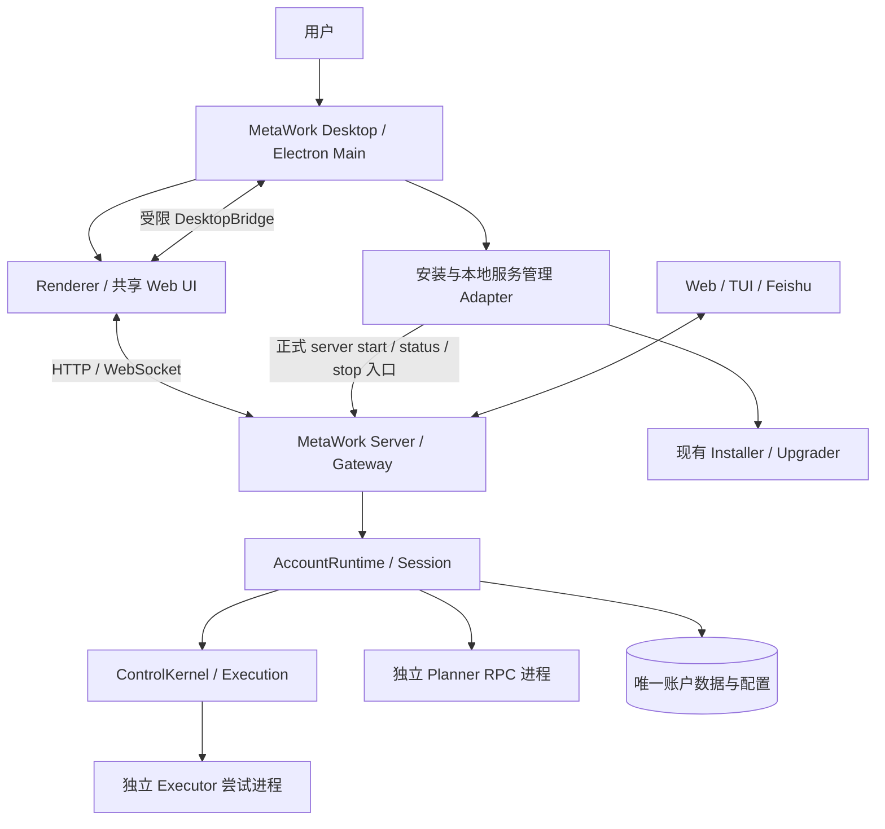
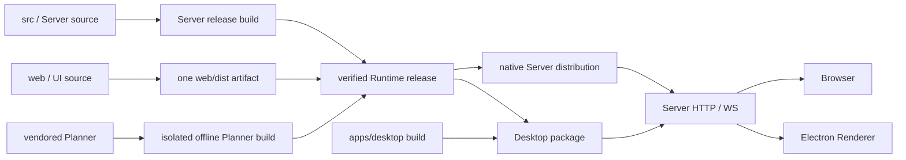

# MetaWork Desktop 方案（macOS 首版，已批准实施）

- Status: Accepted / Native implementation validated；用户于 2026-10-06 确认当前代码验证通过，并授权合并主干及推送 GitHub。签名发行等剩余发布验收以实施记录为准。
- Plan date: 2026-10-05。
- 平台范围：用户确认首版 macOS，预留 Windows / Linux。
- 参考项目：用户指定 `deepseek-ai/deepseek-harness`。
- Authority：现有代码与 Accepted ADR 仍有效；本提案不提前修改生产契约。
- 设计交付日期：2026-10-05；实现完成日期、发布验证、closing commit：尚无。

## 1. 建议结论

采用 **Electron 桌面壳 + 复用现有 Web UI + 独立 MetaWork Server + 已签名的内置运行时**。

对用户交付一个应用：安装、双击、配置模型、选择工作区、开始工作。对系统仍保留客户端、Server、Planner、Executor 的进程和权限边界。桌面壳负责本地产品体验及安装管理，不成为新的 Runtime composition root。

macOS 首版以 Apple Silicon 为主验收平台，Intel 提供独立构建和独立验收；不以 Rosetta 运行结果代替 x64 验收。Electron 的具体版本在实现启动时选择仍受支持的稳定版并锁定，不沿用旧草案的 Electron 28，也不机械复制参考项目版本。

推荐的首版行为：

1. 新用户无需先装 MetaWork CLI、Node/npm，也无需手动启动 Server。
2. 已安装用户连接同一个账户、Server、工作区和历史，不创建桌面专属业务数据库。
3. 关闭窗口隐藏应用；退出桌面客户端仍保留后台任务。停止后台服务是单独的明确操作。
4. 桌面与 Web/TUI/Feishu 具有同账户业务权限，继续共享 Gateway 和 Kernel。
5. 先交付单主窗口与完整任务闭环；远程 Server、多窗口、终端嵌入、插件市场等后置。

需要 Review 的核心是“用户体验一体化、运行时独立”。这需要对 ADR-0034 的客户端自动启动限制做**明确而有限的修订**，并对桌面本地认证补充决策。

## 2. DeepSeek Harness：参考事实与取舍

本次使用仓库此前研究固定的提交 `639ed015397290b3745d163aafe02ffee4aa3f84`，通过 jsDelivr 读取该提交的 Desktop README、package.json、main.ts、host-process.ts。未运行参考应用，也不声称这是当前 master 的最新行为。

| 参考项目中已核对的机制 | MetaWork 采用方式 |
| --- | --- |
| Electron 包装完整 Web 应用；Host 通过子进程启动，具有 IPC ready/shutdown 协议 | 复用 Web 与独立后台进程；后台继续使用 MetaWork 正式 Server 入口 |
| `dsh-app://app/` 加载打包 UI，HTTP 转发到认证后的 Host；WS 使用 Host | 借鉴 UI/Host 分离；首版直接加载验证后的 Server loopback origin，暂不引入自定义业务协议代理 |
| 窗口关闭可以隐藏，保留页面、草稿和 Host；普通退出检查任务中断 | 关闭隐藏；退出客户端也继续 Server 工作。全局停止单列菜单，并展示受影响任务 |
| 原生目录选择、菜单、快捷键、启动失败恢复 | 首版纳入，目录选择结果仍由 Server 验证和授权 |
| preload 有范围明确的桥接；Renderer 无通用文件系统、shell 或原始 IPC | 使用 typed DesktopBridge，只提供必要原生动作 |
| 打包运行时、隔离可执行依赖；发布包含签名、版本和完整性检查 | 内置 Node 与正式 release artifact，复用 MetaWork 安装/升级 authority |
| Host 使用 Electron Node mode；参考项目有自身 profile/plugin 生命周期 | MetaWork 使用独立 Node，保留 Planner 独立依赖树和唯一业务数据 authority |
| 更新前准备资源、检查运行任务、完成受控退出 | 更新安全策略复用 ADR-0030，不另建桌面迁移器 |

DeepSeek 的设计证明“一个桌面产品”可以由多个进程组成。它的插件系统、平台账户/充值、内嵌浏览器、分析采集和 Host 随应用退出策略不属于本次照搬范围。

## 3. 当前可复用基础

| 基础 | 已有位置 / 约束 | 本次处理 |
| --- | --- | --- |
| React + Vite Web | `web/src/App.tsx`、`components/WorkspaceShell.tsx` | 保留单份 UI 源码，增加可选平台能力适配 |
| 会话观察与恢复 | `web/src/observation/`、`api/ws.ts`，ADR-0043 | 复用 baseline/tail、资源按需读、幂等命令与断线恢复 |
| Workspace/Conversation | ADR-0035，Server 目录与授权 | 原生选择器只提供路径提示，不创建或改绑业务实体 |
| 统一 Gateway | `src/gateway/`、`src/management/` | 桌面使用已有 HTTP/WS 应用接口，不复制成全量 Electron IPC API |
| Server 生命周期 | `src/server/server-lifecycle.ts` | ready/draining、恢复、关闭顺序与 runtime.lock 保持 Server-owned |
| endpoint manifest | `src/server/server-endpoint-manifest.ts` | 复用解析与校验，补充实际健康/实例身份确认 |
| 安装与升级 | `src/installation/`、`scripts/build-release.mjs` | 补桌面交付 adapter，沿用签名、指针事务、备份与恢复 |
| 本地 IPC 平台抽象 | `src/platform/local-endpoint.ts` | 已有 Unix/Named Pipe 路径抽象；不是 Windows 产品验收证明 |
| SecretStore | `src/configuration/`，含 Keychain adapter | 保留唯一 SecretStore authority；桌面不建立第二套 API Key 存储 |

当前 manifest 校验本身不能证明 PID 未被复用、HTTP origin 属于目标实例。接入必须同时验证运行实例、当前 release/protocol/capabilities 与健康信息，不能只读 JSON 就信任地址。实现时沿用 shared resolver，所缺事实由 Server 添加。

本方案保持 Work Graph、Kernel 决策、路由算法及 Task 生命周期契约。Desktop 渲染 canonical TaskView 与既有安全结果投影。

## 4. 进程、所有权与通信



### 4.1 Electron Main

拥有窗口、菜单、Dock、通知、单实例、原生文件对话框、前后台状态、endpoint discovery、诊断展示与升级 UI。

安装管理模块可调用固定的官方服务/安装命令；参数结构化，使用验证过的绝对可执行路径，不依赖 Finder 启动时的 shell PATH。不得导入或构造 AccountRuntime、ConversationSession、Repository、Planner、Kernel 或 Executor。

桌面单实例锁仅管同一安装的窗口入口；runtime.lock 仍只由 Server/既有 updater 持有。两种锁职责不同，不互相替代。

### 4.2 Renderer 与 Web 复用

首版加载 `manifest.webOrigin` 上与 Server release 匹配的 Web assets。先显示不具备业务权限的本地启动页，Server ready 后进入业务页面。所有 HTTP/WS 请求保持现有同源机制，不需要复制 API、上传、下载和 observation 协议。

增加可选 `PlatformServices`：浏览器默认实现与 Desktop 实现共享界面，其内容限于目录选择、原生保存、通知呈现、菜单动作、窗口状态等。没有 Electron bridge 的浏览器仍使用现有 Web 功能。无需整体搬迁 Web 至新 monorepo。

桌面偏好通过 bridge 在应用启动时恢复，不能依赖临时 HTTP 端口作为永久偏好身份。草稿按安装/账户/Conversation 隔离，可在本人机器持久化，退出账户清理对应敏感缓存；UI 偏好和草稿均不构成任务事实。

自定义 `metawork-app://` 业务 origin 暂不进入首版。若后续确需离线业务壳，再独立设计 HTTP 转发、WS 认证、Origin/CSRF、上传下载和缓存。不能为了类似 DeepSeek 的协议名，增加未验收的第二条传输路径。

### 4.3 Server 与后台生存期

继续由正式 `metawork server start` 路径构造 Runtime，运行在独立 Node 进程。首次启动由安装管理 adapter 启动；已有兼容实例直接连接。

首版使用现有独立进程机制并补启动/健康等待，不依赖 Electron 子进程 IPC 存活来维持 Server。stdout/stderr 不持续绑在 Desktop 的管道上；进程从不可变已安装 release 运行，不从可被替换的 `.app` 路径运行。

OS 登录自启动属于后续可选服务能力；首版不默认注册 LaunchAgent。无需为“客户端退出后继续运行”同时引入一套常驻 supervisor。后台崩溃通过现有 Server recovery 恢复，Desktop 只显示状态并提供重新启动；不推断哪些 Task 应 retry/replan。

休眠、注销和关机不是“持续执行”保证。唤醒后重新验证实例和连接；注销/关机后的恢复仍由 Server durable recovery 决定。

## 5. 用户流程和关键状态

### 5.1 首次使用

```text
打开 MetaWork.app
  → 校验应用与内置 release
  → 检测现有安装：连接 / 初始化 / 引导兼容升级
  → 启动后台并等待 recovery + ready
  → 建立当前 OS 用户的本地桌面会话
  → 复用设置完成 Provider / Planner / Executor 就绪检查
  → 原生选择工作区 → Server 授权
  → 新建对话并发送首个任务
```

“安装即开”不等于无需模型凭证。初始化必须区分软件已就绪、模型未配置、凭证失效和 Executor 未就绪；失败时保留配置输入，不显示一个笼统的“连接失败”。

已安装用户默认使用既有 canonical 安装和配置路径，包括明确配置的 `METAWORK_CONFIG_HOME`；Finder 无 shell 环境时，由受限的安装选择设置显式恢复路径。检测到多个安装时明确选择，不自动合并数据库。

### 5.2 主工作台

延续 `Workspace → Conversation → Turn → Task → Subtask → Attempt` 的业务层级。

```text
┌ 原生标题区：MetaWork · 当前工作区                 后台状态 ┐
│ 工作区 / 对话列表 │ 对话 / 轨迹                  │ 产物预览 │
│ 搜索、新建对话    │ 回答、执行进展、费用          │ 按需打开 │
│ 任务状态摘要      │ 待审批操作紧邻对应任务        │          │
│ 设置             │ 输入框 / 附件 / 发送与停止    │          │
└──────────────────────────────────────────────────────────┘
```

使用现有 Web 主题与组件，补 macOS 标题栏留白、窗口尺寸恢复和键盘菜单。首版不重新设计一整套聊天 UI，也不为每个后台任务新增常驻页面。

紧凑设计约定：现有明暗主题 token；系统中文字体与系统 UI 字体，代码/数值使用等宽字体；8 px 间距节奏；状态同时有文字与颜色。宽窗口显示三栏，中等宽度将预览变为抽屉，窄窗口折叠侧栏；以实际内容决定断点，初始验证 1440、1100、900 px。保留可见焦点、键盘访问、200% 缩放和长文件名换行。

快捷键首版包括新建对话、搜索、设置、显示/隐藏侧栏和标准复制粘贴；默认应用内生效，不抢占全局系统快捷键。中文输入法 composition 期间 Enter 不发送。

### 5.2.1 智能体设置修订（2026-10-06，本地实现与桌面验收完成）

取消“允许的操作范围”的研究/工程二选一。普通执行智能体默认可使用实际已配置工具访问公共资料、读写任务文件、处理文档与执行常规工作区命令；职责决定工作分工，职责文本不授予权限或生成不存在的能力。敏感操作仍由系统针对具体请求统一授权，不支持的操作不因审批而变成可执行。

Planner 的只读/提案边界保持不变。已有普通智能体的标准权限迁移与其他设置一起进入草稿，仅通过“保存并激活”生效；自定义受限方案、历史 revision 和已授权任务保持原约束。新安装直接采用系统基础方案。

详细边界、迁移、模块归属与验收见[智能体基础操作与职责分工方案](2026-10-06-agent-baseline-permissions-design.md)及 [ADR-0046](../adr/0046-agent-baseline-operations-and-responsibility-separation.md)。已实现并通过原生、浏览器及 Electron 联合保存验收；Docker 实跑仍待具备运行环境后验收。

### 5.3 生命周期语义

| 用户或系统动作 | 首版行为 |
| --- | --- |
| 关闭窗口 / ⌘W | 隐藏主窗口，保持 Renderer 草稿与滚动位置、后台工作；首次说明后台继续 |
| Dock 点击 / 再次启动 | 聚焦原窗口；不启动第二个 Server |
| ⌘Q / 退出桌面客户端 | 关闭 Electron，Server 继续；菜单说明这一语义 |
| “停止后台服务…” | 查询全账户活动任务及待处理工作，说明影响所有客户端；确认后调用正式 stop/drain |
| Renderer 崩溃 | 提供重新加载；Server/Tasks 不受界面重启直接影响 |
| Server 不可达 | 当前草稿可保留，禁用提交，显示恢复状态；不得乐观宣称任务已停止 |
| 不兼容 Server 已运行 | 展示版本冲突，提供协调升级；不创建第二个相同数据根的 Server |
| 升级进行中 | 展示阶段与可重试错误；等待受控 drain，禁止新命令准入由 Server 执行 |
| 系统通知权限关闭 | 保留应用内提示，不阻塞任务执行 |

首版通知仅在 Desktop 进程存活时提供；完全退出 Electron 后，已有 Feishu 等 Server 通知路由继续有效，不承诺仍有系统桌面通知。若未来需要退出后也有原生通知，应另立 OS 通知代理方案。

### 5.4 通知与原生文件操作

任务完成、失败、待审批可产生系统通知；以 Server 的稳定事件/请求身份去重，默认隐藏敏感正文。点击仅定位到正确 Workspace/Conversation/Turn；审批仍进入页面，经最新请求 revision/generation 校验后提交。

后台摘要订阅沿用已授权 activity/notification 事实，不为通知长期观察全部 Conversation 正文。若现有接口不足，新增由 Gateway/通知模块拥有的有界事实接口，而不是 Main 解析数据库或日志。

原生选择目录只返回用户选择的路径，Server `select_workspace` 负责解析和授权。附件继续走现有上传 API。产物保存由授权的 artifact ID 下载后通过用户指定保存位置写入；“Finder 中显示”只允许本次受控下载结果或已验证工作区，不暴露通用 `readFile/exec/openPath` 桥。

## 6. 本地认证与桌面权限边界

### 6.1 推荐正式体验：本地桌面会话

桌面本地用户体验应接近已有本地 TUI 身份：无需再次输入 Web 密码，但仍经过 Server 身份和账户授权。这是**待批准的新机制**，不复用 ADR-0039 的启动目录 hint，不向 Web 自动填写默认密码。

建议流程：

1. Main 验证安装根、socket 权限/拥有者与 Server 实例，连接既有受限本地 Unix Gateway。
2. Server 根据既有本地 Principal 解析账户，签发短时、单次、限本地 HTTP 会话交换的 ticket，绑定 Server 启动实例、安装和请求随机数；Main 不能任选账户。
3. Main 在专用 Electron Session 内完成交换，Server 建立具有现有业务权限的会话；凭据进入该 Session 的 HttpOnly cookie，不进入 Renderer JS、URL、日志或 localStorage。
4. HTTP/WS 仍按该会话授权，Origin/CSRF 检查保持有效；过期、登出或 Server 换实例时重新握手。普通浏览器继续现有显式登录流程。

ticket 的窄 scope 只授权一次登录交换，不直接授权 Task。最终权限来自 Server 的 Principal/Account 映射。同一个 OS 用户已具有本地 TUI 权限，这不是声称隔离恶意的同用户本机进程。

本地 POC 可先用现有登录页面验证业务传输；正式发布以新认证 ADR 和集成验收为门槛。若 review 不批准桌面本地认证，则首版明确保留 Web 登录，不静默降级为免密。

### 6.2 Renderer 与原生桥

- `nodeIntegration: false`、`contextIsolation: true`、`sandbox: true`；不开启通用 webview。
- 每个 IPC 校验 owned webContents、主 frame、当前验证 origin、参数 schema 与调用生命周期；仅信任字符串 URL 前缀不够。
- Main 的 shell/installer 页面与业务页使用不同权限集；远程页面与产物预览均不能得到业务页的原生桥。
- 默认拒绝任意新窗口和跨 origin 页面跳转；用户点击的允许 HTTP(S) 外链在系统浏览器打开，拒绝危险 scheme、URL 内凭据和非预期导航。
- 产物 HTML/Markdown 延续内容清理及隔离预览，不因运行于 Electron 而获得本地能力。
- Provider/API Key 继续走已有设置与 SecretStore，Main 不保存第二份；诊断不记录 cookie、ticket、Key、prompt 或原始 Executor 输出。

建议的桥接 seam 为 `selectWorkspaceDirectory()`、`saveArtifact(artifactRef)`、`showDownloadedArtifact(downloadId)`、`getShellState()` 与受限菜单/偏好事件。服务停止/更新属于 Main 原生菜单的安装管理操作，不提供任意 argv 或任意升级地址给 Renderer。

## 7. 安装包、数据与依赖

### 7.1 一份产品包，明确依赖清单

macOS 发布 DMG 中的签名 `.app`，内含桌面壳、受支持且锁定的 Node runtime、MetaWork Server release、Web assets、vendored Planner 的离线构建与独立依赖。Server 的 `better-sqlite3` 按所附 Node 的 ABI/架构构建，不依赖 Electron ABI。

首次使用把已校验 release 安装到现有 immutable release 目录，之后 Server 从该目录运行。数据库、工作区、Planner sessions、凭证不写入 `.app` 或 ASAR。`.app` 不作业务数据根。

必须在发布清单逐项列出：

| 依赖 | 首版建议 |
| --- | --- |
| Electron、Node、Server/Web、vendored Planner、SQLite native module | 打包提供，首次启动不运行 npm install |
| Git | 产品必需依赖；优先提供受控打包版本并完成许可证/签名验收，不假设用户已装 Xcode CLT |
| 至少一个正式 Executor | 建议锁定可再分发的 Pi CLI 和所需运行时，以独立 attempt home 运行；仍是正式 Executor，不是 Planner 代执行 |
| 其他 Executor CLI | 可选集成；检查兼容版本和认证状态，不能因为缺少可选 Codex CLI 而阻塞所有工作 |
| Provider 凭证 | 首次引导填写或沿用既有配置，安装包不携带 |
| 项目专用 Python/编译器等 | 按任务需要检测；不承诺任意项目的构建环境全内置 |

Pi CLI/Git 的可再分发清单、原生二进制和签名链必须在 P0/P1 验证；若不能随包交付，采用用户明确触发的受控下载，并在产品说明中更正“离线可运行”范围。不能到发布末期才发现干净机器根本无法执行任务。

### 7.2 数据 authority

- 安装、账户、配置路径由现有 resolver 确定；默认安装根为 `~/.metawork`，配置 home 遵循现有 `METAWORK_CONFIG_HOME` 契约，不凭桌面惯例另迁一套。
- Electron userData 只放窗口位置、桌面偏好、受账户隔离的草稿与 cookie/cache；不存任务 SQLite、配置 revision 或 Provider secrets。
- CLI、Desktop、Web 指向同一 canonical runtime，不能并行开两个不同 release 写同一账户。
- 删除 `.app` 默认保留任务数据；提供独立卸载指引，先停止后台，再移除桌面关联资源，数据清理单独确认。
- “安装终端命令”是可选动作，复用已有 launcher；不覆盖用户其他安装而无提示，不改 shell 启动文件。

## 8. 更新与恢复

将 Shell、Server、Web、Planner、Node ABI、Gateway capability、schema 及配置生成规则纳入一个可验证兼容组合。不能让 electron-updater 和原生 updater 分别自主切换自己的半套版本。

首个可发布版本即需要受控手动更新；定期检查/后台下载可以后置。更新 UI 的职责是展示、下载进度与用户选择；**唯一的运行时激活 authority 仍是现有 Installer/Upgrader**。如采用 electron-updater，仅作为经过协调的壳下载/替换机制。

推荐事务顺序：

1. 下载并校验签名、文件散列、目标平台与完整兼容矩阵；先 staging，不触碰活动版本。
2. Server 拒绝新命令，按现有规则 drain；不能证明安全可恢复则终止更新并保留旧组合。
3. 由既有更新路径协调同一个物理 runtime lock，避免 Desktop 自己持锁再等待 Server 的死锁。
4. 执行已验证 SQLite backup，并备份其引用的 immutable Gateway journal segments；必要迁移在 clone 上完成。
5. 校验候选配置/generated runtime 与候选服务，准备 Shell/Runtime 联合激活记录。
6. 由独立安装 helper 完成需要退出 `.app` 才能做的替换，原子切换正式 release 指针，并启动候选 Server。
7. Shell 重新发现并验证新组合；健康验收通过后提交。失败通过 activation journal 恢复旧版本/备份与 segments。

第 5–7 步的 Shell 协调是对 ADR-0030 的桌面扩展，不是现有代码已经完整支持。必须以崩溃注入证明每个断点可恢复，包括壳已替换但 Runtime 未提交。

相邻版本可兼容时允许壳短时保留只读恢复界面；不兼容则禁止业务请求，提供协调修复。回滚到备份是时间点恢复，不能宣称自动保留新版本运行后产生的所有写入。

macOS 分发采用 Developer ID 签名、Hardened Runtime、公证与 stapling；所有内置可执行文件/原生模块纳入校验。首版经官网直接分发，不承诺 Mac App Store sandbox。系统 App Sandbox 与 Electron Renderer sandbox 是不同边界。

## 9. 建议代码布局与公开 seam

```text
apps/desktop/                    # 新增产品入口，独立 Electron 构建与依赖
  main/                          # 窗口、菜单、服务/安装 adapter、通知
  preload/                       # typed DesktopBridge
  shell/                         # 启动、修复与更新页面
  shared/                        # 仅桌面桥 schema/类型
  packaging/                     # macOS entitlement、图标、发布配置
  tests/                         # Electron 集成与安装验收
web/src/platform/                # 新增 Web 默认能力与 Desktop 能力适配
src/client/                      # 共享 endpoint discovery；不依赖 Electron
src/gateway/                     # 本地认证交换与必要事实接口的 owner
src/installation/                # release、服务管理及联合升级协调的 owner
scripts/                         # desktop 构建/打包/smoke 入口
```

候选公开接口（名字待实现设计确认，不视为现有 API）：

| seam | Owner | Consumer |
| --- | --- | --- |
| `DesktopBridge` | apps/desktop/shared | preload、web/platform |
| `LocalServiceController`：discover/start/status/explicitStop | installation/client adapter | Desktop 安装管理、现有 CLI |
| desktop session ticket/exchange | Gateway authentication | Electron Main |
| authoritative activity/notification facts | Gateway/notifications | Desktop 通知 adapter、已有消费者 |
| desktop-compatible release plan/activation | installation | Desktop 更新 UI、native CLI |

依赖约束需加入静态检查：Desktop/Web 不导入具体 Storage、AccountRuntime、Kernel/Executor 实现；Server 不反向导入 Electron；既有业务 API 不复制为桌面专属状态机。

## 10. 交付阶段与验收门

以下为估算，不是承诺日期。按一名熟悉仓库的工程师计，签名账号、Intel 机器及发布基础设施可用时，桌面首版约 20–34 人日，包含第 14 节的增量同仓组织，不包含全仓包管理器/目录迁移。正式上线前按 P0 结果重估。

| 阶段 | 交付 | 验收门 | 估算 |
| --- | --- | --- | --- |
| P0 设计冻结与技术验证 | ADR 修订草案、依赖分发清单、Electron 加载现有 Server/Web、版本矩阵 | 无 Runtime 直连；真实页面/WS/附件可用；打包依赖可行 | 2–3 日 |
| P1 可安装的 macOS alpha | 签名结构、内置 Node/Server/Planner/必要工具、复用已有安装、一键启动 | 干净用户无 Node/npm/MetaWork CLI 完成任务；锁与实例冲突可控 | 5–8 日 |
| P2 完整桌面体验 | 本地认证、原生目录/保存、通知、菜单、退出语义、故障状态 | 多端同权、中文输入、草稿/滚动恢复、Renderer 崩溃不影响任务 | 5–8 日 |
| P3 发布与升级闭环 | 公证 DMG、受控更新、回滚、卸载路径、真实 macOS 矩阵 | 旧版有活动任务升级及故障注入通过；arm64/x64 分别合格 | 6–10 日 |
| P4 稳定性收尾 | 性能、长会话、多日使用、说明文档 | 关键体验和资源回归达标，用户验收 | 2–5 日 |

各阶段完成时记录实现日期、交付行为、验证命令/环境及 closing commit；源码通过、隔离安装通过、用户正常安装通过分别记录，不互相替代。

实现前必须建立的核心验收用例：

1. 干净 macOS 用户首次安装；没有 Node/npm、全局 Planner 和预装 CLI；模型配置后产出真实报告及文件。
2. 已安装且有工作运行时启动 Desktop，只出现一个 Runtime、无数据库迁移副本或锁竞争循环。
3. Desktop/Web/TUI/Feishu 任一端发起，Desktop 可查看/续发/停止/审批；Desktop 发起也可由其他端控制，通知目标不漂移。
4. 两端相反审批只有一个持久结果；断线重发沿用同一请求身份，不产生重复 Task。
5. 关闭窗口、退出 Electron、杀死 Renderer 均不直接取消工作；显式 stop 才走全局 drain。
6. Server 崩溃/重启、网络恢复、系统睡眠唤醒、PID/端口被复用、过期 manifest、升级中重复打开应用。
7. 恶意页面、子 frame、产物 HTML 和外链不能调用桌面 bridge；ticket 不能复用/跨实例交换。
8. 更新前中后故障、缺少 journal companion、schema 不匹配、错误签名、候选启动失败均可安全拒绝或恢复。
9. 从 DMG 启动、应用移动、只读目录、Finder 缺少 PATH、中文/空格路径、原生模块 ABI 与签名检查。
10. 长会话仍使用有界读模型，十次反复重连/切换不无限增加订阅、窗口、任务 listener 或缓存。

初始性能目标供 P0 校准：warm Server 下可交互 p95 ≤ 2 秒；首次已完成安装后的冷启动 p95 ≤ 5 秒，不含模型调用；启动状态在 1 秒内可见。统计 Desktop、Server、Planner/Executor 分项 RSS/CPU，先建立真实基线再冻结预算，不用单一 Electron 包体估算替代测量。

测试分层：Desktop bridge/生命周期聚焦测试、现有 owning seam 回归、真实 Electron E2E、签名安装包 smoke、macOS 两种架构验收。涉及持久化变化时同步 repositories 与 Docker 测试；Docker 只能验证后端，不能代替 macOS GUI、公证和权限验收。

## 11. 需要修改的架构决策

方案已获实施授权。由 ADR-0045 记录桌面边界，实施状态单独记录，不将未验收功能标记为已交付。涉及以下 authority：

| 当前决策 | 建议修订 |
| --- | --- |
| ADR-0020 | 保持 ownership；新增 desktop/installation adapter 的依赖矩阵，不放宽核心依赖 |
| ADR-0031 | 在统一 Principal/Account/Gateway 模型中加入 Desktop；业务权限不按 surface 区分 |
| ADR-0034 | 允许桌面安装管理层调用正式 Server 生命周期入口；普通 UI 不构造 Runtime，Client disconnect 不停服；明确显式全局 stop |
| ADR-0039 | 保留浏览器显式登录和非认证 launch hint；补受限本地桌面会话交换，不能复用旧 launch token 登录 |
| ADR-0030 | 补 Shell/Runtime 联合发布矩阵、激活日志、安装 helper 与跨版本恢复门 |
| ADR-0035/0043 | Desktop 沿用工作区授权、显式观察、多端同权与独立通知；如新增 capability 则同步协议消费者 |
| ADR-0041 | 保持唯一 TUI，Desktop 不引入新的 terminal/standalone agent 面 |

ADR 接受时同步 `CONTEXT.md`、current technical overview 和 ADR authority index；仅在新目录/入口实际形成时更新 AGENTS 导航。

## 12. 本次 Review 建议逐项确认

| 项目 | 推荐决策 | 主要取舍 |
| --- | --- | --- |
| 架构 | Electron + 独立 Server + 共享 Web | 安装体验一体化，保留多端与任务生存期 |
| 平台 | macOS 首版，arm64 主验收、x64 独立发布门 | Windows/Linux 后续验收，不预先保证功能对等 |
| 退出 | 关闭隐藏；退出桌面不停止 Server；全局 stop 独立入口 | 任务可靠性优先，需要清楚解释后台生存期 |
| 认证 | 受限本地桌面会话，浏览器登录不变 | 首次体验更自然，需新增并验证认证契约 |
| UI | 原 Web 工作台原生化，单主窗口 | 先交付功能闭环，再评估布局大改/多窗口 |
| 交付依赖 | 内置 Node/Planner/Git/至少一个 Executor | 包体增大，换取干净机器可运行 |
| 更新 | 原生升级事务作为唯一激活 authority | 首版工程量增加，避免代码/数据版本撕裂 |
| 产品源码仓库 | 单仓新增 apps/desktop，共享 Web/Server 产物与公开契约，同 commit 联合验证 | 渐进提取 packages，Planner 依赖树继续隔离；详见第 14 节 |

## 13. 证据与本次验证范围

本次只进行了源码/文档静态核对及方案编写；没有安装 Electron、启动模型任务、修改现有安装或执行应用测试。GitHub/raw 直连失败后，通过固定提交的 jsDelivr 镜像读取参考文件；引用仍指向可审计的 GitHub commit。

参考项目：

- [Desktop README](https://github.com/deepseek-ai/deepseek-harness/blob/639ed015397290b3745d163aafe02ffee4aa3f84/apps/desktop/README.md)：壳与 Host、目录选择、退出、安装、更新、已知限制。
- [Electron 主进程](https://github.com/deepseek-ai/deepseek-harness/blob/639ed015397290b3745d163aafe02ffee4aa3f84/apps/desktop/src/main.ts)：Host 控制、sandbox/context isolation、请求与窗口边界。
- [Host 子进程](https://github.com/deepseek-ai/deepseek-harness/blob/639ed015397290b3745d163aafe02ffee4aa3f84/apps/desktop/src/host-process.ts)：spawn、IPC、ready/fatal/shutdown 和受控关闭。
- [Desktop package.json](https://github.com/deepseek-ai/deepseek-harness/blob/639ed015397290b3745d163aafe02ffee4aa3f84/apps/desktop/package.json)：Electron、builder 与分架构构建。版本只作为参考快照，不作为本项目安装要求。

MetaWork 依据：

- [核心模块归属](../adr/0020-core-module-ownership-and-dependency-direction.md)、[独立 Server/Client](../adr/0034-independent-server-and-client-process-lifecycle.md)、[Web 登录](../adr/0039-web-workspace-creation-and-login.md)。
- [原生发布与更新事务](../adr/0030-native-release-trust-and-upgrade-transaction.md)、[多端统一控制与观察](../adr/0043-explicit-conversation-observation-and-client-read-models.md)。
- [Server lifecycle](../../src/server/server-lifecycle.ts)、[endpoint manifest](../../src/server/server-endpoint-manifest.ts)、[本地 Principal](../../src/gateway/local-principal.ts)。
- [安装路径](../../src/installation/paths.ts)、[release 构建](../../scripts/build-release.mjs)、[本地 endpoint 平台抽象](../../src/platform/local-endpoint.ts)。
- [Web 工作台](../../web/src/components/WorkspaceShell.tsx)、[HTTP client](../../web/src/api/http.ts)、[WS client](../../web/src/api/ws.ts)、[主题](../../web/src/theme.ts)。

风险最集中的部分是干净机器的完整依赖交付、客户端/后台退出契约、本地认证和联合升级。P0 应优先验证这些部分，再开展视觉优化。

## 14. MetaWork Desktop 自身的 Git 仓库与发布管理

### 14.1 对薄壳草案的结论

已阅读 [2026-10-06 薄壳草案](2026-10-06-electron-desktop-app-thin-shell-design.md)。采用它提出的 **单 Git 仓库、多应用入口、共享 Web 与后端能力、Electron 薄壳、渐进迁移** 方向。第 9 节相应将新增入口统一为 `apps/desktop/`。

共享需要覆盖三层：源码模块、正式构建产物、运行时协议/启动行为。同仓解决协同修改与版本对齐；同一 UI 构建和同一 Server/Gateway 路径才让新 Web 功能自然进入 Desktop。`apps`/`packages` 目录本身不能保证兼容。

保持一个私有 MetaWork 产品仓库；vendored Planner 按现有隔离依赖树与独立进程构建运行。

### 14.2 DeepSeek 的实际结构与复用关系

以下按相同固定提交的 workspace 文件、各应用 package manifest、Desktop Host 代码及已实施的 thin-wrapper 决策核对；并非以草案的目录示意当作事实。

```text
deepseek-harness/
  apps/
    cli/                         # dsh 命令与可复用 profile-boot 导出
    web/                         # Web frontend 构建与 dist 导出
    desktop/                     # Electron Main/preload、原生集成、打包
    desktop-host/                # 私有 Host 入口，复用共享启动链
  packages/
    boot/app-boot/               # 共享启动支持
    client/...                  # 客户端连接、UI、交互等包
    api/...                     # 控制与传输相关包
    host/...                    # Web server 等 Host 支持
    ...                         # 按职责划分的其他包
  pnpm-workspace.yaml            # apps/*、packages/*/* 等
```

Desktop Host 运行于子进程，调用 CLI 的共享 profile runner；完整 Web composition 拥有认证、HTTP 路由、RPC 与流式响应。Electron 加载打包的 Web 页面，HTTP 转发/WS 继续使用同一 Host，IPC 承担 ready、boot injections、shutdown 和有限原生能力。它不是另外写一套桌面后端。

重要区别：共享源码不要求共享安装目录里的 `node_modules`。参考项目明确隔离 CLI 与 Desktop 的可执行包、profile 和插件激活；Desktop 将匹配的 Shell/Host/runtime 打包成一个发布单元。MetaWork 借鉴共享启动与发布组合，同时保留自身“一份 canonical Server/账户写 authority”的约束，不照搬独立 profile 来建立第二份 Runtime。

### 14.3 MetaWork 的增量目录与依赖边界

首版建议结构：

```text
metawork/                         # 一个 Git 仓库
  package.json                   # 保留现有 metawork 包身份、bin、构建入口
  package-lock.json              # 现行 Server npm 依赖锁
  src/                           # 现有 Server、CLI dispatch 与领域代码
  web/                           # 唯一业务 UI 源码和构建
    src/platform/                # Browser 默认实现 / Desktop 能力适配
    package.json
    package-lock.json
  apps/
    desktop/
      main/ preload/ shell/ shared/ packaging/ tests/
      package.json
      package-lock.json          # 增量阶段独立安装；不 hoist 到 Planner
  planner/AnyFusion-Pi/           # 原 vendored 子树，不变为 submodule
  scripts/                       # 明确依赖顺序的统一构建/安装/smoke 入口
  docs/
```

这是同仓多项目的增量落地。首版不创建源码软链接，也不把 Server 复制进 Desktop 源码目录；桌面打包消费 release artifact。`apps/cli/src -> ../../src` 之类链接既不能表达依赖 owner，也会引入构建路径与打包差异。

共享包提取以实际消费者为依据，建议次序为：

| 候选包 | 提取条件与内容 | 依赖限制 |
| --- | --- | --- |
| `packages/gateway-contracts` | Web 当前已有对 `src/gateway`、`src/session` 的 type-only 引用；需要正式包边界时提取公共 wire types/schema | 契约语义 owner 仍是 Gateway/Session；不包含 Repo、Server composition 或 raw DB 类型 |
| `packages/client-sdk` | 第二个独立 JS 客户端确需复用 HTTP/WS、capability 协商、观察/幂等逻辑时提取 | 浏览器可用，不依赖 Electron、SQLite、Node fs；Desktop 复用完整 Web 时无需提前抽取 |
| `packages/platform-contracts` | typed 原生能力协议出现跨构建消费时提取 | 纯类型/schema；Browser 与 Electron 各自实现 adapter |
| `packages/web-ui` | 出现多个独立 frontend entry、无法直接复用一份 `web/dist` 时再提取 | 不出现两个 fork 的 Conversation/Settings/observation 实现 |

禁止以“所有 apps 都依赖 packages/core”作为最终目标。Server 核心代码仍只进入 Server 进程；Electron Main 依赖本地发现/安装管理 adapter，Renderer 依赖客户端契约。物理包提取遵守 ADR-0020，不改变 Planning/Kernel/Execution 的 authority。

未来移动 `web/ → apps/web` 或 Server 入口时，必须同批更新 release packager、安装器、Docker、smoke、路径型配置及 import；过渡以一个明确生效入口为准，不保留第二套业务启动路径。

### 14.4 构建和开发：一份 Web，两个载体



图中的两种分发包含同一 Runtime release 内容；运行时通过实例发现选择同一个 canonical Server，不表示同时启动两个写实例。初版沿用第 4.2 节直接加载 Server origin；将来使用自定义 scheme 时，也必须代理到同一应用接口，不重写业务传输。

构建顺序固定为：Server/Web + 独立 Planner offline build → 正式 runtime packaging/校验 → Electron 壳构建 → 将已验证 payload 纳入桌面包 → macOS 签名/安装验收。可并行执行无依赖的构建，但不能让 `build --workspaces` 的偶然顺序决定产物是否完整。

已有 `scripts/package-release.mjs` 将 `dist`、`web/dist`、生产依赖和单独 Planner artifact 纳入发布。桌面必须复用这一份完整内容，不通过复制根 `node_modules` 或整个 Planner 源码目录自行拼装。打包验收检查动态 import、native module、Worker、Planner MCP/schema 等都能在没有源码工作区的机器上解析。

开发模式分清三个进程：Server、Vite、Electron。根 `npm run dev` 当前只执行 `tsup --watch`，不会启动 HTTP Server；`web` 的 Vite server 才负责 HMR。新增开发 orchestrator 应显式构建/启动隔离测试 Server、启动 Vite 并配置 HTTP/WS 代理、再启动 Electron。普通浏览器也访问同一开发 UI。开发后端不连接用户正式数据根，不因 watch 自动重启真实任务。

正式验收必须再测试非 Vite 的 Server-owned assets；开发时 HMR 正常不证明发布包含有 `web/dist`。跨端验收包含新增普通 Web 功能在两端同时出现、认证/流式响应/附件/配置行为一致，以及浏览器缺少 native bridge 时仍可使用。

### 14.5 包管理、版本和 CI

推荐首版沿用实际安装/CI 使用的 npm 锁和隔离安装，不同时引入 pnpm/Turbo 与桌面运行时变化。当前根 `packageManager` 声明为 Yarn 而正式脚本使用 npm，属于待收敛的工程配置；必须在实施 PR 中明确唯一安装工具与锁文件，不能再叠加第三种默认行为。

若 review 决定改为 pnpm workspace，则作为独立迁移阶段：

1. 明确 workspace 成员包括现有根 Server 包、`web`、`apps/desktop` 及实际存在的共享包；不能只写 `apps/*`/`packages/*` 就以为包含了 `web/`。
2. 为主产品建立一个权威 pnpm lock，迁移安装、release、Docker/CI、native build 与打包闭包；根脚本可保留同名入口，内部工具只用选定版本。
3. vendored Planner 保留它独立的包管理边界和依赖树，禁止被主 workspace glob/hoisting 吸入；继续独立执行 `build:offline`。
4. 在干净 checkout、离线准备好的构建环境和安装包上验证依赖解析及 native ABI；完成迁移后删除主产品冗余锁和旧安装路径，不让 npm/pnpm 双写同一 node_modules。
5. Turbo 仅在已测量的重复构建成本值得引入时采用；缓存键包含平台、架构、Node ABI、配置与 lock，签名/公证/发布不因缓存命中跳过必要验收。

Git 维持短期功能分支和 Conventional Commits。同一个 PR 可原子修改 Gateway、Web 与 Desktop adapter；每个包有明确 owner。契约/共享代码变化触发 Web + Server + Desktop 联合检查；壳原生变化触发 macOS Electron 验收；release/Planner/native 依赖变化触发真实安装与升级矩阵。

发布 manifest 固定 source commit、组件版本、Node ABI、平台架构、内容 hash、协议/capability 和签名。Desktop package 可有独立版本号，但正式 tag 绑定明确兼容组合，不以 semver 相近推断兼容；arm64/x64 从同一 commit 分别构建。根包 `metawork` 的 bin 名称与安装入口不能被示例 monorepo 根 package.json 丢弃。

源码、图标源文件、锁文件、构建配置进入 Git；应用输出、DMG、下载缓存、native 编译产物、数据库、执行 worktree、签名私钥和业务凭证留在构建/运行环境。正式 release 从干净源码和锁定依赖产生，dirty 开发包不复用正式身份。

### 14.6 薄壳草案中应修正的具体内容

结论是采纳组织方向，示例实现尚不能直接执行。以下是对当前草案的静态核对，未安装或运行其示例。

| 草案位置 / 内容 | 核对结果与建议 |
| --- | --- |
| §1.1 的 `electron/main.ts`、`packages/core/web-ui` 示意 | 固定参考提交实际是 `apps/desktop/src/main.ts`，并有 `apps/web`、`apps/desktop-host` 和按职责组织的 packages；应标注准确路径及抽象层次 |
| §1–2 将 Host 称作“直接启动普通 CLI”，所有 apps 共享 core | 参考 Host 调用共享 profile runner；MetaWork 应复用正式 Server 入口与 Web 产物，Main 不加载后端核心 |
| §3.5 替换根 package.json，同时用 pnpm 配置/npm workspaces/Turbo | 会丢失现有 `metawork` bin、依赖、schema/extension/Web 构建；workspace glob 漏掉现有 `web`。只能增量修改并确定唯一安装流程 |
| §3.1 `spawn(process.execPath, ...)` 注释称 RunAsNode | Electron 的 executable 不是普通 Node；示例未设置 `ELECTRON_RUN_AS_NODE=1`。若选择该方案还需验证 fuse、子进程和 native ABI；本提案继续推荐独立内置 Node |
| §3.1 `server start --port ... --no-open` | 当前 `src/cli/args.ts` 拒绝这些 server 参数。用现行配置及 Server manifest/ready discovery，不能先挑端口再凭 HTTP 可访问认定正确实例 |
| §3.1 将业务数据放在 Electron userData，设置 `METAWORK_DATA_ROOT` | 当前正式安装根契约是 `METAWORK_INSTALL_ROOT`；该 data-root 变量不是已实现入口，覆盖 config home 也可能隔离既有配置。必须使用既有路径 resolver |
| §3.4 手工复制 `dist`/node_modules/Planner | 漏了现有 release 明确包含的 `web/dist`，也未证明 Planner offline build、Node ABI 和依赖闭包；改为消费正式 release payload |
| §4 `npm run dev` 后访问 3000、声称 Vite HMR 自动生效 | 根 dev 只做 tsup watch，示例未启动 Server/Vite；需显式三进程开发入口及实际代理配置 |
| §3.1/FAQ 以 `ChildProcess.killed` 判断退出、固定 3 秒强杀 | `killed` 表示发送过信号，不证明进程已退出；现有全局 Server 更不应因桌面关闭被误停。以正式 drain/退出事实和独立生存期为准 |
| §8 “100% 不变”，§9 “约 500 行、零回归风险”、固定包体/OS 指标 | 认证、服务发现、打包、更新、native ABI 均需适配及验证；ASAR 是归档而非通用压缩，平台最低版本必须随选定 Electron/Node 验证。改为目标及实测验收 |

首次 review 先确定 M1 同仓增量结构、共享产物和依赖边界；M2 pnpm/共享包迁移及 M3 全面 `apps` 化单独评估。这样既能复用 Web，也能明确知道每次结构调整改变了哪些构建和部署契约。

### 14.7 核对来源

- [DeepSeek workspace 定义](https://github.com/deepseek-ai/deepseek-harness/blob/639ed015397290b3745d163aafe02ffee4aa3f84/pnpm-workspace.yaml)。
- [共享 Web 应用的已实施架构决策](https://github.com/deepseek-ai/deepseek-harness/blob/639ed015397290b3745d163aafe02ffee4aa3f84/.agents/notes/implemented/architecture/2026-09-10-desktop-web-wrapper.md)。
- [CLI profile-boot 导出](https://github.com/deepseek-ai/deepseek-harness/blob/639ed015397290b3745d163aafe02ffee4aa3f84/apps/cli/package.json)、[Web frontend 导出](https://github.com/deepseek-ai/deepseek-harness/blob/639ed015397290b3745d163aafe02ffee4aa3f84/apps/web/package.json)、[Desktop Host 依赖](https://github.com/deepseek-ai/deepseek-harness/blob/639ed015397290b3745d163aafe02ffee4aa3f84/apps/desktop-host/package.json)。
- MetaWork：[根 package](../../package.json)、[Web Vite 配置](../../web/vite.config.ts)、[CLI 参数](../../src/cli/args.ts)、[产品环境变量](../../src/installation/product-environment.ts)、[正式 release 打包](../../scripts/package-release.mjs)。

以上源码/产物组织已做静态核对；本轮仅修订方案和文档索引，没有迁移源码、安装包管理器或改变运行环境。
